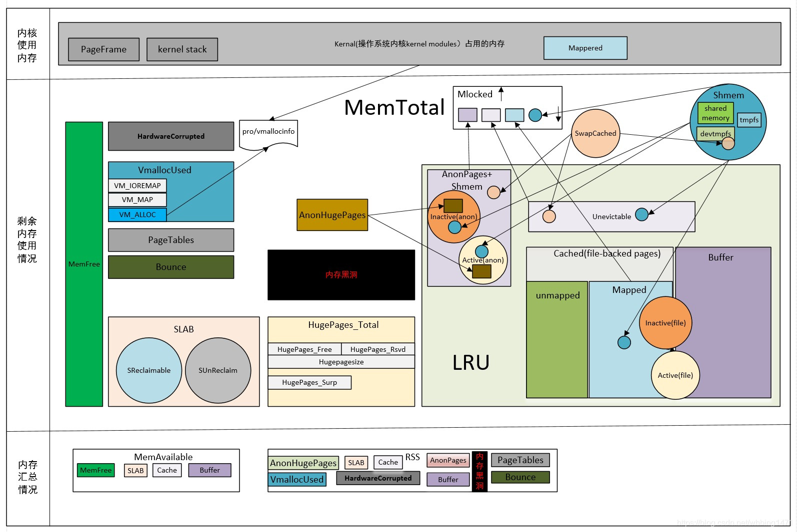

# 编译和调试笔记

## 目录

[TOC]

## 编译工具集概览

* `gcc`                         : 编译器
    * `gcc`                     : C编译工具
    * `g++`                     : C++编译工具，等价于 `gcc -lstdc++`
    * `libstdc++`               : C++标准库，`libstdc++` 会通过 `glibc` 调用系统调用
* `glibc`                       : C标准库
* `binutils`                    : 二进制处理工具
    * 编译相关
        * `as`                  : 汇编器
        * `ld`                  : 链接器
        * `objcopy`             : 段编辑器
        * `ar`                  : 静态库编辑器
        * `ranlib`              : 更新静态库的符号索引表
        * `strip`               : 去除目标文件的符号调试信息
    * 分析相关
        * `objdump`             : 查看目标文件信息
        * `readelf`             : 查看目标文件ELF信息
        * `elfedit`             : 编辑目标文件ELF信息
        * `size`                : 查看目标文件段大小
        * `strings`             : 查看目标文件的可打印的字符串(默认长度不短于4)
        * `nm`                  : 查看目标文件符号表
        * `addr2line`           : 将地址转换成文件名和行号
        * `c++filt`             : 将C++重载的函数名转换成真实的函数名
        * `gprof`               : 性能分析工具
* `gdb`                         : 调试工具
* `file`                        : 探测文件类型
* `ldd`                         : 查看目标文件依赖的共享库

## Makefile例子

* Makefile

```Makefile
srcs := $(wildcard *.c)
objs := $(patsubst %.c,%.o,$(srcs))

#CFLAGS := -O2 -Wall -Wextra
CFLAGS := -O0 -g -ggdb

all: libmyop.so libmyop.a myop
	@echo Build done.

clean:
	@rm -f libmyop.so libmyop.a myop *.o
	@echo Clean done.

$(objs): %.o: %.c
	gcc -c -fPIC -o $@ $<

libmyop.so: myop.o
	gcc -shared -fPIC -o $@ $^ -lm

libmyop.a: myop.o
	ar r $@ $^ -c

myop: main.o myop.h libmyop.so
	gcc -o $@ $< -L./ -lmyop
```

* myop.h

```c
int myadd(int a, int b);
int mysub(int a, int b);
int mymul(int a, int b);
int mydiv(int a, int b);
double mypow(int a, int b);
```

* myop.c

```c
#include <math.h>

int myadd(int a, int b)
{
	return a + b;
}

int mysub(int a, int b)
{
	return a - b;
}

int mymul(int a, int b)
{
	return a * b;
}

int mydiv(int a, int b)
{
	return a / b;
}

double mypow(int a, int b)
{
	return pow(a, b);
}
```

* main.c

```c
#include <stdio.h>
#include <stdlib.h>
#include "myop.h"

int main(int argc, char *argv[])
{
	if (argc != 3) {
		printf("Usage: %s num1 num2\n", argv[0]);
		return -1;
	}

	int a = atoi(argv[1]);
	int b = atoi(argv[2]);

	printf("%d + %d = %d\n", a, b, myadd(a, b));
	printf("%d - %d = %d\n", a, b, mysub(a, b));
	printf("%d * %d = %d\n", a, b, mymul(a, b));
	printf("%d / %d = %d\n", a, b, mydiv(a, b));
	printf("%d ^ %d = %lf\n", a, b, mypow(a, b));
	return 0;
}
```

### ELF文件类型

* ELF(Executable and Linking Format)是一种对象文件的格式，用于定义不同类型的对象文件(Object files)中都放了什么东西、以及都以什么样的格式去放这些东西。
* ELF文件有三种类型：
    * 可重定位的对象文件(Relocatable file)：由汇编器汇编生成的 .o 文件
    * 可执行的对象文件(Executable file)：可执行应用程序
    * 可被共享的对象文件(Shared object file)：动态库文件，也即 .so 文件
* 程序段
    * .text section 里装载了可执行代码
    * .data section 里面装载了被初始化的数据
    * .bss section 里面装载了未被初始化的数据
    * 以 .rec 打头的 sections 里面装载了重定位条目
    * .symtab 或者 .dynsym section 里面装载了符号信息
    * .strtab 或者 .dynstr section 里面装载了字符串信息

## 编译工具

### gcc

#### gcc堆栈溢出检查

* 编译警告
    * `-Wstack-usage=byte-size`         : 函数的栈空间大于指定 byte-size 产生编译警告 ` warning: stack usage is/might be xxxx bytes`
    * `-Wlarger-than=byte-size`         : 对定义大于指定 byte-size 的对象产生编译警告
    * `-Wframe-larger-than=byte-size`   : 对帧大于指定 byte-size 的函数产生编译警告
    * `-Walloc-size-larger-than=byte-size` : 对动态分配大于指定 byte-size 的堆空间产生编译警告
    * `-Walloca-larger-than=byte-size`  : 对动态分配大于指定 byte-size 的栈空间产生编译警告
    * `-Wvla-larger-than=byte-size`     : 对帧大于指定 byte-size (未知是无限大)的变长数组产生编译警告
    * `-Wstringop-overflow=type`        : 检查字符串复制或连接函数的溢出，可能误报，有 `1~4` 共4个等级，默认等级为 2
    * `-Wformat-overflow=type`          : 检查格式化函数的溢出，可能误报，有 `1~2` 共2个等级

* 栈溢出保护机制 [stack-protector](https://lwn.net/Articles/584225/)
    * 原理和机制
        *  stack-protector 基本思想是在函数返回指针被压入后立即将 canary (随机选择的整数的意思) 压入栈，然后在函数返回之前检查 canary，如果它发生了变化，程序将中止
        * 使用 stack-protector 选项编译后，会占用更大的栈且运行速度降低了，栈溢出是在运行时检测的
        * 编译应用时使用下面的编译选项开启 stack-protector，编译内核时通过 menuconfig (搜索 STACKPROTECTOR)开启
    * 编译选项：`-fstack-protector` `-fstack-protector-strong` `-fstack-protector-all` (保护范围由少到多) : 在函数栈插入保护机制
        * `-fstack-protector`           : 含大于等于8字节的字符数组的函数插入保护机制，可通过 `--param=ssp-buffer-size=N` 改变阈值
        * `-fstack-protector-strong`    : 含任意大小任意类型数组(即使数组定义在 struct 或 union 中)的函数和含局部变量地址赋给变量值的函数插入保护机制 (gcc>=4.9 or linux>=3.14) (推荐使用)
        * `-fstack-protector-all`       : 任意函数插入保护机制
        * `-fno-stack-protector`        : 禁用保护
    * 编译选项：`-fstack-check`         : 在线程栈插入保护机制

### as

### ld

### objcopy

### ar

* `ar [options] arname [files]`
    * [ar](https://sourceware.org/binutils/docs-2.39/binutils/ar-cmdline.html) 归档(静态库)处理工具
    * ar至少需要两个参数才能运行：执行的操作(命令)和归档名称，命令选项可以不加减号 `-`
    * 命令：
        * `-r`                  : 替换归档中已有的文件或加入新文件，如果没加`a` or `b` or `i` 修饰，则添加到归档末尾
        * `-s`                  : 向归档添加或更新索引，创建静态库时默认使用了此选项，既可以作命令，也可以作提示符
        * `-t`                  : 显示归档的文件列表，未指定文件时显示所有文件
        * `-x`                  : 从归档中提取文件，未指定文件时提取所有文件
        * `-d`                  : 从归档中删除文件，未指定文件时不进行任何操作
        * `-m`                  : 在归档中移动文件，如果没加特定修饰符，则移动到归档末尾
        * `-p`                  : 打印在归档中找到的文件的内容，使用 `v` 修饰时会先打印文件名
        * `-q`                  : 将文件快速追加到归档末尾，不检查是否替换，有些系统实现不更新存档的符号表
    * 通用修饰符
        * `-c`                  : 向归档中加入文件时，如果归档还不存在，不给出打印
        * `-s`                  : 向归档添加或更新索引，既可以作命令，也可以作提示符
        * `-S`                  : 不要创建符号表，加速建立大归档文件的过程
        * `-laname`             : 指定静态库依赖的库，依赖库aname名紧跟在l后面
        * `-v`                  : 显示详细信息
        * `-V`                  : 显示ar的版本号
    * 特定修饰符
        * `-a file`             : 修饰 `r` `m` 命令，将文件置于成员名之后
        * `-b file` or `-i file`: 修饰 `r` `m` 命令，将文件置于成员名之前
        * `-u`                  : 修饰 `r` 命令，只替换比当前归档中内容中更新的文件
        * `-N count`            : 修饰 `x` `d` 命令，归档中有同名文件时，提取或删除第 count 个实例
        * `-f`                  : 修饰 `r` `q` 命令，截断归档中的文件名称，GNU通常允许在归档中的文件名任意长度，其它系统可能要求最长15或16个字符
        * `-P`                  : 修饰 `x` 命令， 提取由其它工具建立的归档时，在匹配时使用完整的路径名
        * `-o`                  : 修饰 `x` 命令，从存档中提取的文件保留原来的时间属性，未指定此修饰符，则以提取的时间作为它的时间属性
        * `-D`                  : 修饰 `s` 命令，将0用于时间戳和 uid/gid（默认）
        * `-U`                  : 修饰 `s` 命令，使用实际时间戳和 uid/gid

```sh
ar rcs libxxx.a a.o b.o c.o     # 创建静态库
```

### ranlib

* `ranlib [options] arname`
    * [ranlib](https://sourceware.org/binutils/docs-2.39/binutils/ranlib.html) 向归档添加或更新索引
    * 作用同 `ar -s`，选项参数 `-D` `-U` 同 ar 中的选项

### strip

* `strip [options] [objs]`
    * [strip](https://sourceware.org/binutils/docs-2.39/binutils/strip.html) 删除目标文件的符号
    * strip 清除目标文件(程序或动态库等)中不必要的标示符及调试信息，可减小文件大小而不影响正常使用，strip 后很难调试
    * 命令：
        * `-o file`             : 指定输出文件，而不是默认覆盖当前文件
        * `-p`                  : 不修改时间戳
        * `-w`                  : 文件名可以使用通配符
        * `-s`                  : 删除所有符号，不加任何选项时的默认行为
        * `-g` or `-S` or `-d`  : 仅删除调试符号
        * `-K symbol`           : 保留符号，可多次使用此选项
        * `-N symbol`           : 删除符号，可多次使用此选项
        * `-R section`          : 删除段，可多次使用此选项
        * `-F bfdname`          : 指定输入输出 bfd 的格式
        * `-I bfdname`          : 指定输入 bfd 的格式，将目标文件 bfd 的格式当成 bfdname
        * `-O bfdname`          : 指定输出 bfd 的格式，用 bfdname 重写它
        * `-v`                  : 显示详细信息

## 分析工具

### objdump

* `objdump [options] [objs]`
    * [objdump](https://sourceware.org/binutils/docs-2.39/binutils/objdump.html) 显示每个目标文件的特定信息
        * 如果是静态库，列出库中每个目标文件的信息
    * 必要选项(必有一个)
        * `-a`                  : 显示文件头信息
        * `-f`                  : 显示文件头的摘要信息
        * `-p`                  : 显示特定于文件(动态库、可执行文件)的头内容(文件头信息、程序头、动态节、版本引用)
        * `-P`                  : 显示特定于对象文件格式(需要是 XCOFF 格式，不是 ELF 格式)的信息
        * `-h`                  : 显示节头的摘要信息
        * `-x`                  : 显示所有头的摘要信息(对比 `-h`多显示了文件头的摘要信息、程序头、动态节、版本引用、符号表)
        * `-g`                  : 显示调试节(`.eh_frame .debug_xxx`)的信息
        * `-e`                  : 类似 `-g` ，但是生成的信息是和 ctags 工具相兼容的格式
        * `-G`                  : 显示文件的 STABS 信息，功能好像同 `-a`
        * `-s`                  : 十六进制显示请求的所有部分的完整内容
        * `-S`                  : 将源代码与反汇编混合，功能好像同 `-d`
        * `-d`                  : 反汇编显示可执行节的汇编程序内容
        * `-D`                  : 反汇编显示所有节的汇编程序内容
    * 常用选项
        * `-C`                  : 将低级符号名称解码为用户级别名称，使C++函数名称可读
        * `-j section`          : 仅显示特定节的信息
        * `-l`                  : 反汇编时，增加显示函数等所在的文件名和行号

### readelf

* `readelf [options] [objs]`
    * [readelf](https://sourceware.org/binutils/docs-2.39/binutils/readelf.html) 显示关于 ELF 格式文件内容的信息
    * 常用选项
        * `-a`                  : 等价于 `-h -l -S -s -r -d -V -A -I`
        * `-e`                  : 等价于 `-h -l -S`
        * `-h`                  : 显示 ELF 文件头信息
        * `-l`                  : 显示(动态库、可执行文件的)程序头信息
        * `-S`                  : 显示节头信息
        * `-t`                  : 类似 `-S`，只是显示样式不同
        * `-s`                  : 显示符号表信息
        * `-d`                  : 显示(动态库、可执行文件的)动态节(dynamic section)信息
        * `-V`                  : 显示版本节信息(如果有)
        * `-A`                  : 显示特定于体系结构的信息(如果有)
        * `-T`                  : 不要断开输出行以适合80列
        * `-c`                  : 显示静态库中的符号/文件索引
        * `-x num_or_name`      : 十六进制显示将节＜number |name＞的内容
        * `-p`                  : 显示将节＜number |name＞的字符串
        * `-C`                  : 将低级符号名称解码为用户级别名称，使C++函数名称可读

### elfedit

### size

* `size [options] [objs]`
    * [size](https://sourceware.org/binutils/docs-2.39/binutils/size.html) 列出每个目标文件的段大小和总大小
    * 段内存管理(ROM size >= text + data)
        * `text`                : 通常用来存放代码和常量
        * `data`                : 通常用来存放初始化为非0的静态变量，有时占用空间小的初始化0的静态变量也会放在此段
        * `bss`                 : Block Started by Symbol segment，通常用来存放未初始化或初始化为0的静态变量
    * 常用选项
        * `-A`                  : 默认是以 Berkeley style 列出信息的，此选项改为以 System V style 列出信息
        * `-t`                  : 同时列出多个文件的 size 时计算总大小(只在  Berkeley style 可用)

```sh
$ size myop
   text	   data	    bss	    dec	    hex	filename
   2520	    664	      8	   3192	    c78	myop

$ size -A myop
myop  :
section              size      addr
.interp                28       568
.note.ABI-tag          32       596
.note.gnu.build-id     36       628
.gnu.hash              56       664
.dynsym               432       720
.dynstr               214      1152
.gnu.version           36      1366
.gnu.version_r         32      1408
.rela.dyn             192      1440
.rela.plt             168      1632
.init                  23      1800
.plt                  128      1824
.plt.got                8      1952
.text                 706      1968
.fini                   9      2676
.rodata                96      2688
.eh_frame_hdr          60      2784
.eh_frame             264      2848
.init_array             8   2100600
.fini_array             8   2100608
.dynamic              512   2100616
.got                  120   2101128
.data                  16   2101248
.bss                    8   2101264
.comment               41         0
Total                3233

$ size -t main.o myop.o
   text	   data	    bss	    dec	    hex	filename
    465	      0	      0	    465	    1d1	main.o
    305	      0	      0	    305	    131	myop.o
    770	      0	      0	    770	    302	(TOTALS)
```

### strings

* `strings [options] [objs]`
    * [strings](https://sourceware.org/binutils/docs-2.39/binutils/strings.html) 列出每个目标文件的可读字符串
    * 常用选项
        * `-d`                  : 默认是列出所有段的可读字符串，此选项改为只列出常量段 `.rodata` 中的
        * `-f`                  : 在每个字符串之前加上文件名，适用于同时列出多个文件时
        * `-n min-len`          : 列出长度至少为 min-len 的可读字符串，默认是 `4`
        * `-t radix`            : 同时列出在文件中的偏移量，radix 取值: o 八进制, d 十进制, x 十六进制
        * `-s separator`        : 指定输出的分隔符，默认是换行符

```sh
$ strings main.o
Usage: %s num1 num2
%d + %d = %d
%d - %d = %d
%d * %d = %d
%d / %d = %d
%d ^ %d = %lf
GCC: (Ubuntu 7.5.0-3ubuntu1~18.04) 7.5.0
main.c
main
_GLOBAL_OFFSET_TABLE_
printf
atoi
myadd
mysub
mymul
mydiv
mypow
.symtab
.strtab
.shstrtab
.rela.text
.data
.bss
.rodata
.comment
.note.GNU-stack
.rela.eh_frame

$ strings -d main.o
Usage: %s num1 num2
%d + %d = %d
%d - %d = %d
%d * %d = %d
%d / %d = %d
%d ^ %d = %lf

$ strings -n 10 main.o
Usage: %s num1 num2
%d + %d = %d
%d - %d = %d
%d * %d = %d
%d / %d = %d
%d ^ %d = %lf
GCC: (Ubuntu 7.5.0-3ubuntu1~18.04) 7.5.0
_GLOBAL_OFFSET_TABLE_
.rela.text
.note.GNU-stack
.rela.eh_frame
```

### nm

* `nm [options] [objs]`
    * [nm](https://sourceware.org/binutils/docs-2.39/binutils/nm.html) 列出每个目标文件的符号表
    * 默认输出显示3列: 地址偏移、符号类型、符号名称，其中常见符号类型的含义是
        * `B/b` 符号位于未初始化数据 `D/d` 符号位于位于初始化数据 `R/r` 符号位于只读数据 `T/t` 符号位于代码 `U` 未定义(外部定义)符号
    * 常用选项
        * `-A` or `-o`          : 在每个符号行之前加上文件名，适用于同时列出多个文件时
        * `-a`                  : 列出所有符号
        * `-C`                  : 将低级符号名称解码为用户级别名称，使C++函数名称可读
        * `-P`                  : 使用 POSIX.2 Style 列出信息
        * `-S`                  : 在第2列增加列出符号占用空间的大小
        * `-u`                  : 仅显示不在本文件定义的符号(外部符号)
        * `-U` or `--defined-only` : 仅显示在本文件定义的符号(内部符号)
        * `--size-sort`         : 按符号大小排序
        * `--print-armap`       : 显示静态库索引信息

```sh
$ nm -CS --size-sort libmyop.so
0000000000201028 0000000000000001 b completed.7698
00000000000006ae 0000000000000012 T mysub
00000000000006d3 0000000000000013 T mydiv
00000000000006c0 0000000000000013 T mymul
000000000000069a 0000000000000014 T myadd
00000000000006e6 000000000000002d T mypow

$ nm --print-armap libmyop.a
Archive index:
myadd in myop.o
mysub in myop.o
mymul in myop.o
mydiv in myop.o
mypow in myop.o

myop.o:
                 U _GLOBAL_OFFSET_TABLE_
0000000000000000 T myadd
0000000000000039 T mydiv
0000000000000026 T mymul
000000000000004c T mypow
0000000000000014 T mysub
                 U pow
```

### addr2line

* `addr2line [options] -e binname [addrs]`
    * [addr2line](https://sourceware.org/binutils/docs-2.39/binutils/addr2line.html) 将地址转换为文件名和行号
    * 不指定 addrs 时，可从管道获取输入，addrs 可使用 `addrs+offset` 的形式
    * 常用选项
        * `-f`                  : 在文件名和行号前显示函数名
        * `-a`                  : 在文件名和行号前显示地址
        * `-C`                  : 将低级符号名称解码为用户级别名称，使C++函数名称可读
        * `-p`                  : 一行显示全部信息

* 例子: 使用addr2line找出段错误位置

```c
1 #include <stdio.h>
2
3 int main(void)
4 {
5     char* p = "Hello world!";
6     *p = 'h';
7
8     return 0;
9 }
```

```sh
$ gcc -O0 -g -ggdb main.c -static
$ ./a.out
段错误 (核心已转储)
$ dmesg | tail -2
[83208.450712] a.out[13275]: segfault at 491f44 ip 0000000000400b80 sp 00007ffecb47fd50 error 7 in a.out[400000+b6000]
[83208.450715] Code: 89 e5 e8 c3 e3 08 00 5d e9 5d ff ff ff 0f 1f 44 00 00 e9 53 ff ff ff 55 48 89 e5 48 8d 05 cc 13 09 00 48 89 45 f8 48 8b 45 f8 <c6> 00 68 b8 00 00 00 00 5d c3 66 0f 1f 44 00 00 53 48 81 ec 88 00
$ addr2line -af -e a.out 0x0000000000400b80   # 上面显示的ip的值
0x0000000000400b80
main
/home/jleng/test/main.c:6
$ addr2line -fap -e a.out 0x0000000000400b80
0x0000000000400b80: main at /home/jleng/test/main.c:6
```

### c++filt

* `c++filt [options] [symbols]`
    * [c++filt](https://sourceware.org/binutils/docs-2.39/binutils/c_002b_002bfilt.html) 将低级符号名称解码为用户级别名称，使C++函数名称可读
    * 函数重载时，编译器把同名函数转换为唯一的低级符号名称，失去了可读性
    * 常用选项
        * `-p`                  : 只显示函数名，不加此选项默认会显示函数名和函数参数类型

### file

* `file [options] [filenames]`
    * file 探测文件类型

```sh
$ file myop
myop: ELF 64-bit LSB shared object, x86-64, version 1 (SYSV), dynamically linked, interpreter /lib64/ld-linux-x86-64.so.2, for GNU/Linux 3.2.0, BuildID[sha1]=2552f206a34bf9c9d4484f9826b3387d41321710, not stripped
$ file libmyop.so
libmyop.so: ELF 64-bit LSB shared object, x86-64, version 1 (SYSV), dynamically linked, BuildID[sha1]=3713cccced8b17ce96ba3bd486f45ea5fb9cddfe, not stripped
$ file libmyop.a
libmyop.a: current ar archive
$ file myop.o
myop.o: ELF 64-bit LSB relocatable, x86-64, version 1 (SYSV), not stripped
```

### ldd

* `ldd [options] [filenames]`
    * ldd 查看依赖的动态库
    * ldd 显示可执行模块的dependency的工作原理，其实质是通过ld-linux.so(elf动态库的装载器)来实现的
    * 注意将库所在的位置加入动态库搜索路径 `LD_LIBRARY_PATH`
    * 输出有3列
        * 第1列 : 程序需要依赖什么库
        * 第2列 : 系统提供的与程序需要的库所对应的库
        * 第3列 : 当前的库中的符号在对应的进程的地址空间中的开始位置

```sh
$ ldd libmyop.so
	linux-vdso.so.1 (0x00007fff7f1ef000)
	libm.so.6 => /lib/x86_64-linux-gnu/libm.so.6 (0x00007f61641f4000)
	libc.so.6 => /lib/x86_64-linux-gnu/libc.so.6 (0x00007f6163e03000)
	/lib64/ld-linux-x86-64.so.2 (0x00007f6164794000)
$ ldd myop
	linux-vdso.so.1 (0x00007ffe6379b000)
	libmyop.so => not found
	libc.so.6 => /lib/x86_64-linux-gnu/libc.so.6 (0x00007fa074eba000)
	/lib64/ld-linux-x86-64.so.2 (0x00007fa0754ad000)
$ export LD_LIBRARY_PATH=$LD_LIBRARY_PATH:.
$ ldd myop
	linux-vdso.so.1 (0x00007ffdcadf7000)
	libmyop.so (0x00007f3bb16a3000)
	libc.so.6 => /lib/x86_64-linux-gnu/libc.so.6 (0x00007f3bb12b2000)
	libm.so.6 => /lib/x86_64-linux-gnu/libm.so.6 (0x00007f3bb0f14000)
	/lib64/ld-linux-x86-64.so.2 (0x00007f3bb1aa7000)
```

### gprof

## gdb调试工具

### GDB启动参数

* `gdb -help` : GDB启动参数详细说明
* `gdb -s  <file>` : 从指定文件中读取符号表。全称 `-symbols`
* `gdb -se <file>` : 从指定文件中读取符号表信息，并把它用在可执行文件中。
* `gdb -c  <file>` : 调试时core dump的core文件。全称 `-core`
* `gdb -d  <directory>` : 加入一个源文件的搜索路径。默认搜索路径是环境变量中PATH所定义的路径。全称 `-directory`
* `gdb -nx` : 不执行 .gdbinit 初始化文件
    * 如果存在.gdbinit，gdb 就会在启动之前将其作为命令文件运行。
    * .gdbinit 可能存在家目录，当前目录，或 -x 选项指定

### 启动gdb本地调试

* 本地调试软件
    * `gdb <program>` : 用gdb调试启动可执行文件program
    * `set args <arg1> <arg2> <...>` : 进入gdb后设置运行参数
    * `run` : 开始运行

* 本地调试运行的进程
    * 3种启动方式
        * `gdb --pid <pid_mum>` : 通过--pid参数绑定进程的pid来调试指定的进程程序，例如 `sudo gdb --pid 1620`
        * `gdb <program> <pid_mum>` : 通过程序和进程号绑定，例如 `gdb test 3095`
        * `attach <pid_mum>` : gdb命令启动后，在gdb中用 `attach` 命令来挂接进程的PID
            * 用`detach`来取消挂接的进程
    * `continue` : 继续运行

### 启动gdb交叉调试

* 交叉调试需要目标板文件系统中必须有gdbserver工具。
    * gdbserver负责与远程的 gdb 远程通讯并且控制本地的应用程序执行。

* `gdbserver <host>:<port> <program> &` : 在目标板上启动 gdbserver 控制程序执行
    * `<host>` 是主机名称或者IP地址，可以省略
    * `<port>` 是网络端口号，服务器在这个端口上等待客户端的连接，这个值可以是目标板上任何可用的端口号
    * `<program>` 是需要调试的程序名，`&` 为后台执行
    * 例如 `gdbserver 192.168.110.124:2345 out.elf`

* `aarch64-linux-gdb <program>` : 在主机端，启动gdb调试程序
    * 例如 aarch64-linux-gdb out.elf
* `target remote <target>:<port>` : 在主机gdb控制台下建立与目标板的连接
    * 当然也可以将这句话写入配置文件.gdbinit，启动gdb时会自动读取 .gdbinit 的配置
    * `<target>` 是目标板的IP地址
    * `<port>` 是上面gdbserver监听的网络端口号
    * 例如 `target remote 192.168.110.125:2345`

### coredump 调试

* 命令说明
    * `ulimit -a` : 查看coredump设置
    * `ulimit -c 0` : 关闭coredump
    * `ulimit -c <num>` : 程序崩溃时最大生成 num KB 大小的`core`文件
    * `ulimit -c unlimited` : 生成coredump文件大小没有限制
    * `echo "/tmp/core-%e-%p-%t" > /proc/sys/kernel/core_pattern` :  指定coredump文件存放目录
        * 默认是在程序执行的当前目录生成文件core，core_pattern参数含义：
            * `%e` 程序文件名
            * `%h` 主机名
            * `%p` 所dump进程的进程ID
            * `%u` 所dump进程的实际用户ID
            * `%g` 所dump进程的实际组ID
            * `%t` coredump的时间戳
            * `%s` 导致本次coredump的信号
            * `%%` 单个%字符
        * 可能无法在可移动磁盘中生成coredump

* `gdb <program> core` : 用gdb查看可执行文件的coredump后生成的文件core
    * 也可以 `gdb <program>` 进入gdb后，用命令 `core-file core` 加载coredump文件:
    * SIGQUIT信号 `Ctrl-\` 的默认处理动作是终止进程并且生成coredump

### 主要命令

| 命令          | 简写  | 描述 |
| ------------- | ----- | ---- |
| `help`        |       | 查看命令的帮助。例如 `help info` 查看info的所有命令 |
| `file`        |       | 指定要调试的可执行程序 |
| `load`        |       | 将动态库加载入内存 |
| `kill`        |       | 终止正在调试的可执行程序 |
| `make`        |       | 在不退出gdb的情况下运行make工具 |
| `shell`       |       | 在不退出gdb的情况下运行shell命令 |
|               |       |  |
| `run`         | r     | 开始执行程序 |
| `start `      |       | 运行到main函数暂停 |
| `continue`    | c     | 继续执行程序 |
| `quit`        | q     | 结束gdb调试任务，也可以 CTRL+d |
|               |       |  |
| `next`        | n     | 单步执行，不会进入函数内部(显示的代码是下一步将要执行的代码) |
| `nexti`       | ni    | 单步执行，不会进入函数内部(显示的指令是下一步将要执行的指令) |
| `step`        | s     | 单步执行，可以跟踪到函数内部 |
| `stepi`       | si    | 单步执行，可以跟踪到函数内部 |
|               |       |  |
| `until `      | u     | 直到运行到某处停止 |
| `finish`      | fin   | 函数执行完成返回，并打印函数返回时的堆栈地址和返回值等信息 |
| `return`      |       | 函数直接从当前返回 |
|               |       | |
| `break`       | b     | 设置断点，程序运行到断点处会被暂停 |
| `tbreak `     | tb    | 设置临时断点，程序到达临时断点后会被暂停，临时断点会被自动删除 |
| `watch`       |       | 设置观察点，观察的变量被软件改变时，程序会暂停在改变变量的代码处 |
| `twatch`      |       | 设置临时观察点 |
|               |       |  |
| `delete`      | d     | 删除断点或观察点 |
| `disable`     | dis   | 使断点或观察点失效 |
| `enable`      | en    | 使断点或观察点使能 |
| `ignore `     |       | 忽略断点中断多少次 |
|               |       |  |
| `display`     | disp  | 设置程序暂停后欲显示的数据及其格式 |
| `undisplay`   | undisp| 删除程序暂停后欲显示的数据及其格式 |
|               |       |  |
| `list`        | l     | 部分列出源代码 |
| `disassemble` | disas | 反汇编 |
| `info`        | i     | 显示运行的默写信息 |
|               |       |  |
| `backtrace`   | bt    | 显示程序堆栈 |
| `whatis`      |       | 打印变量的类型 |
| `x`           |       | 查看内存地址中的值 |
| `print `      | p     | 打印变量的值到标准输出，改变变量值或调用函数 |
| `call`        |       | 调用函数运行 |
| `set`         |       | 改变变量值或设置某些gdb参数 |
| `dump`        |       | dump内存， 例如 `dump memory file.log start_addr end_addr` |

* 注: Ctrl+c 主动暂停程序运行，直接回车表示重复上一次命令。
* 注: 可以运行 generate-core-file 生成内核转储文件，查看调试历史

### 断点和观察点

| 命令                  | 描述 |
| --------------------- | ---- |
| `b`                   | 当前位置设置断点 |
| `b <line>`            | 当前文件line行设置断点，如 `b 100` |
| `b <file>:<line>`     | 指定文件line行设置断点，如 `b main.c:100` |
| `b <func>`            | 指定函数func入口设置断点, 如 `b malloc` |
| `b <addr>`            | 指定内存addr处设置断点，如 `b 0x9000888a` |
| `b +<offset>`         | 当前行号的后面的offset行设置断点 |
| `b -<offset>`         | 当前行号的前面的offset行设置断点 |
| `b ... if <condition>`| 设置条件断点，在循环中使用非常方便，如 `b 10 if i==3` |
| `tb ...`              | 设置临时断点，到达后被自动删除，使用类似 `break` |
|                       |  |
| `watch <val>`         | 设置观察点，指定val变量的值被软件改变后程序被暂停 (watch局部变量退出局部作用域会自动删除观察点) |
| `watch <expr>`        | 设置观察点，指定expr表达式的值被软件改变后程序被暂停 |
| `watch *<addr>`       | 设置观察点，指定addr内存的值被软件改变后程序被暂停 |
| `awatch <val>`        | 设置观察点，指定val变量被读出或写入时程序被暂停 |
| `rwatch <val>`        | 设置观察点，指定val变量被读出时程序被暂停 |
| `catch`               | 设置捕捉点，来补捉程序运行时的一些事件，如: 载入共享库(动态链接库)或是C++的异常 |
| `tcatch`              | 只设置一次捕捉点，当程序停住以后，捕捉点被自动删除 |
|                       |  |
| `i b`                 | 显示所有断点和观察点 |
| `clear <line> `       | 清除指定line行的断点或观察点 |
| `d `                  | 清除所有断点和观察点 |
| `d <num>`             | 清除指定num编号的断点或观察点 |
| `dis`                 | 所有断点和观察点失效 |
| `dis <num>`           | 指定num编号的断点或观察点失效，可将编号之间用空格隔开 |
| `en`                  | 所有断点和观察点使能 |
| `en <num>`            | 指定num编号的断点或观察点使能，可将编号之间用空格隔开 |
| `en once <num>`       | 指定num编号的断点或观察点暂时使能一次 |
| `ignore <num> <times>`| 指定num编号的断点或观察点到达后不停止times次 |

* 断点与观察点的区别
    1. 所有使用与breakpoint的操作都适用于watchpoint
    2. 断点是CPU到某一地址取指令时中断，观察点是CPU到某一地址读写数据时中断
    3. GDB无法检测一个非当前进程或硬件对表达式值的改变

### 调试运行

| 命令                  | 描述 |
| --------------------- | ---- |
| `set args`            | 设置运行参数，如 set args arg1 arg2 |
| `show args`           | 参看运行参数 |
| `cd <dir>`            | 切换工作目录 |
| `q`                   | 结束gdb调试任务 |
| `r`                   | 执行当前的可执行程序 |
| `c`                   | 继续执行正在调试的程序 |
|                       |  |
| `s`                   | 单步执行,可以跟踪到函数内部 |
| `<num>s`              | 执行num步 |
| `n`                   | 单步执行,不会进入函数内部(显示的代码是下一步将要执行的代码) |
| `<num>n`              | 执行num步 |
| `si / ni`             | si类似s，ni类似n。不同的是，这两个命令 si/ni 所针对的是汇编指令，而 s/n 针对的是源代码 |
| `u`                   | 直到运行到比原内存地址更高的内存地址的指令处停止 |
| `u <line>`            | 直到运行到当前文件line行处停止 |
| `fin`                 | 函数执行返回，并打印函数返回时的堆栈地址和返回值及参数值等信息 |
| `return <value>`      | 改变程序流程，直接结束当前函数，并将指定值value返回 |
| `call <func>`         | 在当前位置执行所要运行的函数func |
| `p <func>`            | 在当前位置执行所要运行的函数func |

* 注: `s` `n` `si` `ni` 等指令可以加数字表示执行多少次，例如 `c 4`  。

### 数据命令

* 查看内存命令: `x /显示类型 内存地址`
    * 大小类型: Size letters are b(byte), h(halfword), w(word), g(giant, 8 bytes).
    * 显示类型: o(octal), x(hex), d(decimal), u(unsigned decimal), t(binary), f(float), a(address), i(instruction), c(char), s(string) and z(hex, zero padded on the left).
    * 例如: `x /64x 0x90a2a7a0` 表示以四字节为单位十六进制显示0x90a2a7a0内存地址开始的64个数据(默认)
    * 例如: `x /64bx 0x90a2a7a0` 表示以单字节为单位十六进制显示0x90a2a7a0内存地址开始的64个数据
* 查看和显示命令: `命令(p or disp) /显示类型 表达式或变量`
    * 显示类型同上
    * 例如: `p /x var1` `disp /c str`

| 命令                  | 描述 |
| --------------------- | ---- |
| `show convenience`    | 查看当前所设置的所有的环境变量 |
| `set print pretty`    | 改变struct显示格式为多行显示 |
| `set <var>=<value>`   | 改变变量或表达式的值，如 `set i=3` |
| `set $<var>=<value>`  | 定义gdb的调试环境中定义自己的变量，第1次使用时会创建这个变量，后面再使用则直接对其赋值。如 `set $i=0` |
| `p <var or expr>`     | 打印变量或表达式的值, 如 `p a+b` |
| `p *<ptr>@<len>`      | 显示数组值，如 p *buf@sizeof(buf) |
| `p '<file>'::<var>`   | 显示特定文件flie的变量值，如 `p 'file1.c'::var1` |
| `p '<func>'::<var>`   | 显示特定函数func的变量值，如 `p 'func1.c'::var1` |
| `p /<type> <var or expr>`| 打印变量或表达式的值, 指定格式进行输出，如 `p /x a+b` |
| `p <var>=<value>`     | 改变变量或表达式的值，如 `p i=3` |
|                       |  |
| `i disp`              | 显示当前所有的display |
| `disp <var or expr>`  | 增加disp用于显示变量或表达式的值，每当程序运行到断点处都会显示 |
| `disp /<type> <var or expr>`| 增加disp用于格式进行输出显示变量或表达式的值, 指定格式进行输出，如 `disp /c str` |
| `disp /i $pc`         | 自动显示下一条汇编指令，`$pc`表示着指令的地址，/i则表示输出格式为机器指令码 |
| `undisp <num>`        | 删除指定num编号的disp |
| `d disp <num>`        | 删除指定num编号的disp |
| `dis disp <num>`      | 指定num编号的disp失效 |
| `en disp <num>`       | 指定num编号的disp使能 |
| `whatis <val>`        | 显示变量val的数据类型 |

### 堆栈命令

| 命令                  | 描述 |
| --------------------- | ---- |
| `bt `                 | 用来打印栈帧，查看程序执行到此时，函数调用层次是怎样的 |
| `bt full`             | 显示详细栈帧 |
| `bt <num>`            | 显示前num层栈帧 |
| `bt -<num> `          | 显示最后num层栈帧 |
| `f <num>`             | 切换到第num层栈，全称 `frame <num>` |
| `up`                  | 切换到高一层栈 |
| `down`                | 切换到低一层栈 |
|                       |  |
| `i s`                 | 查看堆栈使用情况，同 bt，全称 `info stack` |
| `i r`                 | 查看寄存器使用情况，全称 `info reg` |
| `i f`                 | 查看当前栈层的详细信息，比如: 函数地址、调用函数的地址、被调用函数的地址等，全称 `info frame` |
|                       |
| `i args`              | 查看当前函数的参数名及其值 |
| `i locals`            | 查看当前函数中所有局部变量及其值 |
| `i catch`             | 查看当前的函数中的异常处理信息 |

* 注: 程序“调用堆栈”是当前函数之前的所有已调用函数的列表(包括当前函数)。每个函数及其变量都被分配了一个“帧”，最近调用的函数在0号帧中(“底部”帧)

### 窗口命令

| 命令                  | 描述 |
| --------------------- | ---- |
| `layout`              | 用于分割窗口，可以一边查看代码，一边测试 |
| `layout src`          | 显示源代码窗口 |
| `layout asm`          | 显示反汇编窗口 |
| `layout regs`         | 显示源代码/反汇编和CPU寄存器窗口 |
| `layout split`        | 显示源代码和反汇编窗口 |
| `Ctrl + L`            | 刷新窗口 |

### 多线程命令

| 命令                  | 描述 |
| --------------------- | ---- |
| `info threads`        | 查看所有线程信息，gdb会为每个线程分配一个ID(和tid不同)，编号一般从1开始，后面的ID是指这个ID |
| `thread <ID>`         | 切换当前调试的线程为指定ID的线程 |
| `b <file>:<line> thread all` | 所有线程都在文件file的第line行有断点，如 `b malloc.c:128 thread all` |
| `thread apply <ID1> <ID2> ... <command>` | 多个线程执行gdb命令command |
| `thread apply all <command>` | 所有线程执行gdb命令command命令，如查看所有的线程堆栈 `thread apply all bt` |
|                       |  |
| `set scheduler-locking off/on/step`| 在调试某一个线程时，off: 不锁定任何线程，默认值; on: 锁定其他线程，只有当前线程执行; step: 在step(单步)时，只有被调试线程运行 |
| `set non-stop on/off `| 在调试某一个线程时，其他线程是否运行 |
| `set pagination on/off` | 在使用backtrace时，在分页时是否停止 |
| `set target-async on/off` | 同步和异步。同步，gdb在输出提示符之前等待程序报告一些线程已经终止的信息，而异步的则是直接返回 |
| `set print thread-events on/off`| 线程创建是否提醒 |

## 多进程命令

| 命令 | 描述 |
|------|------|
| `attach <pid>` | 挂接进程 |
| `detach` | 取消挂接的进程 |
| `set follow-fork-mode <parent|child>` | fork创建子进程时，调试父进程还是子进程 |
| `info inferiors` | 查看当前正在调试的所有进程列表 |
| `inferior <ID>` | 切换到指定ID的进程进行调试 |
| `add-inferior` | 添加一个新的待调试进程 |
| `remove-inferiors <ID>` | 移除指定ID的进程（从调试列表中移除，不终止进程） |
| `clone-inferior` | 克隆当前进程创建一个新的调试进程 |
| `maint info sections` | 显示当前进程的内存段信息 |

注：每个进程有自己的地址空间，断点和观察点是进程特定的。

### 信号命令

| 命令                  | 描述 |
| --------------------- | ---- |
| `signal <num>`        | 发送一个信号量给被调试的程序 |
| `handle <signal> nostop` | 忽略信号处理，例如 handle SIGPIPE nostop |

### 自定义命令

* 自定义命令
    ```
    define 命令名
    命令
    ...
    end
    ```
* 自定义命令说明
    ```
    document 命令名
    命令
    ...
    end
    ```
* 自定义命令举例
    ```
    define li
        x /8i $pc
    end
    ```

## 其它调试工具

参考 [linuxtools](https://linuxtools-rst.readthedocs.io/zh_CN/latest/index.html)

### ps列出进程信息

* `pstree`          : 列出进程树

* `ps -elf`         : 列出所有进程(System V 格式写法)
    * e 是所有模式，l 是长模式，f 是详细信息
    * `ps aux`      : BSD格式写法
* `ps -T`           : 列出线程信息
* `ps -u username`  : 查看用户username的进程信息

* [ps](https://developer.aliyun.com/article/710681) 输出分析：
    ```
    jleng@jleng:~$ ps -elf
    F S UID        PID  PPID  C PRI  NI ADDR SZ WCHAN  STIME TTY          TIME CMD
    ...
    0 S gdm       1343  1212  0  80   0 - 49943 -      Sep16 tty1     00:00:00 /usr/lib/ibus/ibus-engine-simple
    4 S root      1354  1115  0  80   0 - 65655 -      Sep16 ?        00:00:00 gdm-session-worker [pam/gdm-password]
    4 S jleng     1357     1  0  80   0 - 19241 ep_pol Sep16 ?        00:00:00 /lib/systemd/systemd --user
    ...

    jleng@jleng:~$ ps aux
    USER       PID %CPU %MEM    VSZ   RSS TTY      STAT START   TIME COMMAND
    ···
    gdm       1343  0.0  0.0 199772  6600 tty1     Sl   Sep16   0:00 /usr/lib/ibus/ibus-engine-simple
    root      1354  0.0  0.1 262620  8696 ?        Sl   Sep16   0:00 gdm-session-worker [pam/gdm-password]
    jleng     1357  0.0  0.1  76964  8144 ?        Ss   Sep16   0:00 /lib/systemd/systemd --user
    ···
    ```
    * F             : 程序的旗标(flag)，常见标志：1，进程可以被复制，但是不能被执行；4，进程使用超级用户权限
    * S (STAT)      : 程序的状态(STAT)
        * D         : 不可中断 uninterruptible sleep (usually IO)
        * R         : 运行 runnable (on run queue)
        * S         : 睡眠 sleeping
        * T         : 停止 traced or stopped
        * Z         : 僵死 a defunct (zombie) process

        * `<`       : 表示nice值小于0，高优先级
        * `N`       : 表示nice值大于0，低优先级
        * `L`       : 进程vm_lock值为真，即此进程有内存页被锁在内存中，这些内存页不能通过换页换出
        * `l`       : 进程中的线程数量大于1，这说明当前进程是一个多线程程序
        * `s`       : 包含子进程
        * `+`       : 表示进程的pgrp(pgid)值等于进程的tpgid前台进程组ID，这表示当前进程在前台进程组中
    * UID (USER)    : 程序的用户
    * PID (PID)     : 进程的ID
    * PPID          : 进程的父ID
    * C (%CPU)      : CPU使用的资源百分比
    * PRI           : 优先级Priority，数值越小，该进程的优先级越高
    * NI            : Nice值，进程特性nice值允许进程间接的影响内核调度算法。显然比0越小就越不谦让，比0越大就越谦让。
    * ADDR          : 该进程在内存的哪个位置
    * SZ            : 占用内存大小
    * (%MEM)        : 占用物理内存的百分比
    * (VSZ)         : 占用的虚拟内存大小
    * (RSS)         : 占用的物理内存大小
    * WCHAN         : 程序是否正在运行中，若为 `-` 表示正在运作
    * STIME (START) : 程序开始运行时间
    * TTY           : 进程的终端
    * TIME (TIME)   : 使用掉的 CPU 时间
    * CMD (COMMAND) : 程序命令

### top监视进程信息

* `top`             : 动态监视进程资源使用情况，运行后可输入下面字符切换显示：
    * H             : 切换到线程模式
    * P             : 根据CPU使用百分比大小进行排序
    * M             : 根据占用内存大小进行排序
    * i             : 使top不显示任何闲置或者僵死进程
    * b             : 高亮状态为run的进程
    * q             : 退出
    * 空格          : 立即刷新
* `top -H`          : 显示线程
* `top -p <pid>`    : 查看某个进程的资源占用 `cat /proc/<pid>/status`

* top输出分析：
    ```
    jleng@jleng:~$ top
    top - 10:57:48 up 18:09,  1 user,  load average: 0.00, 0.02, 0.00
    Tasks: 247 total,   2 running, 208 sleeping,   0 stopped,   0 zombie
    %Cpu(s):  6.1 us,  0.3 sy,  0.0 ni, 93.5 id,  0.0 wa,  0.0 hi,  0.0 si,  0.0 st
    KiB Mem :  8055172 total,  4788676 free,  1260076 used,  2006420 buff/cache
    KiB Swap:  2097148 total,  2097148 free,        0 used.  6443836 avail Mem

    PID USER      PR  NI    VIRT    RES    SHR S %CPU %MEM     TIME+ COMMAND
    1553 jleng     20   0 3091024 360596 141340 S  5.3  4.5   1:28.96 gnome-shell
    1377 jleng     20   0  504932 145528  73572 S  2.3  1.8   0:40.91 Xorg
    1933 jleng     20   0  713772  65500  41152 S  1.0  0.8   0:11.23 gnome-terminal-
       1 root      20   0  160216   9412   6600 S  0.3  0.1   0:01.57 systemd
    ```
    * 第1行         : 系统当前时间 up 系统运行时间，当前用户在线，系统1分钟、5分钟、15分钟的CPU负载信息
    * 第2行         : 任务总数，运行的任务，睡眠的任务，停止的任务，僵死的任务
    * 第3行         : 占用CPU的百分比(如果想看每一个cpu的处理情况，按1即可)
        * us        : 用户空间(不包含renice值为负的进程)占用CPU百分比
        * sy        : 内核空间占用CPU百分比
        * ni        : 用户进程空间内改变过优先级的进程
        * id        : 空闲时间
        * wa        : 等待I/O时间
        * hi        : CPU硬中断时间
        * si        : CPU软中断时间
        * st        : Steal Time，虚拟机被hypervisor偷去的CPU时间
    * 第4行         : 物理内存总量，使用的物理内存总量，空闲内存总量，用作内核缓存的内存总量
    * 第5行         : 交换区总量，使用的交换区总量，空闲交换区总量，缓冲的交换区总量
    * 第6行         : 进程信息
        * PID       : 进程的ID
        * USER      : 进程所有者
        * PR        : 进程的优先级别，越小越优先被执行
        * NI        : nice值
        * VIRT      : 进程占用的虚拟内存
        * RES       : 进程占用的物理内存
        * SHR       : 进程使用的共享内存
        * S         : 进程的状态：S表示休眠，R表示正在运行，Z表示僵死状态，N表示该进程优先值为负数
        * %CPU      : 进程占用CPU的使用率
        * %MEM      : 进程使用的物理内存和总内存的百分比
        * TIME+     : 该进程启动后占用的总的CPU时间，即占用CPU使用时间的累加值
        * COMMAND   : 进程启动命令名称

* 其它工具:  `htop` 是一个 Linux 下的交互式的进程浏览器

### free/vmstat列出内存信息

* `/proc/meminfo` [内存详细分析]
    * `free` 、`vmstat` 等命令就是通过它获取数据的
    * 负责输出/proc/meminfo的源代码是：`fs/proc/meminfo.c : meminfo_proc_show()`
    
<br>

* `free `           : 列出内存资源使用信息
* `free -s <sec>`   : 持续的观察内存的状况，指定间隔的秒数

* free输出分析：
    ```
    jleng@jleng:~$ free
                total        used        free      shared  buff/cache   available
    Mem:        8055172     1285500     4760256       47864     2009416     6418464
    Swap:       2097148           0     2097148
    ```
    * Mem行         : 是内存的使用情况
    * Swap行        : 是交换空间的使用情况
        * swap space是磁盘上的一块区域
        * 换出      : 当系统物理内存吃紧时，Linux 会将内存中不常访问的数据保存到 swap 上，这样系统就有更多的物理内存为各个进程服务
        * 换入      : 当系统需要访问 swap 上存储的内容时，再将 swap 上的数据加载到内存中
    * total列       : 显示系统总的可用物理内存和交换空间大小
    * used列        : 显示已经被使用的物理内存和交换空间
    * free列        : 显示还有多少物理内存和交换空间可用使用
        * free是真正尚未被使用的物理内存数量
    * shared列      : 显示被共享使用的物理内存大小
    * buff/cache列  : 显示被buffer和cache使用的物理内存大小
        * buffer    : 磁盘块缓冲区
        * cache     : 文件数据的内存映射
    * available列   : 显示还可以被应用程序使用的物理内存大小
        * available  = free + buffer/cache

<br>

* `vmstat n1 n2`    : 监视内存使用情况
    * n1(delay)     : 两次输出之间的延迟时间
    * n2(count)     : 按照这个时间间隔统计的次数

* vmstat 输出分析：
    ```
    jleng@jleng:~$ vmstat
    procs -----------memory---------- ---swap-- -----io---- -system-- ------cpu-----
    r  b   swpd   free   buff  cache   si   so    bi    bo   in   cs us sy id wa st
    3  0      0 4766152 209728 1802784    0    0    22    11   75  153  0  0 100  0  0
    ```
    * procs         : 进程
        * r         : 运行队列中进程数量
        * b         : 等待IO的进程数量
    * memory        : 内存
        * swpd      : 使用虚拟内存大小
        * free      : 可用内存大小
        * buff      : 用作缓冲的内存大小
        * cache     : 用作缓存的内存大小
    * swap          : 交换区
        * si        : 每秒从交换区写到内存的大小
        * so        : 每秒写入交换区的内存大小
    * io            : 输入输出，现在的Linux版本块的大小为1024bytes
        * bi        : 每秒读取的块数
        * bo        : 每秒写入的块数
    * system        : 系统
        * in        : 每秒中断数，包括时钟中断
        * cs        : 每秒上下文切换数
    * cpu           : CPU占用百分比
        * us        : 用户进程执行时间(user time)
        * sy        : 系统进程执行时间(system time)
        * id        : 空闲时间(包括IO等待时间)
        * wa        : 等待IO时间
<br>

* `slabtop`         : 显示内核slab缓存信息
    * 读 `/proc/slabinfo` 信息
<br>

* `pmap <pid>`      : 输出进程内存的使用情况
    * 读 `/proc/<pid>/maps` 信息

### iostat 查看io信息

* `iostat [参数] [时间] [次数]`
* `iostat -c`       : 显示CPU使用情况
* `iostat -d`       : 显示磁盘使用情况
* `iostat -x`       : 显示详细信息

* iostat 输出分析：

    ```
    jleng@jleng:~$ iostat
    Linux 5.4.0-84-generic (jleng) 	09/17/21 	_x86_64_	(1 CPU)

    avg-cpu:  %user   %nice %system %iowait  %steal   %idle
            0.30    0.02    0.09    0.02    0.00   99.57

    Device             tps    kB_read/s    kB_wrtn/s    kB_read    kB_wrtn
    loop7             0.00         0.01         0.00       1044          0
    sda               1.00        21.38        10.67    1657685     827436

    jleng@jleng:~$ iostat -x
    Linux 5.4.0-84-generic (jleng) 	09/17/21 	_x86_64_	(1 CPU)

    avg-cpu:  %user   %nice %system %iowait  %steal   %idle
            0.30    0.02    0.09    0.02    0.00   99.57

    Device            r/s     w/s     rkB/s     wkB/s   rrqm/s   wrqm/s  %rrqm  %wrqm r_await w_await aqu-sz rareq-sz wareq-sz  svctm  %util
    loop7            0.00    0.00      0.01      0.00     0.00     0.00   0.00   0.00    1.13    0.00   0.00    18.98     0.00   1.09   0.00
    sda              0.63    0.38     21.60     10.73     0.30     0.27  32.05  41.76    0.46    0.69   0.00    34.41    28.38   0.64   0.06
    ```

    * avg-cpu
        * `%user`   : CPU处在用户模式下的时间百分比
        * `%nice`   : CPU处在带NICE值的用户模式下的时间百分比
        * `%system` : CPU处在系统模式下的时间百分比
        * `%iowait` : CPU等待输入输出完成时间的百分比
            * iowait值过高，表示硬盘存在I/O瓶颈
        * `%steal`  : 管理程序维护另一个虚拟处理器时，虚拟CPU的无意识等待时间百分比
        * `%idle`   : CPU空闲时间百分比，
            * idle值高但系统响应慢时，可能是CPU等待分配内存，应加大内存容量
            * idle值持续低于10，表明CPU处理能力相对较低，系统中最需要解决的资源是CPU
    * disk
        * `tps`     : 该设备每秒的传输次数
        * `r/s`     : 每秒完成的读 I/O 设备次数。即 rio/s
        * `w/s`     : 每秒完成的写 I/O 设备次数。即 wio/s
        * `rsec/s`  : 每秒读扇区数。即 rsect/s
        * `wsec/s`  : 每秒写扇区数。即 wsect/s
        * `rkB/s`   : 每秒读K字节数。是 rsect/s 的一半，因为每扇区大小为512字节
        * `wkB/s`   : 每秒写K字节数。是 wsect/s 的一半，因为每扇区大小为512字节
        * `rrqm/s`  : 每秒进行 merge 的读操作数目。即 rmerge/s
        * `wrqm/s`  : 每秒进行 merge 的写操作数目。即 wmerge/s
        * `r_await` : 平均每次设备读操作的等待时间 (毫秒)
        * `w_await` : 平均每次设备写操作的等待时间 (毫秒)
        * `aqu-sz`  : 平均I/O队列长度
        * `rareq-sz`: 平均每次设备读操作的数据大小 (扇区)
        * `wareq-sz`: 平均每次设备写操作的数据大小 (扇区)
        * `svctm`   : 平均每次设备I/O操作的服务时间 (毫秒)。
        * `%util`   : 一秒中有百分之多少的时间用于 I/O 操作，即被io消耗的cpu百分比
    * 结果
        * 设备IO操作 : `总IO(io)/s = r/s(读) + w/s(写)`
        * `平均等待时间 = 单个I/O服务器时间 * (1 + 2 + ... + 请求总数-1 ) / 请求总数`

### lsof列出文件信息

* lsof(list open files)是一个查看当前系统文件的工具。lsof打开的文件可以是:
    * 普通文件
    * 目录
    * 符号链接
    * 共享库
    * 管道，命名管道
    * 字符或设备文件
    * 网络文件系统的文件
    * 网络文件(网络socket，unix域名socket)
    * 还有其它类型的文件，等等

* lsof输出分析：
    ```
    jleng@jleng:~$ lsof
    COMMAND    PID  TID            USER   FD      TYPE             DEVICE SIZE/OFF       NODE NAME
    ...
    gdbus     2138 2143           jleng    6u     unix 0x0000000000000000      0t0      37778 type=STREAM
    gdbus     2138 2143           jleng    7u  a_inode               0,14        0      10376 [eventfd]
    gdbus     2138 2143           jleng    9u  netlink                         0t0      37781 ROUTE
    gdbus     2138 2143           jleng   10u     unix 0x0000000000000000      0t0      37782 type=STREAM
    bash      4536                jleng  cwd       DIR                8,1     4096    2097154 /home/jleng
    bash      4536                jleng  rtd       DIR                8,1     4096          2 /
    bash      4536                jleng  txt       REG                8,1  1113504    6291463 /bin/bash
    bash      4536                jleng  mem       REG                8,1    47568    3410160 /lib/x86_64-linux-gnu/libnss_files-2.27.so
    ...
    ```

    * COMMAND       : 进程名称
    * PID           : 进程ID
    * TID           : 线程ID
    * USER          : 进程所有者
    * FD            : 文件描述信息
        * 文件类型：
            * cwd   : 应用程序的当前工作目录
            * txt   : 程序代码，如应用程序二进制文件本身或共享库
            * lnn   : 库引用(AIX)
            * er    : FD信息错误(参考NAME列)
            * jld   : jail目录(FreeBSD)
            * ltx   : 共享库text段(code data)
            * mxx   : 十六进制内存映射类型编号
            * m86   : DOS合并映射文件
            * mem   : 内存映射文件file
            * mmap  : 内存映射设备device
            * pd    : 父目录
            * rtd   : 根目录
            * tr    : 内核跟踪文件(OpenBSD)
            * v86   : VP/ix映射文件
            * 0     : 标准输入
            * 1     : 标准输出
            * 2     : 标准错误
        * 一般在文件后还跟着文件状态模式：
            * u     : 表示该文件被打开并处于读取/写入模式
            * r     : 表示该文件被打开并处于只读模式
            * w     : 表示该文件被打开并处于只写模式
            * -     : 表示该文件的状态模式为unknow，且被锁定
            * 空格  : 表示该文件的状态模式为unknow，且没有锁定
        * 同时在文件状态模式后面，还可能跟着相关的锁：
            * N     : 未知类型的Solaris NFS锁
            * r     : 文件的部分读锁
            * R     : 整个文件的读锁
            * w     : 文件的部分写锁
            * W    : 整个文件的写锁
            * u     : 任意长度的读写锁
            * U     : 未知类型的锁
            * x     : 文件的部分SCO OpenServer Xenix lock
            * X     : 整个文件的SCO OpenServer Xenix lock
            * 空格  : 没有锁
    * TYPE：文件类型
        * DIR       : 表示目录
        * CHR       : 表示字符类型
        * BLK       : 块设备类型
        * UNIX      : UNIX 域套接字
        * FIFO      : 先进先出 (FIFO) 队列
        * IPv4      : 网际协议 (IP) 套接字
    * DEVICE        : 指定磁盘的名称
    * SIZE/OFF      : 文件的大小
    * NODE          : 索引节点（文件在磁盘上的标识）
    * NAME          : 打开文件的确切名称

* `lsof -c cmdname` : 查看程序cmdname开头的进程打开的文件
* `lsof -p pid`     : 查询指定的进程ID打开的文件
* `lsof -u username`: 查看用户username的进程打开的文件
* `lsof -d fd`      : 查询指定的文件描述符相关的进程
* `lsof +d dir`     : 列出目录下被打开的文件
* `lsof +D dir`     : 递归列出目录下被打开的文件
* `lsof filename`   : 查找某个文件filename相关的进程
* `lsof -i`         : 列出所有的网络连接
    * `lsof -i[46] [protocol][@hostname|hostaddr][:service|port]`
    * `lsof  -i TCP`: 查看TCP的链接
    * `lsof  -i UDP`: 查看UDP的链接
    * `lsof  -i :80`: 查看port=80的链接

### icps/ipcrm 查看清除ipc资源

* `ipcs`            : 查看ipc资源
    * `ipcs -m`     : 查看ipc共享内存资源
    * `ipcs -q`     : 查看ipc消息队列资源
    * `ipcs -s`     : 查看ipc信号量资源
* `/etc/sysctl.conf`: 修改IPC系统参数，保存后使用 `sysctl -p` 生效
* `ipcrm`           : 清除IPC资源
    * `ipcrm -M shmkey` : 移除用shmkey创建的共享内存段
    * `ipcrm -m shmid`  : 移除用shmid标识的共享内存段
    * `ipcrm -Q msgkey` : 移除用msqkey创建的消息队列
    * `ipcrm -q msqid`  : 移除用msqid标识的消息队列
    * `ipcrm -S semkey` : 移除用semkey创建的信号
    * `ipcrm -s semid`  : 移除用semid标识的信号

### sar统计资源使用

* `sar [参数] [时间] [次数]`
* `sar -u 1 2`      : 查看CPU使用率
    * 后面的两个参数表示监控的频率，比如例子中的1和10，表示每1秒采样1次，总共采样2次
* `sar -q 1 2`      : 查看CPU负载
* `sar -r 1 2`      : 查看内存使用状况
* `sar -W 1 2`      : 查看页面交换(页面发生交换时，服务器的吞吐量会大幅下降)

* sar输出：
    ```
    jleng@jleng:~$ sar -u 1 2
    Linux 5.4.0-84-generic (jleng) 	09/17/21 	_x86_64_	(1 CPU)

    14:31:57        CPU     %user     %nice   %system   %iowait    %steal     %idle
    14:31:58        all      5.00      0.00      0.00      0.00      0.00     95.00
    14:31:59        all      4.95      0.00      0.99      0.00      0.00     94.06
    Average:        all      4.98      0.00      0.50      0.00      0.00     94.53
    jleng@jleng:~$ sar -q 1 2
    Linux 5.4.0-84-generic (jleng) 	09/17/21 	_x86_64_	(1 CPU)

    14:32:11      runq-sz  plist-sz   ldavg-1   ldavg-5  ldavg-15   blocked
    14:32:12            0       575      0.00      0.00      0.00         0
    14:32:13            0       575      0.00      0.00      0.00         0
    Average:            0       575      0.00      0.00      0.00         0
    jleng@jleng:~$ sar -r 1 2
    Linux 5.4.0-84-generic (jleng) 	09/17/21 	_x86_64_	(1 CPU)

    14:32:18    kbmemfree   kbavail kbmemused  %memused kbbuffers  kbcached  kbcommit   %commit  kbactive   kbinact   kbdirty
    14:32:19      4766060   6431560   3289112     40.83    211320   1617276   4892924     48.20   2071472    867296         0
    14:32:20      4766060   6431560   3289112     40.83    211320   1617276   4892924     48.20   2071472    867296         0
    Average:      4766060   6431560   3289112     40.83    211320   1617276   4892924     48.20   2071472    867296         0
    jleng@jleng:~$ sar -W 1 2
    Linux 5.4.0-84-generic (jleng) 	09/17/21 	_x86_64_	(1 CPU)

    14:32:33     pswpin/s pswpout/s
    14:32:34         0.00      0.00
    14:32:35         0.00      0.00
    Average:         0.00      0.00
    ```

### 性能分析

* `pstack <pid>`    : 跟踪进程栈
* `ptrace`          : 进程跟踪器
    * ptrace系统调用主要是父进程用来观察和控制子进程的执行过程、检查并替换
* `strace`          : 跟踪系统调用执行的工具 https://strace.io/  `strace -p pid`
    * strace常常被用来拦截和记录进程所执行的系统调用，以及进程所收到的信号
* `ltrace`          : 库文件调用跟踪器
    * Linux内核内建命令，用法类似strace
* `ftrace`          : ftrace是内建于Linux的内核跟踪工具，
    * 依赖于内核配置宏(Kernel Hacking->Tracers)和debugfs。 ftrace包含一系列跟踪器，用于不同的场合，比如
    * 跟踪内核函数调用(function tracer)
    * 跟踪上下文切换(sched_switch tracer)
    * 查看中断被关闭的时长(irqsoff tracer)
    * 跟踪内核中的延迟以及性能问题等。子进程执行序列或者寄存器值的一种手段。主要用于实现断点调试和跟踪系统调用。
* `perf`            : 内置于Linux 内核源码树中的性能剖析(profiling)工具
* `gprof`           : GNU的性能剖析工具，编译程序时，使用-pg参数，
    * 使用 gprof 命令分析生成的 gmon.out 文件，如下所示：`gprof example1 gmon.out`

### Linux内核调试方法sysrq

* sysrq被称为”魔术组合键”， 是内建于Linux内核的调试工具。
    * 只要内核没有完全锁住，不管内核在做什么事情，使用这些组合键都可以搜集包括系统内存使用、CPU任务处理、进程运行状态等系统运行信息。
    * 内核帮助文档 `kernel/Documentation/sysrq.txt`
* 首先，内核配置选项中要使能CONFIG_MAGIC_SYSRQ选项，这样系统启动之后，会生成/proc/sysrq-trigger节点用于调试。
* 其次，也可以通过写 `/proc/sys/kernel/sysrq` 节点动态使能sysrq功能。(也可以在 `/etc/sysctl.conf` 中设置 `kernel.sysrq=<num>` 默认使能sysq功能。)
    * 0 - disable sysrq completely
    * 1 - enable all functions of sysrq
    * 2 - enable control of console logging level
    * 4 - enable control of keyboard (SAK, unraw)
    * 8 - enable debugging dumps of processes etc.
    * 16 - enable sync command
    * 32 - enable remount read-only
    * 64 - enable signalling of processes (term, kill, oom-kill)
    * 128- allow reboot/poweroff
    * 256- allow nicing of all RT tasks
* 最后，使用说明：
    * `echo m > /proc/sysrq-trigger` : 导出内存分配信息
    * `echo t > /proc/sysrq-trigger` : 导出当前任务状态信息
    * `echo p > /proc/sysrq-trigger` : 导出当前CPU寄存器和标志位信息
    * `echo c > /proc/sysrq-trigger` : 产生空指针panic事件，人为导致系统崩溃
    * `echo s > /proc/sysrq-trigger` : 即时同步所有挂载的文件系统
    * `echo u > /proc/sysrq-trigger` : 即时重新挂载所有的文件系统为只读
    * `echo w > /proc/sysrq-trigger` : 转储处于uninterruptable阻塞状态的任务

### Linux动态关闭cpu

* `/proc/cpuinfo`   : cpu信息
* 关闭CPU1：echo "0" > /sys/devices/system/cpu/cpu1/online
* 开启CPU1：echo "1" > /sys/devices/system/cpu/cpu1/online
* 注意：CPU0不能关闭，没有 `cpu0/online` 文件
