# Markdown使用笔记

本文是markdown使用的简单指导，使用的编辑器如下：

* `VSCode` + 插件 [Markdown Preview Enhanced](https://shd101wyy.github.io/markdown-preview-enhanced/#/zh-cn/) : 推荐编辑器
* [crossnote](https://github.com/shd101wyy/crossnote) : 上面插件的命令行工具
* [Typora](https://typora.io/) : 所见即所得的编辑器，目前版本收费
* [mdbook](https://hellowac.github.io/mdbook-doc-zh/) : markdown书籍工具

不同的编辑器一般可支持基本语法，但是扩展语法不确定。本文所记录的语法一般上面的编辑器都支持，特例会特别说明。

## 目录

[TOC]

## 基础概念

* 基本知识
    * 文本内容存储在带有 `.md` 扩展名的纯文本文件中
    * markdown有自己专有语法，也可以使用 `HTML` 语法，例如 [HTML表格](#html表格语法)

    * 文档的注释使用 `<!-- 单行或多行注释 -->` 方式
    * 转义字符
        * 要显示原本用于格式化markdown文档的字符，请在字符前面添加反斜杠 `\`
        * 可转义的字符有 `` \ # * + - _ . ` ! | { } [ ] () ``
        * markdown允许你直接使用 `<` `&` ，不需要使用HTML中的转义字符 `&lt;` 和 `&amp;`
<br>

* 使用教程
    * 语法教程：https://markdown.com.cn/
    * 语法教程：https://www.imooc.com/wiki/markdownlesson/
    * mermaid官方文档：https://mermaid.js.org/intro/
    * katex官方文档：https://katex.org/docs/supported.html

## 语法详解 {#语法详解}

### 标题语法

* 标题(Heading)
    * 使用 `#` 开头，有几个 `#` 就是几级标题
    * 请用一个空格将 `#` 和标题隔开
    * 标题上下最好留出空行
    * 可选语法
        * 文本下方添加任意数量的 `===` 来标识一级标题
        * 文本下方添加任意数量的 `---` 来标识二级标题

---

**语法**

```
# 一级标题
## 二级标题
### 三级标题
#### 四级标题
##### 五级标题
###### 六级标题
```

---

* 生成目录(扩展语法)
    * 任意位置放置 `[TOC]` 会根据标题显示目录
    * 任意位置放置下面指令保存时会根据标题插入目录文本(mdbook不支持)
        ```
        <!-- @import "[TOC]" {cmd="toc" depthFrom=2 depthTo=3 orderedList=false} -->
        ```

### 段落语法

* 段落(Paragraph)
    * 要创建段落，请使用空白行将一行或多行文本进行分隔(mdbook需要两行空行)
    * 不要用空格符或制表符缩进段落，缩进是无效的

### 换行语法

* 换行(Line Break)
    * 使用HTML的 `<br>` 创建换行

### 分割线语法

* 分隔线(Horizontal Rule)
    * 单独一行上使用至少3个星号 `***`、连接号 `---` 或下划线 `___` ，并且上下要留出空行

### 强调语法

* 强调
    * 要用斜体显示文本，请在单词或短语的前后各添加1个星号 `*`
    * 要加粗显示文本，请在单词或短语的前后各添加2个星号 `**`
    * 要同时用粗体和斜体突出显示文本，请在单词或短语的前后各添加3个星号 `***`
    * 注：也可以使用下划线 `-` 代替星号 `*`，但不建议使用，因为不同渲染器有不同处理
* 删除线(扩展语法)
    * 要在文本上显示删除线，请在单词或短语的前后各添加2个波浪号 `~~`
* 高亮(扩展语法)(mdbook不支持)
    * 要高亮显示文本，请在单词或短语的前后各添加2个等号 `==`

---

**语法**

```
*我是斜体* **我是粗体** ***我是粗斜体*** ~~我被删除了~~ ==我高亮了==
```

**效果**

*我是斜体* **我是粗体** ***我是粗斜体*** ~~我被删除了~~ ==我高亮了==

---

### 引用语法

* 引用
    * 引用使用大于号 `>` 开头
    * 块引用可以包含多个段落，段落之间的空白行需要添加一个 `>` 符号
        * 如果是同一个段落，嵌套元素的效果会延续
    * 块引用可以嵌套，在要嵌套的段落前添加 `>>` 符号
    * 块引用可以嵌套其他的元素，但并非所有元素都可以使用

---

**语法**

```
> 我是引用段落1
> * 列表
> 没有向右箭头我还在这里
>
> 我是引用段落2
>> 我是段落2嵌套引用
>
> 我是引用段落3
```

**效果**

> 我是引用段落1
> * 列表
> 没有向右箭头我还在这里
>
> 我是引用段落2
>> 我是段落2嵌套引用
>
> 我是引用段落3

---

### 链接语法

* 图片链接
    * 语法：``
    * 可选的链接title是当鼠标悬停在链接上时会出现的文字，它放在圆括号中链接地址后面，跟链接地址之间以空格分隔
    * 直接显示图片标题要单独书写，可以使用html语法，例如 `<center><b><font size="5">加粗加大标题</font></b></center>`
* 引用图片链接
    * 引用图片链接分为两部分：与文本保持内联的部分以及存储在文件中其他位置的部分
    * 第1部分语法：`![图片alt][图片的标签]`
    * 第2部分语法：`[图片的标签]: 图片路径 "可选的图片title"`
<br>

* 超链接
    * 语法：`[超链接显示名](超链接地址 "可选的超链接title")`
    * 链接文本放在中括号内，链接地址放在后面的小括号中，链接title可选
    * 链接文本也可以是上面的图片路径
    * 可选的链接title是当鼠标悬停在链接上时会出现的文字，它放在圆括号中链接地址后面，跟链接地址之间以空格分隔
    * 注：可以使用尖括号 `<>` 将URL或者email地址变成可点击的链接

---

**语法**

```
[必应搜索](https://www.bing.com "可以替代百度")
```

**效果**

[必应搜索](https://www.bing.com "可以替代百度")

---

* 引用超链接
    * 引用超链接(参考样式链接)分为两部分：与文本保持内联的部分以及存储在文件中其他位置的部分
    * 第1部分语法：`[链接的文本][链接的标签]`，标签不区分大小写，可以包含字母，数字，空格或标点符号
    * 第2部分语法：`[链接的标签]: 链接的URL "链接的可选标题"`
        * 链接的URL，可以选择将其括在尖括号中
        * 链接的可选标题，可以将其括在双引号，单引号或小括号中

---

**语法**

```
[必应搜索][bing]

[bing]: https://www.bing.com "可以替代百度"
```

**效果**

[必应搜索][bing]

[bing]: https://www.bing.com "可以替代百度"

---

* 脚注(扩展语法)
    * 创建脚注时，带有脚注的上标数字会出现在您添加脚注参考的位置，可以单击链接以跳至页面底部的脚注内容
        * 脚注语法：`[^标签]` , 标签可以是数字或单词，但不能包含空格或制表符
        * 脚注内容语法，`[^标签]: 内容文本`
    * 注意编号有顺序

---

**语法**

```
markdown[^1]

[^1]: Markdown是一种轻量级标记语言，排版语法简洁，让人们更多地关注内容本身而非排版。它使用易读易写的纯文本格式编写文档，可与HTML混编，可导出 HTML、PDF 以及本身的 .md 格式的文件。
```

**效果**

markdown[^1]

[^1]: Markdown是一种轻量级标记语言，排版语法简洁，让人们更多地关注内容本身而非排版。它使用易读易写的纯文本格式编写文档，可与HTML混编，可导出 HTML、PDF 以及本身的 .md 格式的文件。

---

* 标签跳转(扩展语法)
    * 定义跳转ID的语法
        * 可以直接使用标题名作为跳转ID
        * 标题背后可以自定义ID，语法： `# 标题名字 {#跳转id}`
    * 跳转到本文件的指定ID的语法：`[名称](#跳转id)`
        * 跳转到指定ID的ID中含有的一些字符需要替换
            * 替换成小写：大写字母替换成相应的小写字母
            * 替换成横线 `-`：空格，TAB
            * 删除该字符：所有英文标点和特殊字符
        * 可使用html语法`<a href="#跳转id">名称</a>`
    * 跳转到指定文件的指定ID的语法：`[名称](文件路径#跳转id)`

---

**语法**

```
## 语法详解 {#语法详解}
[点击](#语法详解)跳转到语法详解标题
```

**效果**

[点击](#语法详解)跳转到语法详解标题

---

### 代码语法

* 代码
    * 要将单词或短语表示为代码，请将其包裹在单反引号(TAB键上面)中
    * 要表示为代码的单词或短语中包含一个或多个反引号，则可以将单词或短语包裹在双反引号中
    * 要使用多行代码块，请将代码块增加一个层次的缩进
    * 多行代码块也可以不用缩进，用三反引号包围，并且可以加上代码类型(例如 c / json / html 等)以显示高亮(扩展语法)

---

**语法**

    ```json
    {
        "firstName": "Leng",
        "lastName": "Jing",
        "age": 34
    }
    ```

    ```c
    #include <stdio.h>
    int main (void)
    {
        printf("Hello World!");
        return 0;
    }
    ```

**效果**

```json
{
    "firstName": "Leng",
    "lastName": "Jing",
    "age": 34
}
```

```c
#include <stdio.h>
int main (void)
{
    printf("Hello World!");
    return 0;
}
```

---

### 列表语法

* 有序列表(Ordered List)
    * 使用 `n. ` 开头，例如 `1. ` `2. ` ...
    * 请用一个空格将 `n.` 和内容隔开
    * 次级列表至少使用4个空格缩进，次级列表也可以是无序列表

---

**语法**

```
1. First item
    1. First item sub1
2. Second item
3. Third item
```

**效果**

1. First item
    1. First item sub1
2. Second item
3. Third item

---

* 无序列表(Unordered List)
    * 使用  `* ` 或 `- ` 或 `+ ` 开头，注意不用混用
    * 请用一个空格将 `*` 或 `-` 或 `+` 和内容隔开
    * 次级列表至少使用2个空格缩进

---

**语法**

```
* First item
    * First item sub1
* Second item
* Third item
```

**效果**

* First item
    * First item sub1
* Second item
* Third item

---

* 在列表中嵌套其他元素
    * 要在保留列表连续性的同时在列表中添加另一种元素(例如 段落、图片、引用、代码、次级列表)，可以将该元素缩进2(或4)个空格或一个制表符

---

**语法**

```
* First item
  附加段落
* Second item
  > 附加引用
* Third item
  | 符号 | 代码 | 描述 |
  |----|----|----|
  | $ ( x ) $ | `$ ( x ) $` | 小括号 |
  | $ [ x ] $ | `$ [ x ] $` | 中括号 |
  | $ \{ x \} $ | `$ \{ x \} $` | 大括号 |
```

**效果**

* First item
    附加段落
* Second item
    > 附加引用
* Third item
    | 符号 | 代码 | 描述 |
    |----|----|----|
    | $ ( x ) $ | `$ ( x ) $` | 小括号 |
    | $ [ x ] $ | `$ [ x ] $` | 中括号 |
    | $ \{ x \} $ | `$ \{ x \} $` | 大括号 |

---

* 定义列表(扩展语法)(mdbook不支持)
    * 要创建定义列表，请在第一行上键入术语，在下一行键入一个冒号后跟一个空格和定义 `: 定义`

---

**语法**

```
功能A
  : 定义
  : 作用
  : 适用场景
  : 其他说明
```

**效果**

功能A
  : 定义
  : 作用
  : 适用场景
  : 其他说明

---

* 任务列表(扩展语法)
    * 已完成语法： `- [x] 任务信息`
    * 未完成语法： `- [ ] 任务信息`

---

**语法**

```
- [x] 已完成任务
- [ ] 未完成任务
```

**效果**

- [x] 已完成任务
- [ ] 未完成任务

---

### 表格语法

* 表格(扩展语法)
    * 第一行是标题(表头)，第二行是格式说明(分割线)，第三行及之后都是表格内容(数据)
    * 格式说明: (任意个)连接符 `-` 代表这是一列，使用管道符 `|` 分隔每列
    * 连接符的 `左侧/右侧或两侧` 添加冒号 `:` ，表示列中的文本对齐到 `左侧/右侧/中心`，默认左对齐
    * 可以使用表格的HTML字符代码 `&#124;` 在表中显示竖线 `|` 字符
    * 如果需要定义复杂的表格效果，请使用 html 的 `<Table>` 标签实现
    * 可以使用 `标题名称<div style="width:100px;">` 指定该标题的列宽度

---

**语法**

```
| Title1 | Title2 | Title3 |
| --- | --- | --- |
| aa | bb | cc |

| 左对齐 | 右对齐 | 居中对齐<div style="width:100px;"> |
| :-- | --: | :-: |
| aa | bb | cc |
| aaaa | bbbb | cccc |
| aaaaaa | bbbbbb | cccccc |
```

**效果**

| Title1 | Title2 | Title3 |
| --- | --- | --- |
| aa | bb | cc |

| 左对齐 | 右对齐 | 居中对齐<div style="width:600px;"> |
| :-- | --: | :-: |
| aa | bb | cc |
| aaaa | bbbb | cccc |
| aaaaaa | bbbbbb | cccccc |

### HTML表格语法

Markdown也可以使用 [HTML表格](https://www.runoob.com/html/html-tables.html)

* 必要元素
    * HTML 表格由 `<table>` 标签来定义，可用 `border="1"` 设置外框线的宽度
    * 每个表格均有若干行由 `<tr>` 标签定义，tr 是 table row 的缩写，表示表格的一行
    * 表格可以包含标题行由 `<td>` 标签定义，th 是 table header的缩写，表示表格的表头单元格
    * 表格的含内容行由 `<td>` 标签定义，td 是 table data 的缩写，表示表格的数据单元格
* 其它元素
    * `<thead>` 表格的页眉
    * `<tbody>` 表格的主体
    * `<tfoot>` 表格的页脚
* 修饰表格
    * 表格可以跨行跨列
        * `colspan="2"` 表示跨两列
        * `rowspan="2"`表示跨两行
    * 可指定对齐方式
        * `align="center"` 水平对齐方式(参数有left、center、right)
        * `valign="middle"`  垂直对齐方式(参数有top、middle、bottom)
    * 可指定宽高度
        * `width="500"`   单元格的宽度，设置后对当前一列的单元格都有影响
        * `height="100"`  单元格的高度，设置后对当前一行的单元格都有影响
    * 可指定颜色
        * `bgcolor="#ffff00"`  背景色

---

**语法**

```html
<table>
<thead>
<tr>
  <th>列标题1</th>
  <th>列标题2</th>
  <th>列标题3</th>
</tr>
</thead>
<tbody>
<tr>
  <td>行1，列1</td>
  <td>行1，列2</td>
  <td>行1，列3</td>
</tr>
<tr>
  <td>行2，列1</td>
  <td colspan="2" align="center">行2，列2、3</td>
</tr>
<tr>
  <td rowspan="2">行3、4，列1</td>
  <td>行3，列2</td>
  <td>行3，列3</td>
</tr>
<tr>
  <td>行4，列2</td>
  <td>行4，列3</td>
</tr>
<tr>
  <td>行5，列1</td>
  <td>行5，列2</td>
  <td><ul><li>A</li><li>B</li><li>C</li></ul>
</tr>
</tbody>
</table>
```

**效果**

<table>
<thead>
<tr>
  <th>列标题1</th>
  <th>列标题2</th>
  <th>列标题3</th>
</tr>
</thead>
<tbody>
<tr>
  <td>行1，列1</td>
  <td>行1，列2</td>
  <td>行1，列3</td>
</tr>
<tr>
  <td>行2，列1</td>
  <td colspan="2" align="center">行2，列2、3</td>
</tr>
<tr>
  <td rowspan="2">行3、4，列1</td>
  <td>行3，列2</td>
  <td>行3，列3</td>
</tr>
<tr>
  <td>行4，列2</td>
  <td>行4，列3</td>
</tr>
<tr>
  <td>行5，列1</td>
  <td>行5，列2</td>
  <td><ul><li>A</li><li>B</li><li>C</li></ul></td>
</tr>
</tbody>
</table>

---

## 图形语法mermaid

* 绘图使用 [mermaid](https://mermaid.js.org/intro/) 语法，代码关键字为 `mermaid`
    * 图关键字上一行可加入 `%% 注释的内容` 表示注释
    * 图关键字
        * 状态图：使用 `stateDiagram` 关键字
        * 流程图：使用 `graph` 关键字
        * 时序图：使用 `sequenceDiagram` 关键字
        * 甘特图：使用 `gantt` 关键字
        * 饼状图：使用 `pie` 关键字
        * 类图：使用 `classDiagram` 关键字
        * 用户旅程图：使用 `journey` 关键字
    * 如果使用 **Typora** ，需要在设置中开启对图表的语法支持：`设置-> Markdown -> Markdown 扩展语法-> 勾选图表`
    * 如果渲染mermaid不好，可以通过图片引用+隐藏代码的的方式规避，隐藏方法如下：
        ```
        <details style="display:none">
        <summary></summary>
        要隐藏的内容
        </details>
        ```

---

**语法**

    ```mermaid
    图关键字
        代码内容

    ```

---

### 状态图stateDiagram

* 开始节点和结束节点：通过 `[*]` 声明
* 状态描述语法: `state "状态描述性文字" as 状态ID` 或 `状态ID : 状态描述性文字`
* 状态转换： `状态ID1 --> 状态ID2`
* 状态转换描述： `状态ID1 --> 状态ID2 : 状态描述性文字`
* 状态图嵌套: 描述嵌套的方式，是使用大括号 `{ }` 描述子状态。

---

**语法**

    ```mermaid
    stateDiagram
        [*] --> 第一层
        第一层 --> 第二层
        第一层 --> 第三层

        state 第一层 {
            [*] --> 第一层子节点
            第一层子节点 --> [*]
        }
        state 第二层 {
            [*] --> 第二层子节点
            第二层子节点 --> [*]
        }
        state 第三层 {
            [*] --> 第三层子节点
            第三层子节点 --> [*]
            state 第三层子节点 {
                [*] --> 第四层子节点
                第四层子节点 --> [*]
            }
        }
    ```

**效果**

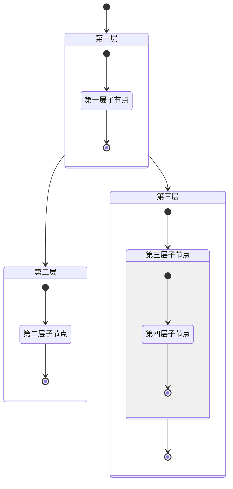

---

* 使用 `<<fork>>` 描述分支，使用 `<<join>>` 描述聚合

---

**语法**

    ```mermaid
    stateDiagram
        state 分支 <<fork>>
            分支 --> 分支2
            分支 --> 分支3

        state 合并 <<join>>
            分支2 --> 合并
            分支3 --> 合并

        [*] --> 分支
        合并 --> 状态4
        状态4 --> [*]
    ```

**效果**

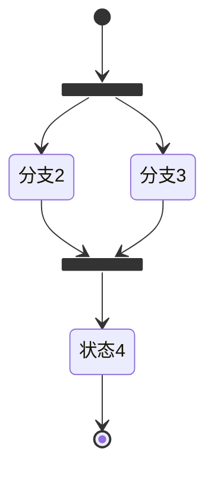

**语法**

    ```mermaid
    stateDiagram
        [*] --> 下单成功
        下单成功 --> 备货
        备货 --> 出货中
        state 出货中 <<fork>>
            出货中 --> 出货失败
            出货失败 --> [*]

            出货中 --> 出货确认
            出货确认 --> 出货完毕
            出货完毕 --> 订单完成
            订单完成 --> [*]
    ```

**效果**

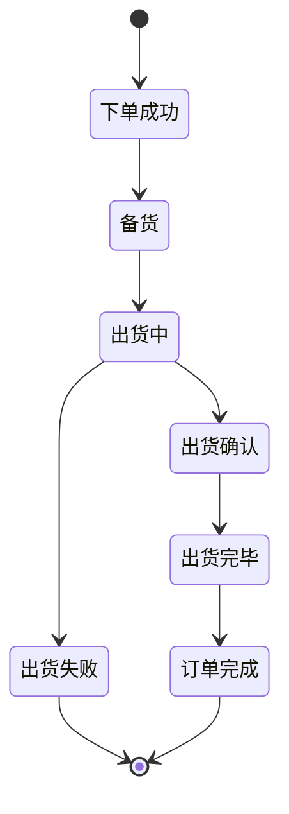

---

* 对于一些同步完成的状态转换，可以用 `--` 符号声明并行效果

---

**语法**

    ```mermaid
    stateDiagram
        [*] --> 激活状态

        state 激活状态 {
            [*] --> NumLock关
            NumLock关 --> NumLock开 : 按下 NumLock 键
            NumLock开 --> NumLock关 : 按下 NumLock 键
            --
            [*] --> CapsLock关
            CapsLock关 --> CapsLock开 : 按下 CapsLock 键
            CapsLock开 --> CapsLock关 : 按下 CapsLock 键
        }
    ```

**效果**

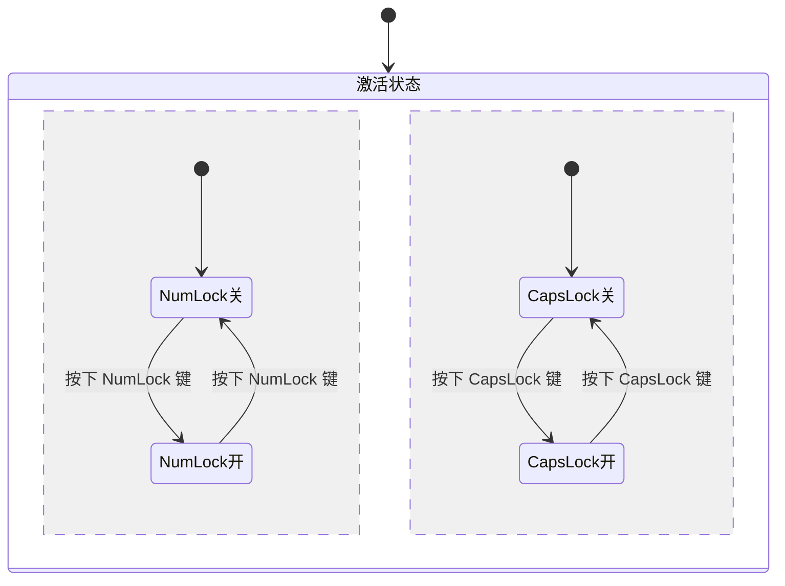

---

* 单行备注： `note <left|right> of 状态ID : 备注内容`
* 多行备注：
  ```
  note <left|right> of 状态ID
      备注内容
  end note
  ```

---

**语法**

    ```mermaid
    stateDiagram
        状态1 --> 状态2
        note left of 状态1 : 左侧描述
        note right of 状态2
            右侧描述
        end note
    ```

**效果**

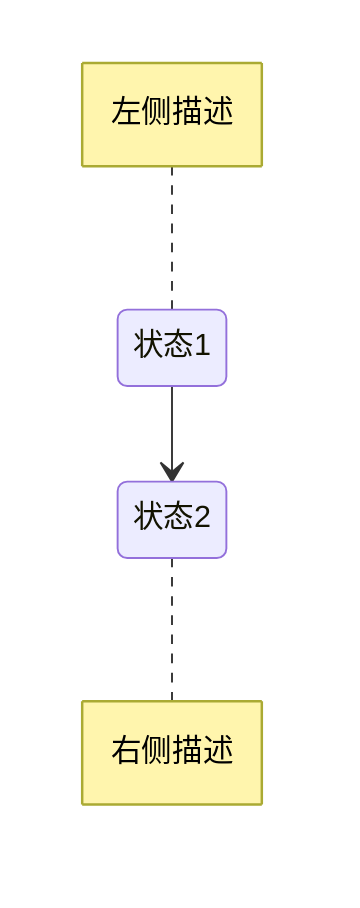

---

### 流程图graph

* 布局
    * 使用 `graph 布局标志` 说明流程图布局(不带标志默认从上到下)

    | 布局标志 | 方向 | 说明 |
    | --- | --- | --- |
    | TB | top bottom | 从上到下 |
    | TD | 等同于 TB  | 从上到下 |
    | BT | bottom top | 从下到上 |
    | RL | right left | 从右到左 |
    | LR | left right | 从左到右 |
<br>

* 节点
    * 使用 `节点ID 左符号 节点显示文本 右符号` 显示节点属性和形状
    * 不带标志默认矩形
    * 节点显示文本用双引号包围可以避免一些特殊字符的错误 `"节点显示文本"`
    * 节点显示文本可以使用HTML中的实体字符

    | 图形标志 | 流程图作用 |  形状 | 功能说明 |
    | --- | --- | --- | --- |
    | `{{hexagon}}` | 六边形 | 起始框 | 表示准备之意，大多数人用作流程的起始 |
    | `([ellipse])` | 椭圆形 | 结束框 | 一般用作流程的结束 |
    | `(rounded rectangle)` | 圆角矩形(扁圆) | 起始框 / 结束框 | 表示程序的开始或者结束 |
    | `[rectangle]` | 矩形 | 执行框 | 表示执行的处理(process) |
    | `{diamond}` | 菱形 | 判别框 | 表示决策或判断 |
    | `[/parallelogram/]` | 平行四边形(右倾) | 数据框 | 表示数据的输入或者输出 |
    | `[\parallelogram\]` | 平行四边形(左倾) | 数据框 | |
    | `[[bilateral rectangle]]` | 双边矩形 | 预处理框 | 可以理解为子流程 |
    | `((circle))` | 圆形 | 联系框 | 一般表示从一个进程到另一个进程的交叉引用 |
    | `[(cylindrical)]` | 圆柱形 | 数据库 | 表示数据库 |
    | `[/trapezoid\]` | 梯形(正) | 手动操作框 | 一般用作手动操作 |
    | `[\reverse trapezoid/]` | 梯形(倒) | 手动操作框 | |
    | `>label shape]` | 不对称节点 |  |  |
<br>

* 连线
    * 不同节点之间需要通过连接线来描述其相关性
    * 无方向的连接线可用来表示相关性，有方向的连接线可以表示数据流向或者节点间的依赖关系
    * 用实线表示强关联，用虚线表示弱关联等待
    * 带有文字有2种写法，例如： ` --text--> ` 或 ` -->|text| ` ，`-.text.->`
    * 增加相应字符可以加长连线，例如：` ---> `

    | 无向连线 | 有向连线 | 说明 |
    | --- | --- | --- |
    | `---` | `-->` | 实线 |
    | `----` | `--->` | 长实线 |
    | `-.-` | `.->` | 虚线 |
    | `===` | `==>` | 粗实线 |
<br>

* 样式
    * 关键字 `linkStyle` 后面的 `数字` 表示第几根线(从0 开始)的颜色和粗细
    * 关键字 `style` 后面的 `节点ID` 可以设置节点背景，边框颜色，粗细

---

**语法**

    ```mermaid
    graph LR
        开始{{开始}}
        执行1[i = 1]
        执行2[j = 0]
        执行3[i++]
        执行4["a = arr[j], b = arr[j+1]"]
        执行5[交换 a, b]
        执行6[j ++]
        判断1{i < n}
        判断2{j < n - i}
        判断3{a > b}
        结束([结束])

        开始 --> 执行1
        执行1 --> 判断1
        判断1 --Yes--> 执行2
        执行2 --> 判断2
        判断2 --Yes--> 执行4
        判断2 --No--> 执行3
        执行3 --> 判断1
        执行4 --> 判断3
        判断3 --No--> 判断2
        判断3 --Yes--> 执行5
        执行5 --> 执行6
        执行6 --> 判断2
        判断1 --No--> 结束

        标题[冒泡排序]

        linkStyle 0 stroke:#0ff,stroke-width:4px;
        linkStyle 12 stroke:#0ff,stroke-width:4px;
        style 开始 fill:#ccf,stroke:#f66,stroke-width:4px
        style 结束 fill:#ccf,stroke:#f66,stroke-width:4px
    ```

**效果**

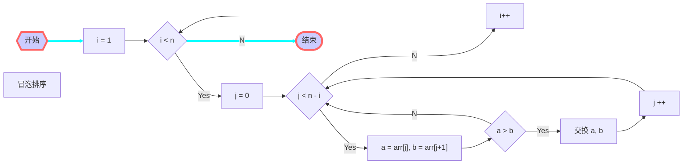

---

* 多重链
    * 可以使用 `&` 字符

---

**语法**

    ```mermaid
    graph
        a --> b & c--> d

        A & B--> C & D

        X --> M
        X --> N
        Y --> M
        Y --> N
    ```

**效果**

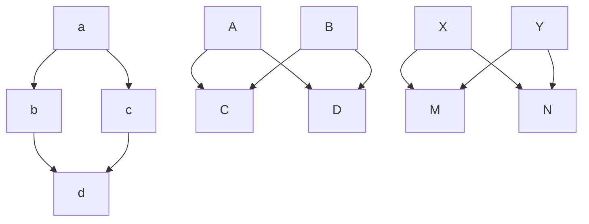

---

* 子图
    * 需要将 `graph` 关键字改为 `flowchart` ，在代码段的开始加入 `subgraph` ，尾部加入`end`

---

**语法**

    ```mermaid
    flowchart TB
        subgraph one
            a1-->a2
        end

        subgraph two
            b1-->b2
        end

        subgraph three
            c1-->c2
        end

        c1-->a2
        one --> two
        three --> two
        two --> c2

        title[subgraph]
    ```

**效果**

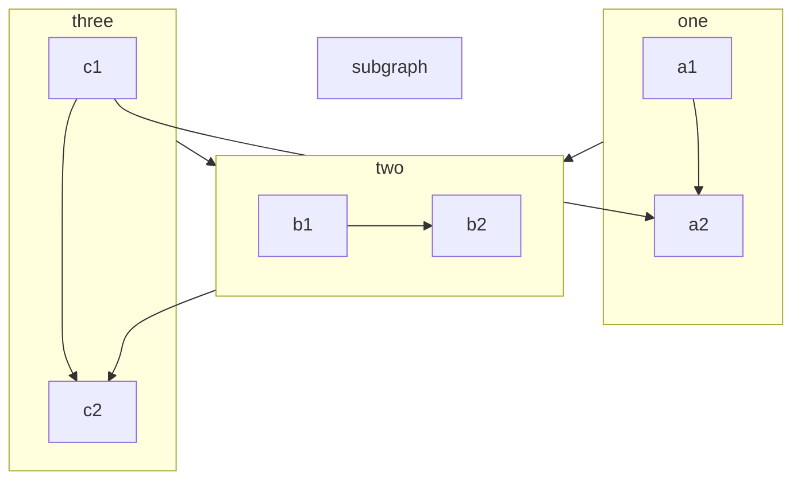

---

### 思维导图mindmap

* 思维导图使用不同的缩进表示父子关系
* 节点
    * 单纯使用 `节点` 当做节点ID和节点显示文档
    * 或使用 `节点ID 左符号 节点显示文本 右符号` 显示节点属性和形状
    * 节点形状(左符号和右符号)和 [流程图节点](#流程图graph) 相同
    * 可以使用 `::icon(图标代码)` 给节点增加小图片，图标代码使用 [Font Awesome 5](https://fontawesome.com/v5/search?o=r&m=free)

---

**语法**

    ```mermaid
    mindmap
      根((根))
        起源
          悠久的历史
          ::icon(fa fa-book)
          普及
            英国流行心理学作家托尼·布赞
        研究
          关于有效性和特点
          关于自动创建
            使用
              创作技巧
              战略规划
              参数映射
        工具
          笔和纸
          Mermaid绘图
    ```

**效果**

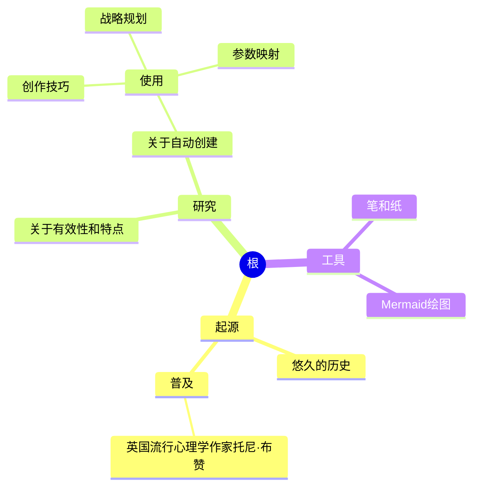

---

### 时序图sequenceDiagram

* 绘制时序图，必须包含时序图类型声明、对象及消息三个部分

    * 角色：使用关键字 `participant` 定义角色，有下面的方法：
        * 角色名也是角色ID(也可省略定义)：`participant 角色`
        * 角色名和角色ID分开：`participant 角色ID as 角色名`

    * 连线

        | 类型 | 实线 | 虚线 |
        | --- | --- | --- |
        | 无箭头 | `->` | `-->` |
        | 有箭头 | `->>` | `-->>` |
        | 有x号 | `-x` | `--x` |

    * 备注

        | 表述 |
        | --- |
        | `Note left of 角色ID: 左侧备注` |
        | `Note right of 角色ID: 右侧备注` |
        | `Note over 角色ID: 当中备注` |
        | `Note over 角色ID1, 角色ID2: 当中备注` |

    * 活动期
        * 激活控制焦点：`activate 角色ID`
        * 结束控制焦点：`deactivate 角色ID`
        * 也可以连线背后加上 `+` 或 `-` 表示控制开始或结束

    * 循环 `loop`

        ```
        loop describing_text
        ... statements ...
        end
        ```

    * 条件 `alt`

        ```
        alt describing_text
        ... statements ...
        else describing_text
        ... statements ...
        end
        ```

---

**语法**

    ```mermaid
    sequenceDiagram
        participant A
        Note left of A: 左侧备注
        Note right of B: 右侧备注
        Note over A, B: 当中备注
        A->B: 无箭头实线
        A-->B: 无箭头虚线
        A->>B: 有箭头实线
        A-->>B: 有箭头虚线
        A-xB: 有箭头实线，加上叉
        A--xB: 有箭头虚线，加上叉
    ```

**效果**

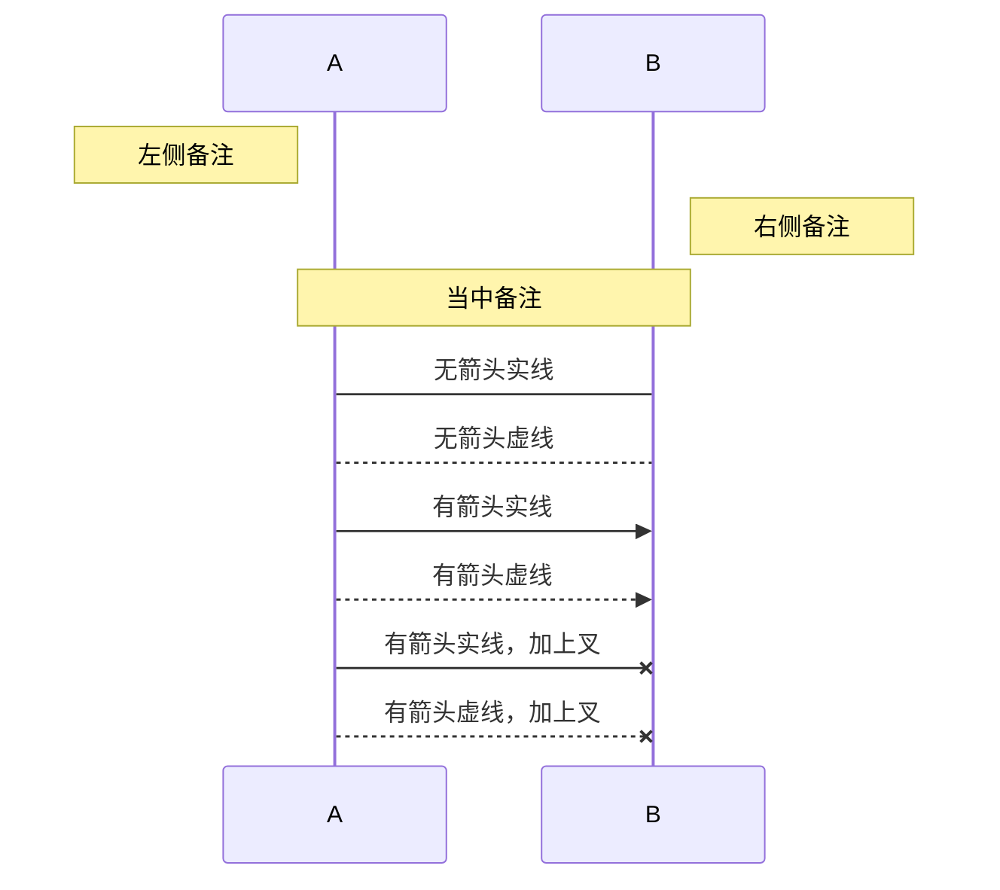

**语法**

    ```mermaid
    sequenceDiagram
        participant a as 学生
        participant b as 教务系统
        participant c as 课程
        participant d as 成绩

        opt 认证
            a->>b: 用户名/密码
            activate b
            alt 正确
                b->>a: 下一步操作
            else 错误
                b->>a: 密码错误，请重试
            end
            deactivate b
        end
        a->>+b: 请求课程列表
        b->>+c: 获取课程列表
        c-->>-b: 返回课程列表
        b->>+d: 获取成绩信息
        d-->>-b: 返回成绩信息
        b-->>-a: 显示成绩
    ```

**效果**

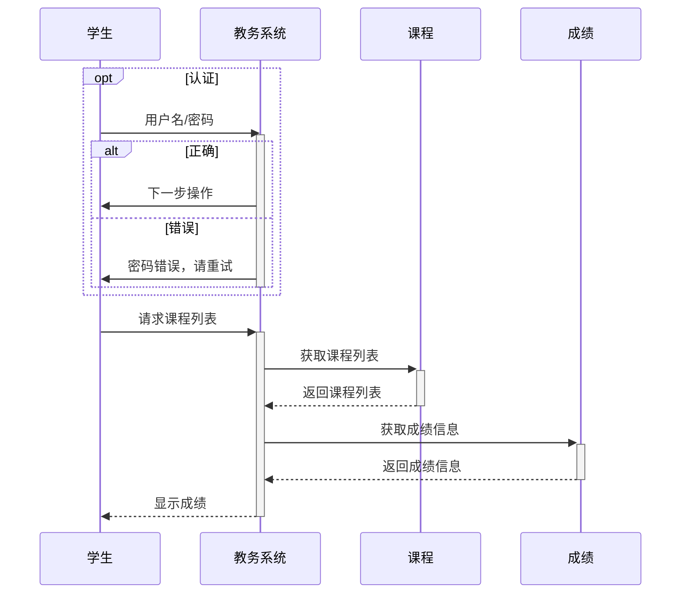

---

### 甘特图gantt

* 基本的甘特图由标题 `title` 、日期格式约定 `dateFormat` 、分组及任务 `section` 三部分组成
    * 一张甘特图表中可以包含多个分组，一个分组内可以定义多个任务
    * 任务定义格式形如：`<任务名> : [任务状态], [任务ID], [前置任务], <周期>` ，其中任务名和周期两项是必要项
    * 任务状态：
        * `done` 已完成
        * `active` 正在进行
        * `crit` 关键任务
        * 默认任务为未开始任务
        * 默认前置任务为上一个任务，可用 `after task` 指定

---

**语法**

    ```mermaid
    gantt
        title                甘特图实例
        dateFormat           YYYY-MM-DD

        section 基本任务
        已完成任务            :done,    des1, 2014-01-06, 2014-01-08
        进行中任务            :active,  des2, 2014-01-09, 3d
        未开始任务1           :         des3, after des2, 5d
        未开始任务2           :         des4, after des3, 5d

        section 紧急任务
        已完成紧急任务        :crit, done, 2014-01-06, 24h
        已完成紧急任务1       :crit, done, after des1, 2d
        进行中紧急任务2       :crit, active, 3d
        未开始紧急任务3       :crit, 5d
        未开始一般任务4       :2d
        未开始一般任务5       :1d

        section 文档编写
        进行中文档任务1       :active, a1, after des1, 3d
        未开始文档任务2       :after a1, 20h
        未开始文档任务3       :doc1, after a1, 48h

        section 其他部分
        其他任务1            :after doc1, 3d
        其他任务2            :20h
        其他任务3            :48h
    ```

**效果**

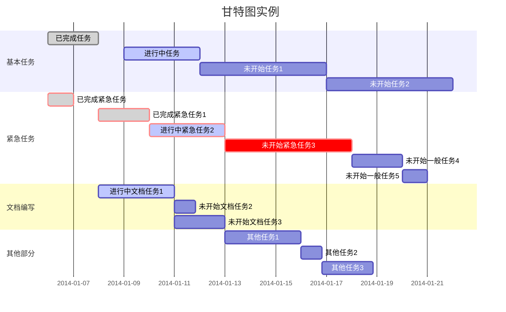

---

### 饼图pie

* 饼图包含标题、内容名称和内容权重3个元素
    * 内容权重会在渲染时，自动转换为百分比并显示在饼图上

---

**语法**

    ```mermaid
    pie title 宠物的选择
        "狗" : 500
        "猫" : 300
        "其它" : 100
    ```

**效果**

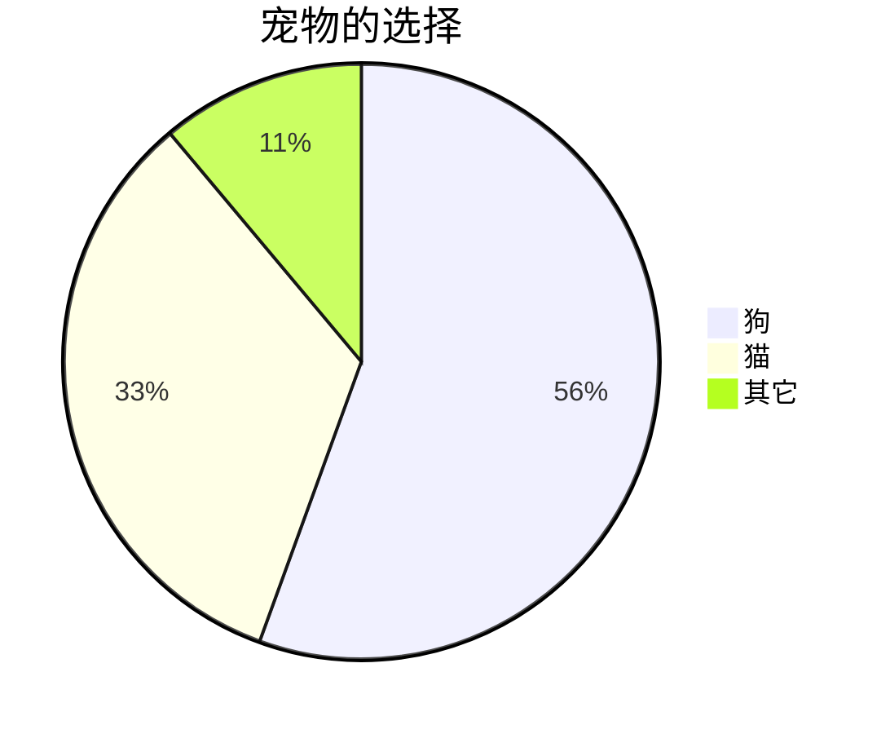

---

### 类图classDiagram

* 类是类图中的核心组成，类的成员包括属性和方法，以及一些扩展信息。在类图中，一个类实例由三层组成：
    * 类名称：在类图的最顶端
    * 类属性：在类图的中间层
    * 类方法：在类图的最下层
<br>

* 语法要点
    * 使用`:` 表示类成员，也可以使用 `{ }` 来描述成员
    * 区分属性和方法的语法依赖于是否以小括号 `()` 结尾，无括号的被解释为属性，有括号的被解释为方法
    *  `+` 表示 public，`-` 表示 private，`#` 表示 protected，`~` 表示 package/internal
    * 类方法小括号 `()` 结尾处增加数据类型描述，可以给方法成员设置入参及返回值
<br>

* 箭头关系：`[类A][箭头][类B]: 可选的标签文字`

    | 语法 | 关系 |
    | --- | --- |
    | `--\|>` `<\|--` | 继承关系 |
    | `--*`   `*--`   | 组成关系 |
    | `--o`   `o--`   | 集合关系 |
    | `-->`   `<--`   | 关联关系 |
    | `--`            | 实现连接 |
    | `..>`   `<..`   | 依赖关系 |
    | `..\|>` `<\|..` | 实现关系 |
    | `..`            | 虚线连接 |

    ```mermaid
    classDiagram
        classA --|> classB : 继承
        classC --* classD : 组成
        classE --o classF : 集合
        classG --> classH : 关联
        classI -- classJ : 实线连接
        classK ..> classL : 依赖
        classM ..|> classN : 实现
        classO .. classP : 虚线连接
    ```

---

**语法**

    ```mermaid
    classDiagram
        Animal <|-- Duck
        Animal <|-- Fish
        Animal <|-- Zebra

        Animal: +int age
        Animal: +String gender
        Animal: +isMammal()
        Animal: +mate()

        class Duck {
            +String beakColor
            +swim()
            +quack()
        }

        class Fish {
            -int sizeInFeet
            -canEat()
        }

        class Zebra {
            +bool is_wild
            +run()
        }
    ```

**效果**

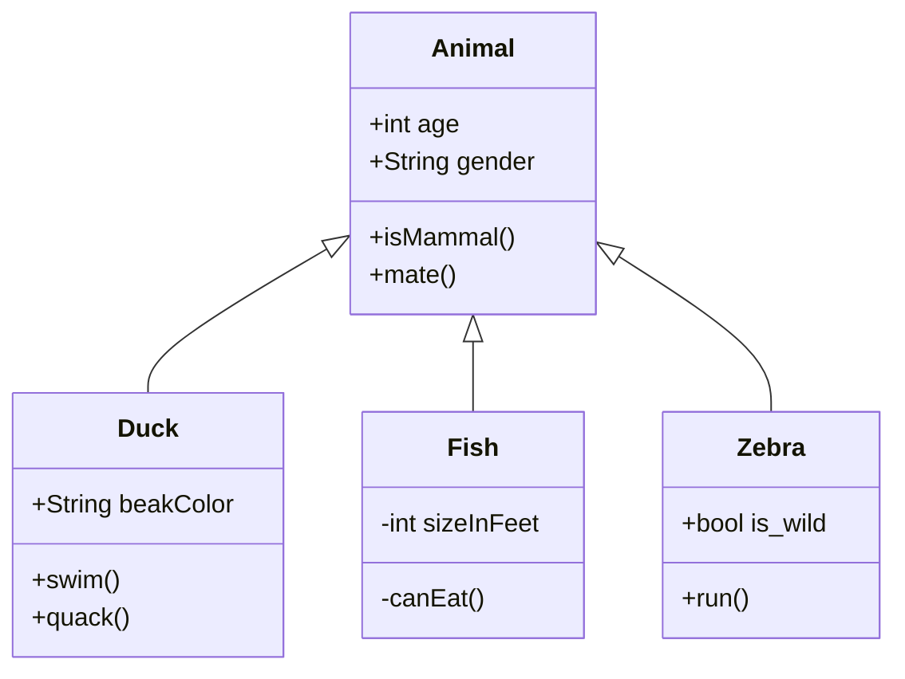

---

## 符号公式语法LaTeX

### Latex语法

* markdown的符号和公式一般使用 **LaTeX** 语法(建议使用)
* 公式标记：行内公式(inline)用一对美元符号 `$` 包裹；整行公式(displayed)用一对紧挨的两个美元符号 `$$` 包裹
    * `$ \int x dx = \frac{x^2}{2} + C $` 是行内公式 $ \int x dx = \frac{x^2}{2} + C $
    * `$$ \mu = \frac{1}{N} \sum_{i=0} x_i $$` 是整行公式 $$ \mu = \frac{1}{N} \sum_{i=0} x_i $$
    * **注：mdbook 使用 `mdbook-katex` 插件，美元符和公式之间一定要有空格**

### MathJax语法

* mdbook的符号和公式也可以使用 **MathJax** 语法，需要将 `book.toml` 中的 `mathjax-support` 置为 true
    * 行内公式(inline)用 `\\( 公式内容 \\)` 包裹；整行公式(displayed)用 `\\[ 公式内容 \\]` 包裹
        * `\\( \int x dx = \frac{x^2}{2} + C \\)` 是行内公式 \\( \int x dx = \frac{x^2}{2} + C \\)
        * `\\[ \mu = \frac{1}{N} \sum_{i=0} x_i \\]` 是整行公式 \\[ \mu = \frac{1}{N} \sum_{i=0} x_i \\]
    * 公式内容中使用斜杠可能需要二次转义

### 定界符和上下标

* 定界符
    * 默认情况下，上下标符号仅仅对下一个字符作用，必须使用大括号 `{ }` 来界定结合性
    * 例如： `$ A^ix $` 表示 $ A^ix $ ， `$ A^{ix} $` 表示  $ A^{ix} $
    * 真正表示大括号时需要使用转义字符 `\{` 和 `\}`

* 上下标
    * 左上标： `$ ^aA $` 表示 $ ^aA $
    * 左下标： `$ _bA $` 表示 $ _bA $
    * 右上标： `$ A^c $` 表示 $ A^c $
    * 右下标： `$ A_d $` 表示 $ A_d $
    * 四周标： `$ ^a_bA^c_d $` 表示 $ ^a_bA^c_d $
    * 四周标： `$ _b^aA_d^c $` 表示 $ _b^aA_d^c $

### 括号

| 符号 | 代码 | 描述 |
|----|----|----|
| $ ( x ) $ | `$ ( x ) $` | 小括号 |
| $ [ x ] $ | `$ [ x ] $` | 中括号 |
| $ \{ x \} $ | `$ \{ x \} $` | 大括号 |
| $ \lbrace x \rbrace $ | `$ \lbrace x \rbrace $` | 大括号 |
| $ \langle x \rangle $ | `$ \langle x \rangle $` | 尖括号 |
| $ \lceil x \rceil $ | `$ \lceil x \rceil $` | 上取整 |
| $ \lfloor x \rfloor $ | `$ \lfloor x \rfloor $` | 下取整 |
| $ \frac{a+b}{c+d} $ | `$ \frac{a+b}{c+d} $` | 分数 |
| $ \sqrt{a+b} $ | `$ \sqrt{a+b} $` | 根号 |
| $ \sqrt[c+d]{a+b} $ | `$ \sqrt[c+d]{a+b} $` | 根号 |
| $ \overline{a+b+c+d} $ | `$ \overline{a+b+c+d} $` | 上划线 |
| $ \underline{a+b+c+d} $ | `$ \underline{a+b+c+d} $` | 下划线  |
| $ \overbrace{a+\underbrace{b+c}_{1.0}+d}^{2.0} $ | `$ \overbrace{a+\underbrace{b+c}_{1.0}+d}^{2.0} $` | 选择线 |

* 原始括号并不会随着公式的大小自动缩放，可以使用 `\left( \right)` 来自适应的调整括号。如 `$ (\frac xy) $` `$ \left( \frac xy \right) $` 的区别 $ (\frac xy) $ $ \left( \frac xy \right) $

### 二元关系符

| 符号 | 代码 | 描述 |
|----|----|----|
| $ < $ | `$ < $` | 小于 |
| $ \not< $ | `$ \not< $` | 不大于 |
| $ > $ | `$ > $` | 大于 |
| $ \not> $ | `$ \not> $` | 不大于 |
| $ = $ | `$ = $` | 等于 |
| $ \ne $ $ \neq $ $ \not= $ | `$ \ne $` `$ \neq $` `$ \not= $` | 不等于 |
| $ \le $ $ \leq $ | `$ \le $` `$ \leq $` | 小于等于 |
| $ \ge $ $ \geq $ | `$ \ge $` `$ \geq $` | 大于等于 |
| $ \equiv $ | `$ \equiv $` | 等价于、恒等于 |
| $ \sim $ | `$ \sim $` |  |
| $ \approx $ | `$ \approx $` | 约等于 |
| $ \simeq $ | `$ \simeq $` |  |
| $ \cong $ | `$ \cong $` | 约等于 |
| $ \ll $ | `$ \ll $` | 左移、远大于 |
| $ \gg $ | `$ \gg $` | 右移、远小于 |
| $ \subset $ $ \supset $ | `$ \subset $` `$ \supset $` | 子集 |
| $ \not\subset $ $ \not\supset $ | `$ \not\subset $` `$ \not\supset $` |  |
| $ \subseteq $ $ \supseteq $ | `$ \subseteq $` `$ \supseteq $` | 真子集 |
| $ \not\subseteq $ $ \not\supseteq $ | `$ \not\subseteq $` `$ \not\supseteq $` |  |
| $ \in $ $ \ni $ $ \owns $ | `$ \in $` `$ \ni $` `$ \owns $` | 集合元素 |
| $ \notin $ $ \notni $ | `$ \notin $` `$ \notni $` |  |
| $ \mid $ | `$ \mid $` | 竖线 |
| $ \parallel $ | `$ \parallel $` | 平行 |
| $ \emptyset $ | `$ \emptyset $` | 空集 |
| $ \biguplus $ | `$ \biguplus $` | 多重集 |
| $ \bigsqcup $ | `$ \bigsqcup $` |  |

### 二元运算符

| 符号 | 代码 | 描述 |
|----|----|----|
| $ + $ | `$ + $` | 加号 |
| $ - $ | `$ - $` | 减号 |
| $ \times $ | `$ \times $` | 乘号 |
| $ \div $ | `$ \div $` | 除号 |
| $ \pm $ | `$ \pm $` | 正负号 |
| $ \mp $ | `$ \mp $` | 负正号 |
| $ \cup $ $ \bigcup $ | `$ \cup $` `$ \bigcup $` | 并集 |
| $ \cap $ $ \bigcap $ | `$ \cap $` `$ \bigcap $` | 交集 |
| $ \vee $ $ \lor $ $ \bigvee $ | `$ \vee $` `$ \lor $` `$ \bigvee $` | 逻辑或 |
| $ \wedge $ $ \land $ $ \bigwedge $ | `$ \wedge $` `$ \land $` `$ \bigwedge $` | 逻辑与 |
| $ \oplus $ $ \bigoplus $ | `$ \oplus $` `$ \bigoplus $` | 异或 |
| $ \ominus $ | `$ \ominus $` |  |
| $ \odot $ $ \bigodot $ | `$ \odot $` `$ \bigodot $` |  |
| $ \oslash $ | `$ \oslash $` |  |
| $ \otimes $ $ \bigotimes $ | `$ \otimes $` `$ \bigotimes $` | 克罗内克积 |
| $ \bigtriangleup $ | `$ \bigtriangleup $` |  |
| $ \bigtriangledown $ | `$ \bigtriangledown $` |  |
| $ \bigcirc $ | `$ \bigcirc $` |  |
| $ \infty $ | `$ \infty $` | 无穷 |
| $ \nabla $ | `$ \nabla $` | 梯度 |
| $ \because $ | `$ \because $` | 因为 |
| $ \therefore $ | `$ \therefore $` | 所以 |
| $ \forall $ | `$ \forall $` | 任意 |
| $ \exists $ | `$ \exists $` | 存在 |
| $ \sum $ | `$ \sum $` | N元求和 |
| $ \sum_{k=1}^N k^2 $ | `$ \sum_{k=1}^N k^2 $` |  |
| $ \begin{matrix} \sum_{k=1}^N k^2 \end{matrix} $ | `$ \begin{matrix} \sum_{k=1}^N k^2 \end{matrix} $` | 居中 |
| $ \prod $ | `$ \prod $` | N元乘积 |
| $ \prod_{i=1}^N x_i $ | `$ \prod_{i=1}^N x_i $` |  |
| $ \coprod $ | `$ \coprod $` | N元余积 |
| $ \int $ | `$ \int $` | 积分 |
| $ \int_{-N}^{N} e^x\, dx $ | `$ \int_{-N}^{N} e^x\, dx` |  |
| $ \int_{-\infty}^{\infty} e^{x} dx $ | `\int_{-\infty}^{\infty} e^{x} dx $` |  |
| $ \iint $ | `$ \iint $` | 双重积分 |
| $ \iiint $ | `$ \iiint $` | 三重积分 |
| $ \oint $ | `$ \oint $` | 曲线积分 |
| $ \oint_{C} x^3 dx + 4y^2 dy $ | `$ \oint_{C} x^3 dx + 4y^2 dy $` |  |
| $ \prime $ | `$ \prime $` | 求导 |

### 希腊字母

| 符号 | 代码 | 描述 |
|----|----|----|
| $ \alpha $ $ \Alpha $ | `$ \alpha $` `$ \Alpha $` |  |
| $ \beta $ $ \Beta $ | `$ \beta $` `$ \Beta $` |  |
| $ \gamma $ $ \Gamma $ | `$ \gamma $` `$ \Gamma $` |  |
| $ \delta $ $ \Delta $ | `$ \delta $` `$ \Delta $` |  |
| $ \epsilon $ $ \Epsilon $ | `$ \epsilon $` `$ \Epsilon $` |  |
| $ \zeta $ $ \Zeta $ | `$ \zeta $` `$ \Zeta $` |  |
| $ \eta $ $ \Eta $ | `$ \eta $` `$ \Eta $` |  |
| $ \theta $ $ \Theta $ | `$ \theta $` `$ \Theta $` |  |
| $ \iota $ $ \Iota $ | `$ \iota $` `$ \Iota $` |  |
| $ \kappa $ $ \Kappa $ | `$ \kappa $` `$ \Kappa $` |  |
| $ \lambda $ $ \Lambda $ | `$ \lambda $` `$ \Lambda $` |  |
| $ \mu $ $ \Mu $ | `$ \mu $` `$ \Mu $` |  |
| $ \nu $ $ \Nu $ | `$ \nu $` `$ \Nu $` |  |
| $ \xi $ $ \Xi $ | `$ \xi $` `$ \Xi $` |  |
| $ \omega $ $ \Omega $ | `$ \omega $` `$ \Omega $` |  |
| $ \pi $ $ \Pi $ | `$ \pi $` `$ \Pi $` |  |
| $ \rho $ $ \Rho $ | `$ \rho $` `$ \Rho $` |  |
| $ \sigma $ $ \Sigma $ | `$ \sigma $` `$ \Sigma $` |  |
| $ \tau $ $ \Tau $ | `$ \tau $` `$ \Tau $` |  |
| $ \upsilon $ $ \Upsilon $ | `$ \upsilon $` `$ \Upsilon $` |  |
| $ \phi $ $ \Phi $ | `$ \phi $` `$ \Phi $` |  |
| $ \chi $ $ \Chi $ | `$ \chi $` `$ \Chi $` |  |
| $ \psi $ $ \Psi $ | `$ \psi $` `$ \Psi $` |  |
| $ \omicron $ $ \Omicron $ | `$ \omicron $` `$ \Omicron $` |  |

### 其他字符

| 符号 | 代码 | 描述 |
|----|----|----|
| $ \varepsilon $ | `$ \varepsilon $` |  |
| $ \vartheta $ | `$ \vartheta $` |  |
| $ \varpi $ | `$ \varpi $` |  |
| $ \varrho $ | `$ \varrho $` |  |
| $ \varsigma $ | `$ \varsigma $` |  |
| $ \varphi $ | `$ \varphi $` |  |
| $ \mho $ | `$ \mho $` |  |
| $ \partial $ | `$ \partial $` |  |
| $ \hbar $ | `$ \hbar $` |  |
| $ \imath $ | `$ \imath $` |  |
| $ \jmath $ | `$ \jmath $` |  |
| $ \ell $ | `$ \ell $` |  |
| $ \Re $ | `$ \Re $` |  |
| $ \Im $ | `$ \Im $` |  |
| $ \aleph $ | `$ \aleph $` |  |
| $ \wp $ | `$ \wp $` |  |
| $ \cdot $ | `$ \cdot $` | 点 |
| $ \dots $ | `$ \dots $` | 省略号 |
| $ \cdots $ | `$ \cdots $` |  |
| $ \vdots $ | `$ \vdots $` |  |
| $ \ddots $ | `$ \ddots $` |  |
| $ \ast $ | `$ \ast $` | 星号 |
| $ \star $ | `$ \star $` |  |
| $ \circ $ | `$ \circ $` | 圈 |
| $ \bullet $ | `$ \bullet $` |  |
| $ \diamond $ $ \Diamond $ | `$ \diamond $` `$ \Diamond $` |  |
| $ \setminus $ | `$ \setminus $` |  |
| $ \triangle $ | `$ \triangle $` |  |
| $ \triangleleft $ | `$ \triangleleft $` |  |
| $ \triangleright $ | `$ \triangleright $` |  |
| $ \Box $ | `$ \Box $` |  |
| $ \bot $ | `$ \bot $` |  |
| $ \top $ | `$ \top $` |  |
| $ \angle $ | `$ \angle $` |  |
| $ \surd $ | `$ \surd $` |  |
| $ \neg $ $ \lnot $ | `$ \neg $` `$ \lnot $`|  |
| $ \flat $ | `$ \flat $` |  |
| $ \natural $ | `$ \natural $` |  |
| $ \sharp $ | `$ \sharp $` |  |
| $ \diamondsuit $ | `$ \diamondsuit $` |  |
| $ \heartsuit $ | `$ \heartsuit $` |  |
| $ \clubsuit $ | `$ \clubsuit $` |  |
| $ \spadesuit $ | `$ \spadesuit $` |  |

### 重音符

| 符号 | 代码 | 描述 |
|----|----|----|
| $ \bar{a} $ | `$ \bar{a} $` |  |
| $ \hat{a} $ | `$ \hat{a} $` | 期望值 |
| $ \widehat{A} $ | `$ \widehat{A} $` |  |
| $ \breve{a} $ | `$ \breve{a} $` |  |
| $ \acute{a} $ | `$ \acute{a} $` |  |
| $ \tilde{a} $ | `$ \tilde{a} $` |  |
| $ \widetilde{A} $ | `$ \widetilde{A} $` |  |
| $ \vec{a} $ | `$ \vec{a} $` |  |
| $ \check{a} $ | `$ \check{a} $` | |
| $ \dot{a} $ | `$ \dot{a} $` |  |
| $ \ddot{a} $ | `$ \ddot{a} $` |  |
| $ \grave{a} $ | `$ \grave{a} $` |  |

### 箭头

| 符号 | 代码 | 描述 |
|----|----|----|
| $ \uparrow $ $ \Uparrow $ | `$ \uparrow $` `$ \Uparrow $` |  |
| $ \downarrow $ $ \Downarrow $ | `$ \downarrow $` `$ \Downarrow $` |  |
| $ \leftarrow $ $ \gets $ $ \Leftarrow $ | `$ \leftarrow $` `$ \gets $` `$ \Leftarrow $` |  |
| $ \longleftarrow $ $ \Longleftarrow $ | `$ \longleftarrow $` `$ \Longleftarrow $` |  |
| $ \rightarrow $ $ \to $ $ \Rightarrow $ | `$ \rightarrow $` `$ \to $` `$ \Rightarrow $` |  |
| $ \longrightarrow $ $ \Longrightarrow $ | `$ long\rightarrow $` `$ \Longrightarrow $` |  |
| $ \leftrightarrow $ $ \Leftrightarrow $ | `$ \leftrightarrow $` `$ \Leftrightarrow $` |  |
| $ \longleftrightarrow $ $ \Longleftrightarrow $ $ \iff $ | `$ \longleftrightarrow $` `$ \Longleftrightarrow $` `$ \iff $` |  |
| $ \updownarrow $ $ \Updownarrow $ | `$ \updownarrow $` `$ \Updownarrow $` |  |
| $ \nearrow $ | `$ \nearrow $` |  |
| $ \searrow $ | `$ \searrow $` |  |
| $ \swarrow $ | `$ \swarrow $` |  |
| $ \nwarrow $ | `$ \nwarrow $` |  |
| $ \leftharpoonup $ | `$ \leftharpoonup $` |  |
| $ \rightharpoonup $ | `$ \rightharpoonup $` |  |
| $ \leftharpoondown $ | `$ \leftharpoondown $` |  |
| $ \rightharpoondown $ | `$ \rightharpoondown $` |  |
| $ \rightleftharpoons $ | `$ \rightleftharpoons $` |  |

### 矩阵方程

| 符号 | 代码 | 描述 |
|----|----|----|
| $ \begin{matrix} a & b \\ c & d  \end{matrix} $ | `$ \begin{matrix} a & b \\ c & d  \end{matrix} $` | 不带括号的矩阵matrix |
| $ \begin{pmatrix} a & b \\ c & d  \end{pmatrix} $ | `$ \begin{pmatrix} a & b \\ c & d  \end{pmatrix} $` | 带小括号的矩阵pmatrix |
| $ \begin{bmatrix} a & b \\ c & d  \end{bmatrix} $ | `$ \begin{bmatrix} a & b \\ c & d  \end{bmatrix} $` | 带中括号的矩阵bmatrix |
| $ \begin{Bmatrix} a & b \\ c & d  \end{Bmatrix} $ | `$ \begin{Bmatrix} a & b \\ c & d  \end{Bmatrix} $` | 带大括号的矩阵Bmatrix |
| $ \begin{vmatrix} a & b \\ c & d  \end{vmatrix} $ | `$ \begin{vmatrix} a & b \\ c & d  \end{vmatrix} $` | 单竖线的矩阵vmatrix |
| $ \begin{Vmatrix} a & b \\ c & d  \end{Vmatrix} $ | `$ \begin{Vmatrix} a & b \\ c & d  \end{Vmatrix} $` | 双竖线的矩阵Vmatrix |
| $ \begin{Bmatrix} a & b & \cdots & g \\ h & i & \cdots & n \\ \vdots & \vdots & \ddots & \vdots \\ u & v & \cdots & z \end{Bmatrix} $ | `$ \begin{Bmatrix} a & b & \cdots & g \\ h & i & \cdots & n \\ \vdots & \vdots & \ddots & \vdots \\ u & v & \cdots & z \end{Bmatrix} $` | 矩阵中间有省略号 |
| $ \begin{cases} 3x + 5y + z = 0 \\ 7x - 2y + 4z = 0 \\ -6x + 3y + 2z = 0 \end{cases} $ | `$ \begin{cases} 3x + 5y + z = 0 \\ 7x - 2y + 4z = 0 \\ -6x + 3y + 2z = 0 \end{cases} $` | 方程组 |

* 矩阵中间加横线
    * 代码: `$ \left\{ \begin{array}{ccc|c} a & b & c & g \\ h & i & j & n \\ o & p & q & t \\ u & v & w & z \end{array} \right\} $`
    * 效果:  $ \left\{ \begin{array}{ccc|c} a & b & c & g \\ h & i & j & n \\ o & p & q & t \\ u & v & w & z \end{array} \right\} $

## 格式设置

* 显示格式

    | 效果 | 语法 |
    |----|----|
    | <font face="黑体">我是黑体字</font> | `<font face="黑体">我是黑体字</font>` |
    | <font color=red>我是红色</font> | `<font color=red>我是红色</font>` |
    | <font color=#0000ff>我是蓝色</font> | `<font color=#0000ff>我是蓝色</font>` |
    | <font size=5>我是尺寸</font> | `<font size=5>我是尺寸</font>` |
    | <font face="黑体" color=green size=2>我是黑体，绿色，尺寸为2</font> | `<font face="黑体" color=green size=2>我是黑体，绿色，尺寸为2</font>` |
    | <center>我居中</center > | `<center>我居中</center >` |

* 输出格式(mdbook不支持)
    * 可以使用 [puppeteer](http://puppeteerjs.com/) 设置PDF生成格式
    * 文件顶部加上下面代码表示A4横向打印
        ```
        ---
        puppeteer:
        format: "A4"
        landscape: true
        ---
        ```

## Emoji 表情

[表情符号简码列表](https://gist.github.com/rxaviers/7360908)

## mdbook使用

### 环境安装

* mdbook使用rust编写，需要安装如下环境
    * 需要在文件 `~/.bashrc` 导出环境变量 `export PATH=$PATH:/home/$USER/.cargo/bin`
    * 插件配置方式参考插件的官方网站，有些需要运行命令安装资源到你的book
        * `mdbook-xxx install path/to/your/book` ： `mermaid` `admonish` 需要运行命令

```bash
sudo apt install rustc cargo
cargo install mdbook            # markdown编译器
cargo install mdbook-katex      # 支持公式
cargo install mdbook-mermaid    # 支持图表
cargo install mdbook-pdf        # 支持pdf
cargo install mdbook-toc        # 支持 `[TOC]` 生成目录；也可用 mdbook-pagetoc 生成右上侧目录
cargo install mdbook-admonish   # 支持提示/警告框等
```

* 注：mdbook-katex和mdbook-admonish可能 **不兼容mdbook-v0.5.x，需要指定版本** ，下面是Debian13下的配置

```bash
sudo apt install rustc cargo
cargo install mdbook@0.4.52         # markdown编译器
cargo install mdbook-katex          # 支持公式
cargo install mdbook-mermaid@0.16.0 # 支持图表
cargo install mdbook-pdf            # 支持pdf
cargo install mdbook-toc@0.14.2     # 支持 `[TOC]` 生成目录；也可用 mdbook-pagetoc 生成右上侧目录
cargo install mdbook-admonish       # 支持提示/警告框等
```

* 更多插件参考 <https://github.com/rust-lang/mdBook/wiki/Third-party-plugins>

### admonish语法

* 多行代码块三点后面使用 `admonish xxx` 选择提示框类型，xxx 为
    * `note` ：Note提示框(默认类型)
    * `abstract` `summary` `tldr` ：Abstract提示框
    * `info` `todo` ：Info提示框
    * `tip` `hint` `important` ：Tip提示框
    * `success` `check` `done` ：Success提示框
    * `question` `help` `faq` ：Question提示框
    * `warning` `caution` `attention` ：Warning提示框
    * `failure` `fail` `missing` ：Failure提示框
    * `danger` `error` ：Danger提示框
    * `bug` ：Bug提示框
    * `example` ：Example提示框
    * `quote` `cite` ：Quote提示框

**语法**

    ```admonish info
    A plain info.
    ```

**效果**

```admonish info
A plain info.
```

### 命令使用

* `mdbook init` 初始化一本书
    ```
    .
    |-- book.toml
    |-- book
    `-- src
        |-- SUMMARY.md
        `-- chapter_1.md
    ```
    * book.toml文件是mdbook的配置文件
    * book目录是html页面输出的位置
    * src目录是包含所有源文件，配置文件等
    * SUMMARY.md文件是章节列表，用于组织文件

* `mdbook build` 编译生成html(生成一个book文件夹包含了书籍的所有html文件)
* `mdbook serve` 编译生成html并启动本地服务器预览(浏览器打开网址： `http://127.0.0.1:3000` 预览效果)
* `mdbook clean` 清除编译生成的文件

### 章节 `SUMMARY.md`

* `SUMMARY.md` 文件定义和生成书籍的章节结构
    * `# Summary` 到第一个主标题之间的段落为前言
    * `---` 后面的段落为附录
    * `[标题](文件路径)` 为章节语法，文件路径为空渲染为TODO

```
# Summary

[介绍](README.md)

# 类别A

- [A段落1](类别A/段落1.md)

# 列别B

- [B段落1](类别B/段落1.md)
  - [B1子段落1](类别B/段落1/段落1.md)
    - [Draft chapter]()

---

[贡献者](misc/contributors.md)
```

### 配置 `book.toml`

* `book.toml` 是配置文件
    * `[book]` 书籍信息
    * `[preprocessor.xxx]` 预处理器 `mdbook-xxx`启用和配置
        * `[preprocessor.katex]` : [katex公式支持](https://github.com/lzanini/mdbook-katex)
        * `[preprocessor.mermaid]` : [mermaid画图支持](https://github.com/badboy/mdbook-mermaid)
        * `[preprocessor.toc]` : [mdbook-toc](https://github.com/badboy/mdbook-toc) 使用 `[TOC]` 语法生成目录
        * `[preprocessor.admonish]` : [preprocessor.admonish](https://github.com/tommilligan/mdbook-admonish) 提示框支持
    * `[output.html]` 输出配置
        * ["assets/fzf.umd.js", "assets/elasticlunr.js"](https://lijunlin2022.github.io/docs/tool/mdbook/) 中文搜索支持
        * ["assets/mermaid.min.js", "assets/mermaid-init.js"](https://github.com/badboy/mdbook-mermaid) mermaid支持
        * ["assets/mdbook-admonish.css"](https://github.com/tommilligan/mdbook-admonish) 提示框支持
    * `[output.html.fold]` 输出目录折叠配置

```
[book]
title = "学习笔记"
description = "学习笔记"
authors = ["冷静"]
language = "zh-CN"

[preprocessor.links]

[preprocessor.katex]
after = ["links"]

[preprocessor.mermaid]

[preprocessor.toc]
marker = "[TOC]"
max-level = 4

[preprocessor.admonish]
command = "mdbook-admonish"
assets_version = "3.1.0"

[output.html]
mathjax-support = false
additional-js = ["assets/fzf.umd.js", "assets/elasticlunr.js", "assets/mermaid.min.js", "assets/mermaid-init.js"]
additional-css = ["assets/custom.css", "assets/mdbook-admonish.css"]

[output.html.fold]
enable = true
level = 2
```

### 覆盖默认设置

用户可用自定义css覆盖默认自动生成的的css，例如下面的 `assets/custom.css` 覆盖了默认生成的 `book/css/variables.css` 和 `book/css/general.css` 中的同类的某些设置，改变了默认显示页宽和表格样式。


注：本工程的custom.css还做了图片居中，mermaid图表渲览图(下载)和代码(复制)切换等功能。

```
:root {
    --sidebar-width: 300px;
    --page-padding: 10px;
    --content-max-width: 1200px;
}

.light {
    --table-border-color: hsl(0, 0%, 90%);
    --table-header-bg: hsl(0, 0%, 95%);
    --table-alternate-bg: hsl(0, 0%, 99%);
}

table thead th {
    border: 1px var(--table-border-color) solid;
}
```

## crossnote脚本

`crossnote` 即是 `VSCode` 中的插件 `Markdown Preview Enhanced` 的核心，可以使用脚本(环境配置脚本中也有说明)自动生成html/pdf/epub等文件。

```sh
#!/bin/bash

input=""
output="3"
move="1"
js=md_auto_gen.js
#timestr=$(env LC_TIME=en_US.UTF-8 date "+%Y/%m/%d %H:%M:%S")
export NODE_PATH=/home/$USER/node_modules

usage()
{
    echo -e "\033[32mUsage:\033[0m"
    echo "    $0 -i <file> -o <num> -m <num>"
    echo "        -i: input markdown filename"
    echo "        -o: output choice, bit0: export HTML, bit1: export PDF, bit2: export EPUB"
    echo "        -m: move choice, 1: mv HTML+PDF+EPUB to html/pdf/epub folder, 0: not move"
    echo "    default is exporting HTML+PDF+EPUB from all markdown files in md folder, then move them to html/pdf/epub folder"
    echo -e "\033[32mDependency:\033[0m"
    echo "    nodejs + npm (for running JavaScript): sudo apt install nodejs npm gdebi"
    echo "    crossnote (https://github.com/shd101wyy/crossnote/) (core tool): npm install --save crossnote"
    echo "    chrome (for exporting PDF files): wget https://dl.google.com/linux/direct/google-chrome-stable_current_amd64.deb && sudo gdebi google-chrome*.deb"
    echo "    calibre (for exporting epub files): sudo -v && wget -nv -O- https://download.calibre-ebook.com/linux-installer.sh | sudo sh /dev/stdin"
    echo "    Note: Maybe we should upgrade nodejs and npm to the latest version:"
    echo "        sudo npm cache clean -f   # Clean cache"
    echo "        sudo npm install n -g     # Install n module"
    echo "        sudo n stable             # Upgrade to lastest nodejs: 'stable' / 'lts' / 'latest'"
    echo "        sudo npm install npm -g   # Upgrade to lastest npm"
}

while getopts "i:o:m:h" args
do
    case $args in
        i)
            input=$OPTARG
            if [ ! -f $input ]; then
                echo "$input is not existed!"
                exit 1
            fi
            ;;
        o)
            output=$OPTARG
            ;;
        m)
            move=$OPTARG
            ;;
        h)
            usage
            exit 0
            ;;
        *)
            usage
            exit 1
            ;;
    esac
done

cat <<'EOF' >$js
const { Notebook } = require('crossnote');

const [, , mdpath, mdname, choice] = process.argv;
mdchoice = parseInt(choice)

async function main() {
    const notebook = await Notebook.init({
        notebookPath: mdpath,
        config: {
            previewTheme: 'github-light.css',
            mathRenderingOption: 'KaTeX',
            codeBlockTheme: 'github.css',
            printBackground: true,
            enableScriptExecution: true, // <= For running code chunks.
            chromePath: '/usr/bin/google-chrome',  // <= Your chrome browser path.
        },
    });

    // Get the markdown engine for a specific note file in your notebook.
    const engine = notebook.getNoteMarkdownEngine(mdname);

    if (mdchoice & 1) {
        // html export
        await engine.htmlExport({ offline: false, runAllCodeChunks: true });
    }

    if (mdchoice & 2) {
        // chrome (puppeteer) export
        await engine.chromeExport({ fileType: 'pdf', runAllCodeChunks: true }); // fileType = 'pdf'|'png'|'jpeg'
    }

    if (mdchoice & 4) {
        // ebook export
        await engine.eBookExport({ fileType: 'epub' }); // fileType = 'epub'|'pdf'|'mobi'|'html'
    }

    // prince export
    // await engine.princeExport({ runAllCodeChunks: true });

    // pandoc export
    // await engine.pandocExport({ runAllCodeChunks: true });

    // markdown(gfm) export
    // await engine.markdownExport({ runAllCodeChunks: true });

    // open in browser
    // await engine.openInBrowser({ runAllCodeChunks: true });

    return process.exit();
}

main();
EOF

do_export()
{
    md=$1

    # export to html and pdf
    echo "export $md"
    node $js $(dirname $md) $(basename $md) $output

    # add timestamp
    if [[ $(( $output & 1 )) != "0" ]]; then
        html=${md%.*}".html"
        # Add to head of html
        # sed -i "s;<body for=\"html-export\">;<body for=\"html-export\"><p align=\"center\">$timestr</p>;" $html
        # Add to tail of html
        # sed -i "$ i <p align=\"center\">$timestr</p>" $html
    fi
}

if [[ -z $input ]]; then
    for file in `ls md/*.md`
    do
        do_export `realpath $file`
    done
else
    do_export `realpath $input`
fi

# move to html/pdf/epub folder
if [[ $move != "0" ]]; then
    savepath=../books
    if [[ $(( $output & 1 )) != "0" ]]; then
        mkdir -p $savepath/html
        mv md/*.html $savepath/html -f
    fi
    if [[ $(( $output & 2 )) != "0" ]]; then
        mkdir -p $savepath/pdf
        mv md/*.pdf $savepath/pdf
    fi
    if [[ $(( $output & 4 )) != "0" ]]; then
        mkdir -p $savepath/epub
        mv md/*.epub $savepath/epub
    fi

    mkdir -p $savepath/pic
    cp -rfp pic/* $savepath/pic
fi

rm $js
echo "Successful!"
```

