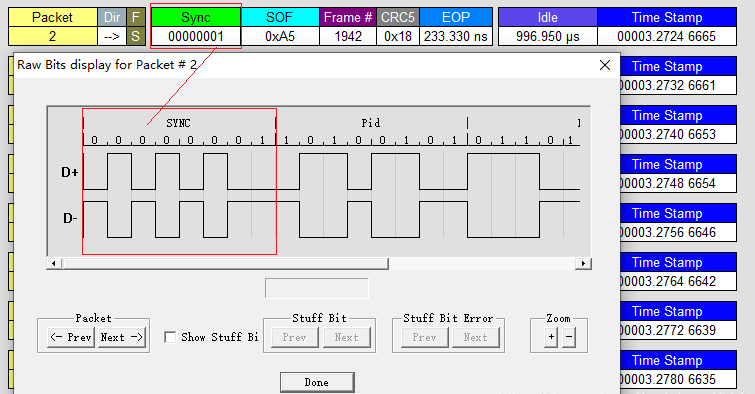
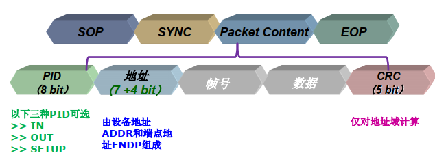
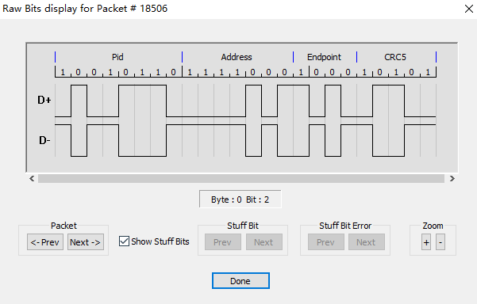
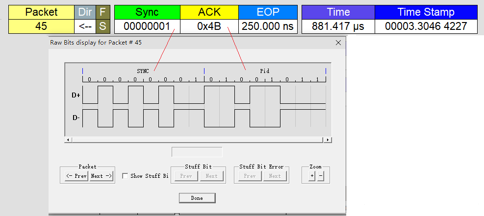
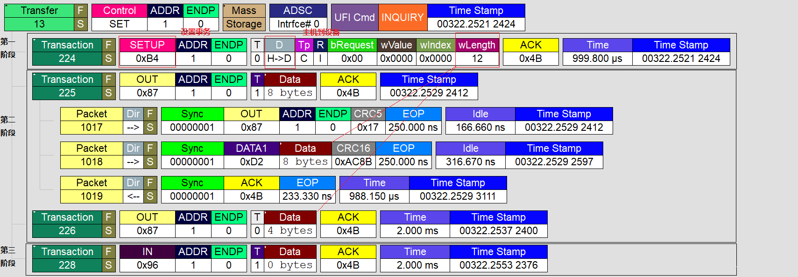
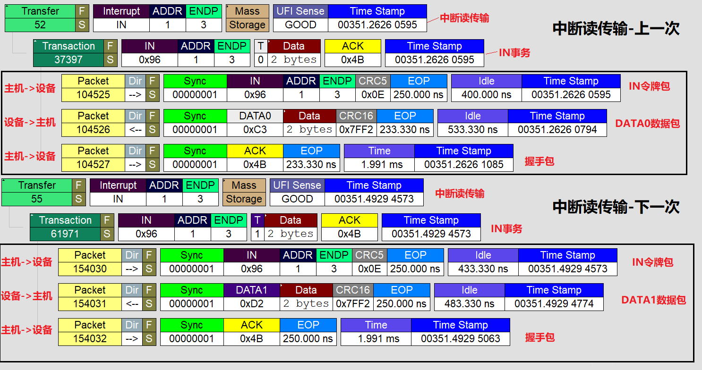
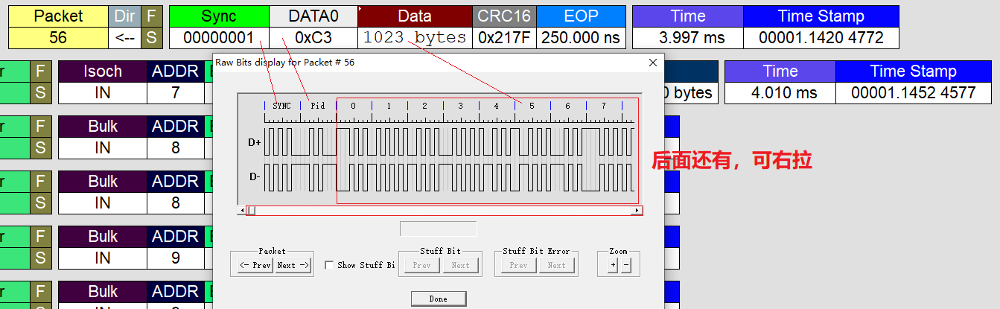

# USB/UVC学习笔记

## 目录

[TOC]

## 缩写词

* USB: Universal Serial Bus(通用串行总线)
* UVC: USB Video Class
* UAC: USB Audio Class

* LS: Low Speed
* FS: Full Speed
* HS: Hign Speed
* SS: Super Speed

* CFG: config
* IF: interface
* EP: endpoint
* DESC: descriptor

* ALT: Alternate Setting(交替设置)
* IT: Input Terminal
* OT: Ouput Terminal
* VC: Video Control
* VS: Video Stream
* AS: Audio Stream

## 工具

* 常用网站
    * usb官网：https://www.usb.org/
    * usb中文网：http://www.usbzh.com/
    * Libusb应用库：https://libusb.info/
* 常用工具
    * [USB Device Tree Viewer](https://www.uwe-sieber.de/usbtreeview_e.html): Ubuntu查看usb设备树图形化工具
    * [USBView](http://www.kroah.com/linux-usb/): Linux查看usb设备树图形化工具(也可以`lsusb -v`)
    * [Wireshark](https://www.wireshark.org/): usb抓包工具
        * Linux 需要加载usbmon模块
            ```bash
            # 内核开启 CONFIG_USB_MON=m
            sudo mount -t debugfs none /sys/kernel/debug  # 这一步一般不用做，debugfs默认都是挂载的
            sudo modprobe usbmon
            ls /sys/kernel/debug/usb # 加载成功可以看到usbmon文件夹
            ```
    * [USBlyzer](https://www.usblyzer.com/): usb抓包工具
    * [Bus Hound](https://en.freedownloadmanager.org/Windows-PC/Bus-Hound.html): usb抓包工具
    * [USB Trace](https://www.sysnucleus.com/index.html): usb抓包工具
    * [USB Monitor Pro](https://www.usb-monitor.com/): usb抓包工具
    * [USB Monitor](https://www.hhdsoftware.com/usb-sniffer): usb抓包工具
    * [LeCroy USB Advisor](https://pan.baidu.com/s/12qBCOjuy4i8kr1MHjBrfYQ "提取码：2rpx"): usb抓包工具，需要配合仪器使用

* Linux kernel
    * linux/usb/ch9.h
    * include/linux/usb/
    * drivers/usb/gadget

## 基础概念

* USB是一种主从结构，主机叫做Host，从机叫做Device，集线器被当作一种特殊的设备处理，用于扩展USB端口
* USB的数据交换只能发生在主机和设备之间，主机和主机、设备和设备之间不能互连
* 在USBOTG中，一个设备可以在从机和主机之间切换，这样就可以实现设备与设备之间的连接
    * USBOTG普通的4线USB多了一个ID表识线，用来表明它是主机还是设备
* USB总线上所有的数据传输都由主机主动发起，而设备只是被动的应答
* 每个USB系统只允许有一个HOST(主机)，允许的最大层数，USB1.1规定最多为5层，USB2.0规定最多为7层(包括根集线器)
* USB高速集线器与USB根集线器之间只使用USB高速通讯讯方式，而对于低速或全速的数据通讯的转换是由其挂接的最近的USB-HUB负责完成转换。
    * 对于USB高速设备和USB高速HUB，使用高速通讯
    * 对于连接到高速HUB上的低速或全速USB-HUB，使用低速或全速通讯方式
    * 对于连接到高速HUB上的低速或全速设备，使用低速或全速通讯方式
* 理论上，一个USB主控制器最多可接127个设备，这是由数据包中的7位地址位决定的

## USB版本

| 版本     | 官方名称        | 市场代号           | 理论速度  | 传输距离 | 最大电压电流 | 日期 |
| ---     | ---             | ---               | ---      | --- | ---     | ---        |
| USB1.0 | USB2.0 LowSpeed  | LowSpeed          | 1.5 Mbps | 3m | 5V 500mA | 1996-01-15 |
| USB1.1 | USB2.0 FullSpeed | FullSpeed         | 12  Mbps | 3m | 5V 500mA | 1998-09-23 |
| USB2.0 | USB2.0 HighSpeed | HighSpeed         | 480 Mbps | 5m | 5V 500mA | 2000-04-27 |
| USB3.0 | USB3.2 Gen1      | SuperSpeed        | 5   Gbps | 3m | 5V 900mA | 2008-11-17 |
| USB3.1 | USB3.2 Gen2      | SuperSpeed 10Gbps | 10  Gbps | 3m | 20V 5A   | 2013-07-26 |
| USB3.2 | USB3.2 Gen2x2    | SuperSpeed 20Gbps | 20  Gbps | 3m | 20V 5A   | 2017-09-22 |
| USB4   | USB4   Gen3x2    | SuperSpeed 40Gbps | 40  Gbps | 0.8m | 20V 5A | 2019-09-xx |

* USBusb3.0和2.0的区别
    * USB2.0速度是480 Mbps，USB3.0速度是5 Gbps
    * USB2.0有4根线，接口一般为黑色；USB3.0有9根线，接口一般为蓝色；USB3.2更是多增加了一组差分收发引线
    * USB2.0主控是EHCI，USB3.0主控是xHCI
    * USB2.0是半双工广播(broadcast)总线，而USB3.0是全双工通讯单播(unicast)总线(同时允许IN和OUT)
    * USB2.0使用轮询模型，而USB3.0还可使用异步通知
    * USB2.0没有流的能力，而USB3.0支持对批量端点的流
    * USB2.0采用的是NRZI编码，而USB3.0采用的是8b/10b编码，USB3.1/3.2采用的是128b/132b编码
    * USB3.0也增加了新的电源管理功能，支持待机、睡眠以及暂定模式，更加省电

* 主机控制器

    | USB主机控制器类型 | 对应的USB的协议 | 创立者 | 功能划分 |
    | ---              | ---            | ---   | ---     |
    | OHCI(Open Host Controller Interface)     | USB1.1 | Other | 硬件做的事更多， 用于嵌入式 |
    | UHCI(Universal Host Controller Interface)| USB1.1 | Intel | 软件做的事更多， 用于PC |
    | EHCI(Enhanced Host Controller Interface) | USB2.0 | Intel | 兼容 OHCI / UHCI |
    | xHCI(eXtensible Host ControllerInterface)| USB3.0 | Intel | 兼容 OHCI / UHCI / EHCI |

## USB接口

* USB2.0 Type-A接口的引脚定义及颜色
    | 引脚 | 名称 | 电缆颜色 | 描述  |
    | --- | ---  | ---  | --- |
    | 1   | VBUS | 红色 | +5 V 电源 |
    | 2   | D-   | 白色 | Data - 数据线 |
    | 3   | D+   | 绿色 | Data + 数据线 |
    | 4   | GND  | 黑色 | 接地 |

* USB3.0 Type-A接口的引脚定义及颜色
    | 引脚 | 名称     | 线缆颜色 | 描述 |
    | --- | ---      | --- | --- |
    | 1 | VBUS       | 红色 | 供电 |
    | 2 | D-         | 白色 | 2.0数据差分对 |
    | 3 | D+         | 绿色 | 2.0数据差分对 |
    | 4 | GND        | 黑色 | 电源地 |
    | 5 | StdA_SSRX- | 蓝色 | 高速数据差分对-接收 |
    | 6 | StdA_SSRX+ | 黄色 | 高速数据差分对+接收 |
    | 7 | GND_DRAIN  | N/A  | 信号地 |
    | 8 | StdA_SSTX- | 紫色 | 高速数据差分对-发送 |
    | 9 | StdA_SSTX+ | 橙色 | 高速数据差分对+发送 |

* USB线插头(公头)
    

* Type-C线
    * 相比于普通的usb3.0 A座，typec多出了一组TX RX，以及以及VCONN和CC
        * 两组TX RX表明共有两个通道，Lane 0 Adapter和Lane 1 Adapter
            * 同时也可以复用为DisplayPort接口，使得typec可以做视频输出
        * VCONN：typec有源线缆的e-mark供电，进一步可以识别线材的供电能力
        * CC1/CCC2：USB的主机和设备端可以通过CC通讯，以实现pd、dp以及主从模式的切换等各种功能
        * SBU1,SBU2：辅助信号
        * USB 2.0差分信号只会连接其中一边。因USB Type-C插头无B6、B7

    

## USB驱动总体结构


* 主机侧
    * USB主机控制器驱动程序控制插入其中的USB设备
        * 每条总线上只有一个主机控制器，负责协调主机和设备间的通信，而设备不能主动向主机发送任何消息
        * USB核心USB核心负责USB驱动管理和协议处理的主要工作，功能包括：通过定义一些数据结构、宏和功能函数，向上为设备驱动提供编程接口，向下为USB主机控制器驱动提供编程接口；维护整个系统的USB设备信息；完成设备热插拔控制、总线数据传输控制等
        * USB设备驱动程序控制该设备如何作为从设备与主机通信
* 设备侧
    * UDC驱动直接访问硬件，控制USB设备和主机间的底层通信，向上层提供与硬件相关操作的回调函数
    * Gadget Function API把下层的UDC驱动程序和上层的Gadget Function驱动程序隔离开，使得在Linux系统中编写USB设备侧驱动程序时能够把功能的实现和底层通信分离
    * Gadget Function驱动程序具体控制USB设备功能的实现，使设备表现出“网络连接”、“打印机”或“USBMass Storage”等特性

### USB主机控制器驱动

```c
#include <include/linux/usb/hcd.h>
struct usb_hcd {

	/*
	 * housekeeping
	 */
	struct usb_bus		self;		/* hcd is-a bus */
	struct kref		kref;		/* reference counter */

	const char		*product_desc;	/* product/vendor string */
	int			speed;		/* Speed for this roothub.
						 * May be different from
						 * hcd->driver->flags & HCD_MASK
						 */
	char			irq_descr[24];	/* driver + bus # */

	struct timer_list	rh_timer;	/* drives root-hub polling */
	struct urb		*status_urb;	/* the current status urb */
#ifdef CONFIG_PM
	struct work_struct	wakeup_work;	/* for remote wakeup */
#endif
	struct work_struct	died_work;	/* for when the device dies */

	/*
	 * hardware info/state
	 */
	const struct hc_driver	*driver;	/* hw-specific hooks */

	/*
	 * OTG and some Host controllers need software interaction with phys;
	 * other external phys should be software-transparent
	 */
	struct usb_phy		*usb_phy;
	struct usb_phy_roothub	*phy_roothub;

	/* Flags that need to be manipulated atomically because they can
	 * change while the host controller is running.  Always use
	 * set_bit() or clear_bit() to change their values.
	 */
	unsigned long		flags;
#define HCD_FLAG_HW_ACCESSIBLE		0	/* at full power */
#define HCD_FLAG_POLL_RH		2	/* poll for rh status? */
#define HCD_FLAG_POLL_PENDING		3	/* status has changed? */
#define HCD_FLAG_WAKEUP_PENDING		4	/* root hub is resuming? */
#define HCD_FLAG_RH_RUNNING		5	/* root hub is running? */
#define HCD_FLAG_DEAD			6	/* controller has died? */
#define HCD_FLAG_INTF_AUTHORIZED	7	/* authorize interfaces? */
#define HCD_FLAG_DEFER_RH_REGISTER	8	/* Defer roothub registration */

	/* The flags can be tested using these macros; they are likely to
	 * be slightly faster than test_bit().
	 */
#define HCD_HW_ACCESSIBLE(hcd)	((hcd)->flags & (1U << HCD_FLAG_HW_ACCESSIBLE))
#define HCD_POLL_RH(hcd)	((hcd)->flags & (1U << HCD_FLAG_POLL_RH))
#define HCD_POLL_PENDING(hcd)	((hcd)->flags & (1U << HCD_FLAG_POLL_PENDING))
#define HCD_WAKEUP_PENDING(hcd)	((hcd)->flags & (1U << HCD_FLAG_WAKEUP_PENDING))
#define HCD_RH_RUNNING(hcd)	((hcd)->flags & (1U << HCD_FLAG_RH_RUNNING))
#define HCD_DEAD(hcd)		((hcd)->flags & (1U << HCD_FLAG_DEAD))
#define HCD_DEFER_RH_REGISTER(hcd) ((hcd)->flags & (1U << HCD_FLAG_DEFER_RH_REGISTER))

	/*
	 * Specifies if interfaces are authorized by default
	 * or they require explicit user space authorization; this bit is
	 * settable through /sys/class/usb_host/X/interface_authorized_default
	 */
#define HCD_INTF_AUTHORIZED(hcd) \
	((hcd)->flags & (1U << HCD_FLAG_INTF_AUTHORIZED))

	/*
	 * Specifies if devices are authorized by default
	 * or they require explicit user space authorization; this bit is
	 * settable through /sys/class/usb_host/X/authorized_default
	 */
	enum usb_dev_authorize_policy dev_policy;

	/* Flags that get set only during HCD registration or removal. */
	unsigned		rh_registered:1;/* is root hub registered? */
	unsigned		rh_pollable:1;	/* may we poll the root hub? */
	unsigned		msix_enabled:1;	/* driver has MSI-X enabled? */
	unsigned		msi_enabled:1;	/* driver has MSI enabled? */
	/*
	 * do not manage the PHY state in the HCD core, instead let the driver
	 * handle this (for example if the PHY can only be turned on after a
	 * specific event)
	 */
	unsigned		skip_phy_initialization:1;

	/* The next flag is a stopgap, to be removed when all the HCDs
	 * support the new root-hub polling mechanism. */
	unsigned		uses_new_polling:1;
	unsigned		wireless:1;	/* Wireless USBHCD */
	unsigned		has_tt:1;	/* Integrated TT in root hub */
	unsigned		amd_resume_bug:1; /* AMD remote wakeup quirk */
	unsigned		can_do_streams:1; /* HC supports streams */
	unsigned		tpl_support:1; /* OTG & EH TPL support */
	unsigned		cant_recv_wakeups:1;
			/* wakeup requests from downstream aren't received */

	unsigned int		irq;		/* irq allocated */
	void __iomem		*regs;		/* device memory/io */
	resource_size_t		rsrc_start;	/* memory/io resource start */
	resource_size_t		rsrc_len;	/* memory/io resource length */
	unsigned		power_budget;	/* in mA, 0 = no limit */

	struct giveback_urb_bh  high_prio_bh;
	struct giveback_urb_bh  low_prio_bh;

	/* bandwidth_mutex should be taken before adding or removing
	 * any new bus bandwidth constraints:
	 *   1. Before adding a configuration for a new device.
	 *   2. Before removing the configuration to put the device into
	 *      the addressed state.
	 *   3. Before selecting a different configuration.
	 *   4. Before selecting an alternate interface setting.
	 *
	 * bandwidth_mutex should be dropped after a successful control message
	 * to the device, or resetting the bandwidth after a failed attempt.
	 */
	struct mutex		*address0_mutex;
	struct mutex		*bandwidth_mutex;
	struct usb_hcd		*shared_hcd;
	struct usb_hcd		*primary_hcd;

#define HCD_BUFFER_POOLS	4
	struct dma_pool		*pool[HCD_BUFFER_POOLS];

	int			state;
#	define	__ACTIVE		0x01
#	define	__SUSPEND		0x04
#	define	__TRANSIENT		0x80

#	define	HC_STATE_HALT		0
#	define	HC_STATE_RUNNING	(__ACTIVE)
#	define	HC_STATE_QUIESCING	(__SUSPEND|__TRANSIENT|__ACTIVE)
#	define	HC_STATE_RESUMING	(__SUSPEND|__TRANSIENT)
#	define	HC_STATE_SUSPENDED	(__SUSPEND)

#define	HC_IS_RUNNING(state) ((state) & __ACTIVE)
#define	HC_IS_SUSPENDED(state) ((state) & __SUSPEND)

	/* memory pool for HCs having local memory, or %NULL */
	struct gen_pool         *localmem_pool;

	/* more shared queuing code would be good; it should support
	 * smarter scheduling, handle transaction translators, etc;
	 * input size of periodic table to an interrupt scheduler.
	 * (ohci 32, uhci 1024, ehci 256/512/1024).
	 */

	/* The HC driver's private data is stored at the end of
	 * this structure.
	 */
	unsigned long hcd_priv[]
			__attribute__ ((aligned(sizeof(s64))));
};
```

* 创建增加和移除HCD

```c
struct usb_hcd *usb_create_hcd (const struct hc_driver *driver, struct device *dev, char *bus_name);
int usb_add_hcd(struct usb_hcd *hcd, unsigned int irqnum, unsigned long irqflags);
void usb_remove_hcd(struct usb_hcd *hcd);
```

#### URB

* USB请求块(USB Request Block，URB)是USB设备驱动中用来描述与USB设备通信所用的基本载体和核心数据结构，非常类似于网络设备驱动中的sk_buff结构体
* USB设备中的每个端点都处理一个URB队列，在队列被清空之前，一个URB的典型生命周期如下
	* 被一个USB设备驱动创建 `struct urb *usb_alloc_urb(int iso_packets, gfp_t mem_flags);` 反函数为 `void usb_free_urb(struct urb *urb);`
	* 初始化，被安排给一个特定USB设备的特定端点
		* 对于中断URB初始化
		```c
		void usb_fill_int_urb(struct urb *urb, struct usb_device *dev,
			unsigned int pipe, void *transfer_buffer,
			int buffer_length, usb_complete_t complete,
			void *context, int interval);
		```
		* 对于批量URB初始化
		```c
		void usb_fill_bulk_urb(struct urb *urb, struct usb_device *dev,
			unsigned int pipe, void *transfer_buffer,
			int buffer_length, usb_complete_t complete,
			void *context);
		```
		* 对于控制URB初始化
		```c
		void usb_fill_control_urb(struct urb *urb, struct usb_device *dev,
			unsigned int pipe, unsigned char *setup_packet,
			void *transfer_buffer, int buffer_length,
			usb_complete_t complete, void *context);
		```
		* 等时URB没有像中断、控制和批量URB的初始化函数，只能手动对它初始化
	* 被USB设备驱动提交给USB核心 `int usb_submit_urb(struct urb *urb, gfp_t mem_flags);`
	* 提交由USB核心指定的USB主机控制器驱动
	* 被USB主机控制器处理，进行一次到USB设备的传送
	* 当URB完成，USB主机控制器驱动通知USB设备驱动

```c
#include <linux/usb.h>
struct urb {
	/* private: USBcore and host controller only fields in the urb */
	struct kref kref;		/* reference count of the URB */
	int unlinked;			/* unlink error code */
	void *hcpriv;			/* private data for host controller */
	atomic_t use_count;		/* concurrent submissions counter */
	atomic_t reject;		/* submissions will fail */

	/* public: documented fields in the urb that can be used by drivers */
	struct list_head urb_list;	/* list head for use by the urb's
					 * current owner */
	struct list_head anchor_list;	/* the URB may be anchored */
	struct usb_anchor *anchor;
	struct usb_device *dev;		/* (in) pointer to associated device */
	struct usb_host_endpoint *ep;	/* (internal) pointer to endpoint */
	unsigned int pipe;		/* (in) pipe information */
	unsigned int stream_id;		/* (in) stream ID */
	int status;			/* (return) non-ISO status */
	unsigned int transfer_flags;	/* (in) URB_SHORT_NOT_OK | ...*/
	void *transfer_buffer;		/* (in) associated data buffer */
	dma_addr_t transfer_dma;	/* (in) dma addr for transfer_buffer */
	struct scatterlist *sg;		/* (in) scatter gather buffer list */
	int num_mapped_sgs;		/* (internal) mapped sg entries */
	int num_sgs;			/* (in) number of entries in the sg list */
	u32 transfer_buffer_length;	/* (in) data buffer length */
	u32 actual_length;		/* (return) actual transfer length */
	unsigned char *setup_packet;	/* (in) setup packet (control only) */
	dma_addr_t setup_dma;		/* (in) dma addr for setup_packet */
	int start_frame;		/* (modify) start frame (ISO) */
	int number_of_packets;		/* (in) number of ISO packets */
	int interval;			/* (modify) transfer interval
					 * (INT/ISO) */
	int error_count;		/* (return) number of ISO errors */
	void *context;			/* (in) context for completion */
	usb_complete_t complete;	/* (in) completion routine */
	struct usb_iso_packet_descriptor iso_frame_desc[];
					/* (in) ISO ONLY */
};
```

### USB设备侧驱动

* 在debugfs下，`/sys/kernel/debug/usb/devices` 包含了USB的设备信息
* Linux内核源代码中的`driver/usb/usb-skeleton.c`文件为我们提供了一个最基础的USB驱动程序
* USB设备驱动包含其作为总线上挂接设备的驱动和本身所属设备类型的驱动两部分，usb_driver本身只是有找到USB设备、管理USB设备连接和断开的作用

```c
#include <include/linux/usb.h>
struct usb_driver {
	const char *name;

	int (*probe) (struct usb_interface *intf,
		      const struct usb_device_id *id);

	void (*disconnect) (struct usb_interface *intf);

	int (*unlocked_ioctl) (struct usb_interface *intf, unsigned int code,
			void *buf);

	int (*suspend) (struct usb_interface *intf, pm_message_t message);
	int (*resume) (struct usb_interface *intf);
	int (*reset_resume)(struct usb_interface *intf);

	int (*pre_reset)(struct usb_interface *intf);
	int (*post_reset)(struct usb_interface *intf);

	const struct usb_device_id *id_table; /* 支持的USB设备列表 */
	const struct attribute_group **dev_groups;

	struct usb_dynids dynids;
	struct usbdrv_wrap drvwrap;
	unsigned int no_dynamic_id:1;
	unsigned int supports_autosuspend:1;
	unsigned int disable_hub_initiated_lpm:1;
	unsigned int soft_unbind:1;
};
#define	to_usb_driver(d) container_of(d, struct usb_driver, drvwrap.driver)
```

* 对usb_driver的注册和注销可通过下面两个函数完成：
```c
int usb_register(struct usb_driver *new_driver)
void usb_deregister(struct usb_driver *driver);
```

* USB UDC与Gadget驱动

* UDC驱动和Function驱动都位于内核的`drivers/usb/gadget`目录中
* usb_function结构体定义于 `include/linux/usb/composite.h` 中
* 在Gadget驱动中，`include/linux/usb/gadget.h` 用usb_request结构体来描述一次传输请求，这个结构体的地位类似于USB主机侧的URB

## USB设备

* 在USB设备的逻辑组织中，包含设备(device)、配置(config)、接口(interface)和端点(endpoint)4个层次
* 设备通常有一个或多个配置，配置通常有一个或多个接口，接口通常有一个或多个设置，有零个或多个端点
* 一个设备只有一个设备描述符，包含了设备类型、设备遵循的协议、厂商ID、产品id、序列号等
* 每个USB设备都提供不同级别的配置信息，不同的配置使设备表现出不同的功能组合(在探测/连接期间需从其中选定一个)
* 接口代表一个基本的功能，是USB设备驱动程序控制的对象，一个配置中的所有接口可以同时有效，并可被不同的驱动程序连接
* 端点是USB通信的最基本形式，每一个USB设备接口在主机看来就是一系列端点的集合，主机只能通过端点与设备进行通信，以使用设备的功能。
    * 在USB系统中每一个端点都有唯一的地址，这是由设备地址和端点号给出的。
    * 每个端点都有一定的属性，其中包括传输方式、总线访问频率、带宽、端点号和数据包的最大容量等。
    * 一个USB端点只能在一个方向上承载数据，从主机到设备(称为输出端点)或者从设备到主机(称为输入端点)，因此端点可看作是一个单向的管道。
    * 端点0为控制端点，每个USB设备都必须包括一个USB控制端点，并且这个控掉端点是双向的
        * 控制端点的数据传输使用控制传输方式，其主要功能使主机实现对设备的配置如设备描述符，配置描述符和字符串描述的获取和对设备的配置(如设备地址的设置等)
    * 端点1、2 ...等一般用作数据端点，是可选的
        * 数据端点用于数据的传输，传输的类型(控制传输，中断传输，批量传输，同步/等时传输)等属性通过端点描述符来描述


### 描述符类型

```c
#include <linux/usb/ch9.h>
/*
 * Descriptor types ... USB2.0 spec table 9.5
 */
#define USB_DT_DEVICE           0x01    /* 设备描述符类型 */
#define USB_DT_CONFIG           0x02    /* 配置描述符类型 */
#define USB_DT_STRING           0x03    /* 字符串描述符类型 */
#define USB_DT_INTERFACE        0x04    /* 接口描述符类型 */
#define USB_DT_ENDPOINT         0x05    /* 端点描述符类型 */

#define USB_DT_DEVICE_QUALIFIER 0x06    /* 设备限定描述符类型 */
#define USB_DT_OTHER_SPEED_CONFIG 0x07  /* 其它速率定描述符类型 */
#define USB_DT_INTERFACE_POWER  0x08    /* 接口功率描述符类型 */

/* these are from a minor USB2.0 revision (ECN) */
#define USB_DT_OTG              0x09
#define USB_DT_DEBUG            0x0a
#define USB_DT_INTERFACE_ASSOCIATION    0x0b    /* 接口关联描述符类型 */

/* these are from the Wireless USBspec */
#define USB_DT_SECURITY         0x0c
#define USB_DT_KEY              0x0d
#define USB_DT_ENCRYPTION_TYPE  0x0e
#define USB_DT_BOS              0x0f
#define USB_DT_DEVICE_CAPABILITY    0x10
#define USB_DT_WIRELESS_ENDPOINT_COMP   0x11
#define USB_DT_WIRE_ADAPTER	    0x21
#define USB_DT_RPIPE            0x22
#define USB_DT_CS_RADIO_CONTROL 0x23

/* From the T10 UAS specification */
#define USB_DT_PIPE_USAGE       0x24
/* From the USB3.0 spec */
#define	USB_DT_SS_ENDPOINT_COMP 0x30     /* 超高速端点伴随描述符类型 */
/* From the USB3.1 spec */
#define	USB_DT_SSP_ISOC_ENDPOINT_COMP   0x31

/* Conventional codes for class-specific descriptors.  The convention is
    * defined in the USB"Common Class" Spec (3.11).  Individual class specs
    * are authoritative for their usage, not the "common class" writeup.
    */
#define USB_DT_CS_DEVICE        (USB_TYPE_CLASS | USB_DT_DEVICE)
#define USB_DT_CS_CONFIG        (USB_TYPE_CLASS | USB_DT_CONFIG)
#define USB_DT_CS_STRING        (USB_TYPE_CLASS | USB_DT_STRING)
#define USB_DT_CS_INTERFACE     (USB_TYPE_CLASS | USB_DT_INTERFACE)
#define USB_DT_CS_ENDPOINT      (USB_TYPE_CLASS | USB_DT_ENDPOINT)
```

### 设备描述符

```c
#include <linux/usb/ch9.h>
struct usb_device_descriptor {
	__u8  bLength;              /* 描述符长度 0x12 */
	__u8  bDescriptorType;      /* 描述符类型编号 0x01 */

	__le16 bcdUSB;              /* USB版本号 */
	__u8  bDeviceClass;         /* USB分配的设备类代码  */
	__u8  bDeviceSubClass;      /* USB分配的子类代码 */
	__u8  bDeviceProtocol;      /* USB分配的协议代码 */
	__u8  bMaxPacketSize0;      /* EP0的最大包大小 */
	                            /* USB2.0一般为0x40，USB3.x固定为0x09(2的9次方) */
	__le16 idVendor;            /* 厂商编号，由USB分配 */
	__le16 idProduct;           /* 产品编号，由厂商分配 */
	__le16 bcdDevice;           /* 设备出厂编号，由厂家自行设置 */
	__u8  iManufacturer;        /* 描述厂商字符串的索引 */
	__u8  iProduct;             /* 描述产品字符串的索引 */
	__u8  iSerialNumber;        /* 描述设备序列号字符串的索引 */
	__u8  bNumConfigurations;   /* 可能的配置数量 */
} __attribute__ ((packed));

#define USB_DT_DEVICE_SIZE      18
```

* 设备类型
    * USB设备类信息参考：https://www.usb.org/defined-class-codes
    * `usb_device_descriptor -> bDeviceClass`
    * `usb_interface_assoc_descriptor -> bFunctionClass`
    * `usb_interface_descriptor -> bInterfaceClass`

```c
#include <linux/usb/ch9.h>
#define USB_CLASS_PER_INTERFACE 0       /* for DeviceClass */
#define USB_CLASS_AUDIO         1
#define USB_CLASS_COMM          2
#define USB_CLASS_HID           3
#define USB_CLASS_PHYSICAL      5
#define USB_CLASS_STILL_IMAGE   6
#define USB_CLASS_PRINTER   7
#define USB_CLASS_MASS_STORAGE  8
#define USB_CLASS_HUB           9
#define USB_CLASS_CDC_DATA      0x0a
#define USB_CLASS_CSCID         0x0b    /* chip+ smart card */
#define USB_CLASS_CONTENT_SEC   0x0d    /* content security */
#define USB_CLASS_VIDEO         0x0e
#define USB_CLASS_WIRELESS_CONTROLLER   0xe0
#define USB_CLASS_PERSONAL_HEALTHCARE   0x0f
#define USB_CLASS_AUDIO_VIDEO   0x10
#define USB_CLASS_BILLBOARD     0x11
#define USB_CLASS_USB_TYPE_C_BRIDGE     0x12
#define USB_CLASS_MISC          0xef
#define USB_CLASS_APP_SPEC      0xfe
#define USB_CLASS_VENDOR_SPEC   0xff

#define USB_SUBCLASS_VENDOR_SPEC 0xff
```

### 配置描述符

```c
#include <linux/usb/ch9.h>
struct usb_config_descriptor {
	__u8  bLength;              /* 描述符长度 0x09 */
	__u8  bDescriptorType;      /* 描述符类型编号 0x02 */

	__le16 wTotalLength;        /* 配置所返回的所有数据的大小 */
	                            /* 此配置返回的配置描述符，接口描述符以及端点描述符的全部大小 */
	__u8  bNumInterfaces;       /* 配置所支持的接口数 */
	__u8  bConfigurationValue;  /* 当前配置的标识 */
	__u8  iConfiguration;       /* 描述该配置的字符串的索引值 */
	__u8  bmAttributes;         /* 供电模式的选择 */
        /* D7:保留位，默认为1，D6:0是自供电，1是总线供电，D5:远程唤醒 Bit4-0保留，*/
	__u8  bMaxPower;            /* 设备从总线提取的最大电流，以2mA为单位 */
} __attribute__ ((packed));

#define USB_DT_CONFIG_SIZE      9

/* from config descriptor bmAttributes */
#define USB_CONFIG_ATT_ONE      (1 << 7)    /* must be set */
#define USB_CONFIG_ATT_SELFPOWER (1 << 6)   /* self powered or bus powered */
#define USB_CONFIG_ATT_WAKEUP   (1 << 5)    /* can wakeup */
#define USB_CONFIG_ATT_BATTERY  (1 << 4)    /* battery powered */
```

### 接口关联描述符

* 对于复合USB设备的接口描述符，可以在每个类(Class)要合并的接口描述符之前加一个接口关联描述符(Interface Association Descriptor，IAD)，其作用就是把多个接口定义成一个类设备，即多个接口作用于一个设备。

```c
#include <linux/usb/ch9.h>
struct usb_interface_assoc_descriptor {
	__u8  bLength;              /* 描述符长度 0x08 */
	__u8  bDescriptorType;      /* 描述符类型编号 0x0b */

	__u8  bFirstInterface;      /* 第一个接口编号 */
	__u8  bInterfaceCount;      /* 接口总数量 */
	__u8  bFunctionClass;       /* 接口类代码，由USB分配 */
	__u8  bFunctionSubClass;    /* 接口子类代码，由USB分配 */
	__u8  bFunctionProtocol;    /* 接口所遵循的协议，由USB分配 */
	__u8  iFunction;            /* 描述该接口的字符串索引值 */
} __attribute__ ((packed));

#define USB_DT_INTERFACE_ASSOCIATION_SIZE   8
```

### 接口描述符

```c
#include <linux/usb/ch9.h>
struct usb_interface_descriptor {
	__u8  bLength;              /* 描述符长度 0x09 */
	__u8  bDescriptorType;      /* 描述符类型 0x04 */

	__u8  bInterfaceNumber;     /* 接口的编号 */
	__u8  bAlternateSetting;    /* 备用的接口描述符编号 */
	__u8  bNumEndpoints;        /* 该接口使用的端点数，不包括端点0 */
	__u8  bInterfaceClass;      /* 接口类型，由USB分配 */
	__u8  bInterfaceSubClass;   /* 接口子类型，由USB分配 */
	__u8  bInterfaceProtocol;   /* 接口所遵循的协议，由USB分配 */
	__u8  iInterface;           /* 描述该接口的字符串索引值 */
} __attribute__ ((packed));

#define USB_DT_INTERFACE_SIZE   9
```

### 端点描述符

```c
#include <linux/usb/ch9.h>
struct usb_endpoint_descriptor {
	__u8  bLength;              /* 描述符长度 0x07 */
	__u8  bDescriptorType;      /* 描述符类型 0x05 */

	__u8  bEndpointAddress;     /* 端点地址 */
	                            /* 0~3位是端点号，4~6位保留，第7位是方向(0为输出,1为输入) */
	__u8  bmAttributes;         /* 端点属性 */
	__le16 wMaxPacketSize;      /* 本端点接收或发送的最大信息包的大小 */
	__u8  bInterval;            /* 轮询数据传送端点的时间间隔 */

	/* NOTE:  these two are _only_ in audio endpoints. */
	/* use USB_DT_ENDPOINT*_SIZE in bLength, not sizeof. */
	__u8  bRefresh;
	__u8  bSynchAddress;
} __attribute__ ((packed));

#define USB_DT_ENDPOINT_SIZE        7
#define USB_DT_ENDPOINT_AUDIO_SIZE  9   /* Audio extension */
```

* bmAttributes解释
    * 0~1位 的值为00表示控制传输，为01表示等时传输，为02表示批量传输，为03表示中断传输
    * 当为中断传输时且为超高速模式时
        * 4~5位 的值为00表示周期模式，为01表示通知模式
    * 当为等时传输时
        * 2~3位 的值为00表示无同步子模式，为01表示异步子模式，为02表示自适应子模式，为03表示同步子模式
        * 4~5位 的值为00表示数据端点，为01表示反馈端点，为02表示反馈数据端点，03保留

* wMaxPacketSize解释
    * 0~10位 指定最大数据包大小(以字节为单位)，对所有端点有效
    * 11~12位 表示Mult值，只对高速传输的同步和中断端点有效，取值0~2，可指定每个微帧的额外通信次数，所以总的通信次数是`Mult+1`
        * 如果设置为02b，则表示在一个微帧内可传输3个事务

* bInterval解释
    | Speed | control | int      | isoc | bulk  |
    | ---   | ------- | ---      | ---- | ----  |
    | LS    | /       | 1-255 ms | /    | /     |
    | FS    | /       | 1-255 ms | A    | /     |
    | HS    | B       | A        | A    | B     |
    | SS    | no use  | 125  us  | A    | no use|
    * A: 1-16  2^(N-1)周期，周期其单位表示多少个周期单位传输一次数据
        * 对于FS，总线间隔是一帧，一帧的长度是 1ms
        * 对于HS/SS，总线间隔是一个微帧。微帧的长度是 125us。八个连续的微帧构成一个高速或超高速帧
    * B: 对于高速批量/控制输出端点，bInterval必须指定端点的最大NAK频率。
        * 这个值的范围必须在0到255之间:值0表示端点永不NAK。其它值表示每个微帧的bInterval*125us时间最多1个NAK。
        * 对于BULK传输，bInterval有一定的意义。由于批量传输支持burst传输，所以在进行大批量数据传输时，可以不必每次传输都ACK，而这里的NAK表示数据无法接收或无数据发送了，可以早点知道传输结束或无法继续接收数据。这样就大大提高了数据的发送效率。

* 举例：高速端点的等时数据传输
    * 配置：wMaxPacketSize是1024且bit12~11(Mult)为1；bInterval为4
    * 计算：选择配置后，USB设备端可以在每`1<<(bInterval-1) = 8`个微帧中传输`wMaxPacketSize*(Mult+1) = 2048`个字节

* 举例：超高速端点的等时数据传输
    * 配置：wMaxPacketSize是1024且bit12~11(Mult)必须为0；Mult为2，bInterval为1；bMaxBurst是15；
    * 计算：选择配置后，USB设备端可以在每个微帧中传输`wMaxPacketSize*(Mult+1)*(bMaxBurst+1) = 49152`个字节

### 超高速端点伴随描述符

```c
#include <linux/usb/ch9.h>
struct usb_ss_ep_comp_descriptor {
	__u8  bLength;              /* 描述符长度 0x06 */
	__u8  bDescriptorType;      /* 描述符类型 0x30 */

	__u8  bMaxBurst;            /* 一次突发中可以传输的数据包的最大数量(bMaxBurst + 1) */
	                            /* 有效值为从 0 到 15。值为 0 表示端点只能突发一次一个包
	                            /* 对于控制类型的端点，这个字段应设置为 0 */
	__u8  bmAttributes;         /* 属性 */
	__le16 wBytesPerInterval;   /* 每一个服务间隔将传输的字节总数，只对周期端点有效 */
} __attribute__ ((packed));

#define USB_DT_SS_EP_COMP_SIZE  6
/* Bits 4:0 of bmAttributes if this is a bulk endpoint */
#define usb_ss_max_streams(p)   ({ int n = ((p) & 0x1f); n ? (i << n) : 0; })
/* Bits 1:0 of bmAttributes if this is an isoc endpoint */
#define USB_SS_MULT(p)          (1 + ((p) & 0x3))
```

* bmAttributes解释
    * 批量端点：
        * 0~4位 MaxStreams：这个端点支持的流的最大数量有效值是有效值是0~16，其中值为0表示端点没有定义流，1~16，所支持的流等于2^MaxStream
        * 5~7位 保留：并应设置为零
    * 控制或中断端点
        * 0~7位 保留：并应设置为零
    * 等时端点
        * 0~1位 Mult值：范围0~2，决定服务时间间隔内此端点支持的包的最大数量(Mult+1)。
        * 2~6位 保留：并应设置为零
        * 第7位 SSP ISO指示：设为1时，SSP ISO伴随描述符紧跟此描述符号，且忽略Mult值

* `wBytesPerInterval = (bMaxBurst + 1) * USB_SS_MULT(bmAttributes) * wMaxPacketSize`

### 字符串描述符

* 字符串描述符
    * 为了提供比较友好的设备标识，USB规范中定义了字符串描述符，即使用人类的自然语言来描述设备的功能，生产厂家，生产序列号等
    * 为了解决字符串的跨国性，USB字符串使用UNICODE编码
    * 最长支持126个字符

```c
#include <linux/usb/ch9.h>
struct usb_string_descriptor {
	__u8  bLength;              /* 描述符长度，最大126 */
	__u8  bDescriptorType;      /* 描述符类型 0x03 */

	__le16 wData[1];            /* UTF-16LE encoded */
} __attribute__ ((packed));

#define USB_MAX_STRING_LEN      126
```

* 当主机向设备发送获取字符串索引为0的字符串类型时，这并不表示要获取索引为0的字符串，而是表示获取的是语言ID
    * 一般情况下，我们使用的语言ID为0x0409(en_US)
    * 中文时，可以将语言ID设为0x0804

### 设备限定描述符(同时支持HS与FS)


* 设备限定描述符
    * 设备限定描述符描述符用在当一个设备能够工作在不同的速度下时，会获取设备限定描述符。
    * 设备限定描述符储存当前不适用的速度的字段数值，设备描述符与设备限定描述符中的字段数值，视所选择的速度来做交替。
    * USB设备不一定会支持设备限定描述符，所以如果USB主机获取设备限定描述符，USB设备回复STALL表示设备不支持该描述符。这种控制传输的失败并不影响设备的正常枚举和使用。

```c
#include <linux/usb/ch9.h>
struct usb_qualifier_descriptor {
	__u8  bLength;              /* 描述符长度 0x0a */
	__u8  bDescriptorType;      /* 描述符类型编号 0x06 */

	__le16 bcdUSB;              /* USB版本号 */
	__u8  bDeviceClass;         /* USB分配的设备类代码  */
	__u8  bDeviceSubClass;      /* USB分配的子类代码 */
	__u8  bDeviceProtocol;      /* USB分配的协议代码 */
	__u8  bMaxPacketSize0;      /* EP0的最大包大小 */
	__u8  bNumConfigurations;   /* 可能的配置数量 */
	__u8  bRESERVED;
} __attribute__ ((packed));
```

* 其它速率配置描述符
    * 其它速率配置描述符与设备限定描述符配合使用，当工作在其他速度下时使用，除了描述符类型(0x07)， 其他字段含义格式与配置描述符完全一致。

## USB请求块

### 控制请求字段

```c
struct usb_ctrlrequest {
	__u8 bRequestType; /* bmRequestType */
	__u8 bRequest;
	__le16 wValue;
	__le16 wIndex;
	__le16 wLength;
} __attribute__ ((packed));
```

#### bmRequestType字段

* D7 下一步数据的传输方向
    ```c
    #define USB_DIR_OUT             0           /* 主机到设备(SET请求)*/
    #define USB_DIR_IN              0x80        /* 设备到主机(GET请求) */
    ```
    * 0 = 主机到设备(SET请求)
    * 1 = 设备到主机(GET请求)

* D6-D5 命令的类型
    ```c
    #define USB_TYPE_MASK           (0x03 << 5)
    #define USB_TYPE_STANDARD       (0x00 << 5) /* 标准请求命令 */
    #define USB_TYPE_CLASS          (0x01 << 5) /* 类请求命令(UVC规范中的请求属于类请求命令) */
    #define USB_TYPE_VENDOR         (0x02 << 5) /* 用户定义的请求命令 */
    #define USB_TYPE_RESERVED       (0x03 << 5) /* 保留 */
    ```

* D4-D0 命令接收者的类型
    ```c
    #define USB_RECIP_MASK          0x1f
    #define USB_RECIP_DEVICE        0x00        /* 接收者为设备 */
    #define USB_RECIP_INTERFACE     0x01        /* 接收者为接口 */
    #define USB_RECIP_ENDPOINT      0x02        /* 接收者为端点 */
    #define USB_RECIP_OTHER         0x03        /* 其他接收者 */
    /* From Wireless USB1.0 */
    #define USB_RECIP_PORT          0x04
    #define USB_RECIP_RPIPE         0x05
    ```
#### bRequest字段

```c
#define USB_REQ_GET_STATUS          0x00
#define USB_REQ_CLEAR_FEATURE       0x01
#define USB_REQ_SET_FEATURE         0x03
#define USB_REQ_SET_ADDRESS         0x05
#define USB_REQ_GET_DESCRIPTOR      0x06
#define USB_REQ_SET_DESCRIPTOR      0x07
#define USB_REQ_GET_CONFIGURATION   0x08
#define USB_REQ_SET_CONFIGURATION   0x09
#define USB_REQ_GET_INTERFACE       0x0A
#define USB_REQ_SET_INTERFACE       0x0B
#define USB_REQ_SYNCH_FRAME         0x0C
#define USB_REQ_SET_SEL             0x30
#define USB_REQ_SET_ISOCH_DELAY     0x31

/* For Wireless USB*/
#define USB_REQ_SET_ENCRYPTION      0x0D
#define USB_REQ_GET_ENCRYPTION      0x0E
#define USB_REQ_RPIPE_ABORT         0x0E
#define USB_REQ_SET_HANDSHAKE       0x0F
#define USB_REQ_RPIPE_RESET         0x0F
#define USB_REQ_GET_HANDSHAKE       0x10
#define USB_REQ_SET_CONNECTION      0x11
#define USB_REQ_SET_SECURITY_DATA   0x12
#define USB_REQ_GET_SECURITY_DATA   0x13
#define USB_REQ_SET_WUSB_DATA       0x14
#define USB_REQ_LOOPBACK_DATA_WRITE 0x15
#define USB_REQ_LOOPBACK_DATA_READ  0x16
#define USB_REQ_SET_INTERFACE_DS    0x17

/* specific requests for USBPower Delivery */
#define USB_REQ_GET_PARTNER_PDO     20
#define USB_REQ_GET_BATTERY_STATUS  21
#define USB_REQ_SET_PDO             22
#define USB_REQ_GET_VDM             23
#define USB_REQ_SEND_VDM            24
```

#### wValue字段

* wValue字段用来传送当前请求的参数，随请求不同而变

#### wIndex字段

* wIndex字段的内容根据请求而有所不同，它用于将参数传递给设备，特定于请求
    * 当接收者为接口或端点时，wIndex域用来表明是哪一个接口或端点

* wIndex字段为接口
    
* wIndex字段为端点
    
    * Direction位(bit7)设置为0表示指定端点为OUT端点，设置为1表示指定端点为IN端点。

#### wLength字段

* wLength表明第二阶段的数据传输长度，第二阶段的数据传输方向由bmRequstType的Direction位指出。
* wLength域为0则表明无数据传输。
* 在输入请求下，设备返回的数据长度不应多于wLength(但是可以少于)
* 在输出请求下，wLength指出主机发出的真实的数据量。如果主机发送多于wLength的数据，设备会作出未知响应。

### 标准控制请求

<table>
<tr>
<th>bmRequestType</th>
<th>bRequest</th>
<th>wValue</th>
<th>wIndex</th>
<th>wLength</th>
<th>Data</th>
</tr>

<tr>
<td>0x80</td>
<td rowspan="3">GET_STATUS<br/>(0x00)</td>
<td rowspan="3">0x0000</td>
<td>0x0000</td>
<td rowspan="3">2</td>
<td>设备状态</td>
</tr>
<tr><td>0x81</td><td>接口号</td><td>接口状态</td></tr>
<tr><td>0x82</td><td>端点号</td><td>端点状态</td></tr>

<tr>
<td>0x00</td>
<td rowspan="3">CLEAR_FEATURE<br/>(0x01)</td>
<td rowspan="6">特性选择符</td>
<td>0x0000</td>
<td rowspan="6">0</td>
<td rowspan="6">None</td>
</tr>
<tr><td>0x01</td><td>接口号</td></tr>
<tr><td>0x02</td><td>端点号</td></tr>
<tr>
<td>0x00</td>
<td rowspan="3">SET_FEATURE<br/>(0x03)</td>
<td>0x0000</td>
</tr>
<tr><td>0x01</td><td>接口号</td></tr>
<tr><td>0x02</td><td>端点号</td></tr>

<tr>
<td>0x00</td>
<td>SET_ADDRESS<br/>(0x05)</td>
<td>设备地址</td>
<td>0x0000</td>
<td>0</td>
<td>None</td>
</tr>

<tr>
<td>0x80</td>
<td>GET_DESCRIPTOR<br/>(0x06)</td>
<td rowspan="2">描述符类型H<br/>字符串索引L or 0</td>
<td rowspan="2">0x0000<br/>或语言ID</td>
<td rowspan="2">N</td>
<td rowspan="2">描述符</td>
</tr>
<tr><td>0x00</td><td>SET_DESCRIPTOR<br/>(0x07)</td></tr>

<tr>
<td>0x80</td>
<td>GET_CONFIGURATION<br/>(0x08)</td>
<td>0x0000</td>
<td>0x0000</td>
<td>1</td>
<td>配置值</td>
</tr>
<tr>
<td>0x00</td>
<td>SET_CONFIGURATION<br/>(0x09)</td>
<td>配置值</td>
<td>0x0000</td>
<td>0</td>
<td>None</td>
</tr>

<tr>
<td>0x81</td>
<td>GET_INTERFACE<br/>(0x0A)</td>
<td>0x0000</td>
<td>接口号</td>
<td>1</td>
<td>备用接口</td>
</tr>
<tr>
<td>0x01</td>
<td>SET_INTERFACE<br/>(0x0B)</td>
<td>备用接口</td>
<td>接口号</td>
<td>0</td>
<td>None</td>
</tr>

<tr>
<td>0x82</td>
<td>SYNCH_FRAME<br/>(0x0C)</td>
<td>0x0000</td>
<td>端点号</td>
<td>2</td>
<td>帧号</td>
</tr>
</table>

* SetFeature,当wValue字段为TEST_MODE时，wIndex字段的的高字节指明设备测试选择符，低字节必须为0.

#### 读取状态GetStatus(0x00)

* GetStatus请求主要用于USB主机读取USB设备、接口或端点的状态。USB设备返回2字节的设备状态。
* 状态值
    * 对设备：D0——自供电，D1——远程唤醒，D2~D15——保留为0
    * 对接口：D0~D15——保留为0
    * 对端点：D0——是否端点已经停止(1停止，0未停止)，D1~D15——保留为0

#### 清除特性请求SetFeature(0x01)

* ClearFature请求用于清除或禁用USB设备、接口或端点的某些特性，该请求无数据阶段
* ClearFeature请求只有当设备处于配置或地址状态下才有效

#### 设置特性请求SetFeature(0x03)

* 用于设置或使能USB设备、接口或端点的特性值，和CLEAR_FEATURE请求相对应
* 高速设备在默认的USB状态，地址状态和配置状态下，都必须支持SetFeature
* SetFeature 和 ClearFeature 可用于设置 boolean 型的功能。
* 指定设备作为接收者，支持的选项只有DEVICE_REMOTE_WAKEUP(远程唤醒) 和 TEST_MODE(测试模式)
* 指定端点作为接收者，支持的选项只有ENDPOINT_HALT(允许主机停止并清除一个端点)
<p/>

* 特性选择符
    ```c
    #define USB_DEVICE_SELF_POWERED     0   /* (read only) */
    #define USB_DEVICE_REMOTE_WAKEUP    1   /* dev may initiate wakeup */
    #define USB_DEVICE_TEST_MODE        2   /* (wired high speed only) */
    #define USB_DEVICE_BATTERY          2   /* (wireless) */
    #define USB_DEVICE_B_HNP_ENABLE     3   /* (otg) dev may initiate HNP */
    #define USB_DEVICE_WUSB_DEVICE      3   /* (wireless)*/
    #define USB_DEVICE_A_HNP_SUPPORT    4   /* (otg) RH port supports HNP */
    #define USB_DEVICE_A_ALT_HNP_SUPPORT 5  /* (otg) other RH port does */
    #define USB_DEVICE_DEBUG_MODE       6   /* (special devices only) */

    #define USB_ENDPOINT_HALT           0   /* IN/OUT will STALL */
    ```

* 当wValue字段为TEST_MODE时，wIndex字段的的高字节指明设备测试选择符，低字节必须为0，TEST_MODE不能通过USB的ClearFeature来清除或禁止

* 测试选择符
    ```c
    /*
     * Test Mode Selectors
     * See USB2.0 spec Table 9-7
     */
    #define	USB_TEST_J                  1
    #define	USB_TEST_K                  2
    #define	USB_TEST_SE0_NAK            3
    #define	USB_TEST_PACKET             4
    #define	USB_TEST_FORCE_ENABLE       5
    ```

#### 设置请求地址SetAddress(0x05)

* 用于枚举(enumeration)阶段为设备分配一个唯一的地址
* 地址在 wValue 字段中且最大值为127
* 直到状态阶段完成，设备才完成地址设置，其他所有请求必须在状态阶段之前完成
* 无数据阶段
* 执行完成后，将设置的地址设为x，这样以后所有与该设备的通读地址都是x

#### 获取描述符GetDescriptor(0x06)

* 用于USB主机读取设备的描述符，在请求数据阶段，USB设备将向主机返回指定的描述符
* wValue表示要获取描述符的索引类型(高字节为描述符类型，低字节为描述符索引)
    * 描述符的类型一般是：1——设备描述符 2——配置描述符 3——字符串描述符
* 接口、端点描述符随配置描述符一同获取，不能直接通过 SetDescriptor/GetDescriptor 请求访问
* wIndex字段表示字符串描述符的语言ID，其它描述符为0

#### 设置描述符SetDescriptor(0x07)

* 用于设置USB的描述符，在SetDescriptor请求的数据阶段，主机将向USB设备发送指定的描述符类型

#### 读取配置GetConfiguration(0x08)

* 用于主机读取USB设备当前的配置值
* 在USB设备的不同状态，GetConfiguration请求具有不同的响应：
    * USB设备处于地址状态，GetConfiguration请求返回0
    * USB设备处于配置状态时，GetConfiguration请求返回当前配置描述符中bConfigurationValue字段的值
    * USB设备处于默认状态时，GetConfiguration请求无效

#### 设置配置 SetConfiguration(0x09)

* 主机为USB设备设置一个合适的配置值 ，该请求无数据阶段
* 一般的设备只有一个配置，当有多个配置时，会让用户选择。一个设备只能工作在一个配置状态下

#### 读取接口GetInterface(0x0a)

* GetInterface请求用于USB主机读取指定接口的设置值，即获取接口描述符中bAlternateSetting
* 在GetInterface请求的数据阶段，USB设备向USB主机返回1个字节的可替换设置值

#### 设置接口SetInterface(0x0b)

* 用于USB主机为设备指定的接口选择一个合适的替换值，该请求没有数据阶段
* SetInterface请求只在USB处于配置状态时有效
* 当USB设备的一个接口存在1个或多个可替换设置时，SetInterface请求使得主机可以为其选择所需要的可替换值

#### 设置配置和设置接口的联系和区别

* 设置配置的目标对象是设备，而设置接口的目标对象是接口
* 一个设备可能有一个种工作状态，也可能是多个工作模式，每一个工作模式叫做一个配置，大部分的设备一般只有一个工作模式，即一个配置。设备配置的数量存在于设备描述符bNumConfiguration中。设置配置就是选择设备的工作状态，选择第几个配置。
* 设备配置之后，可以通过GetConfiguration获取设备当前的工作配置。
* 如果需要重新进行设备配置，一般是需要对设备进行复位，然后重新SetConfiguration
* 设备SetConfiguration之后，需要在固件中记录一下当前的配置状态。
* 设置接口是发生在设置配置之后。无论是等时传输，还是批量传输都需要设置接口。
    * 批量传输端点所在的的接口一般没有备用接口，故选择接口就是选择备用接口为0的主接口。虽然只有一个接口，但在使用前也需要选择。
    * 等时传输对设置接口使用的最多，由于备用接口的存在，选择不同的备用接口，可以选择不同流量的数据流带宽传输。
    * 中断传输、控制传输不需要选接接口。
* 选择接口的前提是设备已经选择配置，没有选择配置的选择接口是没有意义的，也不符合规范。
* 选择接口相当于选择设备某种工作模式下的工作状态切换，如音频的采集工作态，停止态。所以选择接口可以根据用户的实际需求可以动态切换，无需复位设备。

#### 同步帧SynchFrame(0x0c)

* 用于设置并报告端点的同步帧号，用于等时传输，只适用于等时端点
* 在SynchFrame请求的数据阶段，USB设备将向USB主机返回2个字节的帧号数据
* SynchFrame请求只在USB设备处于配置状态时有效

## USB状态

* USB上拉电阻
    * USB设备端，在D+或者D-上接了1.5K欧姆上拉电阻。
    * 对于全速和高速设备，上拉电阻是接在D+上；而低速设备则是上拉电阻接在D-上。
    * 当设备插入到hub端口时，有上拉电阻的一根数据线被拉高到幅值的90%的电压(大致是3V)，hub检测到它的一根数据线是高电平，就认为是有设备插入
    * 高速设备刚连接hub或上电时只能用全速信号模式运行，切换到高速模式时，是电流传输模式，会将将D+上的上拉电阻断开

* USB信号
    * 差分信号
        * 0: `D- > Voh(2.8V)` and `D+ < Vol(0.3V)`
        * 1: `D+ > Voh(2.8V)` and `D- < Vol(0.3V)`
    * USB2.0中的数据采用反向不归零编码方式(NRZI:none-return to zero inverted)(反向不归零码)，并对D+和D-线所处的不同状态定义成J和K两种状态。
        * 在数据进行NRZI编码前，每6个连续的1信号之后都会插入一个0信号，以免丢失同步
        * K状态(NRZI编0): LS 差分信号1, FS 差分信号0
        * J状态(NRZI编1): LS 差分信号0, FS 差分信号1
        * SE0状态：`D+ < Vol(0.3V)` and `D- < Vol(0.3V)`
    * NRZI编码：0的边沿进行状态改变，如果是1保持原有状态
    * 在USB规范中，明确定义了数据是按LSB到MSB即从低字节位到高字节位的顺序发送的。如有一个字节分，数据按从Bit0 到 Bit7的顺序位进行发送的。

## USB事务和包

* 包(Packet)是USB总线数据传输的最小单位，不能被打断或干扰，否则会引发错误。
* 若干个数据包组成一次事务传输(Transaction)，一次事务传输也不能打断，属于一次事务传输的几个包必须连续，不能跨帧完成。
    * 一个事务一般包括三个包令牌包、数据包（可选)和握手包。事务保证了单次数据传输的完整性
* 一次传输(Transfer)(控制、批量、中断、等时)由一次到多次事务传输构成，可以跨帧完成。
    * 批量传输、等时传输每次传输需要一个或多个事务
    * 中断传输每次传输只需要一个事务
    * 控制传输包括三个过程(建立过程、数据过程、状态过程)，建立过程和状态过程分别需要一个事务，数据过程则可能包含零个或多个事务
<p/>

* 包超时指标
    * 不包含数据阶段(data stage)的标准设备请求必须在50ms内完成。
    * 包含数据阶段的标准设备请求必须在请求500ms内开始返回数据。
        * 每个数据包必须在成功传输前一个包的500ms内发送。
        * 状态阶段(status stage)必须在最后一个数据包传输后的50ms内完成。
    * SetAddress 命令(该命令包含数据阶段)必须在 50ms 内处理命令并返回状态。在发送下一个请求之前，设备将有 2ms 的时间更改地址

### 包的组成

* 每个包都由SOP(包起始域)、SYNC(同步域)、Packet Content(包内容)、EOP(包结束域)四部分组成
    * 其中SOP、SYNC、EOP为所有包共有的域，Packet Content最为核心，不同类型的包由不同的Packet Content组成
    * Packet Content组成
        * 帧首包： 8bit PID + 11bit 帧号 + 5bit CRC
        * 命令包： 8bit PID + 7bit 地址 + 4bit 端点号 + 5bit CRC
        * 数据包： 8bit PID + nByte 数据 + 16bit CRC
        * 握手包： 8bit PID


#### SOP(包起始域)

* 通过将D+和D-线从空闲状态驱动到K状态，由始发端口发信号通知分组的开始(SOP)。此开关级别表示SYNC字段的第一位。
* 当重新传输到小于±5ns时，集线器必须限制SOP第一位宽度的变化。通过将通过集线器的标称数据延迟与集线器的输出使能延迟相匹配，可以最小化失真。


#### SYNC(同步域)

* SOP域之后就是同步域(SYNC)的开始，
    * 全速/低速设备SYNC被定义长度为8位(0000 0001)
    * 高速设备长度定义为32位(0000 0000 0000 0000 0000 0000 0000 0001)
        * 注意，这个长度是对发送端的要求

* 下图是一个全速/低速设备，经过NRZI编码后的波形。SYNC域中的最后两位是一个标记(电平未翻转，即受到数据1)，用于标识SYNC域的结束和PID域的开始




#### EOP(包结束域)

* 全速或低速设备的结束包：SE0状态用于发信号通知分组结束(EOP)。
    * 通过将D+和D-驱动到SE0状态两位时间，然后将线路驱动到J状态一位时间来发信号通知EOP。
    * 从SE0到J状态的转换定义了接收器处的分组的结束。
    * J状态被置位一个位时间，然后D+和D-输出驱动器都处于高阻态。总线终端电阻将总线保持在空闲状态。


### 包内容字段

#### PID(包标识符)

* 数据包标识符(PID)域紧跟在同步域之后
    * PID由4位类型字段和4位校验字段(低四位的补码)组成
    * 如果4位PID校验位不是它们各自的分组标识符位的补码，则存在PID错误
* 类型字段主要是标识本包的类型，校验字段主要是对类型字段进行校验。


<table>
<tr><th>PID类型</th><th>PID名称</th><th>PID[3:0]</th><th>说明</th></tr>
<tr><td rowspan="5">令牌类
<tr>  <td>OUT</td><td>0001b</td><td>通知设备将要输出数据</td></tr>
<tr>  <td>IN</td><td>1001b</td><td>通知设备将要输入数据</td></tr>
<tr>  <td>SOF</td><td>0101b</td><td>通知设备这是一个帧起始包</td></tr>
<tr>  <td>SETUP</td><td>1101b</td><td>通知设备将要开始一个控制</td></tr>
</td></tr>
<tr><td rowspan="5">数据类
<tr>  <td>DATA0</td><td>0011b</td><td  rowspan="5">不同的数据包</td></tr>
<tr>  <td>DATA1</td><td>1011b</td></tr>
<tr>  <td>DATA2*</td><td>0111b</td></tr>
<tr>  <td>MDATA*</td><td>1111b</td></tr>
</td></tr>
<tr><td rowspan="5">握手类
<tr>  <td>ACK</td><td>0010b</td><td>数据正确接收</td></tr>
<tr>  <td>NACK</td><td>1010b</td><td>数据未正确接收</td></tr>
<tr>  <td>NYET*</td><td>0110b</td><td>接收方未准备好</td></tr>
<tr>  <td>STALL</td><td>1110b</td><td>使用的端点被挂起</td></tr>
</td></tr>
<tr><td rowspan="6">特殊类
<tr>  <td>-</td><td>0000b</td><td>保留，未使用</td></tr>
<tr>  <td>SPLIT*</td><td>1000b</td><td>令牌包：分裂事务<br/>高速模式下解决从高速模式到低速和全速模式的转换</td></tr>
<tr>  <td>PING*</td><td>0100b</td><td>令牌包：测试<br/>高速模式下判断设备是否可以接收数据</td></tr>
<tr>  <td>PRE</td><td rowspan="2">1100b</td><td>令牌包：前导<br/>低速数据的先导包</td></tr>
<tr>  <td>ERR*</td><td>握手包：错误<br/>SPLIT事务中表示出现错误</td></tr>
</td></tr>
</table>

* 令牌包：由主机发送，主机告诉设备将要干什么
* 数据包：根据令牌包数据方向，如果主机要发送数据(OUT)，则设备就会处于接收数据包状态，如果主机要接收数据(IN)，设备会把对应的数据包发送​给主机
* 握手包: (除等时传输外)发送数据包完毕后需要进入接收握手包状态，据接收方在接收到数据之后需要返回一个握手包给数据发送方​
    * ACK：表示正确接收数据，并且有足够空间来容纳数据。主机和设备都可以用ACK来确认，而NAK、STALL、NYET只有设备能够返回，主机不能使用这些握手包。
    * NAK：表示没有数据需要返回，或者数据正确接收但是没有足够的空间来容纳它们。当主机收到NAK时，知道设备还未准备好，主机会在以后合适的时机进行重试传输。
    * STALL：表示设备无法执行这个请求，或者端点已经被挂起了，它表示一种错误的状态，设备返回STALL后，需要主机进行干预才能解除这种STALL状态。
    * NYET：只在USB2.0的高速设备输出事务中使用，它表示设备本次数据成功接收，但是没有足够的空间来接收下一次数据。主机在下一次输出数据时，将先使用PING令牌包来试探设备是否有空间接收数据，以避免不必要的带宽浪费。

#### ADDR(地址字段)

* 使用两个字段来处理功能端点：设备地址字段和端点地址字段。
* 任一字段上的不匹配设备都必须忽略该令牌，访问非初始化端点设备也必须忽略该令牌。


* 设备地址字段
    * 包目标地址Addr占7位，所以一条USB总线上最多可以有127个USB设备
    * 可使用的地址范围为1~127，其中地址0用于设备在枚举过程中尚未分配地址前的过程通讯
    * 设备的地址由主机分配，使用USB标准请求 SET_ADDRESS实现。在设备分配地址前使用地址0，在分配地址后启用新的地址与主机进行数据通讯
    * USB设备复位或者掉电或者从主机被拨开后，再次枚举需要重新分配地址
    * 由于主机发出的令牌包是广播在USB总线上的，所以每一个挂接在该总线上的设备都可以收到该令牌包，所以USB设备需要对收到的令牌包进行过滤


* 端点地址字段
    * 低速设备每个功能最多支持3个管道，端点号为零的控制管道加上2个额外的管道(2个控制管道，1个控制管道和1个中断端点，或2个中断端点)
    * 全速和高速每个功能最多可支持16个IN/OUT端点。
    * USB主机与设备通过管道PIPE进行数据通讯，这个管道表现在设备端为端点。
    * USB设备的端点一般为8位(BIT7指示了数据方向，BIT0~3指示了端点地址)
    * 包目标端点地址占4位，所以一个USB设备最大可以支持16个双向(输入输出)端点，即32个单方向端点
    * 端点0用于控制传输，被称为控制端点。一个USB设备必须支持一个默认的控制端点0


#### FRAME NUMBER(帧号)

* 帧号域是11比特字段，其由主机在每帧的基础上递增。帧号字段在达到其最大值0x7FF时翻转，并且仅在每个帧(微)SOF令牌包发送并累加。
* 每一个帧(微帧)起始点会先发送一个SOF包(帧起始包)，它以广播的形式发送，所有USB全速设备和高速设备都可以接收到SOF包。
    * 帧起始包之后可以是输出(OUT)、输入(IN)、建立(SETUP)等令牌包，在令牌包中指定数据包去向或者来源的设备地址和端点(Endpoint)，从而保证了只有一个设备对被广播的数据包/令牌包作出响应。
    * 如果没有数据，则SOF包发送完毕之后，总线进入空闲状态。

#### DATA(数据字段)

略

#### CRC(检验字段)

* 令牌CRC
    * 为令牌提供5位CRC字段，并覆盖IN，SETUP和OUT令牌的ADDR和ENDP字段或SOF令牌的时间戳字段。PING和SPLIT特殊令牌还包括一个五位CRC字段。
    * 生成多项式是： `G(X)= X^5 + X^2 + 1`


* 数据CRC
    * 数据CRC是应用于数据分组的数据字段的16位多项式。
    * 生成多项式是：`G(X)= X^16 + X^15 + X^2 + 1`


### 包类型

* 根据包的组成把包分为四种类型：SOF(帧首包)、Token(命令包)、Data(数据包)、Handshake(握手包)

#### SOF(帧首包)

* SOF数据流管理由USB主机发送一个SOF令牌包。SOF数据流管理表示USB帧或者USB微帧的开始。
    * 整个数据流管理过程没有数据阶段，所以也不需要USB设备进行握手响应。
    * USB主机中的根集线器会将SOF包广播给所有的USB设备，所以SOF包不需要包含目标高地址和目标端口信息，因为它面向的是所有设备的。
* 两个SOF包之间叫做一个帧或者微帧。
    * 对于全速和低速传输，每隔1±0.0005ms产生一个帧，有一个SOF令牌包，每过1帧，帧号加1
    * 对于高速USB传输，每隔125us±0.0625us产生一个微帧。有一个SOF令牌包，每8个微帧组成一个帧，帧号加1

* SOF包的功能：
    * SOF包由USB主机在USB总线上以广播的形式发出，以防止USB设备进入挂起状态
    * 所有的事务必须在一个帧或者微帧内完成，一个事务不能跨越一个帧或者微帧。通过控制帧或者微帧的事务的个数，可以实现USB带宽的控制
    * SOF包也用于USB主机和USB设备之间进行时钟同步、调整

* SOF数据包由 `PID域 + 11bit 帧号域 + 5bit CRC域` 组成


* SOF包的发送时间


* USB总线包组成


* SOF令牌包的抓包和波形


#### Token(令牌包)

* 所有令牌包都是主机发起的，令牌类包有SETUP令牌包、IN令牌包、OUT令牌包、PING令牌包。

* 令牌包由 `PID域 + 7bit地址域 + 5bit CRC域` 组成



##### SETUP令牌包

* Setup事务是由SETUP令牌，数据包和握手包组成的
* 只用在控制传输中，通知设备将要输出一个数据包，SETUP令牌包后只使用DATA0数据包，且只能发送到设备的控制端点。


* SETUP令牌的抓包和波形


* Setup事务的处理机制


##### IN令牌包

* 通知哪一个设备的哪一个端点接下来要发送一包数据给主机，当设备收到主机发送的IN令牌包，就会发送数据包给主机。


* IN令牌的抓包和波形



* IN事务的处理机制


##### OUT令牌包

* 通知设备主机将要输出一个数据包，OUT令牌包后使用DATA0/DATA1数据包，可以发送到任意类型的端点。


* OUT令牌的抓包和波形


* OUT事务的处理机制


##### PING令牌包

* PING事务只有令牌包和握手包。
* PING事务是USB2.0高速模式特有的，全速模式和低速模式没有。
* PING事务作用：主机探测设备是否有空间接收数据。
* PING流程
    * 主机发送PING令牌包，设备返回状态。
        * 设备有空间接收数据：设备返回ACK握手包。
        * 设备没有空间接收数据：设备返回NAK握手包。
        * 设备端点挂起：设备返回STALL握手包。

* PING令牌的抓包和波形


* PING事务错误机制


#### Data(数据包)

* 数据类包有DATA0数据包、DATA1数据包、DATA2数据包、DATAM数据包
    * DATA0和DATA1支持数据切换同步和重传功能
    * CRC仅在数据包中的数据域上计算，并且不包括PID

* 数据包由 `PID域 + 数据域 + 16bit CRC域` 组成


* 批量传输使用数据包切换实现同步操作，就是通过数据DATA0包和DATA1包的切换来实现主机和设备传输错误检测以及重发机制。

* 正确数据传输同步原理
    * 初始在发送数据之前，假设主机和设备状态都是0。
    * 主机会根据当前状态先发送DATA0类型数据包给设备，当设备正确收到数据包后会对自己的状态进行反转(变为1)，并给主机发送应答数据包，当主机正确接收到应答包后会对自己的状态进行反转(变为1)。
    * 如果还需要发送数据包，则主机会发送DATA1类型的数据包(根据自己的当前状态为1决定的)，当设备收到正确收到数据包后会进行对自己的状态进行反转(变为0)，并给主机发送应答数据包，当主机正确接收到应答包后会对自己的状态进行反转(变为0)。

* 数据被破坏的传输原理(重传机制)
    * 初始在发送数据之前，假设主机和设备状态都是0。
    * 主机会根据当前状态先发送DATA0类型数据包给设备，当设备发现数据存在问题后不会对自己的状态进行切换，并给主机发送非应答数据包，当主机接收到非应答数据包后，不会对自己的状态进行切换。
    * 主机会在适当的时刻对DATA0数据包进行重传(Retry)，直到设备接收正常，设备发现数据包正常了会把自己的状态进行反转，并返回应答数据包，主机在收到应答包后会反转自己的状态。

* 应答包故障的传输原理
    * 初始在发送数据之前，假设主机和设备状态都是0。
    * 主机会根据当前状态先发送DATA0类型数据包给设备，当设备发现数据存在问题后不会对自己的状态进行切换，并给主机发送非应答数据包，当主机收到一个校验有问题应答包，主机不会对自己的状态进行反转.
    * 主机会在适当的时刻对DATA0数据包进行重传(Retry)，但是当前设备的状态是1，因此设备会忽略该数据包并保持现在的状态，然后设备会给主机重新再发送一次应答包，当主机正确收到设备的应答包后对自己的状态进行反转。
    * 当还需要发送数据包时，主机会根据自己当前的状态(假设为1)，会发送DATA1数据包，设备在正确收到DATA1数据包后，会对自己的状态进行反转，并给主机发送应答数据包，当主机正确接收到应答包后会对自己的状态进行反转。

#### Handshake(握手包)

* 握手类包有ACK握手包、NAK握手包、STALL握手包、NYET握手包、ERR握手包


### 帧和微帧

* USB2.0帧的时间间隔是1±0.0005ms
* 高速设备，又将每个帧分成了8个微帧，这样每个微帧的时间间隔变成了125±0.0625us

* 每一个帧（微帧）起始点会先发送一个SOF包（帧起始包），它以广播的形式发送，所有USB全速设备和高速设备都可以接收到SOF包。帧起始包之后可以是输出（OUT）、输入（IN）、建立（SETUP）等令牌包，在令牌包中指定数据包去向或者来源的设备地址和端点(Endpoint)，从而保证了只有一个设备对被广播的数据包/令牌包作出响应。
* usb主机和设备控制器同步后，每个微帧起始点开始传输数据，在一个微帧时间里，usb host轮训各个device.一个微帧传输时间里，可以进行 控制传输，中断传输，批量传输，同步传输。
* 通常微帧起始时间到来时，host 控制器发送中断给 主机系统cpu，usb host驱动中断处理函数处理微帧起始 ，把各种传输配置到host 控制器通道中，之后host开始工作，根据配置好的通道轮训各个device，通道对应的某个device 端点。当某个通道传输完成，host中断cpu，驱动处理完成后，清除通道，接着配置下一个通道。
* 帧起始包在每帧（或微帧）开始时发送，它以广播的形式发送，所有USB全速设备和高速设备都可以接收到SOF包。USB全速设备每毫秒产生一个帧，而高速设备每125us产生一个微帧。

#### 全速USB传输(帧)

* 全速USB传输每一个帧为1ms。首先我们看上一帧，首先会发送一个SOF包(帧起始包)，此时USB主机检测到总线没有事务可以传输，则总线进入idel(空闲状态)，这里的空闲时间996.917us，我们其实可以计算发送一个SOF包的总线有效带宽时间(1000us-996.917us)，大概3us左右，大家可能会问，为什么是3us，那就给大家详细计算下。
* 为什么是3us，因为全速USB 12Mhz的时钟频率，SOF包长度为4字节(同步 1字节+SOF 1字节+Frame域和CRC域 2字节)，4*8 = 32bit，传输时间 = 1/12M*32 + 250[EOP] = 83.3333ns*32+250ns = 2916ns = 3us，EOP是end of packet占用的时间，过瘾吧，提示大家下，包后面会详细讲解。
* 紧接着我们看下一帧，同样的首先会发送一个SOF包(帧起始包)，等了176.817us后，可能有事务了，紧接着USB主机会发送一个SETUP令牌包，也就是请求哪个设备哪个端点进行传输，紧接着两个事务传输完成。我们这里一定要注意，第二个事务传输完毕之后，主机检测到没有事务了，总线同样会进入空闲状态，这里空闲了478.767us，大家自行计算。
* 帧而复始，一直会这样一帧帧下去，主机就是用这种方式和各个设备数据传输的。


#### 高速USB传输(微帧)

* 高速USB传输每一个微帧为125us，含义其实和上面的一样。首先我们看上一帧，首先会发送一个SOF包(帧起始包)，此时USB主机检测到总线没有事务可以传输，则总线进入idel(空闲状态)，这里的空闲时间124.804us，我们其实可以计算高速传输协议下发送一个SOF包的总线有效带宽时间(125us - 124.804us)，大概0.2us左右，大家可能会问，为什么是0.2us，我只想告诉大家，高速USB传输的时钟为480Mhz，如果看到这里还不知道请百度下。
* 紧接着我们看下一帧，同样的首先会发送一个SOF包(帧起始包)，等了17.4us后，可能有事务了，紧接着USB主机会发送一个SETUP令牌包，也就是请求哪个设备哪个端点进行传输，紧接着两个事务传输完成。我们这里一定要注意，第二个事务传输完毕之后，主机检测到没有事务了，总线同样会进入空闲状态，这里空闲了98.704us，大家自行计算。
* 微帧而复始，一直会这样一帧帧下去，主机就是用这种方式和各个设备数据传输的。


#### 微帧计算

* 如图：在一个大帧即1ms中有8个微帧。其编号为199.0-199.7
    * 微帧1922.2和1922.4微帧内有数据通讯事务，其余微帧都事务传输。


微帧1922.2和1922.4微帧内有数据通讯事务，其余微帧都事务传输。

* 如图：展开1922.4，可以看到该微帧内有2次事务，事务编号分别为89和90


## USB传输方式

```c
#include <linux/usb/ch9.h>

#define USB_ENDPOINT_XFER_CONTROL   0       /* Control Transfer：控制传输 */
#define USB_ENDPOINT_XFER_ISOC      1       /* Isochronous Transfer：等时传输(同步传输) */
#define USB_ENDPOINT_SYNC_ASYNC     (1 << 2)/* Asynchronous Mode：等时传输异步子模式 */
#define USB_ENDPOINT_SYNC_ADAPTIVE  (2 << 2)/* Adaptive Mode：等时传输自动调节子模式 */
#define USB_ENDPOINT_SYNC_SYNC      (3 << 2)/* Synchronous Mode：等时传输同步子模式 */
#define USB_ENDPOINT_XFER_BULK      2       /* Bulk Transfer：批量传输(块传输) */
#define USB_ENDPOINT_XFER_INT       3       /* Interrupt Transfer：中断传输 */
```

<table>
<tr><th>类型</th><th>速度</th><th>带宽</th><th>预留</th><th>最大包长</th><th>突发传输</th><th>错误管理</th><th>事务组成</th></tr>

<tr>
<td rowspan="4">控制传输</td>
<td>LS</td>
<td rowspan="4">保证</td>
<td>10%</td>
<td>固定8</td>
<td rowspan="3">N.A</td>
<td rowspan="4">握手包<br/>PID翻转</td>
<td rowspan="4">Setup阶段<br/>+可选Data阶段<br/>+Status阶段</td>
</tr>
<tr><td>FS</td><td>10%</td><td>选择8 16 32 64</td></tr>
<tr><td>HS</td><td>20%</td><td>固定64</td></tr>
<tr><td>SS</td><td>?</td><td>固定512</td><td>1</td></tr>

<tr>
<td rowspan="4">中断传输</td>
<td>LS</td>
<td rowspan="4">有限<br/>保留带宽</td>
<td>800B/s</td>
<td>最大8</td>
<td rowspan="3">N.A</td>
<td rowspan="4">握手包<br/>PID翻转</td>
<td rowspan="4">1个<br/>Data传输<br/>(IN or OUT)</td>
</tr>
<tr><td>FS</td><td>62.5KB/s</td><td>最大64</td></tr>
<tr><td>HS</td><td>23.4MB/s</td><td>最大1024</td></tr>
<tr><td>SS</td><td>80%</td><td>burst=1 最大1024<br/>burst>1 固定1024</td><td>1~3</td></tr>

<tr>
<td rowspan="4">批量传输</td>
<td>LS</td>
<td rowspan="4">没有保证</td>
<td rowspan="4">没有预留</td>
<td>不支持</td>
<td rowspan="3">N.A</td>
<td rowspan="4">握手包<br/>PID翻转</td>
<td rowspan="4">1或多个<br/>Data传输<br/>(IN or OUT)</td>
</tr>
<tr><td>FS</td><td>选择8 16 32 64</td></tr>
<tr><td>HS</td><td>固定512</td></tr>
<tr><td>SS</td><td>固定1024</td><td>1~16</td></tr>

<tr>
<td rowspan="4">等时传输</td>
<td>LS</td>
<td rowspan="4">固定<br/>保证速率</td>
<td>x</td>
<td>不支持</td>
<td rowspan="3">N.A</td>
<td rowspan="4">无错误纠察</td>
<td rowspan="4">1或多个<br/>Data传输<br/>(IN or OUT)</td>
</tr>
<tr><td>FS</td><td>999KB/s</td><td>最大1023</td></tr>
<tr><td>HS</td><td>2.9M/s</td><td>最大1024</td></tr>
<tr><td>SS</td><td>80%</td><td>burst=1 最大1024<br/>burst>1 固定1024</td><td>1~16</td></tr>
<table>

* 不同传输类型，不同设备型的数据域长度不一样
* 包的大小受限于端点的最大包大小
* 使用使用数据包DATA0,DATA1,DATA2和MDATA进行数据传输

### 控制传输

* 控制传输的应用场合：主要应用于设备的枚举过程(如读取设备描述符，设置地址，设置配置等)和对数据准确性要求较高的场合。

#### 传输过程

* 控制传输分为三个过程：
    * 设置过程(1个SETUP事务)
        * 主机发送令牌包：SETUP
        * 主机发送数据包：DATA0
        * 设备返回握手包：ACK或不应答
        > 注意：设备只能使用ACK来应答(或者由于出错不应答)，而不能使用NAK或者STALL来应答，即设备必须接收建立事务的数据。

    * 数据过程(没有事务或 1个或多个IN/OUT事务)(可选)
        * 一个数据过程可以不包括或包含多个数据事务，但所有数据事务必须是同一方向的
            * 主机如果是控制读数据请求，则数据阶段为一个或者多个IN事务；
            * 主机如果是控制写数据请求，则数据阶段为一个或者多个OUT事务；
            * 主机如果是无数据的控制请求，则没有数据阶段。
        * 若数据方向发生了改变，则认为进入状态过程。
        * 数据过程的第一个数据包必须为DATA1，然后每次正确传输一个数据包后就在DATA0和DATA1之间交替。

    * 状态过程(1个OUT或IN事务)
        * 状态过程只使用DATA1包，并且传输方向与数据过程相反
            * 主机给设备把一堆数据发送完毕了(OUT事务)，主机肯定要请求一个IN事务，让设备把自己的接收情况发给主机
            * 设备把数据发送给主机(IN事务)，主机肯定要发起一个OUT事务请求，告诉设备主机的接收情况


#### 传输过程分析

* 设置过程包
    * 设置过程由1个设置事务组成，SETUP事务由SETUP令牌包、DATA0数据包、ACK握手包组成。
    
    * SETUP令牌包
    
    * DATA0数据包
    
    * ACK握手包
    

* 数据过程包
    * 数据过程由0个或者多个IN/OUT事务组成。
    * 读(传输方向为设备到主机)，数据阶段会由连续的多个IN事务组成
    
    * 写(传输方向为主机到设备)，则数据阶段会由连续的多个OUT事务组成
    
    * 无数据(传输方向为主机到设备，并且长度为)，则无第二数据阶段
    

* 状态过程包
    * 如果第二阶段指定数据传输方向为设备到主机，则主机接收完毕数据后，主机请求一个OUT事务告诉设备数据的接收状态
    
    * 如果第二阶段指定数据传输方向为主机到设备，则主机发送完毕数据后，主机请求一个IN事务请求设备数据接收状态。
    
    * 如果第二阶段指定数据传输方向为主机到设备，请求传输数据长度为0，则主机发送完令牌包后，主机请求一个IN事务请求设备数据接收状态。
    

#### USB控制读


* 在控制读传输时，该阶段则为OUT事务，其中的数据包固定为DATA1数据包。返回数据成功与否以有以下情况：
    * 读数据成功：主机发送OUT令牌包(ping令牌包，高速情况下)，主机发送0长度数据包，设备ACK。
    * 数据传输出错：主机发送OUT令牌包(ping令牌包，高速情况下)，主机发送0长度数据包，设备STALL。
    * 设备忙(比如正在写数据)：主机发送OUT令牌包(ping令牌包，高速情况下)，主机发送0长度数据包，设备NAK


#### USB控制写


* 在控制写传输时，该阶段则为IN事务，其中的数据包固定为DATA1数据包。返回数据成功与否以有以下情况：
    * 写数据成功：主机发送IN令牌包，设备发送0长度数据包，主机回复ACK。
    * 数据传输出错：主机发送IN令牌包，设备回复STALL。
    * 设备忙(比如正在写数据)：主机发送IN令牌包，设备回复NAK。


#### USB无数据控制写


* 该阶段则为IN事务，其规则与控制写传输相似。


### 中断传输

* 中断传输一般用于小批量的和非连续的数据传输，主要应用于人机交互设备(HID)中的USB鼠标和USB键盘等。
* USB的中断实际意义是实时查询操作，即USB的中断传输是主机在一定的时间不断地主动轮询设备检查其是否有数据需要传输
* 中断传输能保证最大的服务间隔，能保证在下一次服务间隔中尝试重新传输
* 中断传输一旦传输成功，就不尝试另外一次传输(在此周期内)，直到下一个轮询服务周期到来(保证每个服务周期中尝试一次中断传输)

* 3个重要参数需要在端点描述符中进行配置：传输类型，每次传输的最大数据包大小，轮循时间间隔
    * 中断端点需指定询查周期，主机保留足够的带宽以确保在指定频率上直接向中断端点发出IN或OUT事务。
        * 对于低速端点，时间间隔限制在10ms到255ms之间，
        * 对于全速端点，中断传输的时间间隔在1ms到255ms之间
        * 对于高速端点，时间间隔为`2^(bInterval-1) x 125us`，bInterval的值在`1-16`之间
    * 中断传输如果传输的数据长度大于端点支持的最大包长度，这时一个中断传输内会有多个事务。在传输数据时，如果最后一个事务的数据长度小于端点支持的最大包长度，则认为数据传输完成。
<p/>

* 中断传输使用数据包切换实现同步操作，就是通过数据DATA0包和DATA1包的切换来实现主机和设备传输错误检测以及重发机制。原理和批量传输一致。
* 中断传输和批量传输的结构基本一致，只是中断传输没有PING和NYET两种包
<p/>

* 中断传输只由一个中断事务组成，中断传输事务有3个阶段
    * 令牌包：
        * 主机发出令牌包，令牌包中包含设备地址、端点号和数据方向，寻址从机
    * 数据包
        * IN：
            * 从机端点数据准备好，回送DATAx数据包
            * 从机如果接收令牌包出错，无响应，让主机等待超时
            * 从机端点不存在或被停止，回送STALL
            * 从机端点数据未准备好，回送NAK
        * OUT
            * 主机发送DATAx数据包
    * 握手包：
        * IN：
            * 主机如果接收数据包正确，回送ACK
            * 主机如果接收数据包出错，无响应
        * OUT
            * 主机如果接收数据包正确，回送ACK
            * 从机如果接收令牌包或数据包出错，无响应，让主机等待超时
            * 从机端点不存在或被停止，回送STALL
            * 从机端点未准备好，例如缓冲区满，回送NAK


#### USB中断读




#### USB中断写

略

### 批量传输

* 批量传输一般用于批量的和非实时的数据传输，主要应用于USB存储设备、USB打印机和USB扫描仪等。
* 批量事务类型的特点是能够通过错误检测和重试来保证主机和设备之间数据的无错误传递
<p/>

* 如果USB主机收到的数据长度小于端点支持的最大包长度，那么USB主机认为数据已经接收完成。
* 如果USB主机收到的数据长度等于端点支持的最大包长度，需要额外的0数据的包，告诉USB主机数据已经接收完成。
* 如果批量传输的数据量大于端点所支持的最大数据包长度，USB主控制器会把该数据按最大数据包长度分为多个批量数据包进行传输，前面的包必须等于最大包长，最后一个批量传输长度可以小于或等于最大包长度。
<p/>

* 状态码
    * ACK：表示没有错误，并通知主机它可以发送下一个数据包。
    * NYET：只用在高速设备中，它表示本次数据接收成功，但是没有能力接收下一次传输
    * NAK：表示接收数据没有错误，但是主机应该重新发送数据，因为有可能设备处于临时条件拒绝接受数据(例如缓冲区满)。
    * STALL：如果端点被停止，则返回STALL以指示主机不应该重试传输，表示设备可能存在错误。
    * Error：如果收到的数据包带有CRC或位错误，则不返回握手。
<p/>

* 批量传输由一个或多个批量事务组成，中断传输事务有3个阶段
    * 令牌包：
        * 主机发出令牌包，令牌包中包含设备地址、端点号和数据方向，寻址从机
    * 数据包
        * IN：
            * 从机端点数据准备好，回送DATAx数据包
            * 从机如果接收令牌包出错，无响应，让主机等待超时
            * 从机端点不存在或被停止，回送STALL
            * 从机端点数据未准备好，回送NAK
        * OUT
            * 主机发送DATAx数据包
    * 握手包：
        * IN：
            * 主机如果接收数据包正确，回送ACK
            * 主机如果接收数据包出错，无响应
        * OUT
            * 主机如果接收数据包正确，回送ACK
            * 主机如果接收数据包正确，但是没有能力接收下一次传输，回送NYET(只用在高速设备中)
            * 从机如果接收令牌包或数据包出错，无响应，让主机等待超时
            * 从机端点不存在或被停止，回送STALL
            * 从机端点未准备好，例如缓冲区满，回送NAK
        * PING(OUT)
            * 只能用于高速运行的设备，主机主要用它来查询设备当前的状态
            * 状态同OUT，只是没有NYET


#### USB批量读


* 批量读抓包图
    * 读163字节，因为是全速设备(Full Speed)，所以批量传输需要分3个事务才可以传输完毕，每一个事务最大传输64字节，因为上一次传输最后的数据包PID为DATA0，所以此传输第一个事务的数据包PID为DATA1，下面两个数据包PID依次为DATA0、DATA1。

    

#### USB批量写


#### USB批量流

* 流传输是bulk中的一种特殊模式，当设备的配置描述符在配置了 MaxStreams后，就代表设备可支持流传输。


* 上图代表一个输入批量管道，这里建立起了大量的流。在主机内存中与每个流相关的是一个或者多个端点缓冲区来接收流数据。在设备端，也有一个相应的特定于命令或者功能的数据，会被传输到主机。
* 当设备有对特定的流可用的数据时，它就用发送ERDY加上CStream ID作为标签，并且主机会开始发送加有CStream ID标签的IN ACK TP到设备。设备会通过返回与CStream ID相关的功能数据，并且也是加上CStream ID为标签。当主机接收到数据，就用CStream ID来选择一组端点缓冲区(Endpoint Buffers)用来接收数据。
* 当数据被耗尽，设备终结该流。主机也被允许终结流，如果它用完了端点缓冲区的话。流可以被用来，例如，支持大容量设备(mass storage device)所需要的乱序(out-of-order)数据传输。
* 一个标准的批量端点有单组端点缓冲区(Endpoint Buffers)与之相关联。流扩展了一个端点可以访问的主机缓冲区个数，从1直到65533。在主机缓冲区和Stream ID之间有一个1:1的映射。
* 由于流是基于一个标准的批量管道运行，一个错误就会让管道暂停(halt)，停止所有的活动。

### 等时传输

* 等时传输一般用于数据连续、实时且数据量大的数据传输，主要应用于USB摄像设备和USB语音设备等。
    * 在等时模式下，带宽得到保证，并使用循环冗余校验 (CRC) 检测数据传输错误。但是在发生错误的情况下，不会进行包确认或重新传输，直接将包丢弃。
* 超速等时传输定义了PING和PING_RESPONSE机理，开始一次同步传输之前，主机可以发送一个PING包给设备，设备以PING_RESPONSE包应答通知主机所有连到设备的链路在活动状态

* 等时传输DATAx数据包应该注意以下5点
    * 全速设备或主机控制器能够接受PID 为DATA0或DATA1的数据包。
    * 全速设备或主机控制器只能发送PID为DATA0的数据包。
    * 高速主机控制器必须能够接受和发送 PID为DATA0、DATA1、DATA2或MDATA的数据包。
    * 高速设备，每个微帧最多有一个事务，必须只能发送PID为DATA0的数据包。
    * 高速高带宽端点一个微帧可以接收或者发送多个PID为DATA0、DATA1、DATA2或MDATA的数据包

* 在每个起始帧 (SOF) 周期内发生等时传输
    * SOF 周期为全速 1 毫秒，高速 125 微秒。
    * 每个全速帧可承载高达 1023 字节的有效载荷，高速帧可承载 1024 字节。
    * 综合这两种情况，我们计算出最大传输速率为每秒 1023000 或 8192000 字节。
<p/>

* 子模式
    * 在自动调节子模式下，外设接收器或信号源根据主机的潜在变化采样率进行调节。
    * 在异步(也称为隐式反馈)子模式下，接收器或信号源确定采样率，然后主机相应地做出调整。
        * 异步子模式的主要理论优势是信号源或接收器 USB时钟在物理和电气上更接近于驱动 DAC 或 ADC 的时钟(实际上可能与驱动 DAC 或 ADC 的时钟相同或从其衍生而来)。这种接近意味着异步子模式应该不太容易受到时钟抖动的影响。
        * 此外，DAC 或 ADC 使用的时钟可能具有比主机时钟更高的精度和更低的偏移。
    * 在同步子模式下，每个SOF周期传输固定数量的字节。音频采样率实际上派生自USB时钟。同步子模式不常用于音频，因为主机和外设均受到USB时钟的控制。

    | 子模式 | 每包字节数 | 采样率决定因素 | 是否用于音频 | 同步方式 |
    | --- | --- | --- | --- | --- |
    | 自动调节 | 不固定 | 主机 | 是 | 与USB的软件同步 |
    | 异步 | 不固定 | 外设 | 是 | - |
    | 同步 | 固定 | USB时钟 | 否 | 使用反馈或前馈数据速率信息同步 |

* 当一个等时传输中有多个事务时，最后一个事务之前的事务的数据长度必须是端点所支持的最大包长度。如果最后一个事务的数据长度小于端点支持的最大包长度，则认为数据传输完成

* 等时传输由一个或多个等时事务组成，等时传输事务只有2个阶段，没有握手包
    * 令牌包：
        * 主机发出令牌包，令牌包中包含设备地址、端点号和数据方向，寻址从机
    * 数据包：
        * IN：
            * 从机端点数据准备好，回送DATAx数据包
            * 从机如果接收令牌包出错，无响应
        * OUT
            * 主机发送DATAx数据包


#### USB等时读


* 全速设备传输小于等于1023字节包结构
    * 全速模式传输1023字节的数据只需要使用一个等时事务即可


* IN令牌包波形


* 数据包波形



#### USB等时写

略

### 高速高带宽

* USB使用端点描述符的`usb_endpoint_descriptor -> wMaxPacketSize`来配置端点为高速高带宽端点
    * bit  0-10: 最大传输数据字节数
    * bit 11-12: 表示一个微帧内的事务数
    * bit 13-15: 保留，必须为0
* wMaxPacketSize的`(bit11-12 + 1) * (bit0-10)`，组成了一个微帧内的最大传输数据量。

* 高速高带宽只适用于中断传输和等时传输
    * 中断端点和等时端点这类周期性的端点(Periodic Endpoint)，在一帧中一般只会发起一次传输，通过高带宽相关的描述符，可以突破这个限制，增加一帧中的数据传输数量。
    * 批量端点本身就会占用一帧剩余的所有带宽

* 对于中断传输
    * 如果中断端点在微帧其间NAK了事务，则表示设备端数据没有准备好或设备无数据可传，主机需要放弃本次传输，在下一个微帧再发起事务
    * 如果设备的中断端点超时了该事务，则主机需要重试该事务。如果未达到每个微帧的最大事务数，主机控制器可在当前微帧期间立即重试该事务。如果已达到每个微帧的最大事务数，主机控制器必须在端点的下一个时段重试该事务。
    * 仅当微帧内的事务需要多个内存缓冲区时，主机控制器才允许向每个微帧的端点发出少于最大事务数的事务。
    * 在每个微帧其间，中断事务使用DATA0/DATA1交替进行数所传输。

* 对于等时传输
    * 对于数据输入IN事务，如果输入端点提供的负载数据小于端点描述符指定的最大负载数据，则主机端将不再该端点提供进一步的输入事务。
    * 对于等时输出OUT，主机端应根据实际提供的数据发起OUT事务，但是主机发送每包数据不得大于其等时输出端点指定的最大负载数据长度。
    * 对于等时传输，数据是不会进行重传的。
    * 对于高速高速宽的等时输入端点，主机通过解码传输事务的第一个令牌的PID即可知道传输的事务数量
        * 对于在一个微帧内的单次事务，使用DATA0进行数据传输。
        * 对于在一个微帧内的2次事务，第一个事务为DATA1，第二个事务为DATA0
        * 对于在一个微帧内有3次事务，第一个事务为DATA2，第二个事务为DATA1，第三个事务为DATA0
    * 对于高速高带宽等的等时输出端点，从机通过解码传输事务的最后一个令牌的PID即可知道传输的事务数量
        * 如是为单个数据包时，主机使用DATA0数据包
        * 如果为2个数据包时，第一个事务为MDATA，第二个事务为DATA1
        * 如果有3个数据包时，第一个事务为MDATA，第二个也为MDATA，而三个为DATA2事务

## UVC标准

### bmRequestType字段

* D7 下一步数据的传输方向
    ```c
    #define USB_DIR_OUT			0		/* to device */
    #define USB_DIR_IN			0x80		/* to host */
    ```
    * 0 = 主机到设备(SET请求)
    * 1 = 设备到主机(GET请求)

* D6-D5 命令的类型
    ```c
    #define USB_TYPE_CLASS			(0x01 << 5)
    ```
    * 01 = 类请求命令(UVC规范中的请求属于类请求命令)

* D4-D0 命令接受者的类型
    ```c
    #define USB_RECIP_INTERFACE		0x01
    #define USB_RECIP_ENDPOINT		0x02
    ```
    * 00001 = 接收者为接口(UVC规范中可以理解为VC，VS中拓扑结构中的端子，单元等)
    * 00010 = 接受者为端点(UVC规范中为视频流接口VS的端点)

* 总结：
    * 0x21 = 00100001b 设置接口 VC VS
    * 0xa1 = 10100001b 获取接口 VC VS
    * 0x22 = 00100010b 设置端点 VS
    * 0xa2 = 10100010b 获取端点 VS

* PotPlayer的一次播放
    | bRequestType | bRequest | wValue | wIndex | wLength | Description |
    | -- | -- | ----- | ----- | ----- | -------------- |
    | a1 | 81 | 00 01 | 01 00 | 1a 00 | Probe GET_CUR  |
    | 21 | 01 | 00 01 | 01 00 | 1a 00 | Probe SET_CUR  |
    | a1 | 81 | 00 01 | 01 00 | 1a 00 | Probe GET_CUR  |
    | a1 | 83 | 00 01 | 01 00 | 1a 00 | Probe GET_MAX  |
    | a1 | 82 | 00 01 | 01 00 | 1a 00 | Probe GET_MIN  |
    | 21 | 01 | 00 02 | 01 00 | 1a 00 | Commit SET_CUR |

    ```c
    static void uvc_control_print_info(uvc_streaming_control_t *control)
    {
        int i = 0;

        uvc_dbg("uvc_streaming_control_t control = {\n");
        uvc_dbg("\tbmHint = %d\n", control->bmHint);
        uvc_dbg("\tbFormatIndex = %d\n", control->bFormatIndex);
        uvc_dbg("\tbFrameIndex = %d\n", control->bFrameIndex);
        uvc_dbg("\tdwFrameInterval = %u\n", control->dwFrameInterval);
        uvc_dbg("\twKeyFrameRate = %d\n", control->wKeyFrameRate);
        uvc_dbg("\twPFrameRate = %d\n", control->wPFrameRate);
        uvc_dbg("\twCompQuality = %d\n", control->wCompQuality);
        uvc_dbg("\twCompWindowSize = %d\n", control->wCompWindowSize);
        uvc_dbg("\twDelay = %d\n", control->wDelay);
        uvc_dbg("\tdwMaxVideoFrameSize = %u\n", control->dwMaxVideoFrameSize);
        uvc_dbg("\tdwMaxPayloadTransferSize = %u\n", control->dwMaxPayloadTransferSize);
        uvc_dbg("\tdwClockFrequency = %u\n", control->dwClockFrequency);
        uvc_dbg("\tbmFramingInfo = %d\n", control->bmFramingInfo);
        uvc_dbg("\tbPreferedVersion = %d\n", control->bPreferedVersion);
        uvc_dbg("\tbMinVersion = %d\n", control->bMinVersion);
        uvc_dbg("\tbMaxVersion = %d\n", control->bMaxVersion);
        uvc_dbg("\tbUsage = %d\n", control->bUsage);
        uvc_dbg("\tbBitDepthLuma = %d\n", control->bBitDepthLuma);
        uvc_dbg("\tbmSettings = %d\n", control->bmSettings);
        uvc_dbg("\tbMaxNumberOfRefFramesPlus1 = %d\n", control->bMaxNumberOfRefFramesPlus1);
        uvc_dbg("\tbmRateControlModes = %d\n", control->bmRateControlModes);
        for (i = 0; i < 4; ++i)
            uvc_dbg("\tbmLayoutPerStream[%d] = %d\n", i, control->bmLayoutPerStream[i]);
        uvc_dbg("};\n");
    }
    ```

    * bRequestType: 请求类型
        * `bRequestType & USB_TYPE_MASK == USB_TYPE_CLASS` 都是类请求
        * `bRequestType & USB_RECIP_MASK == USB_RECIP_ENDPOINT` 都是设置接口请求
    * bRequest: 请求命令 例如 GET_CUR、GET_CUR 等等
    * wValue:
        * 低字节为零
        * 高字节为CS(控制选择器)，例如UVC_VS_PROBE_CONTROL， UVC_VS_COMMIT_CONTROL (固定值)
    * wIndex:
        * 低字节为IF(接口)或EP(端点) ID，这里为接口ID，`IF%2==0` 为VC(UVC_SC_VIDEOCONTROL)，`IF%2==1`为VS(UVC_SC_VIDEOSTREAMING)
        * 高字节为Etity ID
            * VC:
                * uvc_camera_terminal_descriptor.bTerminalID == 1
                * uvc_processing_unit_descriptor.bUnitID == 2
                * uvc_output_terminal_descriptor.bTerminalID == 3
            * VS: 为0
    * wLength:
        * VS: 长度为26，表示UVC1.0; UVC1.1的长度34; UVC1.5的长度48。
        * VC: GET_INFO长度为1，GET_LEN长度为2，其它长度取决于CS

### bRequest字段

```c
#include <uapi/linux/usb/video.h>
/* A.8. Video Class-Specific Request Codes */
#define UVC_RC_UNDEFINED				0x00
#define UVC_SET_CUR					0x01
#define UVC_GET_CUR					0x81
#define UVC_GET_MIN					0x82
#define UVC_GET_MAX					0x83
#define UVC_GET_RES					0x84
#define UVC_GET_LEN					0x85
#define UVC_GET_INFO					0x86 /* 获取设备支持的特定类请求属性 */
#define UVC_GET_DEF					0x87
```

* UVC_GET_INFO
    * D0：1=Supports GET value requests(Capability)
    * D1：1=Supports SET value requests(Capability)
    * D2：1=Disabled due to automatic mode(under device control)(State)
    * D3：1=Autoupdate Control(Capability)
    * D4：1=Asynchronous Control(Capability)
    * D5：1=Disabled due to incompatibility with Commit state.(State)
    * 如果编码单元控制的实现使得设备可以启动该控件的最小和/或最大设置属性的更改，那么该设备应该能够发送控制更改中断来通知主机新的GET_MIN和/或GET_MAX设置，因此必须设置D3(自动更新控制)

### wValue字段

* UVC中大多数情况下wValue的取值都为控制选择器CS(高字节)，低字节为零。
* CS的取值受限于wIndex字段中的Entity ID。当Entity ID取不同值时则wValue字段取值也会有所不同。

### wIndex字段

* Etity ID(高字节)，接口或端点(低字节)。
    * Etity ID是由UVC设备开发者指定的，该ID号能标识具体唯一的特定的功能单元

### UVC 接口控制请求

* Entity ID值为VC Interface
    * UVC接口控制请求
        * 用于设置或读取视频功能VideoControl接口相关控制的属性
        * 强制性请求 SET_CUR | GET_CUR GET_MIN GET_MAX GET_RES GET_INFO
    * UVC电源模式控制
        * 强制性请求 SET_CUR | GET_CUR GET_INFO
        * wLength为1，bDevicePowerMode：
            * D3..0: 电源模式设置(读写)。0000b:全功率模式。0001b：设备相关电源模式(可选)
            * D4: 支持设备相关电源模式(读)。
            * D5: USB供电(读)。
            * D6: 电池供电(读)。
            * D7: 交流供电(读)。
    * UVC错误码控制请求
        * 强制性请求 GET_CUR GET_INFO
        * wLength为1，Data为bDevicePowerMode：
            * 0x00:无错误，请求成功。
            * 0x01:未准备，设备尚未完成以前的操作。一次操作完成后，设备将立即从该状态恢复。
            * 0x02:错误状态，设备处于不允许特定请求的状态。在主机或用户的特定操作完成之前，设备将保持此状态。
            * 0x03:电源
            * 0x04:超出范围，不在最大最小值范围。
            * 0x05:无效单元，未分配此请求中的单元ID。
            * 0x06:无效控制，不支持此请求处理的控制。
            * 0x07:无效请求，无效的请求。
            * 0x08:范围内的值无效，在最大也最小范围内，但不支持
            * 0x09-0xFE:保留供将来使用。
            * 0xFF:未知

```c
/* A.9.1. VideoControl Interface Control Selectors */
#define UVC_VC_CONTROL_UNDEFINED			0x00
#define UVC_VC_VIDEO_POWER_MODE_CONTROL			0x01
#define UVC_VC_REQUEST_ERROR_CODE_CONTROL		0x02
```

* Entity ID值为Teminal时

```c
/* A.9.2. Terminal Control Selectors */
#define UVC_TE_CONTROL_UNDEFINED			0x00
```

* Entity ID值为Selector Unit
    * UVC选择单元控制请求
        * 设置或读取视频功能的选择器单元内的选择器控件的属性
        * 选择器单元表示视频流源选择器。CUR、MIN和MAX属性的有效范围是从1到选择器单元的输入管脚数。
        * 这个值可以在选择器单元描述符的bNrInPins字段中找
        * 强制性请求 SET_CUR | GET_CUR GET_MIN GET_MAX GET_RES GET_INFO
        * wLength为1，Data为bSelector

```c
/* A.9.3. Selector Unit Control Selectors */
#define UVC_SU_CONTROL_UNDEFINED			0x00
#define UVC_SU_INPUT_SELECT_CONTROL			0x01
```

* Entity ID值为Camera Terminal(bTerminalID=1)
    * UVC相机终端控制请求
        * bRequest 对应位 SET_CUR GET_CUR GET_MIN GET_MAX GET_RES GET_LEN GET_INFO GET_DEF

        | CS                           | wValue>>8 | bRequest        | wLength | Data | Description |
        | ---                               | ---  | ---             |---| --- | ---|
        | CT_SCANNING_MODE_CONTROL          | 0x01 | 1 1 0 0 0 0 1 0 | 1 | bScanningMode | 扫描模式控制 |
        | CT_AE_MODE_CONTROL                | 0x02 | 1 1 0 0 1 0 1 1 | 1 | bAutoExposureMode | 自动曝光模式控制 |
        | CT_AE_PRIORITY_CONTROL            | 0x03 | 1 1 0 0 0 1 1 1 | 1 | bAutoExposurePriority | 自动曝光优先级控制 |
        | CT_EXPOSURE_TIME_ABSOLUTE_CONTROL | 0x04 | 1.1 1 1 1 0 1 1 | 4 | dwExposureTimeAbsolute | 绝对曝光时间控制 |
        | CT_EXPOSURE_TIME_RELATIVE_CONTROL | 0x05 | 1 1 0 0 0 0 1 0 | 1 | bExposureTimeRelative | 相对曝光时间控制 |
        | CT_FOCUS_ABSOLUTE_CONTROL         | 0x06 | 1.1 1 1 1 0 1 1 | 2 | wFocusAbsolute | 绝对焦点控制 |
        | CT_FOCUS_RELATIVE_CONTROL         | 0x07 | 1 1 1 1 1 0 1 1 | 1 | bFocusRelative | 相对焦点控制 |
        | CT_FOCUS_AUTO_CONTROL             | 0x08 | 1 1 0 0 0 0 1 1 | 1 | bFocusAuto | 自动聚焦控制 |
        | CT_IRIS_ABSOLUTE_CONTROL          | 0x09 | 1.1 1 1 1 0 1 1 | 2 | wIrisAbsolute | 绝对虹膜控制 |
        | CT_IRIS_RELATIVE_CONTROL          | 0x0a | 1 1 0 0 0 0 1 0 | 1 | bIrisRelative | 相对虹膜控制 |
        | CT_ZOOM_ABSOLUTE_CONTROL          | 0x0b | 1.1 1 1 1 0 1 1 | 2 | wObjectiveFocalLength| 绝对缩放控制 |
        | CT_ZOOM_RELATIVE_CONTROL          | 0x0c | 1 1 1 1 1 0 1 1 | 1+1+1 | bZoom + bZoom + bZoomSpeed | 相对缩放控制 |
        | CT_PANTILT_ABSOLUTE_CONTROL       | 0x0d | 1.1 1 1 1 0 1 1 | 4+4 | dwPanAbsolute + dwTiltAbsolute | 绝对云台控制 |
        | CT_PANTILT_RELATIVE_CONTROL       | 0x0e | 1 1 1 1 1 0 1 1 | 1+1+1+1 | bPanRelative + bPanSpeed + bTiltRelative + bTiltSpeed | 相对云台控制 |
        | CT_ROLL_ABSOLUTE_CONTROL          | 0x0f | 1.1 1 1 1 0 1 1 | 2 | wRollAbsolute | 绝对滚动控制 |
        | CT_ROLL_RELATIVE_CONTROL          | 0x10 | 1.1 1 1 1 0 1 1 | 1+1 | bRollRelative + bRollSpeed | 相对滚动控制 |
        | CT_PRIVACY_CONTROL                | 0x11 | 1 1 0 0 0 0 1 0 | 1 | bPrivacy | 隐私控制 |
        | CT_FOCUS_SIMPLE_CONTROL           | 0x12 |                 |   |   |   |
        | CT_WINDOW_CONTROL                 | 0x13 | 1 1 1 1 0 0 0 1 | 2+2+2+2+2+2 | wWindow_Top + wWindow_Left + wWindow_Bottom + wWindow_Right + wNumSteps + bmNumStepsUnits| 数字窗口控制 |
        | CT_REGION_OF_INTEREST_CONTROL     | 0x14 | 1 1 1 1 0 0 0 1 | 2+2+2+2+2 | wROI_Top + wROI_Left + wROI_Bottom + wROI_Right + bmAutoControls | 数字感兴趣区域(ROI)控制 |

```c
/* A.9.4. Camera Terminal Control Selectors */
#define UVC_CT_CONTROL_UNDEFINED			0x00
#define UVC_CT_SCANNING_MODE_CONTROL			0x01
#define UVC_CT_AE_MODE_CONTROL				0x02
#define UVC_CT_AE_PRIORITY_CONTROL			0x03
#define UVC_CT_EXPOSURE_TIME_ABSOLUTE_CONTROL		0x04
#define UVC_CT_EXPOSURE_TIME_RELATIVE_CONTROL		0x05
#define UVC_CT_FOCUS_ABSOLUTE_CONTROL			0x06
#define UVC_CT_FOCUS_RELATIVE_CONTROL			0x07
#define UVC_CT_FOCUS_AUTO_CONTROL			0x08
#define UVC_CT_IRIS_ABSOLUTE_CONTROL			0x09
#define UVC_CT_IRIS_RELATIVE_CONTROL			0x0a
#define UVC_CT_ZOOM_ABSOLUTE_CONTROL			0x0b
#define UVC_CT_ZOOM_RELATIVE_CONTROL			0x0c
#define UVC_CT_PANTILT_ABSOLUTE_CONTROL			0x0d
#define UVC_CT_PANTILT_RELATIVE_CONTROL			0x0e
#define UVC_CT_ROLL_ABSOLUTE_CONTROL			0x0f
#define UVC_CT_ROLL_RELATIVE_CONTROL			0x10
#define UVC_CT_PRIVACY_CONTROL				0x11
/* for UVC 1.5 */
#define UVC_CT_FOCUS_SIMPLE_CONTROL				0x12
#define UVC_CT_WINDOW_CONTROL				0x13
#define UVC_CT_REGION_OF_INTEREST_CONTROL		0x14
```

* Entity ID值为Processing Unit(bUnitID=2)
    * UVC处理单元控制请求
        * 用于设置或读取视频功能VideoControl接口相关控制的属性
        * bRequest
            * A: 强制性请求 SET_CUR | GET_CUR GET_MIN GET_MAX GET_RES GET_INFO GET_DEF
            * B: 强制性请求 SET_CUR | GET_CUR GET_INFO GET_DEF
            * C: 强制性请求 GET_CUR GET_MIN GET_MAX GET_RES GET_INFO GET_DEF，可选请求 SET_CUR
            * D: 强制性请求 GET_CUR GET_INFO
        * Data
            * 电源线频率控制bPowerLineFrequency
                * 0: 已禁用
                * 1: 50赫兹
                * 2: 60赫兹
                * 3: 自动
            * 模拟视频标准控制 bVideoStandard
                * 0: 无
                * 1: NTSC–525/60
                * 2: PAL–625/50
                * 3: SECAM–625/50
                * 4: NTSC–625/50
                * 5: PAL–525/60
                * 6-255: 保留
            * 模拟视频锁定状态控制 bStatus
                * 0: 视频解码器被锁定
                * 1: 视频解码器未锁定
                * 2-255: 保留

        | CS                                   | wValue>>8 | bRequest | wLength | Data | Description |
        | ---                                       | ---  |---|---| --- | ---|
        | PU_BACKLIGHT_COMPENSATION_CONTROL         | 0x01 | A | 2 | wBacklightCompensation | 背光补偿控制 |
        | PU_BRIGHTNESS_CONTROL                     | 0x02 | A | 2 | wBrightness | 亮度控制 |
        | PU_CONTRAST_CONTROL                       | 0x03 | A | 2 | wContrast | 对比度控制 |
        | PU_GAIN_CONTROL                           | 0x04 | A | 2 | wGain | 增益控制 |
        | PU_POWER_LINE_FREQUENCY_CONTROL           | 0x05 | B | 1 | bPowerLineFrequency | 电源线频率控制|
        | PU_HUE_CONTROL                            | 0x06 | C | 2 | wHue | 色调控制 |
        | PU_SATURATION_CONTROL                     | 0x07 | A | 2 | wSaturation | 饱和度控制 |
        | PU_SHARPNESS_CONTROL                      | 0x08 | A | 2 | wSharpness | 锐度控制 |
        | PU_GAMMA_CONTROL                          | 0x09 | A | 2 | wGamma | 伽马控制 |
        | PU_WHITE_BALANCE_TEMPERATURE_CONTROL      | 0x0a | C | 2 | wWhiteBalanceTemperature | 白平衡温度控制 |
        | PU_WHITE_BALANCE_TEMPERATURE_AUTO_CONTROL | 0x0b | B | 1 | bWhiteBalanceTemperatureAuto | 自动白平衡温度控制 |
        | PU_WHITE_BALANCE_COMPONENT_CONTROL        | 0x0c | C | 2+2 | wWhiteBalanceBlue + wWhiteBalanceRed | 白平衡部件控制 |
        | PU_WHITE_BALANCE_COMPONENT_AUTO_CONTROL   | 0x0d | B | 1 | bWhiteBalanceComponentAuto | 自动白平衡部件控制 |
        | PU_DIGITAL_MULTIPLIER_CONTROL             | 0x0e | A | 2 | wMultiplierStep | 数字乘法器控制 |
        | PU_DIGITAL_MULTIPLIER_LIMIT_CONTROL       | 0x0f | A | 2 | wMultiplierLimit | 数字乘法器限位控制 |
        | PU_HUE_AUTO_CONTROL                       | 0x10 | B | 1 | bHueAuto | 自动色调控制 |
        | PU_ANALOG_VIDEO_STANDARD_CONTROL          | 0x11 | D | 1 | bVideoStandard | 模拟视频标准控制 |
        | PU_ANALOG_LOCK_STATUS_CONTROL             | 0x12 | D | 1 | bStatus | 模拟视频锁定状态控制 |
        | PU_CONTRAST_AUTO_CONTROL                  | 0x13 | B | 1 | bContrastAuto | 自动对比度自动控制 |

```c
/* A.9.5. Processing Unit Control Selectors */
#define UVC_PU_CONTROL_UNDEFINED			0x00
#define UVC_PU_BACKLIGHT_COMPENSATION_CONTROL		0x01
#define UVC_PU_BRIGHTNESS_CONTROL			0x02
#define UVC_PU_CONTRAST_CONTROL				0x03
#define UVC_PU_GAIN_CONTROL				0x04
#define UVC_PU_POWER_LINE_FREQUENCY_CONTROL		0x05
#define UVC_PU_HUE_CONTROL				0x06
#define UVC_PU_SATURATION_CONTROL			0x07
#define UVC_PU_SHARPNESS_CONTROL			0x08
#define UVC_PU_GAMMA_CONTROL				0x09
#define UVC_PU_WHITE_BALANCE_TEMPERATURE_CONTROL	0x0a
#define UVC_PU_WHITE_BALANCE_TEMPERATURE_AUTO_CONTROL	0x0b
#define UVC_PU_WHITE_BALANCE_COMPONENT_CONTROL		0x0c
#define UVC_PU_WHITE_BALANCE_COMPONENT_AUTO_CONTROL	0x0d
#define UVC_PU_DIGITAL_MULTIPLIER_CONTROL		0x0e
#define UVC_PU_DIGITAL_MULTIPLIER_LIMIT_CONTROL		0x0f
#define UVC_PU_HUE_AUTO_CONTROL				0x10
#define UVC_PU_ANALOG_VIDEO_STANDARD_CONTROL		0x11
#define UVC_PU_ANALOG_LOCK_STATUS_CONTROL		0x12
/* for UVC 1.5 */
#define UVC_PU_CONTRAST_AUTO_CONTROL		0x13
```

### UVC 视频流接口控制请求

* 视频流接口控件允许主机软件查询和设置与视频流格式和视频流编码器相关的参数。
* 这些参数包括视频流的格式、帧大小和帧速率，以及由与视频流相关联的设备捕获的静止图像的格式和帧大小。
* 对于支持主机可调视频流编码器参数的设备，还支持允许调整关键帧速率和压缩质量等参数的控件。
* 只有流错误码控制支持视频流接口中断。

* 控制选择子: VS_PROBE_CONTROL(01); VS_COMMIT_CONTROL(02)
* 控制选择子长度: UVC1.0的长度是26字节； UVC1.1的长度是34字节； UVC1.5的是48字节

* Entity ID值为VS Interface

```c
/* A.9.7. VideoStreaming Interface Control Selectors */
#define UVC_VS_CONTROL_UNDEFINED			0x00
#define UVC_VS_PROBE_CONTROL				0x01
#define UVC_VS_COMMIT_CONTROL				0x02
#define UVC_VS_STILL_PROBE_CONTROL			0x03
#define UVC_VS_STILL_COMMIT_CONTROL			0x04
#define UVC_VS_STILL_IMAGE_TRIGGER_CONTROL		0x05
#define UVC_VS_STREAM_ERROR_CODE_CONTROL		0x06
#define UVC_VS_GENERATE_KEY_FRAME_CONTROL		0x07
#define UVC_VS_UPDATE_FRAME_SEGMENT_CONTROL		0x08
#define UVC_VS_SYNC_DELAY_CONTROL			0x09
```

* Entity ID值为Extension Unit
    * UVC扩展单元控制请求
        * 设置或读取扩展单元内的视频控件
        * wValue字段在高字节中指定控制选择器(CS)，指示此请求正在处理的扩展单元中的哪个供应商定义的控件。
        * 扩展单元的选择器从1开始(0用于默认)。
        * 强制性请求 SET_CUR | GET_CUR GET_MIN GET_MAX GET_RES GET_LEN GET_INFO
        * GET_LEN请求时，wLength字段应始终设置为2个字节的值。返回的结果应为同一控件上所有其他请求的指定长度。
        * SET_CUR 请求是可选的

```c
#define UVC_XU_CONTROL_UNDEFINED			0x00
```

### wLenth字段

* 传输的数据大小，该字段表示在控制传输中传输数据的大小
    * 主机—>设备时，该字段的值是实际的数据大小
    * 设备—>主机时，该字段的值是设备能够发送的最大数据包大小
