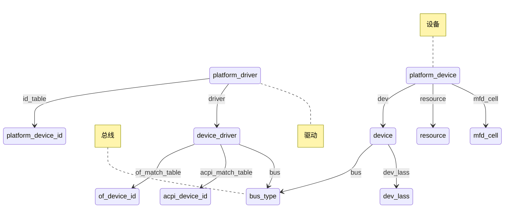

# Linux驱动编程笔记

## 目录

[TOC]

## 内核编程指南

* Linux设计中强调的一个基本观点是机制和策略的分离，在Linux内核中，不应该实现策略
    * 机制是做某样事情的固定步骤、方法，而策略就是每一个步骤所采取的不同方式
    * 机制是相对固定的，而每个步骤采用的策略是不固定的，机制是稳定的，而策略则是灵活的
* 内核编程不能访问标准C库，必须用GNU C
* 内核没有内存保护机制，内核中的内存不分页
* 容积小而固定的栈(一般32位CPU为8K(使用2页),64位CPU为16K)
* 内核尽量不要使用浮点数操作
* 内核支持异步中断、抢占和SMP，需要时刻注意同步和并发
* 考虑可移植的重要性

## Linux内核源码树

* 内核源码阅读: https://elixir.bootlin.com/linux/latest/source
* 内核文档阅读: https://www.kernel.org/doc/html/latest/index.html
* Ubuntun内核源码: `/usr/src/linux`

| 目录 | 说明 |
| ---  | ---  |
| arch          | 特定体系结构的源码，如arm、mips、x86等处理器的子目录 |
| block         | 块设备I/O层 |
| crypto        | 加密API，它们可以应用于WIFI设备驱动的加密算法等场合 |
| Documentation | 对内核各子系统的简要说明文档 |
| drivers       | 设备类和外设控制器的驱动 |
| fs            | VFS和各种文件系统 |
| include       | 内核头文件 |
| init          | 内核引导和初始化，比如著名的函数start_kernel()便是位于init/main.c里面 |
| ipc           | 对消息队列、信号、共享内存等进程间通信(IPC)机制的支持 |
| kernel        | 像调度程序这样的核心子系统，基本上是与体系无关的部分 |
| lib           | 通用内核对象(kobject)处理函数、循环余码校验(CRC)计算函数等库函数 |
| mm            | 内存管理子系统和VM |
| net           | 网络子系统，包括IPv4、IPv6、IPX、蓝牙、ATM、红外、LAPB、LLC等协议栈 |
| samples       | 示例代码 |
| scripts       | 内核编译过程中使用的脚本 |
| security      | Linux安全模块 |
| sound         | 音频子系统 |
| usr           | 早期的用户空间代码(initramfs) |
| tools         | 在Linux开发中有用的工具 |
| virt          | 虚拟化基础结构 |

## 模块基础

### hello模块代码

```makefile
ifneq ($(KERNELRELEASE),)
# Kernel modules
obj-m := hello.o
# if module has mutiple srcs
#obj-m := hello.o
#hello-objs := hello1.o hello2.o

else
KERN_DIR = /lib/modules/$(shell uname -r)/build
CUR_DIR = $(shell pwd)

all:
	@make -C $(KERN_DIR) M=$(CUR_DIR) modules
clean:
	@make -C $(KERN_DIR) M=$(CUR_DIR) clean
endif
```

```c
#include <linux/module.h>
#include <linux/init.h>

// 模块参数
static int num = 0;
module_param(num, int, 0644);
MODULE_PARM_DESC(num, "You can use 'hello_change' to change num value");

// 模块导出符号
void hello_set_param(int n)
{
    printk("change num from %d to %d./n", num, n);
    num = n;
}
EXPORT_SYMBOL(hello_set_param);

// 模块加载函数
static int __init hello_init(void)
{
    printk("Hello World! --> module_init./n");
    printk("num=%d! --> module_param./n", num);
    return 0;
}
module_init(hello_init);

// 模块卸载函数
static void __exit hello_exit(void)
{
    printk("Hello World! --> module_exit./n");
}
module_exit(hello_exit);

MODULE_AUTHOR("lengjing <lengjingzju@163.com>");
MODULE_DESCRIPTION("A simple Hello World Module");

// 模块许可证声明
MODULE_LICENSE("GPL v2");
```

### 模块说明

* 模块参数(可选)
    * 模块参数是模块被加载的时候可以传递给它的值，它本身对应模块内部的全局变量
    * 使用 `module_param(参数名, 参数类型, 参数读/写权限);` 为模块声明一个参数
    * 使用 `module_param_array(参数名, 参数类型, 元素个数, 参数读/写权限);` 为模块声明一个数组参数
    * 参数类型：
        * bool   : 布尔类型
        * invbool: 颠倒了值的bool类型
        * short  : 短整型
        * ushort : 无符号短整型
        * int    : 整型
        * uint   : 无符号整型
        * long   : 长整型
        * ulong  : 无符号长整型
        * charp  : 字符指针类型，内存为用户提供的字符串分配
    * 在装载内核模块时，用户可以向模块传递参数，形式为 `insmode (或modprobe) 模块名 参数名=参数值`
    * 运行 `insmod` 或 `modprobe` 命令时，应使用==逗号==分隔输入的数组元素
    * 如果模块被内置，可以通过在bootargs里设置 "模块名.参数名=值" 的形式给该内置的模块传递参数
    * 模块被加载后，在 `/sys/module/` 目录下将出现以此模块名命名的目录
        * 如果“参数读/写权限”为0时，表示此参数不存在sysfs文件系统下对应的文件节点
        * 如果“参数读/写权限”不为0时，在此模块的目录下还将出现 `parameters` 目录，其中包含一系列以参数名命名的文件节点
    * 使用 `lsmod` 获得系统中已加载的所有模块以及模块间的依赖关系，实际上是读取并分析 `/proc/modules` 文件
    * 使用 `modinfo <modname>` 可以获得模块的信息
* 模块导出符号(可选)
    * 内核模块可以导出的符号(symbol，对应于函数或变量)，若导出，其他模块则可以使用本模块中的变量或函数
    * `EXPORT_SYMBOL` 和 `EXPORT_SYMBOL_GPL` (只适用于包含GPL许可权的模块)导出符号到内核符号表中，`EXPORT_SYMBOL` 标签内定义的函数或者符号对全部内核代码公开
    * `cat /proc/kallsyms` 可以查看内核符号表
    * 使用方法：
        * 在模块函数定义之后使用 `EXPORT_SYMBOL(func_name);` 来声明
        * 在调用该函数的另外一个模块中使用extern对之声明
        * 先加载定义该函数的模块，然后再加载调用该函数的模块，请注意这个先后顺序
* 模块加载函数
    * 使用 `module_init(函数名);` 声明模块的加载函数
    * 当通过 `insmod <modpathname>` 或 `modprobe <modpathname>` 命令加载内核模块时，模块的加载函数会自动被内核执行，完成本模块的相关初始化工作
        * `modprobe` 命令比 `insmod` 命令要强大，它在加载某模块时，会同时加载该模块所依赖的其他模块
        * 依赖关系存放在根文件系统的 `/lib/modules/<kernel-version>/modules.dep` 文件中
    * 内核也可以调用 `request_module(const char *fmt,…)` 灵活地加载其他内核模块
        * 例如 `request_module("fb%d", fbidx);` 在调用主设备号之后，使用次设备之前，根据次设备号加载对应的设备节点
    * 初始化成功，应返回0；失败返回错误编码(负数，例如-ENODEV、-ENOMEM)
* 模块卸载函数
    * 使用 `module_exit(函数名);` 声明模块的卸载函数
    * 当通过 `rmmod <modname>` 命令卸载某模块时，模块的卸载函数会自动被内核执行，完成与模块卸载函数相反的功能
        * `modprobe -r <modname>` 卸载modname时，将同时卸载其依赖的模块
* 模块作者等信息声明(可选)
    * MODULE_AUTHOR         : 模块的作者
    * MODULE_DESCRIPTION    : 模块的描述
    * MODULE_VERSION        : 模块的版本
    * MODULE_ALIAS          : 模块的别名
    * MODULE_DEVICE_TABLE   : 设备表
* 模块许可证声明
    * 许可证(LICENSE)声明描述内核模块的许可权限，如果不声明LICENSE，模块被加载时，将收到内核被污染(Kernel Tainted)的警告
        * GPL               ：GNU General Public License的任意版本
        * GPL v2            ：GPL的第二版本，常用
        * GPL and addtional ：
        * Dual BSD/GPL      ：
        * Dual MPL/GPL      ：
        * Proprietary       ：私有的，除非你的模块显式地声明一个开源版本，否则内核会默认你这是一个私有的模块

* 3类设备

| 设备类型 | 抽象对象 | 访问方法 | 操作接口 | 设备例子 |
| --- | --- | --- | --- | --- |
| 字符设备 | struct cdev | 必须以串行顺序依次进行访问的设备，支持按字节/字符来读写数据 | 文件系统接口 | 触摸屏、磁带驱动器、鼠标 |
| 块设备   | struct block_device | 按任意顺序进行访问，以块(通常是512B)为单位进行操作 | 文件系统接口 | 硬盘、eMMC |
| 网络设备 | struct net_device |网络数据包的接收和发送 | 套接字接口 | |

* 字符设备存在于/dev下，网络设备并不存在于/dev下面

## 字符设备

### 驱动框架

* 实现设备驱动
    * 填充 struct operations 结构体部分内容
* 实现模块初始化
    * 申请设备号(dev_t)
        * 静态申请 : `register_chrdev_region()`
        * 动态申请 : `alloc_chrdev_region()`
    * 初始化 cdev : `cdev_init()`
    * 注册 cdev : `cdev_add()`
    * 建立设备类节点 : `class_create()`
    * 建立设备节点 : `device_create()`
* 实现模块销毁
    * 删除设备节点 : `device_destroy()`
    * 删除设备类节点 : `class_destroy()`
    * 释放 cdev : `cdev_del()`
    * 释放设备号 : `unregister_chrdev_region()`

### 申请释放设备号

```c
#incude <linux/fs.h>
```

* 设备号分 主设备号 和 次设备号
    * `MKDEV(major, minor)` 通过主设备号和次设备号生成设备号，设备号用 `dev_t` 来表示，dev_t 是32 bit的数
    * `MAJOR(dev)` 获得主设备号，主设备号区别设备类型，设备号的高 12 bit
    * `MINOR(dev)` 获得次设备号，次设备号表示具体的设备，设备号的低 20 bit

#### register_chrdev_region - 静态申请连续设备号

```c
/*
 * 功能: 静态申请连续设备号
 * 返回: 0，成功; <0，失败
 * IN  : from       要申请的起始设备号
 * IN  : count      要申请的连续设备号的数量
 * IN  : name       设备名称
 * 说明: from通过MKDEV(ma,mi)生成
 */
int register_chrdev_region(dev_t from, unsigned count, const char *name);
```

#### alloc_chrdev_region - 动态申请连续设备号

```c
/*
 * 功能: 动态申请连续设备号
 * 返回: 0，成功; <0，失败
 * OUT : dev        返回申请到的起始设备编号
 * IN  : baseminor  要申请的起始次设备号
 * IN  : count      要申请的连续设备号的数量
 * IN  : name       设备名称
 * 说明: 和alloc_chrdev_region二选一即可
 */
int alloc_chrdev_region(dev_t *dev, unsigned baseminor, unsigned count, const char *name);
```

#### unregister_chrdev_region - 释放连续设备号

```c
/*
 * 功能: 释放连续设备号
 * 返回: none
 * IN  : from       要释放的起始设备号
 * IN  : count      要释放的连续设备号的数量
 */
void unregister_chrdev_region(dev_t from, unsigned count);
```

#### register_chrdev / unregister_chrdev - 旧的设备号申请释放函数

```c
static inline int register_chrdev(unsigned int major, const char *name,
				  const struct file_operations *fops)
{
	return __register_chrdev(major, 0, 256, name, fops);
}

static inline void unregister_chrdev(unsigned int major, const char *name)
{
	__unregister_chrdev(major, 0, 256, name);
}
```

* 缺点：每注册个字符设备，还会连续注册0~255个次设备号，使它们绑定在同一个file_operations操作方法结构体上，在大多数情况下，都只用极少的次设备号，所以会浪费很多资源

### 初始化释放cdev

```c
#incude <linux/cdev.h>
```

#### struct cdev 结构体

```c
struct cdev {
	struct kobject kobj;                // 内嵌的kobject对象
	struct module *owner;               // 所属模块
	const struct file_operations *ops;  // 文件操作方法结构体
	struct list_head list;              // 与cdev对应的字符设备文件的inode->i_devices的链表头
	dev_t dev;                          // 起始设备号
	unsigned int count;                 // 连续设备号的数量
} __randomize_layout;
```

#### struct file_operations 结构体

```c
#incude <linux/fs.h>

struct inode {
	umode_t			i_mode;
	unsigned short		i_opflags;
	kuid_t			i_uid;
	kgid_t			i_gid;
	unsigned int		i_flags;

#ifdef CONFIG_FS_POSIX_ACL
	struct posix_acl	*i_acl;
	struct posix_acl	*i_default_acl;
#endif

	const struct inode_operations	*i_op;
	struct super_block	*i_sb;
	struct address_space	*i_mapping;

#ifdef CONFIG_SECURITY
	void			*i_security;
#endif

	/* Stat data, not accessed from path walking */
	unsigned long		i_ino;
	/*
	 * Filesystems may only read i_nlink directly.  They shall use the
	 * following functions for modification:
	 *
	 *    (set|clear|inc|drop)_nlink
	 *    inode_(inc|dec)_link_count
	 */
	union {
		const unsigned int i_nlink;
		unsigned int __i_nlink;
	};
	dev_t			i_rdev;
	loff_t			i_size;
	struct timespec64	i_atime;
	struct timespec64	i_mtime;
	struct timespec64	i_ctime;
	spinlock_t		i_lock;	/* i_blocks, i_bytes, maybe i_size */
	unsigned short          i_bytes;
	u8			i_blkbits;
	u8			i_write_hint;
	blkcnt_t		i_blocks;

#ifdef __NEED_I_SIZE_ORDERED
	seqcount_t		i_size_seqcount;
#endif

	/* Misc */
	unsigned long		i_state;
	struct rw_semaphore	i_rwsem;

	unsigned long		dirtied_when;	/* jiffies of first dirtying */
	unsigned long		dirtied_time_when;

	struct hlist_node	i_hash;
	struct list_head	i_io_list;	/* backing dev IO list */
#ifdef CONFIG_CGROUP_WRITEBACK
	struct bdi_writeback	*i_wb;		/* the associated cgroup wb */

	/* foreign inode detection, see wbc_detach_inode() */
	int			i_wb_frn_winner;
	u16			i_wb_frn_avg_time;
	u16			i_wb_frn_history;
#endif
	struct list_head	i_lru;		/* inode LRU list */
	struct list_head	i_sb_list;
	struct list_head	i_wb_list;	/* backing dev writeback list */
	union {
		struct hlist_head	i_dentry;
		struct rcu_head		i_rcu;
	};
	atomic64_t		i_version;
	atomic64_t		i_sequence; /* see futex */
	atomic_t		i_count;
	atomic_t		i_dio_count;
	atomic_t		i_writecount;
#if defined(CONFIG_IMA) || defined(CONFIG_FILE_LOCKING)
	atomic_t		i_readcount; /* struct files open RO */
#endif
	union {
		const struct file_operations	*i_fop;	/* former ->i_op->default_file_ops */
		void (*free_inode)(struct inode *);
	};
	struct file_lock_context	*i_flctx;
	struct address_space	i_data;
	struct list_head	i_devices;
	union {
		struct pipe_inode_info	*i_pipe;
		struct cdev		*i_cdev;
		char			*i_link;
		unsigned		i_dir_seq;
	};

	__u32			i_generation;

#ifdef CONFIG_FSNOTIFY
	__u32			i_fsnotify_mask; /* all events this inode cares about */
	struct fsnotify_mark_connector __rcu	*i_fsnotify_marks;
#endif

#ifdef CONFIG_FS_ENCRYPTION
	struct fscrypt_info	*i_crypt_info;
#endif

#ifdef CONFIG_FS_VERITY
	struct fsverity_info	*i_verity_info;
#endif

	void			*i_private; /* fs or device private pointer */
} __randomize_layout;

struct file {
	union {
		struct llist_node	fu_llist;
		struct rcu_head 	fu_rcuhead;
	} f_u;
	struct path		f_path;
	struct inode		*f_inode;	/* cached value */
	const struct file_operations	*f_op;

	/*
	 * Protects f_ep, f_flags.
	 * Must not be taken from IRQ context.
	 */
	spinlock_t		f_lock;
	enum rw_hint		f_write_hint;
	atomic_long_t		f_count;
	unsigned int 		f_flags;
	fmode_t			f_mode;
	struct mutex		f_pos_lock;
	loff_t			f_pos;
	struct fown_struct	f_owner;
	const struct cred	*f_cred;
	struct file_ra_state	f_ra;

	u64			f_version;
#ifdef CONFIG_SECURITY
	void			*f_security;
#endif
	/* needed for tty driver, and maybe others */
	void			*private_data;

#ifdef CONFIG_EPOLL
	/* Used by fs/eventpoll.c to link all the hooks to this file */
	struct hlist_head	*f_ep;
#endif /* #ifdef CONFIG_EPOLL */
	struct address_space	*f_mapping;
	errseq_t		f_wb_err;
	errseq_t		f_sb_err; /* for syncfs */
} __randomize_layout
  __attribute__((aligned(4)));	/* lest something weird decides that 2 is OK */

struct file_operations {
	struct module *owner;
	loff_t (*llseek) (struct file *, loff_t, int);
	ssize_t (*read) (struct file *, char __user *, size_t, loff_t *);
	ssize_t (*write) (struct file *, const char __user *, size_t, loff_t *);
	ssize_t (*read_iter) (struct kiocb *, struct iov_iter *);
	ssize_t (*write_iter) (struct kiocb *, struct iov_iter *);
	int (*iopoll)(struct kiocb *kiocb, bool spin);
	int (*iterate) (struct file *, struct dir_context *);
	int (*iterate_shared) (struct file *, struct dir_context *);
	__poll_t (*poll) (struct file *, struct poll_table_struct *);
	long (*unlocked_ioctl) (struct file *, unsigned int, unsigned long);
	long (*compat_ioctl) (struct file *, unsigned int, unsigned long);
	int (*mmap) (struct file *, struct vm_area_struct *);
	unsigned long mmap_supported_flags;
	int (*open) (struct inode *, struct file *);
	int (*flush) (struct file *, fl_owner_t id);
	int (*release) (struct inode *, struct file *);
	int (*fsync) (struct file *, loff_t, loff_t, int datasync);
	int (*fasync) (int, struct file *, int);
	int (*lock) (struct file *, int, struct file_lock *);
	ssize_t (*sendpage) (struct file *, struct page *, int, size_t, loff_t *, int);
	unsigned long (*get_unmapped_area)(struct file *, unsigned long, unsigned long, unsigned long, unsigned long);
	int (*check_flags)(int);
	int (*flock) (struct file *, int, struct file_lock *);
	ssize_t (*splice_write)(struct pipe_inode_info *, struct file *, loff_t *, size_t, unsigned int);
	ssize_t (*splice_read)(struct file *, loff_t *, struct pipe_inode_info *, size_t, unsigned int);
	int (*setlease)(struct file *, long, struct file_lock **, void **);
	long (*fallocate)(struct file *file, int mode, loff_t offset,
			  loff_t len);
	void (*show_fdinfo)(struct seq_file *m, struct file *f);
#ifndef CONFIG_MMU
	unsigned (*mmap_capabilities)(struct file *);
#endif
	ssize_t (*copy_file_range)(struct file *, loff_t, struct file *,
			loff_t, size_t, unsigned int);
	loff_t (*remap_file_range)(struct file *file_in, loff_t pos_in,
				   struct file *file_out, loff_t pos_out,
				   loff_t len, unsigned int remap_flags);
	int (*fadvise)(struct file *, loff_t, loff_t, int);
} __randomize_layout;
```

* unlocked_ioctl : 对应fcntl ioctl
* 注意 `struct inode` 的 `i_cdev` 成员，可以通过它找到私有数据
* 注意 `struct file` 的 `private_data` 成员，`open` 时会把私有数据的指针赋值给它，后面就可以使用私有数据了

* 填写open函数举例

```c
struct test_dev {
    struct cdev cdev;
    unsigned char *private_data;
};

static int iav_open(struct inode *inode, struct file *filp)
{
	struct test_dev *dev = NULL;
	struct iav_file_priv_obj *private_data = NULL;
	int rval = 0;

	dev = container_of(inode->i_cdev, struct test_dev, cdev);
	filp->private_data = dev->private_data;

	return rval;
}
```

#### cdev_init - 初始化字符设备

```c
/*
 * 功能: 初始化字符设备
 * 返回: none
 * IN  : cdev       要初始化的字符设备
 * IN  : fops       初始化的字符设备操作函数
 */
void cdev_init(struct cdev *cdev, const struct file_operations *fops);
```

#### cdev_add - 关联设备号与字符设备

```c
/*
 * 功能: 关联设备号与字符设备
 * 返回: 0，成功; <0，失败
 * IN  : p          要关联的字符设备
 * IN  : dev        要关联的起始设备号
 * IN  : count      要关联的连续设备号的数量
 * 说明: 可以为不同的设备号关联不同的设备操作函数
 */
int cdev_add(struct cdev *p, dev_t dev, unsigned count)
```

#### cdev_del - 释放字符设备

```c
/*
 * 功能: 释放字符设备
 * 返回: none
 * IN  : p          要释放的字符设备
 */
void cdev_del(struct cdev *p)
```

### 建立删除设备(类)节点

```c
#incude <linux/device/class.h>
#incude <linux/device.h>
```

#### class_create和device_create的关系

* `class = class_create(THIS_MODULE, "class_name")`
    * 建立了 `/sys/devices/virtual/class_name` 目录
    * 建立了 `/sys/class/class_name` 目录
* `device_create(class, NULL, dev_id, NULL , "dev_name")`
    * 建立了 `/dev/dev_name` 设备节点，可用open打开
    * 建立了 `/sys/devices/virtual/class_name/dev_name` 目录，目录下有设备信息文件节点
    * 建立了 `/sys/class/class_name/dev_name` 符号链接指向上面的目录
    * 一个class下可以有多个device

* 注：如果驱动不调用建立删除设备(类)节点的接口，需要命令 `mknod devname {b | c | p} MAJOR MINOR` 手动创建设备节点
    * devname 是要创建的设备文件名
    * b和c分别表示块设备和字符设备，p表示管道
    * MAJOR和MINOR分别表示主设备号和次设备号
    * 例如 `mknod /dev/gfifo c 231 0`

#### class_create - 建立设备类节点

```c
/*
 * 功能: 建立设备类节点
 * 返回: 非空指针，成功; NULL，失败
 * IN  : owner      class的所有者，一般使用 THIS_MODULE 本模块
 * IN  : name       class的名称
 */
struct class *__class_create(struct module *owner, const char *name,
			     struct lock_class_key *key);
#define class_create(owner, name)		\
({						\
	static struct lock_class_key __key;	\
	__class_create(owner, name, &__key);	\
})
```

#### class_destroy - 删除设备类节点

```c
/*
 * 功能: 删除设备类节点
 * 返回: none
 * IN  : cls        class指针
 */
void class_destroy(struct class *cls);
```

#### class_register / class_unregister

* class_create / class_destroy 他们的封装函数，功能等价

```c
struct class *__class_create(struct module *owner, const char *name,
			     struct lock_class_key *key)
{
	struct class *cls;
	int retval;

	cls = kzalloc(sizeof(*cls), GFP_KERNEL);
	if (!cls) {
		retval = -ENOMEM;
		goto error;
	}

	cls->name = name;
	cls->owner = owner;
	cls->class_release = class_create_release;

	retval = __class_register(cls, key);
	if (retval)
		goto error;

	return cls;

error:
	kfree(cls);
	return ERR_PTR(retval);
}

#define class_create(owner, name)		\
({						\
	static struct lock_class_key __key;	\
	__class_create(owner, name, &__key);	\
})

#define class_register(class)			\
({						\
	static struct lock_class_key __key;	\
	__class_register(class, &__key);	\
})

void class_destroy(struct class *cls)
{
	if ((cls == NULL) || (IS_ERR(cls)))
		return;

	class_unregister(cls);
}
```

#### device_create - 建立设备节点

```c
/*
 * 功能: 建立设备节点
 * 返回: 非空指针，成功; NULL，失败
 * IN  : class      要关联的class指针
 * IN  : parent     父设备的指针
 * IN  : devt       关联的设备号
 * IN  : drvdata    设备回调函数的参数
 * IN  : fmt        device的名称格式化字符串
 */
struct device *device_create(struct class *class, struct device *parent,
			     dev_t devt, void *drvdata, const char *fmt, ...);
```

#### device_destroy - 删除设备节点

```c
/*
 * 功能: 删除设备节点
 * 返回: none
 * IN  : class      设备节点关联的class指针
 * IN  : devt       要删除的设备节点的设备号
 */
void device_destroy(struct class *class, dev_t devt);
```

## platform框架

* 总线、驱动和设备
    * 在系统每注册一个设备的时候，会寻找与之匹配的驱动；对应的，在系统每注册一个驱动的时候，会寻找与之匹配的设备，而匹配由总线完成(将设备和驱动绑定)，而驱动则以标准途径拿到板级信息
* platform模型
    * platform 是一个虚拟的地址总线，相比 PCI、USB，它主要用于描述SOC上的片上资源。
    * platform 所描述的资源有一个共同点：在CPU 的总线上直接取址。平台设备会分到一个名称(用在驱动绑定中)以及一系列诸如地址和中断请求号(IRQ)之类的资源
    * 设备用 platform_device 表示；驱动用 platform_driver 进行注册。设备与驱动的两种绑定方式：在设备注册时进行绑定及在驱动注册时进行绑定。
    * 以一个USB设备为例，有两种情形：
        * 先插上USB设备并挂到总线中，然后在安装USB驱动程序过程中从总线上遍历各个设备，看驱动程序是否与其相匹配，如果匹配就将两者邦定。这就是`platform_driver_register()`
        * 先安装USB驱动程序，然后当有USB设备插入时，那么就遍历总线上的各个驱动，看两者是否匹配，如果匹配就将其绑定。这就是`platform_device_register()`
* platform模型优点
    * 符合Linux 设备模型 —— 总线、设备、驱动，使配套的sysfs节点、设备电源管理都成为可能，方便开发
    * 隔离BSP和驱动。在BSP中定义platform设备和设备使用的资源、设备的具体匹配信息，而在驱动中，只需要通过API去获取资源和数据，做到了板相关代码和驱动代码的分离，使得驱动具有更好的可扩展性和跨平台性。
    * 让一个驱动支持多个设备实例。

### platform_driver 驱动

```c
#include <linux/platform_device.h>
struct device_driver {
	const char *name;  // 驱动名称
	struct bus_type *bus; // 驱动设备所属的总线

	struct module *owner; // 模块所有者，一般填写 THIS_MODULE
	const char *mod_name; // 用于内置模块

	bool suppress_bind_attrs; // 禁用通过sysfs绑定/解绑
	enum probe_type probe_type; // 要使用的探测的类型(同步或异步)

	/* 匹配表 */
	const struct of_device_id *of_match_table; // 开放的固件匹配表
	const struct acpi_device_id *acpi_match_table; // ACPI匹配表

	/* 设备驱动回调函数 */
	int (*probe) (struct device *dev); // 调用该函数查询特定设备是否存在，该驱动程序是否可以与该设备一起工作，并将该驱动程序绑定到特定设备。
	void (*sync_state)(struct device *dev); // 同步状态
	int (*remove) (struct device *dev); // 设备卸载时将该驱动程序与设备解绑
	void (*shutdown) (struct device *dev); // 关机时调用，使设备静默
	int (*suspend) (struct device *dev, pm_message_t state); // 低功耗时使设备进入睡眠模式
	int (*resume) (struct device *dev); // 将设备从睡眠模式唤醒

	/* 驱动属性 */
	const struct attribute_group **groups; // 驱动核心自动创建的属性
	const struct attribute_group **dev_groups; // 绑定设备的附加属性

	const struct dev_pm_ops *pm; // 设备的电源管理模式
	void (*coredump) (struct device *dev); // 写入sysfs条目时调用，设备驱动程序将调用dev_coredump API，从而产生uevent

	struct driver_private *p; // 驱动核心的私有数据
};

struct platform_device_id {
	char name[PLATFORM_NAME_SIZE];
	kernel_ulong_t driver_data;
};

struct platform_driver {
	int (*probe)(struct platform_device *); // 探测回调函数
	int (*remove)(struct platform_device *); // 删除回调函数
	void (*shutdown)(struct platform_device *); // 关闭回调函数
	int (*suspend)(struct platform_device *, pm_message_t state); // 挂起回调函数
	int (*resume)(struct platform_device *); // 唤醒回调函数
	struct device_driver driver; // 设备驱动结构体
	const struct platform_device_id *id_table; // 匹配id表
	bool prevent_deferred_probe; // 禁止推迟探测
};
```

* 填充platform_driver的 suspend resume 做电源管理回调的方法目前已经过时，较好的做法是实现platform_driver的device_driver中的dev_pm_ops结构体成员
* 与platform_driver地位对等的i2c_driver、spi_driver、usb_driver、pci_driver中都包含了device_driver结构体实例成员

#### platform_driver_register 注册platform驱动

```c
int driver_register(struct device_driver *drv)
{
	int ret;
	struct device_driver *other;

	if (!drv->bus->p) {
		pr_err("Driver '%s' was unable to register with bus_type '%s' because the bus was not initialized.\n",
			   drv->name, drv->bus->name);
		return -EINVAL;
	}

	if ((drv->bus->probe && drv->probe) ||
	    (drv->bus->remove && drv->remove) ||
	    (drv->bus->shutdown && drv->shutdown))
		pr_warn("Driver '%s' needs updating - please use "
			"bus_type methods\n", drv->name);

	other = driver_find(drv->name, drv->bus);
	if (other) {
		pr_err("Error: Driver '%s' is already registered, "
			"aborting...\n", drv->name);
		return -EBUSY;
	}

	ret = bus_add_driver(drv);
	if (ret)
		return ret;
	ret = driver_add_groups(drv, drv->groups);
	if (ret) {
		bus_remove_driver(drv);
		return ret;
	}
	kobject_uevent(&drv->p->kobj, KOBJ_ADD);

	return ret;
}

int __platform_driver_register(struct platform_driver *drv,
				struct module *owner)
{
	drv->driver.owner = owner;
	drv->driver.bus = &platform_bus_type;

	return driver_register(&drv->driver);
}

#define platform_driver_register(drv) __platform_driver_register(drv, THIS_MODULE)
```

#### platform_driver_unregister 注销platform驱动

```c
void driver_remove_groups(struct device_driver *drv,
			  const struct attribute_group **groups)
{
	sysfs_remove_groups(&drv->p->kobj, groups);
}

void bus_remove_driver(struct device_driver *drv)
{
	if (!drv->bus)
		return;

	if (!drv->suppress_bind_attrs)
		remove_bind_files(drv);
	driver_remove_groups(drv, drv->bus->drv_groups);
	driver_remove_file(drv, &driver_attr_uevent);
	klist_remove(&drv->p->knode_bus);
	pr_debug("bus: '%s': remove driver %s\n", drv->bus->name, drv->name);
	driver_detach(drv);
	module_remove_driver(drv);
	kobject_put(&drv->p->kobj);
	bus_put(drv->bus);
}

void driver_unregister(struct device_driver *drv)
{
	if (!drv || !drv->p) {
		WARN(1, "Unexpected driver unregister!\n");
		return;
	}
	driver_remove_groups(drv, drv->groups);
	bus_remove_driver(drv);
}

void platform_driver_unregister(struct platform_driver *drv)
{
    driver_unregister(&drv->driver);
}
```

### platform_device 设备

```c
#include <linux/device.h>
#include <linux/platform_device.h>

struct device {
	struct kobject kobj; // 内核对象基类
	struct device *parent;
	struct device_private *p;
	const char *init_name; /* initial name of the device */

	const struct device_type *type;
	struct bus_type	*bus; /* type of bus device is on */
	struct device_driver *driver; /* which driver has allocated this device */
	void *platform_data; /* Platform specific data, device core doesn't touch it */
	void *driver_data; /* Driver data, set and get with dev_set_drvdata/dev_get_drvdata */

#ifdef CONFIG_PROVE_LOCKING
	struct mutex lockdep_mutex;
#endif
	struct mutex mutex; /* mutex to synchronize calls to its driver. */

	struct dev_links_info links;
	struct dev_pm_info power; // 功耗管理
	struct dev_pm_domain *pm_domain; // 功耗管理
#ifdef CONFIG_ENERGY_MODEL
	struct em_perf_domain *em_pd;
#endif
#ifdef CONFIG_GENERIC_MSI_IRQ_DOMAIN
	struct irq_domain *msi_domain;
#endif
#ifdef CONFIG_PINCTRL
	struct dev_pin_info *pins;
#endif
#ifdef CONFIG_GENERIC_MSI_IRQ
	raw_spinlock_t msi_lock;
	struct list_head msi_list;
#endif

	/* DMA 抽象 */
#ifdef CONFIG_DMA_OPS
	const struct dma_map_ops *dma_ops;
#endif
	u64 *dma_mask;	/* dma mask (if dma'able device) */
	u64 coherent_dma_mask;/* Like dma_mask, but for alloc_coherent mappings as
		not all hardware supports 64 bit addresses for consistent allocations such descriptors. */
	u64 bus_dma_limit; /* upstream dma constraint */
	const struct bus_dma_region *dma_range_map;
	struct device_dma_parameters *dma_parms;
	struct list_head dma_pools; /* dma pools (if dma'ble) */
#ifdef CONFIG_DMA_DECLARE_COHERENT
	struct dma_coherent_mem *dma_mem; /* internal for coherent mem override */
#endif
#ifdef CONFIG_DMA_CMA
	struct cma *cma_area; /* contiguous memory area for dma allocations */
#endif

	/* arch specific additions */
	struct dev_archdata	archdata;
	struct device_node *of_node; /* associated device tree node */
	struct fwnode_handle *fwnode; /* firmware device node */

#ifdef CONFIG_NUMA
	int numa_node;	/* NUMA node this device is close to */
#endif
	dev_t devt; /* dev_t, creates the sysfs "dev" */
	u32 id; /* 设备ID */
	spinlock_t devres_lock;
	struct list_head devres_head;
	struct class *class; /* 设备类描述 */
	const struct attribute_group **groups;	/* optional groups */

	void (*release)(struct device *dev);
	struct iommu_group *iommu_group;
	struct dev_iommu *iommu;

	bool			offline_disabled:1;
	bool			offline:1;
	bool			of_node_reused:1;
	bool			state_synced:1;
	bool			can_match:1;
#if defined(CONFIG_ARCH_HAS_SYNC_DMA_FOR_DEVICE) || \
    defined(CONFIG_ARCH_HAS_SYNC_DMA_FOR_CPU) || \
    defined(CONFIG_ARCH_HAS_SYNC_DMA_FOR_CPU_ALL)
	bool			dma_coherent:1;
#endif
#ifdef CONFIG_DMA_OPS_BYPASS
	bool			dma_ops_bypass : 1;
#endif
};

struct resource {
	resource_size_t start; // 资源起始地址
	resource_size_t end; // 资源结束地址
	const char *name; // 资源名称
	unsigned long flags; // 资源类型
	unsigned long desc;
	struct resource *parent, *sibling, *child; // 父/兄弟/子 资源的指针
};
// flags=IORESOURCE_MEM 时，start 、end 分别表示该platform_device占据的内存的开始地址和结束值
// flags=IORESOURCE_IRQ 时，start 、end 分别表示该platform_device使用的中断号的开始地址和结束值

struct mfd_cell {
	const char *name;
	int id;
	int level;

	int (*enable)(struct platform_device *dev);
	int (*disable)(struct platform_device *dev);
	int (*suspend)(struct platform_device *dev);
	int (*resume)(struct platform_device *dev);

	/* 传递给子设备驱动程序的平台数据 */
	void *platform_data;
	size_t pdata_size;

	const struct software_node *swnode; // 设备的软件节点
	const char *of_compatible; // 设备树兼容字符串
	const u64 of_reg; // 设备树中定义的地址，补全of_compatible
	bool use_of_reg; // 使能of_reg

	const struct mfd_cell_acpi_match *acpi_match; // 匹配acpi

	/* 相对于父设备指定的资源，访问硬件需要使用平台资源 */
	int num_resources;
	const struct resource *resources;

	bool ignore_resource_conflicts; // 忽略资源冲突标志
	bool			pm_runtime_no_callbacks; // 禁用子设备运行时pm回调

	/* 映射到MFD设备而非子设备的调节器电源列表 */
	const char * const	*parent_supplies;
	int			num_parent_supplies;
};

struct platform_device {
	const char *name;  // 设备名
	int id;
	bool id_auto;
	struct device dev;
	u64 platform_dma_mask;
	struct device_dma_parameters dma_parms;
	u32 num_resources;
	struct resource *resource; /* 抽象描述驱动程序需要用到的硬件资源 */

	const struct platform_device_id *id_entry; // 记录和驱动的匹配表id_table中匹配的那一个表项的指针
	char *driver_override; // 有值时，只绑定对应名称的驱动

	struct mfd_cell *mfd_cell; // 注册后，该结构的副本将成为结果platform_device的平台数据

	struct pdev_archdata archdata; // 一般都指向这个结构体实体本身地址
};
```

* Linux 3.x之后，ARM Linux不太喜欢人们以编码(调用下面函数)的形式去填写platform_device和注册，而倾向于**根据设备树中的内容自动展开platform_device**。
* `/sys/devices/platform` 目录下会出现相应的设备

#### platform_device_register 注册platform设备

```c
int platform_device_register(struct platform_device *pdev)
{
	device_initialize(&pdev->dev);
	setup_pdev_dma_masks(pdev);
	return platform_device_add(pdev);
}

/* 注册一组设备 */
int platform_add_devices(struct platform_device **devs, int num);
```

#### platform_device_unregister 注销platform设备

```c
void platform_device_unregister(struct platform_device *pdev)
{
	platform_device_del(pdev); // 移除设备，销魂资源
	platform_device_put(pdev); // 销毁设备，释放与平台设备相关的所有内存
}
```

#### bus_type 总线

```c
#include <device/bus.h>
struct bus_type {
	const char *name; // 总线名称
	const char *dev_name; // 枚举子系统设备名称，"foo%u", dev->id
	struct device *dev_root; // 默认父设备

	const struct attribute_group **bus_groups; // 总线的默认属性
	const struct attribute_group **dev_groups; // 总线上设备的默认属性
	const struct attribute_group **drv_groups; // 总线上设备驱动程序的默认属性

	int (*match)(struct device *dev, struct device_driver *drv);
	int (*uevent)(struct device *dev, struct kobj_uevent_env *env);
	int (*probe)(struct device *dev);
	void (*sync_state)(struct device *dev);
	int (*remove)(struct device *dev);
	void (*shutdown)(struct device *dev);
	int (*online)(struct device *dev);
	int (*offline)(struct device *dev);
	int (*suspend)(struct device *dev, pm_message_t state);
	int (*resume)(struct device *dev);
	int (*num_vf)(struct device *dev);
	int (*dma_configure)(struct device *dev);

	const struct dev_pm_ops *pm; // 电源管理
	const struct iommu_ops *iommu_ops; // IO映射
	struct subsys_private *p; // 驱动程序内核的私有数据
	struct lock_class_key lock_key; // 锁验证器使用的锁类密钥
	bool need_parent_lock; // 探测或移除此总线上的设备时，设备核心应该锁定父设备
};
```

#### platform 总线分析

* platform_bus_type

```c
// /drivers/base/platform.c

/* platform_match确定了platform_device和platform_driver之间如何进行匹配 */
static int platform_match(struct device *dev, struct device_driver *drv)
{
	struct platform_device *pdev = to_platform_device(dev);
	struct platform_driver *pdrv = to_platform_driver(drv);

	/* 当driver_override设置时, 只绑定对应名称的驱动 */
	if (pdev->driver_override)
		return !strcmp(pdev->driver_override, drv->name);
	/* 采用设备树的兼容方式匹配驱动和设备 */
	if (of_driver_match_device(dev, drv))
		return 1;
	/* 采用ACPI的方式匹配驱动和设备 */
	if (acpi_driver_match_device(dev, drv))
		return 1;
	/* 通过驱动和设备的匹配ID表来匹配驱动和设备 */
	if (pdrv->id_table)
		return platform_match_id(pdrv->id_table, pdev) != NULL;
	/* 最后就是按驱动和设备名称是否相同来判断当前驱动是否支持这个设备 */
	return (strcmp(pdev->name, drv->name) == 0);
}

struct bus_type platform_bus_type = {
	.name		= "platform",
	.dev_groups	= platform_dev_groups,
	.match		= platform_match,   // platform总线匹配规则
	.uevent		= platform_uevent,
	.probe		= platform_probe,   // 内部会调用platform_driver的probe
	.remove		= platform_remove,  // 内部会调用platform_driver的remove
	.shutdown	= platform_shutdown,// 内部会调用platform_driver的shutdown
	.dma_configure	= platform_dma_configure,
	.pm		= &platform_dev_pm_ops,
};
```

* 关系图



### udev和uevent

* udev在用户空间中执行，动态建立/删除设备文件，允许每个人都不用关心主/次设备号而提供LSB(Linux标准规范，Linux Standard Base)名称，并且可以根据需要固定名称。udev的工作过程如下。
    * 当内核检测到系统中出现了新设备后，内核会通过netlink套接字发送uevent。
    * udev获取内核发送的信息，进行规则的匹配。匹配的事物包括SUBSYSTEM、ACTION、atttribute、内核提供的名称(通过KERNEL=)以及其他的环境变量。
    * 根据这些信息，创建一个规则，以便每次插入的时候，为该设备创建一个/dev/xxx的符号链接
        * 匹配关键字包括：ACTION(行为)、KERNEL(匹配内核设备名)、BUS(匹配总线类型)、SUBSYSTEM(匹配子系统名)、ATTR(属性)等
        * 赋值关键字包括：NAME(创建的设备文件名)、SYMLINK(符号创建链接名)、OWNER(设置设备的所有者)、GROUP(设置设备的组)、IMPORT(调用外部程序)、MODE(节点访问权限)等
* udev的轻量级版本mdev，mdev集成于busybox中

## DTB设备树

### 设备树

#### 设备树描述信息

* 设备树是一种描述硬件的数据结构，它起源于OpenFirmware（OF）
* 在Linux 2.6中， ARM架构的板极硬件细节过多地被硬编码在arch/arm/plat-xxx和arch/arm/mach-xxx中
* 采用设备树后，许多硬件的细节可以直接通过它传递给Linux，而不再需要在内核中进行大量的冗余编码
* 设备树由一系列被命名的节点（Node）和属性（Property）组成，而节点本身可包含子节点。所谓属性，其实就是成对出现的名称和值。
* 在设备树中，可描述的信息包括（原先这些信息大多被硬编码在内核中）：
    * CPU的数量和类别
    * 内存基地址和大小
    * 总线和桥
    * 外设连接
    * 中断控制器和中断使用情况
    * GPIO控制器和GPIO使用情况
    * 时钟控制器和时钟使用情况

#### 设备节点

* 在设备树中节点命名格式如下：

```c
node-name@unit-address
```

* node-name： 是设备节点的名称，为ASCII字符串，节点名字应该能够清晰的描述出节点的功能，比如“uart1”就表示这个节点是UART1外设
* unit-address： 一般表示设备的地址或寄存器首地址，如果某个节点没有地址或者寄存器的话 “unit-address” 可以不要
	* 对于挂在内存空间的设备而言，@字符后跟的一般就是该设备在内存空间的基地址
	* 对于挂在I2C总线上的外设而言，@后面一般跟的是从设备的I2C地址
* node-name相同的情况下，可以通过不同的unit-address定义不同的设备节点
* 注：根节点没有node-name 或者 unit-address，它被定义为 `/`

#### linux设备树中DTS、 DTC和DTB的关系

* DTS： .dts文件是设备树的源文件。由于一个SoC可能对应多个设备，这些.dst文件可能包含很多共同的部分，共同的部分一般被提炼为一个 `.dtsi` 文件，这个文件相当于C语言的头文件。
* DTC： DTC是将.dts编译为.dtb的工具，相当于gcc。
* DTB： .dtb文件是 .dts 被 DTC 编译后的二进制格式的设备树文件，它可以被linux内核解析。

#### .dtsi 头文件

* 和 C 语言一样，设备树也支持头文件，设备树的头文件扩展名为 .dtsi；同时也可以像C 语言一样包含 .h头文件；例如：（代码来源linux-4.15/arch/arm/boot/dts/s3c2416.dtsi）

```c
#include <dt-bindings/clock/s3c2443.h>
#include "s3c24xx.dtsi"
```

* 注：.dtsi 文件一般用于描述 SOC 的内部外设信息，比如 CPU 架构、主频、外设寄存器地址范围，比如 UART、 IIC 等等。

### 设备常用属性

* 描述属性的文档在内核源码目录 `Documentation/devicetree/bindings`，主要内容包括：
    * 关于该模块最基本的描述
    * 必需属性（Required Properties）的描述
    * 可选属性（Optional Properties）的描述
    * 一个实例

#### 属性格式

* an-empty-property : 属性为空
* a-string-property : 属性为字符串
* a-string-list-property : 属性为字符串数组
* cells : 属性为u32整数
* a-byte-data-property : 属性为二进制数

#### compatible 属性

* compatible 属性也叫做 “兼容性” 属性，compatible 属性的值是一个字符串列表， compatible 属性用于将设备和驱动绑定起来。字符串列表用于选择设备所要使用的驱动程序。compatible 属性值的推荐格式：

```c
"manufacturer,model"
```

* manufacturer : 表示厂商
* model : 一般是模块对应的驱动名字。

* 例如：
```c
compatible = "fsl,mpc8641", "ns16550";
```
* 上面的compatible有两个属性，分别是 “fsl,mpc8641” 和 “ns16550”；其中 “fsl,mpc8641” 的厂商是 fsl；设备首先会使用第一个属性值在 Linux 内核里面查找，看看能不能找到与之匹配的驱动文件；如果没找到，就使用第二个属性值查找，以此类推，直到查到到对应的驱动程序 或者 查找完整个 Linux 内核也没有对应的驱动程序为止。
* 注：一般驱动程序文件都会有一个 OF 匹配表，此 OF 匹配表保存着一些 compatible 值，如果设备节点的 compatible 属性值和 OF 匹配表中的任何一个值相等，那么就表示设备可以使用这个驱动。

#### model 属性

* model 属性值也是一个字符串，一般 model 属性描述设备模块信息，比如名字什么的，例如：

```c
model = "Samsung S3C2416 SoC";
```

#### phandle 属性

* phandle属性为devicetree中唯一的节点指定一个数字标识符，节点中的phandle属性，它的取值必须是唯一的(不要跟其他的phandle值一样)，例如：

```c
pic@10000000 {
    phandle = <1>;
    interrupt-controller;
};
another-device-node {
    interrupt-parent = <1>;   // 使用phandle值为1来引用上述节点
};
```
* 注：DTS中的大多数设备树将不包含显式的phandle属性，当DTS被编译成二进制DTB格式时，DTC工具会自动插入phandle属性。

#### status 属性

* status 属性看名字就知道是和设备状态有关的， status 属性值也是字符串，字符串是设备的状态信息，可选的状态如下表所示：
* status值描述
	* okay: 表明设备是可操作的。
	* disabled: 表明设备当前是不可操作的，但是在未来可以变为可操作的，比如热插拔设备插入以后。至于 disabled 的具体含义还要看设备的绑定文档。
	* fail: 表明设备不可操作，设备检测到了一系列的错误，而且设备也不大可能变得可操作。
	* fail-sss: 含义和“fail”相同，后面的 sss 部分是检测到的错误内容

#### address-cells 和 size-cells

* `#address-cells` 和 `#size-cells` 的值都是无符号 32 位整型，可以用在任何拥有子节点的设备中，用于描述子节点的地址信息。
* `#address-cells` 属性值决定了子节点 reg 属性中地址信息所占用的字长(32 位)， `#size-cells` 属性值决定了子节点 reg 属性中长度信息所占的字长(32 位)。
* `#address-cells` 和 `#size-cells` 表明了子节点应该如何编写 reg 属性值，一般 reg 属性都是和地址有关的内容，和地址相关的信息有两种：起始地址和地址长度，reg 属性的格式一为：

```c
reg = <address1 length1 address2 length2 address3 length3……>
```

* 例如一个64位的处理器：

```c
soc {
	#address-cells = <2>;
	#size-cells = <1>;
	serial {
		compatible = "xxx";
		reg = <0x4600 0x5000 0x100>;  /*地址信息是：0x00004600 0x00005000,长度信息是：0x100*/
		};
};
```

#### reg 属性

* reg 属性的值一般是 (address， length) 对，reg 属性一般用于描述设备地址空间资源信息，一般都是某个外设的寄存器地址范围信息。
* 例如：一个设备有两个寄存器块，一个的地址是0x3000，占据32字节；另一个的地址是0xFE00，占据256字节，表示如下：

```c
reg = <0x3000 0x20 0xFE00 0x100>;
```
* 注：上述对应 `#address-cells = <1>; #size-cells = <1>;`。

#### ranges 属性

* ranges 属性值可以为空或者按照 (child-bus-address,parent-bus-address,length) 格式编写的数字矩阵
* ranges 是一个地址映射/转换表， ranges 属性每个项目由子地址、父地址和地址空间长度这三部分组成：
	* child-bus-address： 子总线地址空间的物理地址，由父节点的 #address-cells 确定此物理地址所占用的字长。
	* parent-bus-address： 父总线地址空间的物理地址，同样由父节点的 #address-cells 确定此物理地址所占用的字长。
	* length： 子地址空间的长度，由父节点的 #size-cells 确定此地址长度所占用的字长。

```c
soc {
	compatible = "simple-bus";
	#address-cells = <1>;
	#size-cells = <1>;
	ranges = <0x0 0xe0000000 0x00100000>;
	serial {
		device_type = "serial";
		compatible = "ns16550";
		reg = <0x4600 0x100>;
		clock-frequency = <0>;
		interrupts = <0xA 0x8>;
		interrupt-parent = <&ipic>;
		};
};
```

* 节点 soc 定义的 ranges 属性，值为 `<0x0 0xe0000000 0x00100000>`，此属性值指定了一个 `1024KB(0x00100000)` 的地址范围，子地址空间的物理起始地址为 `0x0`，父地址空间的物理起始地址为 `0xe0000000`。
* serial 是串口设备节点， reg 属性定义了 serial 设备寄存器的起始地址为 `0x4600`，寄存器长度为 `0x100`。经过地址转换， serial 设备可以从 `0xe0004600` 开始进行读写操作，`0xe0004600=0x4600+0xe0000000`。

#### name 属性

* name 属性值为字符串， name 属性用于记录节点名字， name 属性已经被弃用，不推荐使用name 属性，一些老的设备树文件可能会使用此属性。

#### device_type 属性

* device_type 属性值为字符串， IEEE 1275 会用到此属性，用于描述设备的 FCode，但是设备树没有 FCode，所以此属性也被抛弃了。此属性只能用于 cpu 节点或者 memory 节点。

```c
memory@30000000 {
	device_type = "memory";
	reg =  <0x30000000 0x4000000>;
};
```

### 设备节点

#### 根节点

* 每个设备树文件只有一个根节点，其他所有的设备节点都是它的子节点，它的路径是 /。根节点有以下属性：

| 属性 | 属性值类型 | 描述 |
| ---  | ---       | --- |
| `#address-cells` | `< u32 >` | 在它的子节点的reg属性中, 使用多少个u32整数来描述地址(address) |
| `#size-cells` | `< u32 >` | 在它的子节点的reg属性中, 使用多少个u32整数来描述大小(size) |
| `model` | `< string >` | 用于标识系统板卡(例如smdk2440开发板)，推荐的格式是“manufacturer,model-number” |
| `compatible` | `< stringlist >` | 定义一系列的字符串, 用来指定内核中哪个machine_desc可以支持本设备 |

* 例如：compatible = “samsung,smdk2440”,“samsung,s3c24xx” ,内核会优先寻找支持smdk2440的machine_desc结构体，如果找不到才会继续寻找支持s3c24xx的machine_desc结构体(优先选择第一项，然后才是第二项，第三项…)

#### /aliases 子节点

* aliases 节点的主要功能就是定义别名，定义别名的目的就是为了方便访问节点。例如：定义 flexcan1 和 flexcan2 的别名是 can0 和 can1。

```c
aliases {
	can0 = &flexcan1;
	can1 = &flexcan2;
};
```

#### /memory 子节点

* 所有设备树都需要一个memory设备节点，它描述了系统的物理内存布局。如果系统有多个内存块，可以创建多个memory节点，或者可以在单个memory节点的reg属性中指定这些地址范围和内存空间大小。
* 例如：一个64位的系统有两块内存空间：RAM1： 起始地址是0x0，地址空间是 0x80000000；RAM2： 起始地址是0x10000000，地址空间也是0x80000000；同时根节点下的 `#address-cells = <2>`和`#size-cells = <2>`，这个memory节点描述为：

```c
memory@0 {
	device_type = "memory";
	reg = <0x00000000 0x00000000 0x00000000 0x80000000
		   0x00000000 0x10000000 0x00000000 0x80000000>;
};
```

或者：

```c
memory@0 {
	device_type = "memory";
	reg = <0x00000000 0x00000000 0x00000000 0x80000000>;
};
memory@10000000 {
	device_type = "memory";
	reg = <0x00000000 0x10000000 0x00000000 0x80000000>;
};
```

#### /chosen 子节点

* chosen 并不是一个真实的设备， chosen 节点主要是为了 uboot 向 Linux 内核传递数据，重点是 bootargs 参数。例如：

```c
chosen {
	bootargs = "root=/dev/nfs rw nfsroot=192.168.1.1 console=ttyS0,115200";
};
```

#### /cpus 和 /cpus/cpu* 子节点
cpus节点下有1个或多个cpu子节点, cpu子节点中用reg属性用来标明自己是哪一个cpu，所以 /cpus 中有以下2个属性:

* #address-cells   // 在它的子节点的reg属性中, 使用多少个u32整数来描述地址(address)
* #size-cells      // 在它的子节点的reg属性中, 使用多少个u32整数来描述大小(size) // 必须设置为0

例如：

```c
cpus {
	#address-cells = <1>;
	#size-cells = <0>;
	cpu@0 {
		device_type = "cpu";
		reg = <0>;
		cache-unified;
		cache-size = <0x8000>; // L1, 32KB
		cache-block-size = <32>;
		timebase-frequency = <82500000>; // 82.5 MHz
		next-level-cache = <&L2_0>; // phandle to L2
		L2_0:l2-cache {
			compatible = "cache";
			cache-unified;
			cache-size = <0x40000>; // 256 KB
			cache-sets = <1024>;
			cache-block-size = <32>;
			cache-level = <2>;
			next-level-cache = <&L3>; // phandle to L3
			L3:l3-cache {
				compatible = "cache";
				cache-unified;
				cache-size = <0x40000>; // 256 KB
				cache-sets = <0x400>; // 1024
				cache-block-size = <32>;
				cache-level = <3>;
				};
			};
		};
	cpu@1 {
		device_type = "cpu";
		reg = <1>;
		cache-unified;
		cache-block-size = <32>;
		cache-size = <0x8000>; // L1, 32KB
		timebase-frequency = <82500000>; // 82.5 MHzclock-frequency = <825000000>; // 825 MHz
		cache-level = <2>;
		next-level-cache = <&L2_1>; // phandle to L2
		L2_1:l2-cache {
			compatible = "cache";
			cache-unified;
			cache-size = <0x40000>; // 256 KB
			cache-sets = <0x400>; // 1024
			cache-line-size = <32>; // 32 bytes
			next-level-cache = <&L3>; // phandle to L3
			};
		};
};
```

#### 引用其他节点

* 节点中的phandle属性, 它的取值必须是唯一的(不要跟其他的phandle值一样)

```c
pic@10000000 {
    phandle = <1>;
    interrupt-controller;
};

another-device-node {
    interrupt-parent = <1>;   // 使用phandle值为1来引用上述节点
};
```

#### label

```c
PIC: pic@10000000 {
    interrupt-controller;
};

another-device-node {
    interrupt-parent = <&PIC>;   // 使用label来引用上述节点,
                                 // 使用lable时实际上也是使用phandle来引用,
                                 // 在编译dts文件为dtb文件时, 编译器dtc会在dtb中插入phandle属性
};
```

### OF函数族

* Linux 内核给我们提供了一系列的函数来获取设备树中的节点或者属性信息，这一系列的函数都有一个统一的前缀 **of_**
* OF(Open Firmware) 函数原型都定义在include/linux/of.h 文件中

#### of_machine_is_compatible 判断根节点兼容性

* 在Linux内核中，常常使用如下OF函数来判断根节点的兼容性：

```c
int of_machine_is_compatible(const char *compat)
```

* DT设备的.dt_compat可能包含多个电路板，通过该函数可以判断根节点compatible的属性，当该函数的compat参数与根据点的compatible匹配时，返回一个正整数。

* 用法，例如：

```c
of_machine_is_compatible("samsung,exynos4")
```

#### device_node 设备节点

* 设备都是以节点的形式“挂”到设备树上的，因此要想获取这个设备的其他属性信息，必须先获取到这个设备的节点。
* Linux 内核使用 device_node 结构体来描述一个节点，此结构体定义在文件 include/linux/of.h 中，代码如下：

```c
struct device_node {
	const char *name;  /*节点的名字*/
	const char *type;  /*设备类型，来自节点中的device_type属性, 如果没有该属性, 则设为"NULL"*/
	phandle phandle;
	const char *full_name;  /*节点的全名，node-name[@unit-address]*/
	struct fwnode_handle fwnode;

	struct	property *properties;  /*节点的属性*/
	struct	property *deadprops;	/* removed properties */
	struct	device_node *parent;   /*父节点*/
	struct	device_node *child;    /*子节点*/
	struct	device_node *sibling;  /*节点的兄弟，即同级节点*/
#if defined(CONFIG_OF_KOBJ)
	struct	kobject kobj;
#endif
	unsigned long _flags;
	void	*data;
#if defined(CONFIG_SPARC)
	const char *path_component_name;
	unsigned int unique_id;
	struct of_irq_controller *irq_trans;
#endif
};
```

#### of_find_node_by_name 通过节点名字查找指定的节点

* of_find_node_by_name 函数通过节点名字查找指定的节点，函数原型如下：

```c
struct device_node *of_find_node_by_name(struct device_node *from, const char *name)
```

* 函数参数和返回值含义如下：
	* from： 开始查找的节点，如果为 NULL 表示从根节点开始查找整个设备树。
	* name： 要查找的节点名字。

#### of_find_node_by_type 通过 device_type 属性查找指定的节点

* of_find_node_by_type 函数通过 device_type 属性查找指定的节点，函数原型如下：

```c
struct device_node *of_find_node_by_type(struct device_node *from, const char *type)
```

* 函数参数和返回值含义如下：
	* from： 开始查找的节点，如果为 NULL 表示从根节点开始查找整个设备树。
	* type： 要查找的节点对应的 type 字符串，也就是 device_type 属性值。
	* 返回值： 找到的节点，如果为 NULL 表示查找失败。

#### of_find_compatible_node 根据 device_type 和 compatible 这两个属性查找指定的节点

* of_find_compatible_node 函数根据 device_type 和 compatible 这两个属性查找指定的节点，函数原型如下：

```c
struct device_node *of_find_compatible_node(struct device_node *from,
											const char *type,
											const char *compatible)
```

* 函数参数和返回值含义如下：
	* from： 开始查找的节点，如果为 NULL 表示从根节点开始查找整个设备树。
	* type： 要查找的节点对应的 type 字符串，也就是 device_type 属性值，可以为 NULL，表示忽略掉 device_type 属性。
	* compatible： 要查找的节点所对应的 compatible 属性列表。
	* 返回值： 找到的节点，如果为 NULL 表示查找失败

#### of_find_matching_node_and_match 通过 of_device_id 匹配表来查找指定的节点

* of_find_matching_node_and_match 函数通过 of_device_id 匹配表来查找指定的节点，函数原型如下：

```c
struct device_node *of_find_matching_node_and_match(struct device_node *from,
													const struct of_device_id *matches,
													const struct of_device_id **match)
```

* 函数参数和返回值含义如下：
	* from： 开始查找的节点，如果为 NULL 表示从根节点开始查找整个设备树。
	* matches： of_device_id 匹配表，也就是在此匹配表里面查找节点。
	* match： 找到的匹配的 of_device_id。
	* 返回值： 找到的节点，如果为 NULL 表示查找失败

#### of_find_node_by_path 通过路径来查找指定的节点

* of_find_node_by_path 函数通过路径来查找指定的节点，函数原型如下：

```c
inline struct device_node *of_find_node_by_path(const char *path)
```

* 函数参数和返回值含义如下：
	* path： 带有全路径的节点名，可以使用节点的别名，比如“/backlight”就是 backlight 这个节点的全路径。
	* 返回值： 找到的节点，如果为 NULL 表示查找失败

#### of_get_parent 获取指定节点的父节点

* of_get_parent 函数用于获取指定节点的父节点，原型如下：

```c
struct device_node *of_get_parent(const struct device_node *node)
```

* 函数参数和返回值含义如下：
	* node： 需要查找父节点的子节点；
	* 返回值： 返回父节点；

#### of_get_next_child 查找下一个节点

* of_get_next_child 函数用迭代的查找子节点，函数原型如下：

```c
struct device_node *of_get_next_child(const struct device_node *node,
									struct device_node *prev)
```

* 函数参数和返回值含义如下：
	* node： 父节点；
	* prev： 前一个子节点，也就是从哪一个子节点开始迭代的查找下一个子节点。可以设置为NULL，表示从第一个子节点开始。
	* 返回值： 找到的下一个子节点。

#### property 节点属性

* 节点的属性信息里面保存了驱动所需要的内容，因此对于属性值的提取非常重要， Linux 内核中使用结构体 property 表示属性，此结构体同样定义在文件 include/linux/of.h 中，内容如下：

```c
struct property {
	char *name; /* 属性名字 */
	int length; /* 属性长度 */
	void *value; /* 属性值 */
	struct property *next; /* 下一个属性 */
	unsigned long _flags;
	unsigned int unique_id;
	struct bin_attribute attr;
};
```

#### of_find_property 查找指定的属性

* of_find_property 函数用于查找指定的属性，函数原型如下：

```c
struct property *of_find_property(const struct device_node *np,
							const char *name,
							int *lenp)
```

* 函数参数和返回值含义如下：
	* np： 设备节点；
	* name： 属性名字；
	* lenp： 属性值的字节数；
	* 返回值： 找到的属性。

* of_property_count_elems_of_size 获取属性中元素的数量

* of_property_count_elems_of_size 函数用于获取属性中元素的数量，比如 reg 属性值是一个数组，那么使用此函数可以获取到这个数组的大小，此函数原型如下：

```c
int of_property_count_elems_of_size(const struct device_node *np,
									const char *propname,
									int elem_size)
```

* 函数参数和返回值含义如下：
	* np： 设备节点。
	* proname： 需要统计元素数量的属性名字。
	* elem_size： 元素长度。
	* 返回值： 得到的属性元素数量。

#### of_property_read_u32_index 获取指定标号的 u32 类型数据值

* of_property_read_u32_index 函数用于从属性中获取指定标号的 u32 类型数据值(无符号 32位)，比如某个属性有多个 u32 类型的值，那么就可以使用此函数来获取指定标号的数据值，此函数原型如下：

```c
int of_property_read_u32_index(const struct device_node *np,
								const char *propname,
								u32 index,
								u32 *out_value)
```

* 函数参数和返回值含义如下：
	* np： 设备节点；
	* proname： 要读取的属性名字；
	* index： 要读取的值标号；
	* out_value： 读取到的值；
	* 返回值： 0 读取成功，负值，读取失败， -EINVAL 表示属性不存在， -ENODATA 表示没有要读取的数据， -EOVERFLOW 表示属性值列表太小。

#### of_property_read_uxx_array 读取整型数组数据

* 这 4 个函数分别是读取属性中 u8、 u16、 u32 和 u64 类型的数组数据，比如大多数的 reg 属性都是数组数据，可以使用这 4 个函数一次读取出 reg 属性中的所有数据。这四个函数的原型如下：

```c
int of_property_read_u8_array(const struct device_node *np,
							const char *propname,
							u8 *out_values,
							size_t sz)
int of_property_read_u16_array(const struct device_node *np,
							const char *propname,
							u16 *out_values,
							size_t sz)
int of_property_read_u32_array(const struct device_node *np,
							const char *propname,
							u32 *out_values,
							size_t sz)
int of_property_read_u64_array(const struct device_node *np,
							const char *propname,
							u64 *out_values
							size_t sz)
```

* 函数参数和返回值含义如下：
	* np： 设备节点；
	* proname： 要读取的属性名字；
	* out_value： 读取到的数组值，分别为 u8、 u16、 u32 和 u64。
	* sz： 要读取的数组元素数量。
	* 返回值： 0，读取成功，负值，读取失败， -EINVAL 表示属性不存在， -ENODATA 表示没有要读取的数据， -EOVERFLOW 表示属性值列表太小。

#### of_property_read_uxx 读取整型数据

* 有些属性只有一个整形值，这四个函数就是用于读取这种只有一个整形值的属性，分别用
于读取 u8、 u16、 u32 和 u64 类型属性值，函数原型如下：

```c
int of_property_read_u8(const struct device_node *np,
						const char *propname,
						u8 *out_value)
int of_property_read_u16(const struct device_node *np,
						const char *propname,
						u16 *out_value)
int of_property_read_u32(const struct device_node *np,
						const char *propname,
						u32 *out_value)
int of_property_read_u64(const struct device_node *np,
						const char *propname,
						u64 *out_value)
```

* 函数参数和返回值含义如下：
	* np： 设备节点。
	* proname： 要读取的属性名字。
	* out_value： 读取到的数组值。
	* 返回值： 0，读取成功，负值，读取失败， -EINVAL 表示属性不存在， -ENODATA 表示没有要读取的数据， -EOVERFLOW 表示属性值列表太小。

4.6 of_property_read_string 读取属性中字符串值

* of_property_read_string 函数用于读取属性中字符串值，函数原型如下：

```c
int of_property_read_string(struct device_node *np,
							const char *propname,
							const char **out_string)
```

* 函数参数和返回值含义如下：
	* np： 设备节点。
	* proname： 要读取的属性名字。
	* out_string： 读取到的字符串值。
	* 返回值： 0，读取成功，负值，读取失败。

#### of_n_addr_cells 获取 #address-cells 属性值

* of_n_addr_cells 函数用于获取 #address-cells 属性值，函数原型如下：

```c
int of_n_addr_cells(struct device_node *np)
```

* 函数参数和返回值含义如下：
	* np： 设备节点。
	* 返回值： 获取到的#address-cells 属性值。

#### of_n_size_cells 获取 #size-cells 属性值

* of_size_cells 函数用于获取 #size-cells 属性值，函数原型如下：

```c
int of_n_size_cells(struct device_node *np)
```

* 函数参数和返回值含义如下：
	* np： 设备节点。
	* 返回值： 获取到的#size-cells 属性值。

#### of_get_address 用于获取地址相关属性

* of_get_address 函数用于获取地址相关属性，主要是“reg”或者“assigned-addresses”属性
值，函数属性如下：

```c
const __be32 *of_get_address(struct device_node *dev,
							int index,
							u64 *size,
							unsigned int *flags)
```

* 函数参数和返回值含义如下：
	* dev： 设备节点。
	* index： 要读取的地址标号。
	* size： 地址长度。
	* flags： 参数，比如 IORESOURCE_IO、 IORESOURCE_MEM 等
	* 返回值： 读取到的地址数据首地址，为 NULL 的话表示读取失败。

#### of_translate_address 将从设备树读取到的地址转换为物理地址

* of_translate_address 函数负责将从设备树读取到的地址转换为物理地址，函数原型如下：

```c
u64 of_translate_address(struct device_node *dev,
						const __be32 *in_addr)
```

* 函数参数和返回值含义如下：
	* dev： 设备节点。
	* in_addr： 要转换的地址。
	* 返回值： 得到的物理地址，如果为 OF_BAD_ADDR 的话表示转换失败。

#### of_address_to_resource 从设备树里面提取资源值

* resource结构体描述的都是设备资源信息， resource 结构体定义在文件include/linux/ioport.h 中，定义如下：

```c
struct resource {
	resource_size_t start; /*起始地址，对于32位soc，resource_size_t 的数据类型是u32*/
	resource_size_t end; /*结束地址*/
	const char *name;  /*资源的名字*/
	unsigned long flags; /*资源标志位，一般表示资源类型,可选的资源标志定义在文件 include/linux/ioport.h,如IORESOURCE_BITS、IORESOURCE_MEM、IORESOURCE_IRQ等 */
	struct resource *parent, *sibling, *child;
};
```

* of_address_to_resource 函数是从设备树里面提取资源值，但是本质上就是将 reg 属性值，然后将其转换为 resource 结构体类型，函数原型如下所示：

```c
int of_address_to_resource(struct device_node *dev,
							int index,
							struct resource *r)
```

* 函数参数和返回值含义如下：
	* dev： 设备节点。
	* index： 地址资源标号。
	* r： 得到的 resource 类型的资源值。
	* 返回值： 0，成功；负值，失败。

#### of_iomap 函数

* of_iomap 函数用于直接内存映射，以前我们会通过 ioremap 函数来完成物理地址到虚拟地址的映射，采用设备树以后就可以直接过 of_iomap 函数来获取内存地址所对应的虚拟地址，不需要使用 ioremap 函数了。该函数的原型如下：

```c
void __iomem *of_iomap(struct device_node *np,
						int index)
```

* 函数参数和返回值含义如下：
	* np： 设备节点。
	* index： reg 属性中要完成内存映射的段，如果 reg 属性只有一段的话 index 就设置为 0。
	* 返回值： 经过内存映射后的虚拟内存首地址，如果为 NULL 的话表示内存映射失败。

### of platform 函数族

```c
#include <linux/of_platform.h>
```

#### of_find_device_by_node 返回该设备对应的platform_device结构

* 根据device_node查找返回该设备对应的platform_device结构

```c
struct platform_device* of_find_device_by_node(struct device_node *np)
```

## 基本编程

### 数据copy

* `(void __user *)arg`
    * 指示arg值是一个用户空间的地址，不能直接进行拷贝等，要使用内核空间和用户空间交换数据函数，如下两类
* `get_user` / `put_user`: 主要用于完成一些简单类型变量(char int long等)的拷贝任务
    * `#define get_user(x,p)`
    * `#define put_user(x,p)`
    * x是内核空间的变量，p是用户空间的指针
    * 成功则返回0，失败返回-EFAULT
    * 将会检查指针指向的对象长度，在arm平台上只支持长度为1，2，4，8的变量
* `copy_from_user` / `copy_to_user`: 完成所有类型(包括 struct array等)的拷贝任务
    * `unsigned long copy_from_user(void *to, const void __user *from, unsigned long n)`
    * `unsigned long copy_to_user(void __user *to, const void *from, unsigned long n)`
    * 成功返回0，失败返回没有拷贝成功的数据字节数
    * 将会检查用户空间的地址范围是否在当前进程的用户地址空间限制中

### 内核指针错误检查IS_ERR

```c
#include <linux/err.h>

#define IS_ERR_VALUE(x) unlikely((unsigned long)(void *)(x) >= (unsigned long)-MAX_ERRNO)

static inline void * __must_check ERR_PTR(long error)
{
	return (void *) error;
}

static inline long __must_check PTR_ERR(__force const void *ptr)
{
	return (long) ptr;
}

static inline bool __must_check IS_ERR(__force const void *ptr)
{
	return IS_ERR_VALUE((unsigned long)ptr);
}

static inline bool __must_check IS_ERR_OR_NULL(__force const void *ptr)
{
	return unlikely(!ptr) || IS_ERR_VALUE((unsigned long)ptr);
}
```

### ioctl宏

* 获取属性
    * _IOC_NR(cmd) : 读取基数域值 (bit0~ bit7)，区分命令顺序序号，通常，从0开始递增
    * _IOC_TYPE(cmd) : 读取魔数域值 (bit8 ~ bit15)，与其它设备驱动程序的 ioctl 命令进行区别，通常，用英文字符 'A' ~ 'Z' 或者 'a' ~ 'z' 来表示
    * _IOC_SIZE(cmd) : 读取数据大小域值 (bit16 ~ bit29)，ioctl()中的arg 变量传送的内存大小，传入的是代入变量的类型
    * _IOC_DIR(cmd) : 获取读写属性域值 (bit30 ~ bit31)，区分是读取命令还是写入命令
        * _IOC_NONE                 : 无属性
        * _IOC_READ                 : 可读属性
        * _IOC_WRITE                : 可写属性
        * _IOC_READ | _IOC_WRITE    : 可读写属性
* 设置cmd
    * _IO  (魔数, 基数)             : 没有可传送的变量，只是用于传送命令
    * _IOR (魔数, 基数, 变量类型)   : 读取数据的命令
    * _IOW (魔数, 基数, 变量类型)   : 写入数据的命令
    * _IOWR(魔数, 基数, 变量类型)   : 读写数据的命令

## 内存

### Linux内存管理

* 用来将虚拟地址空间映射到物理地址空间的数据结构称为页表。
* 虚拟地址关系到进程的用户空间和内核空间，而物理地址则用来寻址实际可用的内存。物理内存页经常称作页帧。相比之下，页则专指虚拟地址空间中的页。
* 用户进程通常只能访问用户空间的虚拟地址，不能访问内核空间的虚拟地址。用户进程只有通过系统调用（代表用户进程在内核态执行）等方式才可以访问到内核空间。
* 每个进程的用户空间都是完全独立、互不相干的，用户进程各自有不同的页表。而内核空间是由内核负责映射，它并不会跟着进程改变，是固定的。内核空间的虚拟地址到物理地址映射是被所有进程共享的，内核的虚拟空间独立于其他程序。
* 两个虚拟地址空间中的页(虽然在不同的位置)可以映射到同一物理内存页。由于内核负责将虚拟地址空间映射到物理地址空间，因此可以决定哪些内存区域在进程之间共享，哪些不共享。
* Linux采用了四级页表:
    * 全局页目录(Page Global Directory，PGD)
	* 上层页目录(Page Upper Directory, PUD)(64位系统)
    * 中间页目录(Page Middle Directory，PMD)
    * 页表或页目录(Page Table Entry，PTE)
    * 偏移量(offset)。
* 每次访问内存时，必须逐级访问多个数组才能将虚拟地址转换为物理地址，CPU使用MMU加速该过程：
    * CPU中有一个专门的部分称为MMU(Memory Management Unit，内存管理单元)，该单元优化了内存访问操作。该单元辅助操作系统进行内存管理，提供虚拟地址和物理地址的映射、内存访问权限保护和Cache缓存控制等硬件支持。
        * TLB(Translation Lookaside Buffer) : 地址转换后备缓冲器，MMU的核心部件，缓存少量的虚拟地址(地址转换中出现最频繁的那些地址)与物理地址的转换关系，是转换表的Cache，因此也经常被称为“快表”
        * TTW(Translation Table walk)：即转换表漫游，当TLB中没有缓冲对应的地址转换关系时，需要通过对内存中转换表的访问来获得虚拟地址和物理地址的对应关系。TTW成功后，结果应写入TLB中。
<p/>

* 伙伴系统 `/proc/buddyinfo`:
    * 把空闲的页面以2的n次方为单位进行管理
    * 系统中的空闲内存块总是两两分组，每组中的两个内存块称作伙伴。伙伴的分配可以是彼此独立的。
    * 但如果两个伙伴都是空闲的，内核会将其合并为一个更大的内存块，作为下一层次上某个内存块的伙伴。
* slab缓存 `/proc/slabinfo` :
    * 内核本身经常需要比完整页帧小得多的内存块。由于内核无法使用标准库的函数，因而必须在伙伴系统基础上自行定义额外的内存管理层，将伙伴系统提供的页划分为更小的部分。
    * 该方法不仅可以分配内存，还为频繁使用的小对象实现了一个一般性的缓存——slab缓存。它可以用两种方法分配内存。
        * 对频繁使用的对象，内核定义了只包含了所需类型对象实例的缓存。每次需要某种对象时，可以从对应的缓存快速分配(使用后释放到缓存)。 slab缓存自动维护与伙伴系统的交互，在缓存用尽时会请求新的页帧。
        * 对通常情况下小内存块的分配，内核针对不同大小的对象定义了一组slab缓存，可以像用户空间编程一样，用相同的函数访问这些缓存。不同之处是这些函数都增加了前缀k，表明是与内核相关联的: kmalloc和kfree。
    * slab分配器扮演了通用数据结构缓存层的角色。slab层把不同的对象划分为不同的高速缓存组。slab处于的状态有:满、部分满、空。多CPU中，持续不断的缓存失效称为缓存抖动。
    * 注: 对真正微小的嵌入式系统来说，slab分配器的开销可能又太大了。内核提供了slab分配器的两种备选方案，可用于在相应的场景下替换slab分配器并提供更好的性能。
<p/>

* 页面交换和页面回收
    * 页面交换通过利用磁盘空间作为扩展内存，从而增大了可用的内存。在内核需要更多内存时，不经常使用的页可以写入硬盘，换出的页可以通过特别的页表项标识。在进程试图访问此类页帧时，CPU则启动一个可以被内核截取的缺页异常，此时内核可以将硬盘上的数据切换到内存中，接下来用户进程可以恢复运行。
    * 页面回收用于将内存映射被修改的内容与底层的块设备同步，为此有时也简称为数据回写。
<p/>

* 页的区域
    * 处理器的最小可寻址单位是字(甚至字节)，但内核把物理页作为内存管理的基本单位。大多数32位体系架构支持4KB的页，64位体系架构一般支持8KB的页。
    * 内存管理单元(MMU，管理内存并把虚拟地址转换为物理地址的硬件)通常以页为单位管理系统中的页表。内核用 `struct page` `<linux/mm_types.h>` 表示系统中的每个物理页。
* Linux中内核地址空间从低地址到高地址依次为：物理内存映射区→隔离带→vmalloc虚拟内存分配器区→隔离带→高端内存映射区→专用页面映射区→保留区。
    * 对于内核物理内存映射区的虚拟内存（即从DMA和常规区域映射过来的），使用`virt_to_phys()`可以实现内核虚拟地址转化为物理地址。与之对应的函数为`phys_to_virt()`，它将物理地址转化为内核虚拟地址。
* 内核把页划分为不同的区 `struct zone` `<linux/mmzone.h>` 。LInux主要使用了四种区:
    * ZONE_DMA 标记适合DMA(直接存储访问，不经过CPU指令)的内存域。
        * 执行DMA是否有地址限制取决于体系架构，x86中ISA设备只能访问物理内存的前16M。
        * 某些体系架构中任何地址都能执行DMA，则ZONE_DMA为空。
    * ZONE_DMA32 标记了使用32位地址字可寻址、适合DMA的内存域。
        * 在32位计算机上，本内存域是空的，即长度为0MiB。在Alpha和AMD64系统上，该内存域的长度可能从0到4GiB。
    * ZONE_NORMAL 标记了可直接映射到内核段的普通内存域。
        * 内存能否直接映射取决于体系架构，在IA-32系统上，可以直接管理的物理内存数量不超过896MiB。
    * ZONE_HIGHMEM 标记了超出内核段的物理内存。高端内存，并不能永久映射到内核地址空间。超过ZONE_NORMAL的内存只能通过高端内存寻址。
        * 在内核使用高端内存页之前，必须使用kmap函数将其映射到内核虚拟地址空间中，kunmap解除映射。
        * 某些体系架构中所有内存都能被直接映射，则ZONE_HIGHMEM为空。
* 注意: 分配内存不能同时从不同区分配。分配内存的核心函数是 `alloc_pages` `<linux/gfp.h>` ，返回指向第一个页的 page 结构体。
* C库的malloc()函数一般通过brk()和mmap()两个系统调用从内核申请内存。
<p/>

* ddr内存设备管理
	* linux内核中一般定义(ddr)内存的物理地址为 PHY_OFFSET ；将 PHY_OFFSET 映射之后的、linux内核空间的、虚拟地址，定义为其 PAGE_OFFSET ，是值为3g。
	* 内存中的前面部分内存存放内存映射表等相关内存，真正使用的是不是最开始，而是最开始后面的某处为起点的内容。
	* linux中，使用 ioremap 可以将整个4G中的物理地址进行 remap ，之后用返回的虚拟地址访问各种设备。
	* linux内核中的各种内存函数（例如 vmalloc , kmalloc ）只是对ddr内存进行管理。
	* linux的内存管理函数 kmalloc 以及 get_free_pages 之类的函数返回的只是内核管理内存的虚拟空间（ PAGE_OFFSET 为其起点）中的一部分，这个部分和物理地址 PHY_OFFSET 是线性映射的，可以用 _pa 和 _va 宏进行物理地址和虚拟地址之间的转换。
	* vmalloc 返回的地址也是内存映射之后的虚拟空间的一部分，但是不能用 _pa 和 _va 宏转换，因为它返回的内核虚拟地址不是和物理地址线性映射的。
	* 内存通过mmu管理的时候，mmu表项存放物理和虚拟地址映射关系，mmu通过这个表项进行初始化，使用mmu管理的时候只能访问虚拟地址，如果一个虚拟地址没有在表项中映射过，那么访问这个地址就会有问题，所以通过mmu访问一个地址，那么这个地址必然是虚拟地址，并且虚拟地址在mmu表中要添加相应的表项。另外，mmu映射的大小单位至少是一页。
	* 当然如果dma方式的话，就不需要这个虚拟地址物理地址映射了，直接给出地址进行访问。
	* 还有一个就是对于外设寄存器映射，可能多个外设在同一个总线的地址空间上面，这样想要使用相应的寄存器的地址进行访问，只需要映射一下相应的总线，就行了，不用对所有的寄存器都进行映射。

### kmalloc/kfree - 分配物理地址上是连续的内核内存

```c
/*
 * 功能: 分配物理地址上是连续的内核内存
 * 返回: 非空指针，成功; NULL，失败
 * IN  : size       要分配的内存大小
 * IN  : flags      内存分配的标志
 *      GFP_KERNEL  最常用的申请内存标记，若不存在空闲页，进程会阻塞睡眠，不能用于中断上下文和持有自旋锁时
 *      GFP_ATOMIC  可用于中断上下文，若不存在空闲页，则不等待，直接返回
 *      GFP_USER    用来为用户空间页来分配内存，可能睡眠
 *      GFP_HIGHUSER类似GFP_USER, 但是从高端内存分配
 *      GFP_DMA     给DMA控制器分配内存(DMA要求分配虚拟地址和物理地址连续)
 *      GFP_NOIO    不允许任何I/O初始化
 *      GFP_NOFS    不允许进行任何文件系统调用
 * 说明：1、使用kfree释放分配的内存
 * 2、申请的地址与真实的物理地址只有一个固定的偏移，因为存在较简单的转换关系，所以对申请的内存大小有限制，不能超过128KB
 * 3、kmalloc()的底层依赖于__get_free_pages()来实现，缩写是分配标志的前缀GFP
 */
#include <linux/slab.h>
void *kmalloc(size_t size, gfp_t flags);
static inline void *kzalloc(size_t size, gfp_t flags)
{
	return kmalloc(size, flags | __GFP_ZERO);
}
static inline void *kcalloc(size_t n, size_t size, gfp_t flags)
{
	return kmalloc(n * size, flags | __GFP_ZERO);
}
void *krealloc(const void *p, size_t new_size, gfp_t flags);

void kfree(const void *objp);
```

### __get_free_pages / free_pages - 分配内核内存页

```c
/*
 * 功能: 分配多个页并返回分配内存的首地址
 * 返回: 非空指针，成功; NULL，失败
 * IN  : gfp_mask   内存分配的标志
 * IN  : order      要分配的内存大小，2的order次方页
 * 说明：1、使用free_pages释放分配的内存
 * 2、order允许的最大值是10或11，取决于具体的硬件平台
 * 3、使用 int get_order(unsigned long size) 获取计算orger
 */
#include <linux/gfp.h>
unsigned long __get_free_pages(gfp_t gfp_mask, unsigned int order);
#define __get_free_page(gfp_mask) __get_free_pages((gfp_mask), 0)
unsigned long get_zeroed_page(gfp_t gfp_mask)
{
	return __get_free_pages(gfp_mask | __GFP_ZERO, 0);
}

void free_pages(unsigned long addr, unsigned int order);
#define free_page(addr) free_pages((addr), 0)
```

### vmalloc/vfree - 分配虚拟地址上是连续的内核内存

```c
/*
 * 功能: 分配物理地址上是连续的内核内存
 * 返回: 非空指针，成功; NULL，失败
 * IN  : size       要分配的内存大小
 * 说明：1、使用vfree释放分配的内存
 * 2、对申请的内存大小没有限制，如果需要申请较大的内存空间就需要用此函数
 * 3、vmalloc在申请内存时，会进行内存的映射，改变页表项，远大于kmalloc的开销
 */
#include <linux/vmalloc.h>
void *vmalloc(unsigned long size);
void *vzalloc(unsigned long size);

void vfree(const void *addr);
```

## 互斥和同步

* 并发产生的场景
    * 中断(硬中断、软中断、Tasklet、底半部)打断进程
    * 进程调度切换进程
    * 对称多处理器(SMP)并发执行

* 解决竞态问题
    * 解决竞态问题的途径是保证对共享资源的互斥访问，所谓互斥访问是指一个执行单元在访问共享资源的时候，其他的执行单元被禁止访问
    * 访问共享资源的代码区域称为临界区(Critical Sections)，临界区需要被以某种互斥机制加以保护
    * 原子操作、中断屏蔽、自旋锁、信号量、互斥锁等是Linux设备驱动中可采用的互斥途径

* 当锁已经被其它进程持有，锁被争用时会有如下行为之一:
    * 会简单的执行忙等待(自旋锁)
    * 使当前任务睡眠直到锁可用为止(信号量、互斥锁)
    * 报错返回(try_lock、lock_timeout(0))

* 加锁原则
    * 要给数据而不是给代码加锁
    * 合适的加锁粒度
        * 锁被高度争用(频繁被持有或长时间持有)的锁会会成为系统的瓶颈，严重降低系统性能
        * 当锁争用严重时，加锁太粗会降低可扩展性，而锁争用不明显时，加锁太细会加大系统开销，带来浪费
    * 避免死锁
        * 必须按相同的顺序加锁，最后按照获得锁的相反顺序释放锁
        * 防止发生饥饿
        * 不要重复请求同一个锁

### 乱序和屏障(barrier)

```c
#include <asm-generic/barrier.h>  // <arm/barrier.h>

#define mb()		__arm_heavy_mb()    // 读写屏障
#define rmb()		dsb()               // 读屏障
#define wmb()		__arm_heavy_mb(st)  // 写屏障

#define dma_rmb()	dmb(osh)            // DMA读屏障
#define dma_wmb()	dmb(oshst)          // DMA写屏障

#define __smp_mb()	dmb(ish)
#define __smp_rmb()	__smp_mb()
#define __smp_wmb()	dmb(ishst)

#define smp_mb()	__smp_mb()
#define smp_rmb()	__smp_rmb()
#define smp_wmb()	__smp_wmb()
```

* 编译乱序
    * 现代的高性能编译器在目标码优化上都具备对指令进行乱序优化的能力。可以对访存的指令进行乱序，减少逻辑上不必要的访存，以及尽量提高Cache命中率和CPU的Load/Store单元的工作效率。
    * 解决编译乱序问题，需要通过 `barrier();` 编译屏障进行。
* 执行乱序
    * 执行乱序是指即便编译的二进制指令的顺序排放，在处理器上执行时，后发射的指令还是可能先执行完，这是处理器的“乱序执行(Out-of-Order Execution)”策略。
    * 高级的CPU可以根据自己缓存的组织特性，将访存指令重新排序执行。连续地址的访问可能会先执行，因为这样缓存命中率高。
    * 有的还允许访存的非阻塞，即如果前面一条访存指令因为缓存不命中，造成长延时的存储访问时，后面的访存指令可以先执行，以便从缓存中取数。
* ARM屏障指令
    * DMB(数据内存屏障)：在DMB之后的显式内存访问执行前，保证所有在DMB指令之前的内存访问完成。
    * DSB(数据同步屏障)：等待所有在DSB指令之前的指令完成(位于此指令前的所有显式内存访问均完成，位于此指令前的所有缓存、跳转预测和TLB维护操作全部完成)。
    * ISB(指令同步屏障)：Flush流水线，使得所有ISB之后执行的指令都是从缓存或内存中获得的。
* 屏障类型
    * 写屏障(write barriers): 在写屏障之前的所有写操作指令都会在写屏障之后的所有写操作指令更早发生。
    * 读屏障(read barriers): 在读屏障之前的所有读操作指令都会在读屏障之后的所有读操作指令更早发生。另外，它还包含后文描述的数据依赖屏障的功能。
    * 通用屏障(general barriers): 在通用屏障之前的所有写和读操作指令都会在通用屏障之后的所有写和读操作指令更早发生。
        * 注1: 这种顺序性是相对这些动作的承接者，即内存来说。也就是说，在一个处理器上加入读屏障不能保证别的处理器上实际执行的就是这种顺序，也就是观察顺序与执行顺序无关。
        * 注2: 读屏障不保证屏障之前的所有写/读操作在屏障指令结束前结束。也就是说，写/读屏障序列化了读操作的发生顺序，却没保证操作结果发生的序列化。
        * 注3: Linux内核的自旋锁、互斥锁等互斥逻辑，在请求获得锁时，调用屏障指令；在解锁时，也需要调用屏障指令。
* volatile关键字
    * volatile是暗示除了当前的执行线索以外，其他的执行线索也可能改变某内存，所以它的含义是“易变的”。
    * volatile更多的只是避免内存访问行为的合并，无法解决解编译乱序问题，也不具备保护临界资源的作用。

### 整型原子操作(atomic)

```c
#include <linux/atomic.h> // asm/atomic.h

/* 设置和获取原子变量的值 */
void atomic_set(atomic_t *v, int i); /* 设置原子变量的值为i */
int atomic_read(atomic_t *v); /* 返回原子变量的值*/

/* 原子加减操作 */
void atomic_add(int i, atomic_t *v); /* 原子变量增加i */
void atomic_sub(int i, atomic_t *v); /* 原子变量减少i */
void atomic_inc(atomic_t *v); /* 原子变量增加1 */
void atomic_dec(atomic_t *v); /* 原子变量减少1 */

/* 操作并返回：下面操作对原子变量进行加/减和自增/自减操作，并返回新的值 */
int atomic_add_return(int i, atomic_t *v);
int atomic_sub_return(int i, atomic_t *v);
int atomic_inc_return(atomic_t *v);
int atomic_dec_return(atomic_t *v);

/* 操作并测试：下面操作对原子变量执行自增、自减和减操作后(注意没有加)，测试其是否为0，为0返回true，否则返回false */
int atomic_inc_and_test(atomic_t *v);
int atomic_dec_and_test(atomic_t *v);
int atomic_sub_and_test(int i, atomic_t *v);
```
* 保证了指令以原子的方式执行(执行过程中不被打断，要么全部执行完，要么根本不执行)
* 原子整数最常见的用途是实现计数器和操作并测试
* ARM处理器而言，底层使用LDREX和STREX指令实现原子操作。
    * ldrex指令跟strex配对使用，可以让总线监控ldrex到strex之间有无其他的实体存取该地址：
        * 如果有并发的访问，执行strex指令时，第一个寄存器的值被设置为1（Non-Exclusive Access）并且存储的行为也不成功，失败的CPU通过“bne 1b”再次进入ldrex。
        * 如果没有并发的存取，strex在第一个寄存器里设置0（Exclusive Access）并且存储的行为是成功的。
    * ldrex和strex的这一过程不仅适用于多核之间的并发，也适用于同一个核内部并发的情况。

### 位原子操作(bitops)

```c
#include <linux/bitops.h> // asm/bitops.h

void set_bit(int nr, void *addr); /* 置位addr地址的第nr位，即将位写为1 */
void clear_bit(int nr, void *addr); /* 复位addr地址的第nr位，即将位写为0 */
void change_bit(int nr, void *addr); /* 反转addr地址的第nr位 */
int test_bit(int nr, void *addr); /* 返回addr地址的第nr位的值 */

/* 下面test_and_xxx_bit操作等同于执行xxx_bit并返回执行前的第nr位的值 */
int test_and_set_bit(int nr, void *addr);
int test_and_clear_bit(int nr, void *addr);
int test_and_change_bit(int nr, void *addr);
```

### 屏蔽中断(local_irq)

```c
#include <linux/irqflags.h>

#define local_irq_enable()	do { raw_local_irq_enable(); } while (0)
#define local_irq_disable()	do { raw_local_irq_disable(); } while (0)
#define local_irq_save(flags) do { raw_local_irq_save(flags); } while (0)
#define local_irq_restore(flags) do { raw_local_irq_restore(flags); } while (0)

#include <linux/bottom_half.h>
static inline void local_bh_enable(void)
{
	__local_bh_enable_ip(_THIS_IP_, SOFTIRQ_DISABLE_OFFSET);
}
static inline void local_bh_disable(void)
{
	__local_bh_disable_ip(_THIS_IP_, SOFTIRQ_DISABLE_OFFSET);
}
```

* Linux内核的进程调度、异步I/O等很多重要操作都依赖中断来实现，这就要求在屏蔽了中断之后，当前的内核执行路径应当尽快地执行完临界区的代码。
* local_irq_disable() 只能禁止本CPU内的中断，并不能解决SMP多CPU引发的竞态。相反操作 local_irq_enable()
* local_irq_save(flags) 除了进行禁止中断的操作以外，还保存目前CPU的中断位信息(flags为unsigned long值, ARM为CPSR寄存器的值)。相反操作 local_irq_restore(flags)
    * local_irq_save的调用把当前的中断状态(开或关)保存到flags中，然后禁用当前处理器上的中断。
    * local_irq_restore将保存的flags状态值恢复(即local_irq_save的入参flag), 恢复之前的状态(开或关)。
* local_bh_disable() 仅仅只是关闭本CPU的底半部(软中断和tasklet)。相反操作 local_bh_enable()

### 自旋锁(spinlock)

```c
#include <linux/spinlock.h>

void spin_lock_init(spinlock_t *lock); // 初始化自旋锁(是宏定义)

void spin_lock(spinlock_t *lock);
void spin_lock_irq(spinlock_t *lock);
void spin_lock_irqsave(spinlock_t *lock, unsigned long flags); // 宏
void spin_lock_bh(spinlock_t *lock);

int spin_trylock(spinlock_t *lock); // 获得锁并返回1，否则立即返回0
int spin_trylock_irq(spinlock_t *lock);
int spin_trylock_irqsave(spinlock_t *lock, unsigned long flags); // 宏
int spin_trylock_bh(spinlock_t *lock);

void spin_unlock(spinlock_t *lock);
void spin_unlock_irq(spinlock_t *lock);
void spin_unlock_irqrestore(spinlock_t *lock, unsigned long flags);
void spin_unlock_bh(spinlock_t *lock);
```

```c
spin_lock_irq() =  local_irq_disable() + spin_lock()
spin_unlock_irq() = spin_unlock() + local_irq_enable()
spin_lock_irqsave() = local_irq_save() + spin_lock()
spin_unlock_irqrestore() = spin_unlock() + local_irq_restore()
spin_lock_bh() = local_bh_disable() + spin_lock()
spin_unlock_bh() = spin_unlock() + local_bh_enable()
```

* spin_lock 如果能够立即获得锁，它就马上返回；否则，它将在那里自旋，直到该自旋锁的保持者释放。
* spin_trylock 尝试获得自旋锁lock，如果能立即获得锁，它获得锁并返回true；否则立即返回false。
* 自旋锁实际上是忙等锁，当锁不可用时，CPU一直循环执行“测试并设置”该锁直到可用而取得该锁，CPU在等待自旋锁时不做任何有用的工作，仅仅是等待。
* 只有在占用锁的时间极短的情况下，使用自旋锁才是合理的。当临界区很大，或有共享设备的时候，需要较长时间占用锁，使用自旋锁会降低系统的性能。
* 自旋锁加锁会进行关调度的操作，在自旋锁锁定期间不能调用可能引起进程调度的函数。如果进程获得自旋锁之后再阻塞，如调用copy_from_user()、copy_to_user()、kmalloc()和msleep()等函数，则可能导致内核的崩溃。
* 如果一个已经拥有某个自旋锁的CPU想第二次获得这个自旋锁，则该CPU将死锁。
* 如果进程和中断可能访问同一片临界资源，我们一般需要在进程上下文中调用 spin_lock_irqsave() / spin_unlock_irqrestore() ，(SMP需要)在中断上下文中调用 spin_lock() / spin_unlock()。
* ARM自旋锁的实现借用了ldrex指令、strex指令、ARM处理器内存屏障指令dmb和sb、wfe指令和sev指令

### 读写自旋锁(rwlock)

```c
#include <linux/rwlock.h>

void rwlock_init(rwlock_t *lock);

void read_lock(rwlock_t *lock);
void read_lock_irq(rwlock_t *lock);
void read_lock_irqsave(rwlock_t *lock, unsigned long flags);
void read_lock_bh(rwlock_t *lock);
int read_trylock(rwlock_t *lock); // 获得锁并返回1，否则立即返回0

void read_unlock(rwlock_t *lock);
void read_unlock_irq(rwlock_t *lock);
void read_unlock_irqrestore(rwlock_t *lock, unsigned long flags);
void read_unlock_bh(rwlock_t *lock);

void write_lock(rwlock_t *lock);
void write_lock_irq(rwlock_t *lock);
void write_lock_irqsave(rwlock_t *lock, unsigned long flags);
void write_lock_bh(rwlock_t *lock);
int write_trylock(rwlock_t *lock);
int write_trylock_irqsave(rwlock_t *lock, unsigned long flags);

void write_unlock(rwlock_t *lock);
void write_unlock_irq(rwlock_t *lock);
void write_unlock_irqrestore(rwlock_t *lock, unsigned long flags);
void write_unlock_bh(rwlock_t *lock);
```

* 读写自旋锁只能最多有1个写执行单元；同时可以有多个读执行单元；读和写不能同时进行。
* 以上函数都是宏定义

### 顺序自旋锁(seqlock)

```c
#include <linux/seqlock.h>

void seqcount_init(seqlock_t *sl);  // 宏，初始化

void write_seqlock(seqlock_t *sl);
void write_seqlock_irq(seqlock_t *sl);
void write_seqlock_irqsave(seqlock_t *sl, unsigned long flags); // 宏
void write_seqlock_bh(seqlock_t *sl);

void write_sequnlock(seqlock_t *sl);
void write_sequnlock_irq(seqlock_t *sl);
void write_sequnlock_irqrestore(seqlock_t *sl, unsigned long flags);
void write_sequnlock_bh(seqlock_t *sl);

unsigned read_seqbegin(const seqlock_t *sl); // 读开始，返回start
unsigned read_seqretry(const seqlock_t *sl, unsigned start); // 重读，和start一致返回0
```

```c
// 读顺序锁例子
u64 get_jiffies_64(void)
{
	unsigned long seq;
	u64 ret;

	do {
		seq = read_seqbegin(&jiffies_lock);
		ret = jiffies_64;
	} while (read_seqretry(&jiffies_lock, seq));
	return ret;
}
```

* 顺序锁的设计思想是：对某一个共享数据读取的时候不加锁，写的时候加锁。
    * 为了保证读取的过程中因为写进程修改了共享区的数据，导致读进程读取数据错误，在读取者和写入者之间引入了一个整形变量sequence。
    * 读操作在读取之前读取sequence, 读取之后再次读取此值，如果不相同，则说明本次读取操作过程中(发生了写操作)数据发生了更新，需要重新读取。
    * 而写操作在写入数据的时候就需要更新sequence的值，也就是说临界区只允许一个write进程进入到临界区，在没有write进程的话，read进程来多少都可以进入到临界区。
    * 写操作的加锁和解锁操作都要对sequence的值执行了加1的操作(读操作不会去改变此值)，这样就可以保证只要sequence是偶数就说明临界区没有写进程，而奇数说明临界区存在写进程。

### 信号量(semaphore)

```c
#include <linux/semaphore.h>

void sema_init(struct semaphore *sem, int val); // 初始化信号量，并设置信号量sem的值为val
void down(struct semaphore *sem);
int down_interruptible(struct semaphore *sem); // 成功返回0，失败返回-EINTR
int down_killable(struct semaphore *sem); // 成功返回0
int down_trylock(struct semaphore *sem); // 成功返回0
int down_timeout(struct semaphore *sem, long tjiffies);// 成功返回0，失败返回-ETIME
void up(struct semaphore *sem);
```

* down族函数获取信号量，P(S)：①将信号量S的值减1，即S=S-1；②如果S≥0，则该进程继续执行；否则该进程置为等待状态，排入等待队列
    * down 不可中断，进入睡眠状态的进程不能被信号打断一般避免在驱动中调用
    * down_interruptible 进入睡眠状态的进程能被信号打断，信号也会导致该函数返回，这时候函数的返回值非0，驱动中常用
        * 在使用down_interruptible()获取信号量时，对返回值一般会进行检查，如果非0，通常立即返回-ERESTARTSYS
    * down_killable 进入睡眠状态的进程能被致命性信号打断，驱动中很少用
    * down_trylock 尝试获得信号量sem，如果能够立刻获得，它就获得该信号量并返回0，否则，返回非0值，它不会导致调用者睡眠，可以在中断上下文中使用
    * down_timeout 有超时的down
* up函数释放信号量，V(S)：①将信号量S的值加1，即S=S+1；②如果S>0，唤醒队列中等待信号量的进程

### 读写信号量(rwsem)

```c
#include <linux/rwsem.h>

void init_rwsem(struct rw_semaphore *sem); // 宏定义，初始化后没有任何的读取者和写入者

void down_read(struct rw_semaphore *sem);
int down_read_interruptible(struct rw_semaphore *sem); // 成功返回0，失败返回-EINTR
int down_read_killable(struct rw_semaphore *sem);
int down_read_trylock(struct rw_semaphore *sem); // 成功返回1，失败返回0

void up_read(struct rw_semaphore *sem);

void down_write(struct rw_semaphore *sem);
int down_write_killable(struct rw_semaphore *sem);
int down_write_trylock(struct rw_semaphore *sem); // 成功返回1，失败返回0

void up_write(struct rw_semaphore *sem);
```

* sem的值为：0，空闲；-1， 1个写入者；+N，N个读取者

### 互斥锁(mutex)

```c
#include <linux/mutex.h>

void mutex_init(struct mutex *lock); // 宏定义
void mutex_destroy(struct mutex *lock);

void mutex_lock(struct mutex *lock);
void mutex_lock_io(struct mutex *lock);
int mutex_lock_interruptible(struct mutex *lock); // 成功返回0，失败返回-EINTR
int mutex_lock_killable(struct mutex *lock);
int mutex_trylock(struct mutex *lock); // 成功返回1，失败返回0

void mutex_unlock(struct mutex *lock);
```

* 互斥锁和自旋锁选择方法
    1. 当锁不能被获取到时，使用互斥锁的开销是进程上下文切换时间，使用自旋锁的开销是等待获取自旋锁(由临界区执行时间决定)。若临界区比较小，宜使用自旋锁，若临界区很大，应使用互斥锁。
    2. 互斥锁所保护的临界区可包含可能引起阻塞的代码，而自旋锁则绝对要避免用来保护包含这样代码的临界区。因为阻塞意味着要进行进程的切换，如果进程被切换出去后，另一个进程企图获取本自旋锁，死锁就会发生。
    3. 互斥锁存在于进程上下文，因此，如果被保护的共享资源需要在中断或软中断情况下使用，则在互斥锁和自旋锁之间只能选择自旋锁。当然，如果一定要使用互斥锁，则只能通过mutex_trylock方式进行，不能获取就立即返回以避免阻塞。
    4. 同一时间只能有一个任务持有互斥锁，而且只有这个任务可以对互斥锁进行解锁。

### 完成量(completion)

```c
#include <linux/completion.h>

void init_completion(struct completion *x); // 宏定义

/* 等待一个完成量被唤醒 */
void wait_for_completion(struct completion *x);
void wait_for_completion_io(struct completion *x); // 等待io
int wait_for_completion_interruptible(struct completion *x); // 成功返回0，被中断返回-ERESTARTSYS
int wait_for_completion_killable(struct completion *x);

unsigned long wait_for_completion_timeout(struct completion *x, unsigned long tjiffies); // 成功返回正的剩余时间，超时返回0
unsigned long wait_for_completion_io_timeout(struct completion *x, unsigned long tjiffies); // 成功返回正的剩余时间，超时返回0
long wait_for_completion_interruptible_timeout(struct completion *x, unsigned long tjiffies); // 成功返回正的剩余时间，超时返回0，被中断返回-ERESTARTSYS
long wait_for_completion_killable_timeout(struct completion *x, unsigned long tjiffies); // 成功返回正的剩余时间，超时返回0，被中断返回-ERESTARTSYS

bool try_wait_for_completion(struct completion *x); // 成功返回1，失败返回0
bool completion_done(struct completion *x); // 无等待者返回1，有等待者返回0

/* 唤醒完成量 */
void complete(struct completion *x); // 唤醒1个等待着
void complete_all(struct completion *x); // 唤醒所有等待着
void reinit_completion(struct completion *x); // 使用complete_all需要调用此函数重新初始化，将done设为0
```

```c
// 例子
Process1            Process2
code_1();           wait_for_completion(&done);
complete(&done);    // sleep
                    code_2();
```

### RCU(Read-Copy-Update，读-复制-更新)(rcupdate)

```c
#include <linux/rcupdate.h>

void rcu_read_lock(void); // 读锁定，只关闭了内核抢占
void rcu_read_lock_bh(void);

void rcu_read_unlock(void); // 读解锁
void rcu_read_unlock_bh(void);

void synchronize_rcu(void); // 写同步RCU，会睡眠
```

* rcu_read_lock/rcu_read_unlock用来标记一个RCU读过程的开始和结束，其实作用就是帮助检测宽限期是否结束。
* synchronize_rcu()，调用该函数意味着一个宽限期的开始，而直到宽限期结束，该函数才会返回。
* 使用RCU的读端没有锁、内存屏障、原子指令类的开销，几乎可以认为是直接读(只是简单地标明读开始和读结束)，而RCU的写执行单元在访问它的共享资源前首先复制一个副本，然后对副本进行修改，最后使用一个回调机制在适当的时机把指向原来数据的指针重新指向新的被修改的数据，这个时机就是所有引用该数据的CPU都退出对共享数据读操作的时候。等待适当时机的这一时期称为宽限期(Grace Period)。
* RCU可以看作读写锁的高性能版本，相比读写锁，RCU的优点在于既允许多个读执行单元同时访问被保护的数据，又允许多个读执行单元和多个写执行单元同时访问被保护的数据。但是，RCU不能替代读写锁，因为如果写比较多时，对读执行单元的性能提高不能弥补写执行单元同步导致的损失。因为使用RCU时，写执行单元之间的同步开销会比较大，它需要延迟数据结构的释放，复制被修改的数据结构，它也必须使用某种锁机制来同步并发的其他写执行单元的修改操作。
* RCU主要针对的数据对象是链表，目的是提高遍历读取数据的效率，为了达到目的使用RCU机制读取数据的时候不对链表进行耗时的加锁操作。这样在同一时间可以有多个线程同时读取该链表，并且允许一个线程对链表进行修改(修改的时候，需要加锁)。RCU适用于需要频繁的读取数据，而相应修改数据并不多的情景。

## 阻塞和轮询

### 等待队列(wait)

* 在 Linux 驱动程序设计中，可以使用等待队列来实现进程的阻塞。 等待队列可以看作保存进程的容器，在阻塞进程时，将进程放入等待队列；当唤醒进程时，从等待队列中取出进程。
* 等待队列以循环链表为基础结构，链表头和链表项分别为等待队列头和等待队列元素，分别用结构体 wait_queue_head_t 和 wait_queue_entry_t 描述

#### 等待队列结构体

```c
#include <linux/wait.h>

/* 等待队列元素 */
struct wait_queue_entry {
	unsigned int		flags;  // 标识队列元素状态和属性
	void			*private;   // 用于指向关联进程 task_struct 结构体的指针
	wait_queue_func_t	func;   // 函数指针，用于指向等待队列被唤醒时的回调函数
	struct list_head	entry;
};

/* 等待队列 */
struct wait_queue_head {
	spinlock_t		lock;
	struct list_head	head;
};
typedef struct wait_queue_head wait_queue_head_t;
```

* flags标志 `WQ_FLAG_EXCLUSIVE`
    * 等待队列元素设置 WQ_FLAG_EXCLUSIVE 标志时，会被添加到等待队列的尾部，而非头部
    * 在某等待队列上调用 wake up 时，执行独占等待的进程每次只会唤醒其中第一个（所有非独占等待进程仍会被同时唤醒）

#### 等待队列的创建和初始化

```c
/* 方式1: init_waitqueue_head */
wait_queue_head_t wq_head;
void __init_waitqueue_head(struct wait_queue_head *wq_head, const char *name, struct lock_class_key *key);
#define init_waitqueue_head(wq_head)						\
	do {									\
		static struct lock_class_key __key;				\
										\
		__init_waitqueue_head((wq_head), #wq_head, &__key);		\
	} while (0)

/* 方式2: DECLARE_WAIT_QUEUE_HEAD */
#define __WAIT_QUEUE_HEAD_INITIALIZER(name) {					\
	.lock		= __SPIN_LOCK_UNLOCKED(name.lock),			\
	.head		= { &(name).head, &(name).head } }

#define DECLARE_WAIT_QUEUE_HEAD(name) \
	struct wait_queue_head name = __WAIT_QUEUE_HEAD_INITIALIZER(name)
```

#### 等待队列元素的创建和初始化

* 一般不会用到此函数

```c
/* 方式1: DECLARE_WAITQUEUE */
#define __WAITQUEUE_INITIALIZER(name, tsk) {					\
	.private	= tsk,							\
	.func		= default_wake_function,				\
	.entry		= { NULL, NULL } }

#define DECLARE_WAITQUEUE(name, tsk)						\
	struct wait_queue_entry name = __WAITQUEUE_INITIALIZER(name, tsk)

/* 方式2: 将当前进程关联到所定义的等待队列上，被唤醒后会将等待队列元素从等待队列中删除 */
#define DEFINE_WAIT_FUNC(name, function)					\
	struct wait_queue_entry name = {					\
		.private	= current,					\
		.func		= function,					\
		.entry		= LIST_HEAD_INIT((name).entry),			\
	}

#define DEFINE_WAIT(name) DEFINE_WAIT_FUNC(name, autoremove_wake_function)

#define init_wait(wait)								\
	do {									\
		(wait)->private = current;					\
		(wait)->func = autoremove_wake_function;			\
		INIT_LIST_HEAD(&(wait)->entry);					\
		(wait)->flags = 0;						\
	} while (0)
```

#### 添加和移除等待队列元素

* 一般不会用到此函数

```c
void add_wait_queue(struct wait_queue_head *wq_head, struct wait_queue_entry *wq_entry);
void add_wait_queue_exclusive(struct wait_queue_head *wq_head, struct wait_queue_entry *wq_entry);
void remove_wait_queue(struct wait_queue_head *wq_head, struct wait_queue_entry *wq_entry);
```

* add_wait_queue 在等待队列头部添加普通的等待队列元素（非独占等待，清除 WQ_FLAG_EXCLUSIVE 标志）
* add_wait_queue_exclusive 在等待队列尾部添加独占等待队列元素（设置了 WQ_FLAG_EXCLUSIVE 标志）
* remove_wait_queue 将等待队列元素 wq_entry 从等待队列 wq_head 中移除

#### 等待事件

```c
wait_event(wq_head, condition) // 直到条件满足成功返回
wait_event_timeout(wq_head, condition, tjiffies) // 成功返回正的剩余时间，超时条件满足返回1，超时条件不满足返回0
wait_event_interruptible(wq_head, condition) // 成功返回0，被信号中断返回 -ERESTARTSYS
wait_event_interruptible_timeout(wq_head, condition, tjiffies) // 成功返回正的剩余时间，超时条件满足返回1，超时条件不满足返回0，被信号中断返回 -ERESTARTSYS
```

* 步骤
    * 将当前进程关联的等待队列元素加入到等待队列中
    * 设置当前进程状态(可中断 TASK_INTERRUPTIBLE 或不可中断 TASK_UNINTERRUPTIBLE)
    * 判断资源是否得到，或是否捕获中断信号
    * 进程让出调度器，进入休眠状态
    * 资源得到满足时(或超时时)，将等待队列元素从等待队列中移除

#### 唤醒事件

```c
void __wake_up(struct wait_queue_head *wq_head, unsigned int mode, int nr, void *key);
#define wake_up(x)			__wake_up(x, TASK_NORMAL, 1, NULL)
#define wake_up_all(x)			__wake_up(x, TASK_NORMAL, 0, NULL)
#define wake_up_interruptible(x)	__wake_up(x, TASK_INTERRUPTIBLE, 1, NULL)
#define wake_up_interruptible_all(x)	__wake_up(x, TASK_INTERRUPTIBLE, 0, NULL)
```

* wake_up 可以用来唤醒等待队列上的所有进程，一般和 wait_event* 搭配使用(注：wake_up可唤醒wait_event_interruptible)
* wake_up_interruptible() 只会唤醒那些执行可中断休眠的进程，和 wait_event_interruptible* 搭配使用
* nr 表示wakeup的数目

### 轮询poll

* 内核中对应的需要编写的接口：`__poll_t (*poll) (struct file *, struct poll_table_struct *);`
    * 返回值`__poll_t` 是 `unsigned` 类型，返回设备资源的可获取状态，即POLLIN、POLLOUT、POLLPRI、POLLERR、POLLNVAL等宏的位“或”结果
* `poll_wait` 函数所做的工作是把当前进程添加到等待列表poll_table中，实际作用是让wait_queue_head_t对应的等待队列可以唤醒因select/poll/epoll而睡眠的进程
    * `wait_address` 是消息队列头，一般在模块加载函数调用 `init_waitqueue_head()` 初始化它，中断中调用 `wait_event_interruptible*()` 唤醒它
    * **poll_wait** 函数是一个非阻塞函数，
    * 如果不调用poll_wait函数，应用进程还是一直在休眠状态无法立即从休眠状态变为可执行态并被调度执行，直到poll函数超时

```c
#include <linux/poll.h>
typedef struct poll_table_struct {
	poll_queue_proc _qproc;
	__poll_t _key;
} poll_table;

static inline void poll_wait(struct file * filp, wait_queue_head_t * wait_address, poll_table *p)
{
	if (p && p->_qproc && wait_address)
		p->_qproc(filp, wait_address, p);
}
```

## 中断

### 中断基础

* 中断是指CPU在执行程序的过程中，出现了某些突发事件急待处理，CPU必须暂停当前程序的执行，转去处理突发事件，处理完毕后又返回原程序被中断的位置继续执行。
    * 根据中断的来源区分
        * 内部中断的中断源来自CPU内部(软件中断指令、溢出、除法错误等)，例如，操作系统从用户态切换到内核态需借助CPU内部的软件中断
        * 外部中断的中断源来自CPU外部，由外设提出请求
    * 根据中断是否可以屏蔽区分
        * 可屏蔽中断可以通过设置中断控制器寄存器等方法被屏蔽，屏蔽后，该中断不再得到响应
        * 不可屏蔽中断(NMI)不能被屏蔽
    * 根据中断入口跳转方法区分
        * 采用向量中断的CPU通常为不同的中断分配不同的中断号，当检测到某中断号的中断到来后，就自动跳转到与该中断号对应的地址执行。不同中断号的中断有不同的入口地址
        * 非向量中断的多个中断共享一个入口地址，进入该入口地址后，再通过软件判断中断标志来识别具体是哪个中断
* 可编程中断控制器(PIC)：通过读写PIC的寄存器，程序员可以屏蔽/使能某中断及获得中断状态，前者一般通过中断MASK寄存器完成，后者一般通过中断PEND寄存器完成
* ARM多核处理器里最常用的中断控制器是GIC(Generic Interrupt Controller)
    * SGI(Software Generated Interrupt) : 软件产生的中断，可以用于多核的核间通信
    * PPI(Private Peripheral Interrupt) : 某个CPU私有外设的中断，这类外设的中断只能发给绑定的那个CPU
    * SPI(Shared Peripheral Interrupt) : 共享外设的中断，这类外设的中断可以路由到任何一个CPU
* `cat /proc/interrupts` 查看中断

### 中断处理

* 中断处理程序(top half):接受一个中断，他就立即开始执行，只做有严格时限的工作。
* Linux将中断处理程序一般分解为两个半部：顶半部(Top Half)和底半部(Bottom Half)
    * 顶半部用于完成尽量少的比较紧急的功能，它往往只是简单地读取寄存器中的中断状态，并在清除中断标志后就进行“登记中断”的工作。“登记中断”意味着将底半部处理程序挂到该设备的底半部执行队列中去。顶半部往往被设计成不可中断嵌套。
    * 底半部相对来说并不是非常紧急的，而且相对比较耗时，不在硬件中断服务程序中执行。可以被新的中断打断。
    * 如果中断要处理的工作本身很少，则完全可以直接在顶半部全部完成。不需要底半部。
* 底半部实现方法:BH, 任务队列task queues, 工作队列work queues，softirqs, tasklet, 内核定时器 。其中BH 和任务队列task queues已被弃用。
    * 工作队列将工作推后，将给一个内核线程去执行，允许重新调度和睡眠。
    * 软中断(与系统调用的软中断不是同一个概念)(softirqs)是一组静态定义的底半部接口，有32个。两个相同的软中断可以同时被执行。网络和SCSI直接使用软中断，tasklet, 内核定时器建立在软中断的基础之上。
    * tasklet是一种基于软中断实现的灵活性强，动态创建的底半部时限机制。不同类型的tasklet可以在不同的处理器上同时执行，但类型相同的tasklet不能同时执行。大部分的中断处理的底半部采用tasklet。
    * 软中断被触发后执行时机:1、从一个硬件中断代码处返回时; 2、在Ksoftirqd内核线程中; 3、在那些显式检查和执行待处理的软中断的代码中，如网络子系统中。

### 底半部机制的选择

* tasklet基于软中断实现，所以两者很相近。工作队列机制与它们完全不同，它靠内核线程实现。
* 从设计的角度考虑，软中断提供的执行序列化的保障最少。这就要求软中断处理函数必须格外小心地采取一些步骤确保共享数据的安全，两个甚至更多相同类别的软中断有可能在不同的处理器上同时执行。如果被考察的代码本身多线索化的工作就做得非常好，比如网络子系统，它完全使用单处理器变量，那么软中断就是非常好的选择。对于时间要求严格和执行频率很高的应用来说，它执行得也最快。
* 如果代码多线索化考虑得并不充分，那么选择tasklet意义更大。它的接口非常简单，而且，由于两个同种类型的tasklet不能同时执行，所以实现起来也会简单一些。tasklet是有效的软中断，但不能并发运行。驱动程序开发者应当尽可能选择tasklet而不是软中断，当然，如果准备利用每一处理器上的变量或者类似的情形，以确保软中断能安全地在多个处理器上并发地运行，那么还是选择软中断。
* 如果你需要把任务推后到进程上下文中完成，那么在这三者中就只能选择工作队列了。如果进程上下文并不是必须的条件(明确点说，就是如果并不需要睡眠)，那么软中断和tasklet可能更合适。工作队列造成的开销最大，因为它要牵扯到内核线程甚至是上下文切换。这并不是说工作队列的效率低，如果每秒钟有几千次中断，就像网络子系统时常经历的那样，那么采用其他的机制可能更合适一些。尽管如此，针对大部分情况，工作队列都能提供足够的支持。
* 如果讲到易于使用，工作队列就当仁不让了。使用缺省的工作队列简直不费吹灰之力。 接下来是tasklet，它的接口也很简单。最后才是软中断，它必须静态创建，并且需要慎重考虑其实现
* 简单地说，一般的驱动程序的编写者需要做两个选择。首先，你是不是需要一个可调度的实体来执行需要推后完成的工作——从根本上来说，你有休眠的需要吗？要是有，工作队列就是你的唯一选择。否则最好用tasklet。要是必须专注于性能的提高，那么就考虑软中断吧。

### 在底半部之间加锁(xxx_lock_bh / xxx_unlock_bh)

* 在使用底半部机制时，即使是在一个单处理器的系统上，避免共享数据被同时访问也是至关重要的。记住，一个底半部实际上可能在任何时候执行。
* 使用tasklet的一个好处在于，它自己负责执行的序列化保障：两个相同类型的tasklet不允许同时执行，即使在不同的处理器上也不行。这意味着你无须为intra-tasklet的同步问题操心了。tasklet之间的同步(就是当两个不同类型的tasklet共享同一数据时)需要正确使用锁机制。
* 如果进程上下文和一个底半部共享数据，在访问这些数据之前，你需要禁止底半部的处理并得到锁的使用权。做这些是为了本地和SMP的保护并且防止死锁的出现。
* 如果中断上下文和一个底半部共享数据，在访问数据之前，你需要禁止中断并得到锁的使用权。所做的这些也是为了本地和SMP的保护并且防止死锁的出现。
* 任何在工作队列中被共享的数据也需要使用锁机制。其中有关锁的要点和在一般内核代码中没什么区别，因为工作队列本来就是在进程上下文中执行的。

### 禁止底半部(local_bh_disable / local_bh_enable)

* 一般单纯禁止底半部的处理是不够的。为了保证共享数据的安全，更常见的做法是，先得到一个锁然后再禁止底半部的处理。驱动程序中通常使用的都是这种方法。然而，如果你编写的是内核的核心代码，你也可能仅需要禁止底半部就可以了。
* 如果需要禁止所有的底半部处理(明确点说，就是所有的软中断和所有的tasklet) , 可以调用local_bh_disable()函数。允许底半部进行处理，可以调用local_bh_enable()函数。
* 这些函数有可能被嵌套使用：最后被调用的local_bh_enable()最终激活底半部。比如， 一次调用local_bh_disable()，则本地软中断处理被禁止；如果local_bh_disable()被调用三次，则本地处理仍然被禁止；只有当第四次调用local_bh_enable()时，软中断处理才被重新激活
* 函数通过preempt_count(很有意思，还是这个计数器，内核抢占的时候用的也是它)为每个进程维护一个计数器 。当计数器变为0时，底半部才能够被处理。因为底半部的处理已经被禁止，所以local_bh_enable()函数还需要检査所有现存的待处理的底半部并执行它们。
* 这些函数并不能禁止工作队列的执行。因为工作队列是在进程上下文中运行的，不会涉及异步执行的问题，所以也就没有必要禁止它们执行。由于软中断和tasklet是异步发生的(就是说，在中断处理返回的时候)，所以，内核代码必须禁止它们。另一方面，对于工作队列来说，它保护共享数据所做的工作和其他任何进程上下文中所做的都差不多。

### request_irq / free_irq - 将回调函数在中断线上挂载/卸载

```c
/*
 * 功能: 将回调函数挂载在中断线上
 * 返回: 0，成功; <0，失败
 * IN  : irq        要挂载的中断线
 * IN  : handler    挂载的函数，发生中断时调用的回调函数，顶半部
 * IN  : flags      指定中断的触发方式以及处理方式
 * IN  : irq        要挂载的中断线
 * IN  : name       中断名称
 * IN  : dev        中断时传递给回调函数的参数
 * 触发方式: IRQF_TRIGGER_RISING、IRQF_TRIGGER_FALLING、IRQF_TRIGGER_HIGH、IRQF_TRIGGER_LOW
 * 处理方式: IRQF_SHARED 表示多个设备共享中断，一个设备以IRQF_SHARED申请某中断成功的前提是该中断未被申请，或该中断虽然被申请了，但是之前申请该中断的所有设备也都以IRQF_SHARED标志申请该中断
 * 需要用free_irq卸载
 */
#include <linux/interrupt.h>
int request_irq(unsigned int irq, irq_handler_t handler,
    unsigned long flags, const char *name, void *dev);

/*
 * 功能: 卸载request_irq的挂载
 * 返回: 设备名指针，成功; NULL，找不到
 */
void *free_irq(unsigned int irq, void *dev_id)

/*
 * 功能: 将回调函数挂载在中断线上
 * IN  : dev_id     中断时传递给回调函数的参数
 * 说明: devm_request_irq 的挂载，设备卸载时会自动卸载
 */
int devm_request_irq(struct device *dev, unsigned int irq, irq_handler_t handler,
    unsigned long irqflags, const char *devname, void *dev_id);

/* 功能: 主动卸载devm_request_irq的挂载 */
void devm_free_irq(struct device *dev, unsigned int irq, void *dev_id);

/*
 * 功能: 申请线程irq，内核会为相应的中断号分配一个对应的内核线程
 * IN  : thread_fn  不为NULL时创建内核线程运行ISR
 */
int request_threaded_irq(unsigned int irq, irq_handler_t handler,
			 irq_handler_t thread_fn, unsigned long irqflags,
			 const char *devname, void *dev_id);
int devm_request_threaded_irq(struct device *dev, unsigned int irq,
			      irq_handler_t handler, irq_handler_t thread_fn,
			      unsigned long irqflags, const char *devname,
			      void *dev_id);

```

### enable_irq / disable_irq - 使能/屏蔽中断线

```c
/*
 * 功能: 使能/屏蔽中断线
 * 返回: none
 * IN  : irq        操作的中断线
 * 说明: disable_irq会等待指定的中断被处理完，因此如果在n号中断的顶半部调用，会引起系统的死锁
 * disable_irq_nosync立即返回，可在中断的顶半部调用
 */
#include <linux/interrupt.h>
void enable_irq(int irq);
void disable_irq(int irq);
void disable_irq_nosync(int irq);
```

### softirq

* 用softirq_action结构体表征一个软中断，这个结构体包含软中断处理函数指针和传递
给该函数的参数。使用open_softirq()函数可以注册软中断对应的处理函数，而raise_softirq()函数可以触发一个软中断
* 内核中采用softirq的地方包括HI_SOFTIRQ、TIMER_SOFTIRQ、NET_TX_SOFTIRQ、
NET_RX_SOFTIRQ、SCSI_SOFTIRQ、TASKLET_SOFTIRQ等，一般来说，驱动的编写者不会也不宜直接使用softirq
* 硬中断、软中断和信号的区别：硬中断是外部设备对CPU的中断，软中断是中断底半部的一种处理机制，而信号则是由内核（或其他进程）对某个进程的中断。
* 中断以及基于软中断的tasklet如果在某段时间内大量出现的话，内核会把后续
软中断放入ksoftirqd内核线程中执行。

### tasklet

```c
#include <linux/interrupt.h>

struct tasklet_struct
{
	struct tasklet_struct *next; /* 指向链表的下一结构 */
	unsigned long state; /* 状态 */
	atomic_t count; /* 引用计数器 */
	bool use_callback;
	union {
		void (*func)(unsigned long data); /* 回调函数 */
		void (*callback)(struct tasklet_struct *t);
	};
	unsigned long data; /* 传递给回调函数的参数 */
};

/* 初始化tasklet */
void tasklet_init(struct tasklet_struct *t,
			 void (*func)(unsigned long), unsigned long data);
void tasklet_setup(struct tasklet_struct *t,
			  void (*callback)(struct tasklet_struct *));

/* 定义并初始化tasklet */
#define DECLARE_TASKLET(name, _callback)		\
struct tasklet_struct name = {				\
	.count = ATOMIC_INIT(0),			\
	.callback = _callback,				\
	.use_callback = true,				\
}

#define DECLARE_TASKLET_DISABLED(name, _callback)	\
struct tasklet_struct name = {				\
	.count = ATOMIC_INIT(1),			\
	.callback = _callback,				\
	.use_callback = true,				\
}

/* 使能tasklet */
static inline void tasklet_disable(struct tasklet_struct *t)
{
	tasklet_disable_nosync(t);
	tasklet_unlock_wait(t);
	smp_mb();
}

/* 失能tasklet */
static inline void tasklet_enable(struct tasklet_struct *t)
{
	smp_mb__before_atomic();
	atomic_dec(&t->count);
}

/* 调度tasklet运行 */
void tasklet_schedule(struct tasklet_struct *t);

/* 延时调度tasklet运行 */
bool schedule_delayed_work(struct delayed_work *dwork, unsigned long tjiffies);
```

### work_queue

```c
#include <linux/workqueue.h>

typedef void (*work_func_t)(struct work_struct *work);
struct work_struct {
	atomic_long_t data;
	struct list_head entry;
	work_func_t func;
#ifdef CONFIG_LOCKDEP
	struct lockdep_map lockdep_map;
#endif
};

/* 定义并初始化工作队列 */
#define __WORK_INITIALIZER(n, f) {					\
	.data = WORK_DATA_STATIC_INIT(),				\
	.entry	= { &(n).entry, &(n).entry },				\
	.func = (f),							\
	__WORK_INIT_LOCKDEP_MAP(#n, &(n))				\
	}

#define DECLARE_WORK(n, f)						\
	struct work_struct n = __WORK_INITIALIZER(n, f)

/* 初始化工作队列，_work为指针 */
#define INIT_WORK(_work, _func)			\
	__INIT_WORK((_work), (_func), 0)

/* 调度工作队列执行 */
bool schedule_work(struct work_struct *work);
```

### delayed_work

```c
#include <linux/workqueue.h>

struct delayed_work {
	struct work_struct work;
	struct timer_list timer;

	/* target workqueue and CPU ->timer uses to queue ->work */
	struct workqueue_struct *wq;
	int cpu;
};

/* 定义并初始化延时工作队列 */
#define __DELAYED_WORK_INITIALIZER(n, f, tflags) {			\
	.work = __WORK_INITIALIZER((n).work, (f)),			\
	.timer = __TIMER_INITIALIZER(delayed_work_timer_fn,\
				     (tflags) | TIMER_IRQSAFE),		\
	}

#define DECLARE_DELAYED_WORK(n, f)					\
	struct delayed_work n = __DELAYED_WORK_INITIALIZER(n, f, 0)

/* 初始化延时工作队列 */
#define __INIT_DELAYED_WORK(_work, _func, _tflags)			\
	do {								\
		INIT_WORK(&(_work)->work, (_func));			\
		__init_timer(&(_work)->timer,				\
			     delayed_work_timer_fn,			\
			     (_tflags) | TIMER_IRQSAFE);		\
	} while (0)

#define INIT_DELAYED_WORK(_work, _func)					\
	__INIT_DELAYED_WORK(_work, _func, 0)

/* 延时工作队列执行 */
bool schedule_delayed_work(struct delayed_work *dwork, unsigned long tjiffies);
/* 取消延时工作队列 */
int cancel_delayed_work(struct delayed_work *work);
/* 取消工作队列并等待他完成 */
int cancel_delayed_work_sync(struct delayed_work *work);
```

## 时间

### 延时

* 忙等待延时

```c
#include <linux/delay.h>
void ndelay(unsigned long nsecs);
void udelay(unsigned long usecs);
void mdelay(unsigned long msecs);
```

* jiffies延时

```c
#include <linux/jiffies.h>
#define jiffies_delay_msec(msec) do {                       \
	unsigned long delay = jiffies + msecs_to_jiffies(msecs);\
	while(time_before(jiffies, delay));                     \
} while (0)
```

* 睡眠延时
	* `msleep` 的实现基于低分辨率定时器，所以msleep的实际精度只能也是1/HZ级别
	* `msleep_interruptible` 可以在延时进行到一半时被信号打断而退出延时，剩余的延时数则通过返回值返回
```c
#include <linux/delay.h>
void msleep(unsigned int millisecs);
unsigned long msleep_interruptible(unsigned int millisecs);
void ssleep(unsigned int seconds);
```

*  调度延迟
	* `schedule`进行一次调度，`schedule_timeout` 睡眠并进行一次调度
	* `schedule_timeout_xxx` 设置进程状态为xxx并运行 `schedule_timeout`
	* `schedule_timeout`的实现原理是向系统添加一个定时器，在定时器处理函数中唤醒与参数对应的进程

```c
#include <linux/sched.h>
long schedule_timeout(long tjiffies);
long schedule_timeout_interruptible(long tjiffies);
long schedule_timeout_killable(long tjiffies);
long schedule_timeout_uninterruptible(long tjiffies);
long schedule_timeout_idle(long tjiffies);
void schedule(void);
```
例子
```c
void msleep(unsigned int msecs)
{
	unsigned long timeout = msecs_to_jiffies(msecs) + 1;
	while (timeout)
		timeout = schedule_timeout_uninterruptible(timeout);
}

unsigned long msleep_interruptible(unsigned int msecs)
{
	unsigned long timeout = msecs_to_jiffies(msecs) + 1;
	while (timeout && !signal_pending(current))
		timeout = schedule_timeout_interruptible(timeout);
	return jiffies_to_msecs(timeout);
}
```

### 内核定时器

* 软件意义上的定时器最终依赖硬件定时器来实现，内核在时钟中断发生后检测各定时器是否到期，到期后的定时器处理函数将作为软中断在底半部执行。
* 实质上，时钟中断处理程序会唤起TIMER_SOFTIRQ软中断，运行当前处理器上到期的所有定时器。
* 当一个定时器函数即将要被运行前，内核会把相应的定时器从内核链表中删除

```c
#include <linux/timer.h>

/* expires 字段表示期望定时器执行的 jiffies 值，到达该 jiffies 值时，将调用 function 函数 */
struct timer_list {
	/*
	 * All fields that change during normal runtime grouped to the
	 * same cacheline
	 */
	struct hlist_node	entry;
	unsigned long		expires;
	void			(*function)(struct timer_list *);
	u32			flags;
#ifdef CONFIG_LOCKDEP
	struct lockdep_map	lockdep_map;
#endif
};

/* DEFINE_TIMER定义并初始化timer */
#define __TIMER_INITIALIZER(_function, _flags) {		\
		.entry = { .next = TIMER_ENTRY_STATIC },	\
		.function = (_function),			\
		.flags = (_flags),				\
		__TIMER_LOCKDEP_MAP_INITIALIZER(		\
			__FILE__ ":" __stringify(__LINE__))	\
	}

#define DEFINE_TIMER(_name, _function)		\
	struct timer_list _name =				\
		__TIMER_INITIALIZER(_function, 0)

/* 初始化timer,timer为指针 */
#define timer_setup(timer, callback, flags)			\
	__init_timer((timer), (callback), (flags))

/* 向内核注册定时器 */
void add_timer(struct timer_list *timer);
void add_timer_on(struct timer_list *timer, int cpu);
/* 向内核删除定时器 */
int del_timer(struct timer_list * timer);
/* 修改定时器的expires */
int mod_timer(struct timer_list *timer, unsigned long expires);
```

## netlink

* netlink相对于其他的通信机制具有以下优点：
    * 使用Netlink通过自定义一种新的协议并加入协议族即可通过socket API使用Netlink协议完成数据交换，而ioctl和proc文件系统均需要通过程序加入相应的设备或文件。
    * Netlink使用socket缓存队列，是一种异步通信机制，而ioctl是同步通信机制，如果传输的数据量较大，会影响系统性能。
    * Netlink支持多播，属于一个Netlink组的模块和进程都能获得该多播消息。
    * Netlink允许内核发起会话，而ioctl和系统调用只能由用户空间进程发起。

## Linux内核基础

### CPU的体系结构

* 冯·诺依曼结构：程序和数据共有总线，程序指令存储地址和数据存储地址指向同一个存储器的不同物理位置，因此程序指令和数据的宽度相同。例如 Intel、ARM7、MIPS 等
* 哈佛结构：独立的程序总线和数据总线，程序指令和数据分开存储，指令和数据可以有不同的数据宽度，例如 AVR、ARM9、ARM10、ARM11、CortexA 等

### CPU的指令集

* RISC(精简指令集计算机)：RISC强调尽量减少指令集、指令单周期执行，但是目标代码会更大，例如 ARM、MIPS、PowerPC 等
* CISC(复杂指令集计算机)：CSIC强调增强指令的能力、减少目标代码的数量，但是指令复杂，指令周期长，例如 Intel 等

### 内核类型

* 单内核: 所有的内核服务在同一个内核地址空间运行，内核可以直接调用函数。
* 微内核: 功能被划分为多个独立的过程(称为服务)，所有服务保持独立并运行在各自的地址空间，有的服务运行在用户地址空间，各个服务通过消息(进程间通信IPC)传递互通消息和互换服务。

### 大小端模式

* 大端模式，是指数据的高字节保存在内存的低地址中，而数据的低字节保存在内存的高地址中，这样的存储模式有点儿类似于把数据当作字符串顺序处理:地址由小向大增加，而数据从高位往低位放; 这和我们的阅读习惯一致。地址的增长顺序与值的增长顺序相同。
* 小端模式，是指数据的高字节保存在内存的高地址中，而数据的低字节保存在内存的低地址中，这种存储模式将地址的高低和数据位权有效地结合起来，高地址部分权值高，低地址部分权值低。地址的增长顺序与值的增长顺序相反。一般ARM/X86。

### Linux处理器模式

* 运行于用户空间，执行用户进程。
    * 在用户状态禁止访问内核空间。
        * 用户进程不能操作或读取内核空间中的数据，也无法执行内核空间中的代码。
        * 从用户状态到核心态的切换通过系统调用的特定转换手段完成，也可通过中断自动触发。
    * 运行于内核空间，处于进程上下文，代表某个特定的进程执行(此时内核可以休眠或抢占)。
        * 内核线程也不与任何特定的用户空间进程相关联，无权处理用户空间。CPU大多数时间都在执行用户空间中的代码。
        * 当应用程序执行系统调用时，则切换到核心态，内核将完成其请求。在此期间，内核可以访问虚拟地址空间的用户部分。在系统调用完成之后， CPU切换回用户状态。
        * 硬件中断也会使CPU切换到核心态，这种情况下内核不能访问用户空间。
    * 运行于内核空间，处于中断上下文，与特定进程无关，处于某个特定的中断。(不可阻塞，不可睡眠)。
        * 在中断上下文中运行不能访问虚拟地址空间中的用户空间部分。

### 系统调用

* Linux中，系统调用是用户空间访问内核的唯一手段。
    * 主要作用:1、为用户空间提供了硬件的抽象接口; 2、保证了系统的稳定和安全; 3、每个进程都运行在虚拟系统中。
* Unix的接口设计格言“提供机制问不是策略”。“需要提供什么功能”是机制，“怎么实现这些功能”是策略。Unix的系统调用抽象出了用于完成某种确定的目的的函数。这些函数怎么用不需要内核关心。
* 每个系统调用会给出一个系统调用号 <asm/unistd.h> 。系统调用号一旦分配就不能有任何更改，被删除也不允许被回收。
* 通知内核的机制靠软中断实现: 通过引发一个异常(称为同步中断)来促使系统切换到内核态去执行异常处理程序。
* 系统调用的基本流程是: 陷入内核，传递系统调用号和参数，执行正确的系统调用函数，并且把返回值带回用户空间。
* 系统调用号通过系统寄存器(eax for x86)传递给内核, 与NR_syscalls比较检查有效性，有效则执行系统调用 call *sys_call_table(, %rax， 8)，x86-32类似，用4代替8。参数也通过寄存器传入内核(ebx ecx edx esi edi按顺序放置前5个参数 for x86)。系统调用给用户空间的返回值也通过寄存器传递(eax for x86)。
* 传统的系统调用按不同类别分组，如下所示：
    * 进程管理:创建新进程，查询信息，调试。
    * 信号:发送信号，定时器以及相关处理机制。
    * 文件:创建、打开和关闭文件，从文件读取和向文件写入，查询信息和状态。
    * 目录和文件系统:创建、删除和重命名目录，查询信息，链接，变更目录。
    * 保护机制:读取和变更UID/GID，命名空间的处理。
    * 定时器函数:定时器函数和统计信息。

### 内核调度

* 内核调度方式: SCHED_NORMAL、 SCHED_FIFO 和 SCHED_RR(带有时间片的SCHED_FIFO)。
* 进程分为I/O消耗型和处理器消耗型。调度策略(完全公平调度算法CFS等)在进程响应迅速(响应时间短)和最大系统利用率(高吞吐量)间寻找平衡。
* 用户抢占发生在(nead_reached标识被设置):
    * 从系统调用返回用户空间时;
    * 从中断处理程序返回用户空间时
* 内核抢占发生在(锁计数preempt_count=0, nead_reached标识被设置):
    * 中断程序正在执行，且返回内核空间之前
    * 内核代码再一次具有可抢占性的时候
    * 内核中的任务显示地调用 schedule()
    * 内核中的任务阻塞(这会导致调用schedule())
* Linux通过 sched_yield() 系统调用，提供了一种让进程显示地将处理器时间让给其他等待执行进程的机制。

### linux 进程

* linux上进程有5种状态

| 简称 | 全称 | 说明 |
| ---- | ---- | ---- |
| D 不可中断 | uninterruptible sleep       | 收到信号不唤醒和不可运行, 进程必须等待直到有中断发生(usually IO) |
| R 运行     | runnable(on run queue)      | 正在运行或在运行队列中等待
| S 中断     | sleeping                    | 休眠中, 受阻, 在等待某个条件的形成或接受到信号 |
| T 停止     | traced or stopped           | 进程收到SIGSTOP, SIGSTP, SIGTIN, SIGTOU信号后停止运行运行 |
| Z 僵死     | adefunct('zombie') process  | 进程已终止, 但进程描述符存在, 直到父进程调用wait4()系统调用后释放 |

* 杀死进程
    * `kill -9  pid`            : SIGNKILL信号的效果是立即强制杀死进程，该信号不能被阻塞、处理和忽略
    * `kill -15 pid`            : SIGNTERM信号的效果是正常退出进程，退出前可以被阻塞或回调处理，并且它是Linux缺省的程序中断信号
    * `killall [参数] [进程名]` : 查找并杀死进程
    * `pkill program_name`      : 杀死运行中的程序

## ARM体系结构

### 特殊寄存器

* R0-R3
    * 用作传入函数参数，传出函数返回值。
    * 在子程序调用期间，可以将 R0-R3 用于任何用途。被调用函数在返回之前不必恢复 R0-R3。
    * 如果调用函数需要再次使用 R0-R3 的内容，则它必须保留这些内容。
* R4-R11
    * 用来存放函数的局部变量。如果被调用函数使用了这些，它在返回之前必须恢复这些寄存器的值。* 在中断程序中，所有的寄存器都必须保护，编译器会自动保护R4～R11。
* R12
    * 内部调用暂时寄存器 ip。
    * 它在过程链接胶合代码（例如，交互操作胶合代码）中用于此角色。
    * 在过程调用期间，可以将它用于任何用途。被调用函数在返回之前不必恢复 R12。

* SP (栈指针)
    * SP总是指向栈顶位置
    * ARM上为 R13。ARM处理器针对不同的模式，共有6个SP，其中用户模式和系统模式共用一个SP，每种异常模式都有各自专用的SP。这些SP分别为 R13、R13_fiq、R13_irq、R13_svc、R13_abt、R13_und。
    * 栈是一种具有“后进先出”(LIFO——Last In First Out)特殊访问属性的存储结构。栈一般使用RAM物理资源作为存储体，再加上LIFO访问接口实现。
    * 压栈(入栈push):将对象或者数据压入栈中，更新栈顶指针，使其指向最后入栈的对象或数据。
    * 弹栈(出栈pop): 返回栈顶指向的对象或数据，并从栈中删除该对象或数据，更新栈顶。
    * 在函数调用时，第一个进栈的是函数返回的PC指针，然后是函数的各个参数。在大多数的C编译器中，参数是由右往左入栈的，然后是函数中的局部变量。注意静态变量是不入栈的。当
    * 本次函数调用结束后，局部变量先出栈，然后是参数，最后栈顶指针指向最开始存的地址，也就是主函数中的下一条指令，程序由该点继续运行。
    * 在没有溢出保护机制下的编译时，我们可以发现，所有的局部变量入栈的顺序（准确来说是系统为局部变量申请内存中栈空间的顺序）是正向的，即哪个变量先申明哪个变量就先得到空间，也就是说，编译器给变量空间的申请是直接按照变量申请顺序执行的。
    * 在有溢出保护机制下的编译时，情况有了顺序上的变化，对于每一种类型的变量来说，栈空间申请的顺序都与源代码中相反，即哪个变量在源代码中先出现则后申请空间; 而对不同的变量来说，申请的顺序也不同，有例子可以看出，int型总是在char的buf型之后申请，不管源代码中的顺序如何(这应该来源于编译器在进行溢出保护时设下的规定)。
    * SP 中存放的值在退出被调用函数时必须与进入时的值相同。

* LR (连接寄存器) : 保存子程序或异常的返回地址
    * ARM上为 R14。ARM处理器针对不同的模式，共有6个LR，其中用户模式和系统模式共用一个LR，每种异常模式都有各自专用的LR。这些LR分别为 R14、R14_fiq、R14_irq、R14_svc、R14_abt、R14_und。
    * 保存子程序返回地址
        * 使用BL或BLX时，跳转指令自动把返回地址放入R14中; 子程序通过把R14复制到PC来实现返回。
        * ARM处理器执行子程序调用指令(BL)时，会自动完成将当前的PC的值减去4的结果数据保存到LR寄存器，即将调用指令的下紧邻指令的地址保存到LR。通常用下列指令:
            ```
            MOV PC, LR
            BX LR
            ```
        * 通常子程序这样写，保证了子程序中还可以调用子程序。
            ```
            stmfd sp!, {lr} ;在子程序入口处使用以下指令将R14存入堆栈
            ……
            ldmfd sp!, {pc} ;对应的，使用以下指令可以完成子程序的返回
            ```
    * 当异常发生时，异常模式的R14用来保存异常返回地址
        * 异常的发生会导致程序正常运行的被打断，并将控制流转移到相应的异常处理(异常响应)，有些异常(fiq、irq)事件处理后，系统还希望能回到当初异常发生时被打断的源程序断点处继续完成源程序的执行(异常返回)，这就需要一种解决方案，用于记录源程序的断点位置，以便正确的异常返回。
        * ARM处理器相应异常时，会自动完成将当前的PC保存到LR寄存器。

* PC (程序计数器) : 保存当前执行指令的下一条指令的地址
    * ARM上为 R15。流水线使用三个阶段，因此指令分为三个阶段执行:1.取指(从存储器装载一条指令); 2.译码(识别将要被执行的指令); 3.执行(处理指令并将结果写回寄存器)。
    * 而PC总是指向“正在取指”的指令，而不是指向“正在执行”的指令或正在“译码”的指令。一般来说，人们习惯性约定将“正在执行的指令作为参考点”，称之为当前第一条指令，因此PC总是指向第三条指令。
    * 当ARM状态时，每条指令为4字节长，所以PC始终指向该指令地址加8字节的地址，即:PC值=当前程序执行位置+8; 当突然发生中断的时候，保存的是PC的地址。

### 工作模式

* ARM处理器7种工作模式:
    * USR 用户模式  : 正常程序执行模式，不能直接切换到其他模式
    * SYS 系统模式  : 运行操作系统的特权任务，与用户模式类似，但具有可以直接切换到其他模式等特权
    * FIQ 快中断模式: 支持高速数据传输及通道处理，处理时禁止中断，FIQ异常响应时进入此模式
    * IRQ 中断模式  : 用于通用中断处理，IRQ异常响应时进入此模式
    * SVC 管理模式  : 操作系统保护模式，系统复位和软件中断响应时进入此模式（由系统调用执行软中断SWI命令触发）
    * ABT 中止模式  : 用于支持虚拟内存和/或存储器保护，
    * UND 未定义模式: 支持硬件协处理器的软件仿真，未定义指令异常响应时进入此模式

* 硬件权限级别: 系统模式 > 异常模式 > 用户模式。
* 除用户模式外，其余6种工作模式都属于特权模式，特权模式中除了系统模式以外的其余5种模式称为异常模式。
* 大多数程序运行于用户模式，进入特权模式是为了处理中断、异常、或者访问被保护的系统资源
* ARM开发板在刚上电或复位后都会首先进入SVC即管理模式，此时程序计数器PC值会被赋为0x00000000，运行bootloader。接着，bootloader引导Linux内核，此时Linux内核一样运行在ARM的SVC即管理模式下。
* 当内核启动完毕，准备进入用户态init进程时，内核将ARM的当前程序状态CPSR寄存器M[4:0]设置为10000，进而用户态程序只能运行在ARM的用户模式。由于ARM用户模式下对资源的访问受限，因此可以达到保护Linux操作系统内核的目的。
* 某些情况下(系统调用、硬件中断、程序异常等)Linux会进入ARM的其他特权模式。
* 注意: Linux内核从ARM的SVC模式下启动，但内核态不仅仅指ARM的SVC模式（还包括可以访问内核空间的所有ARM模式），Linux用户程序从ARM的用户模式启动，但用户态不仅仅指ARM的用户模式。
